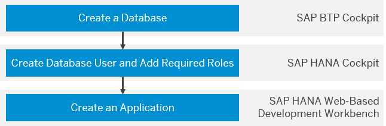

# Create an SAP HANA Tenant Database and an SAP HANA XS Classic Application
<!-- description --> Create and bind an SAP HANA tenant database to an SAP HANA XS classic application.

## Prerequisites
 - You have a subaccount in the SAP BTP, Neo environment.
 - You're assigned the Administrator role for the subaccount.
 - You've installed an SAP HANA tenant database system (MDC). See [Install Database Systems](https://help.sap.com/viewer/d4790b2de2f4429db6f3dff54e4d7b3a/Cloud/en-US/1261e6b87e174c05b774ea38fa3c8c51.html).

## You will learn
- How to create and bind an SAP HANA tenant database to an SAP HANA XS classic application using the SAP BTP cockpit, the SAP HANA cockpit, and the SAP HANA Web-Based Development Workbench

## Intro
To perform the different steps in this tutorial, you use different tools. You first create a tenant database, and then create the XS classic application on the database.

---

### Create a database

In your subaccount in the SAP BTP cockpit, you create a database on an SAP HANA tenant database system.

1.  In the SAP BTP cockpit, navigate to a subaccount. For more information, see [Navigate in the Cockpit](https://help.sap.com/viewer/ea72206b834e4ace9cd834feed6c0e09/Cloud/en-US/fdeff7e68f64496eb8a1fb31f6a08b73.html).

2.  Choose **SAP HANA / SAP ASE** > **Databases & Schemas** in the navigation area.

    All databases available in the selected account are listed with their ID, type, version, and related database system.

    > **Tip:** To view the details of a database, for example, its state and the number of existing bindings, select a database in the list and click the link on its name. On the overview of the database, you can perform further actions, for example, delete the database.

3.  From the **Databases & Schemas** page, choose **New**.

4.  Enter the required data:

    |  Property     | Value     | Description
    |  :------------- | :------------- | :-------------
    |  Database ID    | Example: **`tutorial`**    |   HANA database ID
    |  Database System    | Example: **`mdc1 (HANAMDC)`**    |  An SAP HANA tenant database system. **`mdc1mdc1`** corresponds to the database system on which you create the database.          
    |  SYSTEM User Password    |     |  The password for the SYSTEM user of the database.   The SYSTEM user is a preconfigured database superuser with irrevocable system privileges, such as the ability to create other database users, access system tables, and so on. A database-specific SYSTEM user exists in every database of a tenant database system.

5.  Choose **Create**.

6.  The **Events** page shows the progress of the database creation. Wait until the tenant database is in state **Started**.

7.  (Optional) To view the details of the new database, choose **Overview** in the navigation area and select the database in the list. Verify that the status **STARTED** is displayed.

### Create a database user

Create a new database user in the SAP HANA cockpit and assign the user the required permissions for working with the SAP HANA Web-based Development Workbench.

You'll perform all subsequent activities with this new user.

> You've specified a password for the SYSTEM user when you created an SAP HANA tenant database. You now use the SYSTEM user to log on to SAP HANA cockpit and create your own database administration user.

> **Caution:** You should not use the SYSTEM user for day-to-day activities. Instead, use this user to create dedicated database users for administrative tasks and to assign privileges to these users.

  1.  To log on to the SAP HANA cockpit, in the navigation area of the SAP BTP cockpit, choose **SAP HANA / SAP ASE** > **Databases & Schemas**.

    All databases available in the selected account are listed with their ID, type, version, and related database system.

    > **Tip:** To view the details of a database, for example, its state and the number of existing bindings, select a database in the list and click the link on its name. On the overview of the database, you can perform further actions, for example, delete the database.

  2.  Select the relevant SAP HANA tenant database in the list.

  3.  In the overview that is shown in the lower part of the screen, open the **SAP HANA cockpit** link under **Development Tools**.

  4.  Provide the following details:

      **Enter Username**: **`SYSTEM`**

      **Enter Password**: Enter the password you determined for the SYSTEM user.

      You're informed that you do not have the roles that you need to open the SAP HANA cockpit.

  5.  Choose **OK**.

      You receive a confirmation that the required roles are assigned to you automatically.

  6.  Choose **Continue**.

      You're now logged on to the SAP HANA cockpit.

  7.  Open the **Security** tool of the SAP HANA Web-based Development Workbench.

  8.  Expand the **Security** node.

  9.  Open the context menu for the **Users node** and choose **New User**.

  10.  On the **User** tab, provide a name for the new user.

    The user name always appears in upper case letters.

  11.  In the **Authentication** section, make sure the **Password** checkbox is selected and enter a password.

    > The password must start with a letter and only contain uppercase and lowercase letters ('a' - 'z', 'A' - 'Z'), and numbers ('0' - '9').

  12. To create the database user, in the menu bar choose **Save**.

    The new database user is displayed as a new node under the **Users** node.

  13. To assign your user the roles with the required permissions for working with the SAP HANA Web-based Development Workbench, go to the **Granted Roles** section and choose **+ (Add)**.

  14. Type **`ide`** in the search field and select all roles in the result list.

  15. Choose **OK**.

      The roles are added on the **Granted Roles** tab.

  16. To assign the `CONTENT_ADMIN` role to the user, repeat the steps in the **Granted Roles** section, searching for **`CONTENT_ADMIN`**.

    For more information about the `CONTENT_ADMIN` role, see [Predefined Database Roles](http://help.sap.com/saphelp_hanaplatform/helpdata/en/de/421861bb571014846288086be76719/content.htm).

  17. Save your changes.

  18. Before you continue to work with the SAP HANA Web-based Development Workbench, you log out first and log on again with your new database user.

    > **Caution:** At this point, you're still logged on with the SYSTEM user. You can only use your new database user to work with the SAP HANA Web-based Development Workbench by logging out from the SAP HANA cockpit first. Otherwise, you would automatically log in to the SAP HANA Web-based Development Workbench with the SYSTEM user instead of your new database user.

    > Therefore, choose the **Logout** button before you continue to work with the SAP HANA Web-based Development Workbench, where you need to log on again with the new database user.

### Create and deploy an SAP HANA XS classic application

Create an SAP HANA XS classic Hello World program using the SAP HANA Web-based Development Workbench.

1.  In the navigation area of the SAP BTP cockpit, choose **SAP HANA / SAP ASE** > **Databases & Schemas**.

2.  Select the relevant database.

3.  In the database overview, open the **SAP HANA Web-based Development Workbench** link under **Development Tools**.

4.  Log on to the SAP HANA Web-based Development Workbench with your new database user and password.

5.  Open the **Editor** tool of the SAP HANA Web-based Development Workbench.

    The editor header shows details for your user and database. Hover over the entry for the SID to view the details.

6.  To create a new package, choose **New** > **Package** from the context menu of the **Content** folder.

7.  Enter a package name.

    The package appears under the **Content** folder node.

8.  From the context menu for the new package node, choose **Create Application**.

9.  Select **HANA XS Hello World** as template and choose **Create**.

10. To deploy the program, select the `logic.xsjs` file from the new package and choose **Run**.

    The program is deployed and appears in the browser:     

    `Hello World from User <Your User>.`

---
