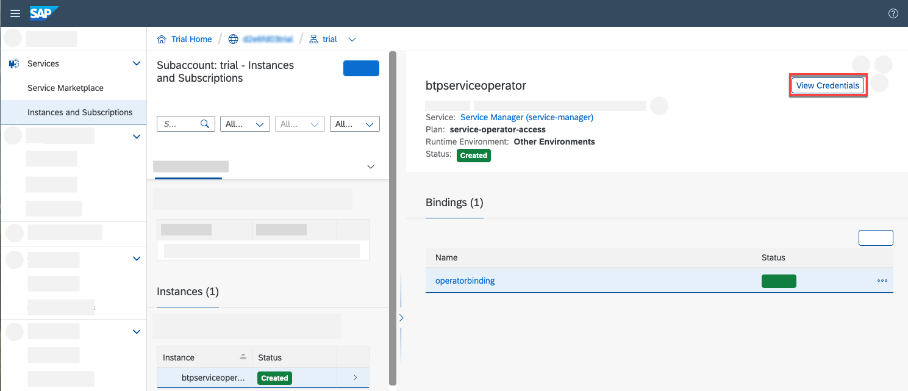

# Consume SAP BTP Services from Any Hyperscaler
<!-- description --> Deploy an SAP Fiori application in any hyperscaler, such as Google Cloud Platform (GCP), Amazon Web Services (AWS), Alibaba Cloud or Azure, and use services from SAP BTP.

## Prerequisites
 - Get an Account on SAP BTP to Try Out Free Tier Service Plans [Get an Account on SAP BTP](btp-free-tier-account)
 - You have an [account on the SAP Gateway Demo System (ES5)](gateway-demo-signup) created
 - You have [connected SAP BTP to your SAP Gateway Demo System (ES5) account](cp-portal-cloud-foundry-gateway-connection)
 - [Install Docker](https://docs.docker.com/get-docker/) (or any other Container tool).
 - You have installed [hub](https://hub.docker.com/) (or any other Container Image Library).
 - You have installed the [Kubernetes Command Line Tool](cp-kyma-download-cli).
 - You have installed Service Manager Control (SMCTL) CLI v1.10.1, see [Service Manager CLI Release Information published on non-SAP site](https://github.com/Peripli/service-manager-cli)
 - You have assigned the Subaccount Service Administrator role collection, see [Assign the Subaccount Service Administrator Collection](https://help.sap.com/viewer/09cc82baadc542a688176dce601398de/Cloud/en-US/0735965d10b342a393b5a83924dba9b4.html)
 - You have the [Helm](https://github.com/helm/helm) package manager for Kubernetes v3.1.2 installed
 - You have a Kubernetes cluster and have downloaded the Kubeconfig file from any hyperscaler:
     - [Google Cloud Platform ](https://cloud.google.com/kubernetes-engine/docs/how-to/cluster-access-for-kubectl#kubeconfig)
     - [Amazon EKS](https://docs.aws.amazon.com/eks/latest/userguide/create-kubeconfig.html)
     - [Azure](https://docs.microsoft.com/bs-latn-ba/azure/aks/kubernetes-walkthrough#connect-to-the-cluster)
     - [Alibaba Cloud](https://in.alibabacloud.com/)


## You will learn
- How to consume SAP BTP services running from other environments
- How to use SAP BTP APIs, Service Manager and Service Operator to consume services from other environments

## Intro
Deploy an SAP Fiori Application in any a hyperscaler, such as Google Cloud Platform (GCP), Amazon Web Services (AWS), Alibaba Cloud or Azure, and still take advantage of the services provided by SAP Business Technology Platform (SAP BTP).

In this tutorial, you use the **`fioriapp`** sample application to learn some best practices of setting up your Kubernetes cluster to communicate with SAP BTP so you can learn how to consume SAP BTP services from any hyperscaler.

---

### Set KUBECONFIG environment variable

To configure the access to your Kubernetes cluster, you have to set the KUBECONFIG environment variable to point to the location where the KUBECONFIG file you have downloaded from your Kubernetes cluster. To do that, open a command line prompt on your computer and type in the following command:

>Replace `<KUBECONFIG_FILE_PATH>` with the file path of the KUBECONFIG file you have downloaded, including the file name and extension.

Open a command line prompt on your computer. In the command line screen, type in the following:

[OPTION BEGIN [Mac and Linux]]

```Shell/Bash
export KUBECONFIG=<KUBECONFIG_FILE_PATH>
```

[OPTION END]

[OPTION BEGIN [Windows]]

```PowerShell
$ENV:KUBECONFIG="<KUBECONFIG_FILE_PATH>"
```

```DOS
set KUBECONFIG="<KUBECONFIG_FILE_PATH>"
```

[OPTION END]

**Test the configuration by running this command:**

```Shell/Bash/DOS
kubectl config get-contexts
```

This should return a context from the `kubeconfig` file.

|CURRENT|NAME|CLUSTER|AUTHINFO|NAMESPACE|
|-------|----|-------|--------|---------|
|*      | `####`|`####`|`####-token`| |

### Install cert-manager


Cert-manager is used to set up the certificates needed for internal communication between the Kubernetes API server and the deployment of the SAP BTP service operator in your cluster. For more information about `cert-manager`, see [cert-manager documentation](https://cert-manager.io/docs/).

Open a command line prompt on your computer and type in the following command:

```Shell/Bash/DOS
kubectl apply -f https://github.com/jetstack/cert-manager/releases/download/v1.5.3/cert-manager.yaml
```


### Set up SAP BTP service operator


Consume services from a global account and a subaccount in SAP BTP.

As subaccounts are bound to specific regions, choose or create a subaccount located close to your Kubernetes cluster to prevent latency drawbacks.

SAP BTP service operator allows you to provision and manage service instances and service bindings of SAP BTP services so that your Kubernetes-native applications can access and use SAP BTP services from the cluster.

1. Go to <https://account.hanatrial.ondemand.com> or  <https://account.hana.ondemand.com> and log in to the **SAP BTP cockpit**.

2. Choose your global account and then in the **Account Explorer** page, choose the tile of your subaccount.

      <!-- border -->

3. Choose **Services** > **Service Marketplace**, and in the **Service Marketplace** page, choose the **Service Manager** service tile.

4. From the **Service Manager** page, choose **Create** and follow the steps in the wizard to create a service instance.

     <!-- border -->

5. On the **Basic Info** step:

      - In the **Service** dropdown menu, select **Service Manager**

      - In the **Plan** dropdown menu, select **service-operator-access**

        >If you can't see this service plan, you need to entitle your subaccount to use the Service Manager service. For more information about how to entitle a service to a subaccount, see: [Configure Entitlements and Quotas for Subaccounts](https://help.sap.com/viewer/65de2977205c403bbc107264b8eccf4b/Cloud/en-US/5ba357b4fa1e4de4b9fcc4ae771609da.html).

      - In the **Runtime Environment** dropdown menu, select **Other**

      - In the **Instance Name** field, enter **`btpserviceoperator`**


6. Choose **Create**.

      <!-- border -->

7. Choose **View Instance**

     <!-- border -->

8. To create a binding for the **`btpserviceoperator`** service instance, choose **Create**.

     <!-- border -->

9. In the **Binding Name** field enter **`operatorbinding`** and choose **Create**.

     <!-- border -->

10. Choose **View Credentials**.

     <!-- border -->

11. Copy the credential information by choosing **Download** or **Copy JSON**.

    <!-- border -->

    This is an example of the binding object created with the default credentials type:

    ```JSON
     {
        "clientid": "xxxxxxx",
        "clientsecret": "xxxxxxx",
        "url": "https://mysubaccount.authentication.xxx.hana.ondemand.com",
        "xsappname": "<name>",
        "sm_url": "<service_manager_URL>"
     }
    ```

12. Deploy the SAP BTP service operator in the cluster using the obtained access credentials.

[OPTION BEGIN [Mac and Linux]]

```Shell/Bash/DOS
helm upgrade --install sap-btp-operator https://github.com/SAP/sap-btp-service-operator/releases/download/<release>/sap-btp-operator-<release>.tgz \
--create-namespace \
--namespace=sap-btp-operator \
--set manager.secret.clientid='<clientid>' \
--set manager.secret.clientsecret='<clientsecret>' \
--set manager.secret.url='<sm_url>' \
--set manager.secret.tokenurl='<url>'    
```

    [OPTION END]

[OPTION BEGIN [Windows]]

```DOS
helm upgrade --install sap-btp-operator https://github.com/SAP/sap-btp-service-operator/releases/download/<release>/sap-btp-operator-<release>.tgz --create-namespace --namespace=sap-btp-operator --set manager.secret.clientid="<clientid>" --set manager.secret.clientsecret="<clientsecret>" --set manager.secret.url="<sm_url>" --set manager.secret.tokenurl="<url>"
```

```Shell/Bash
helm upgrade --install sap-btp-operator https://github.com/SAP/sap-btp-service-operator/releases/download/<release>/sap-btp-operator-<release>.tgz \
--create-namespace \
--namespace=sap-btp-operator \
--set manager.secret.clientid='<clientid>' \
--set manager.secret.clientsecret='<clientsecret>' \
--set manager.secret.url='<sm_url>' \
--set manager.secret.tokenurl='<url>'
```

[OPTION END]


Replace the **release** version of SAP BTP service operator, `clientid`, `clientsecret`, `sm_url`, `url`  with the credentials you have copied from the service binding.
> For the list of the available SAP BTP service operator releases, see [Available Releases](https://github.com/SAP/sap-btp-service-operator/releases).
> To know more about SAP BTP service operator, see [Consuming SAP BTP Services in Kubernetes with SAP BTP Service Operator](https://help.sap.com/viewer/09cc82baadc542a688176dce601398de/Cloud/en-US/b5a35bfa87b5444080e6e6e6d361fa20.html).


**Test the configuration by running this command**  

```Shell/Bash
kubectl get pods -n sap-btp-operator
```

This should return the status of sap-btp-operator configuration.

|NAME|READY|STATUS|RESTART|AGE|
|-------|----|-------|--------|---------|
|`sap-btp-operator-##`| `2/2`|`Running`|`##`|`##`|


### Verify cross consumable services from SAP Business Technology Platform (SAP BTP)


 [OPTION BEGIN [BTP cockpit]]

Login to SAP BTP cockpit to verify cross consumable services from SAP Business Technology Platform (SAP BTP).

 1. Go to <https://account.hanatrial.ondemand.com> or  <https://account.hana.ondemand.com> and log in to the **SAP BTP cockpit**.

 2. Choose your global account and then in the **Account Explorer** page, choose the tile of your subaccount.

       <!-- border -->

 3. Choose **Services** > **Service Marketplace**, and in the **Service Marketplace** page, choose the **Authorization and Trust Management Service** service tile.

 4. From the **Authorization and Trust Management Service** page, verify the cross consumable service plan
    from `xsuaa` service instance.Based on the environment specified in the respective plan is supported for cross consumable.

      <!-- border -->

    >If you can't see this service plan or service instance , you need to entitle your subaccount to use the respective service and service plan. For more information about how to entitle a service to a subaccount, see: [Configure Entitlements and Quotas for Subaccounts](https://help.sap.com/viewer/65de2977205c403bbc107264b8eccf4b/Cloud/en-US/5ba357b4fa1e4de4b9fcc4ae771609da.html).

 [OPTION END]

[OPTION BEGIN [Using SMCTL]]

   Login to SAP service manager to verify cross consumable services from SAP Business Technology Platform (SAP BTP).

1. Execute the following command from your Service Manager Control (SMCTL) command-line interface:

    ```Shell/Bash
     smctl login -a https://service-manager.cfapps.<region domain> --param subdomain=<subdomain>
    ```
     To find the region domain for the SAP Service Manager, see [Regions and API Endpoints Available for the Cloud Foundry Environment](https://help.sap.com/viewer/65de2977205c403bbc107264b8eccf4b/Cloud/en-US/350356d1dc314d3199dca15bd2ab9b0e.html#loiof344a57233d34199b2123b9620d0bb41)

     The subdomain is the subaccount subdomain, in which you would like to register the broker. You can find it in the cloud cockpit Overview tab of your subaccount.

     

2. Input your user, with an assigned subaccount Service Administrator Role Collection, and your password.

    ```Shell/Bash
    smctl login -a https://service-manager.cfapps.<region domain> --param subdomain=<subdomain name> -u <user.email> -p <password>
    ```
    >
    > Assign the Subaccount Service Administrator Collection, see the step 2 of the Setup section of [The procedure shows how to assign new service administrator role collections to a user of your choice](https://help.sap.com/viewer/09cc82baadc542a688176dce601398de/Cloud/en-US/0735965d10b342a393b5a83924dba9b4.html).


3. Check the cross consumable services by entering the following command:

    ```Shell/Bash
    smctl marketplace
    ```

     

    > Based on SAP BTP Entitlements above screenshot may varies.

 [OPTION END]


### Create service instances


   In the **`fioriapp`** sample application, the Destination and the SAP Authorization & Trust Management services will be consumed using the SAP BTP service operator. To use these SAP BTP services you have to create the respective service instances and service bindings. Use the `createservice.yaml` which will create the `destination` service instance with plan `lite` and the `xsuaa` service instance with plan `application`.

1. The hyperscaler applications can be found in the [btp-hyperscaler-extension]
   (https://github.com/SAP-samples/btp-hyperscaler-extension) repository. Within the repo you can find each of their Deployment files within the respective folder.

2. Download the code by choosing the green **Code** button and then choosing one of the options to download the code locally.

    You can instead run the following command within your CLI at your desired folder location:

    ```Shell/Bash
    git clone https://github.com/SAP-samples/btp-hyperscaler-extension
    ```
3. Create your own `sapfiori` namespace in your Kubernetes cluster.

    ```Shell/Bash
    kubectl create namespace sapfiori
    ```

4. create the *destination* service instance with plan *lite* and the `xsuaa` service instance with plan
   *application* by running the below command.

    ```Shell/Bash
    kubectl apply -n sapfiori -f https://raw.githubusercontent.com/SAP-samples/btp-hyperscaler-extension/master/k8s/createservice.yaml
    ```
    > The create service file is represented as declarative YAML object which describes what you want to run inside your namespace. You can find the file at `/btp-hyperscaler-extension/master/k8s/createservice.yaml`.

5. Check that the status of the service instance in your cluster by using the following command:

    ```Shell/Bash
    kubectl get serviceinstances -n sapfiori
    ```
    **This should return the status of created service instances.**

    |NAME|OFFERING|PLAN|STATUS|READY|AGE|
    |-------|----|-------|--------|---------|---------|
    |`destination-instance-fiori`| `destination`|`lite`|`Created`|`True`|`##`|
    |`xsuaa-instance-fiori`| `xsuaa`|`application`|`Created`|`True`|`##`|

    >To know more about consuming services using SAP BTP service operator [Working with SAP BTP Service Operator](https://help.sap.com/viewer/09cc82baadc542a688176dce601398de/Cloud/en-US/0ccebd7cec24411dacd5ad17799534e0.html).


### Build and deploy app into Kubernetes Cluster


To build and deploy the **`fioriapp`** sample application in your cluster, you have to create a pod, which encapsulates the container and ensures that a specified quorum of running instances is fulfilled. To do that, use the `deployment.yaml`.

1. Build the docker image of the **`fioriapp`**.

    * cd `btp-hyperscaler-extension/basicfioriapp`

    * docker build . -t `<docker-username>/fioriapp` -f Dockerfile

    >Replace `<docker-username>` with your username

2. Push the docker image of the `fioriapp` to your Container Image Library.

    * docker push `<docker-username>/fioriapp`

    >Replace `<docker-username>` with your username

3. Update the docker image in the `./btp-hyperscaler-extension/k8s/deployment.yaml` file. Line no 21

    * Replace `<docker-username>` with your username

4. Execute the below command to deploy the application into hyperscaler.

    ```Shell/Bash
    kubectl apply -n sapfiori -f https://raw.githubusercontent.com/SAP-samples/btp-hyperscaler-extension/master/k8s/deployment.yaml
    ```
    > The deployment file is represented as declarative YAML object which describes what you want to run inside your namespace. You can find the file at `/btp-hyperscaler-extension/master/k8s/deployment.yaml`.

5. Execute the following command to check the deployed application pod status

    ```Shell/Bash
    kubectl get pods -n sapfiori
    ```

    This should return the status of deployed application.

    |NAME|READY|STATUS|RESTART|AGE|
    |-------|----|-------|--------|---------|
    |`fioriapp-##-##`| `1/1`|`Running`|`##`|`##`|


### Run the deployed application


  [OPTION BEGIN [Using Load Balancer]]

   Kubernetes provides a convenient way to expose applications. With **`--type=LoadBalancer`** you request to provision a public IP address. It will also automatically assign a cluster-IP and a Node Port in the current setup of the cluster.

1. Execute the below command to deploy the application into hyperscaler.

    ```Shell/Bash
    kubectl apply -n sapfiori -f https://raw.githubusercontent.com/SAP-samples/btp-hyperscaler-extension/master/k8s/loadbalancer.yaml
    ```
    > The deployment file is represented as declarative YAML object which describes what you want to run inside your namespace. You can find the file at `/btp-hyperscaler-extension/master/k8s/loadbalancer.yaml`.


3. To find the deployed load balancer public IP, use the following command:

    ```Shell/Bash
    kubectl get services -n sapfiori
    ```
    <!-- border -->

4. Copy the load balancer IP and add the port "5000" run in a browser.

    Application should return the list of business partners

    <!-- border -->

  [OPTION END]

  [OPTION BEGIN [kubectl port-forward]]

   **`Kubectl`** port-forward allows you to access and interact with internal Kubernetes cluster processes from your localhost.The port-forward command specifies the cluster resource name and defines the port number to port-forward to.As a result, the Kubernetes API server establishes a single HTTP connection between your localhost and the resource running on your cluster.Then user is  able to engage that specific pod directly, either to diagnose an issue or debug if necessary.

1. Execute the following command to check the deployed application pod status

    ```Shell/Bash
    kubectl get pods -n sapfiori
    ```

    This should return the status of deployed application.

    |NAME|READY|STATUS|RESTART|AGE|
    |-------|----|-------|--------|---------|
    |`fioriapp-xx-xx`| `1/1`|`Running`|`##`|`##`|

2. copy the above name of the deployed application `fioriapp-xx-xx`

    ```Shell/Bash
    kubectl port-forward  fioriapp-xx-xx 5000:5000 -n sapfiori
    ```

3. Run <http://localhost:4004> in your browser

    Application should return the list of business partners

    <!-- border -->

  [OPTION END]

**Congratulations!** You have successfully completed the tutorial.
