---

author_profile: https://github.com/HarshitaSuryavanshi
title:  Creating Data Type & Message Type Artifacts
description: Learn how to create the data type and message type artifacts.
keywords: tutorial
auto_validation: true
time: 20
tags: [ tutorial>intermediate, software-product>sap-integration-suite]
primary_tag: software-product>sap-business-technology-platform
parser: v2
---

## You will learn
- What are the two methods to create data type and message type artifacts.

## Prerequisites
 - You have enabled the Cloud Integration capability of [SAP Integration Suite](http://bit.ly/3VmWOOZ) and have subscribed to standard or above service plans.
 - [Configuring SAP Cloud Connector with on premise Enterprise Service Repository (ESR)](https://help.sap.com/docs/connectivity/sap-btp-connectivity-cf/cloud-connector?version=Cloud&locale=en-US).
 - [Configure connection to ESR](https://help.sap.com/docs/integration-suite/sap-integration-suite/configuring-connectivity-to-es-repository).
 
 ## Intro
Data types (DT) and Message Type (MT) artifacts that historically were available in on premise PI/PO are now available in SAP Integration Suite's Cloud Integration capability (version 6.40 and above). It gives you the opportunity to:

- Re-use your PI/PO Datatype and Message type artifacts into your integration flows via import.
- Create new data type and message type artifacts.

Data Type is an object, containing the structure of data that defines the message. A message type comprises a data type that describes the structure of a message. For technical reasons, a data type alone is not sufficient to describe the instance of a message. Data types are defined in XML Schema as abstract types that aren't yet tied to an element. You can only describe an instance of a message when you've specified a data type. Therefore, a message type defines the root element of a message. 
This message type is further consumed in message mappings, which we will learn later in next tutorials. 

### Import re-usable DT & MT from PI/PO ESR

1. Choose **Design** > **Integrations and APIs** to view the list of integration packages.
2. Select the integration package in which you want to add a Data Type or Message Type and choose **Edit**.
   
    <!-- border -->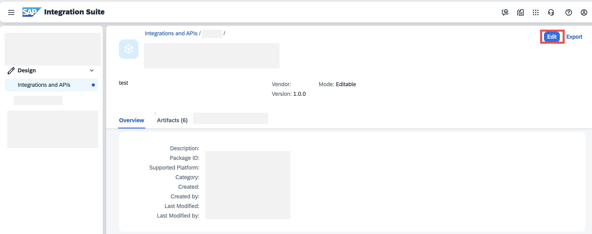

3. Navigate to the Artifacts tab and choose **Add** > **Data Type** or **Add** > **Message Type** to add a data Type or message type artifact respectively.
   
    <!-- border -->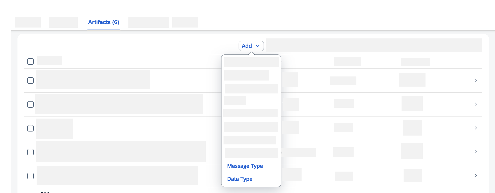

4. In the dialog box, choose **Import from ES Repository**. 
5. Now, ES Repository appears as the **Source**. In the Name list, select an ES Repository from the list of connected systems. The Address is automatically populated.
6. Choose **Connect**. A list of available data types or message types in ES repository appears.

     <!-- border -->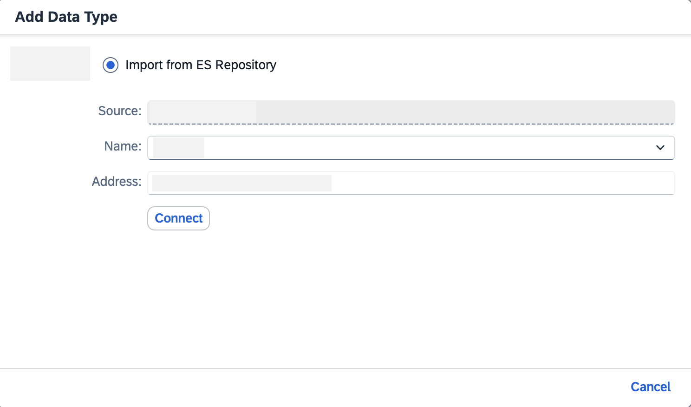

7. Select the data type or message type that you wish to import.
8.  Select the **Include Dependent Data Types** checkbox if you wish to include the dependent data type objects while importing the selected data type or message type.
   
    <!-- border -->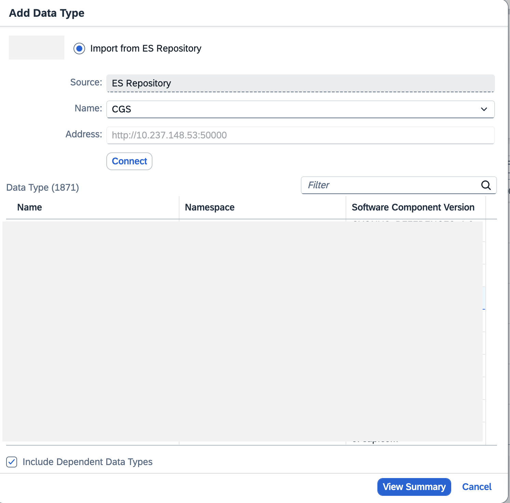

9.  Choose **View Summary** to view a summary of all the artifacts to be imported. From the list of objects, you can view the following object status in the Information column:
    - Create artifact: Means that this object will be created for the first time.

    <!-- border -->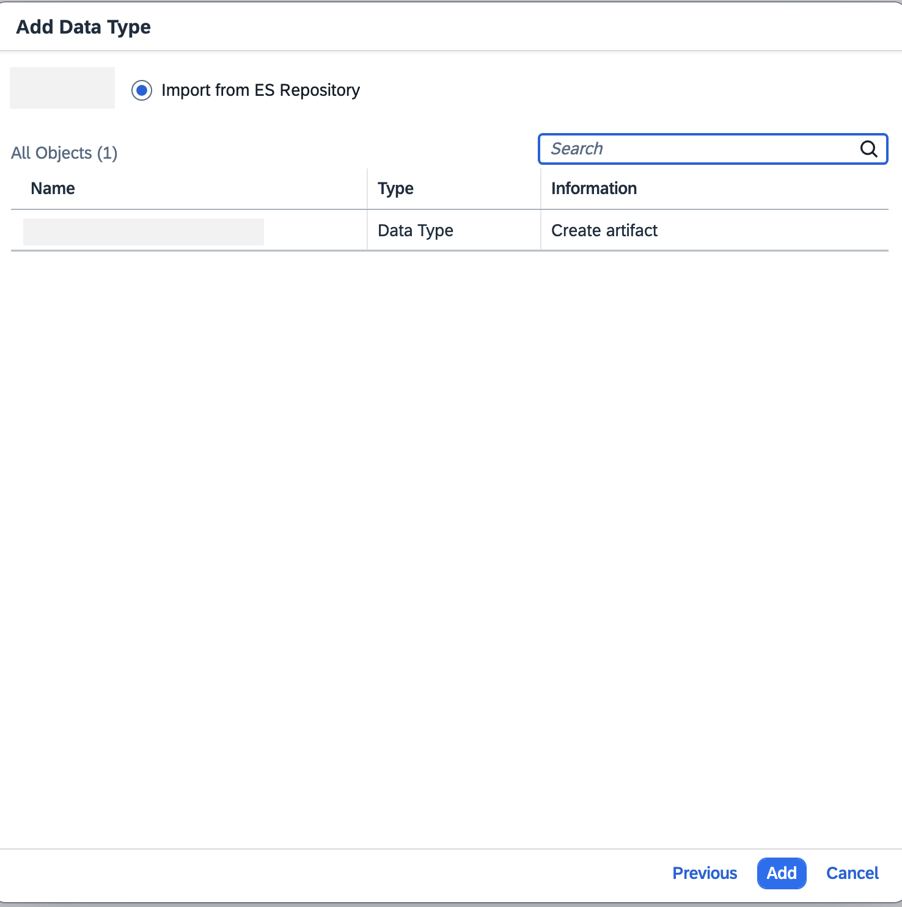

    - Skips; version already exists: Means that the selected version of this object already exists in an integration package, which can be reused. Hence, object import is skipped. Duplicate object isn't created.

    <!-- border -->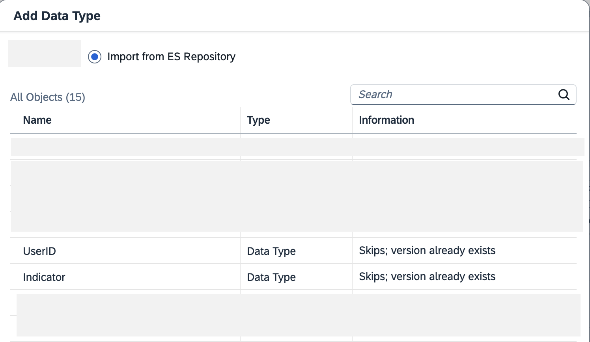

    - Adds new version: Means that a version of this object already exists in an integration package. But, it is not the latest version, which is being imported from the ES repository. So, latest version of the object is created.

    <!-- border -->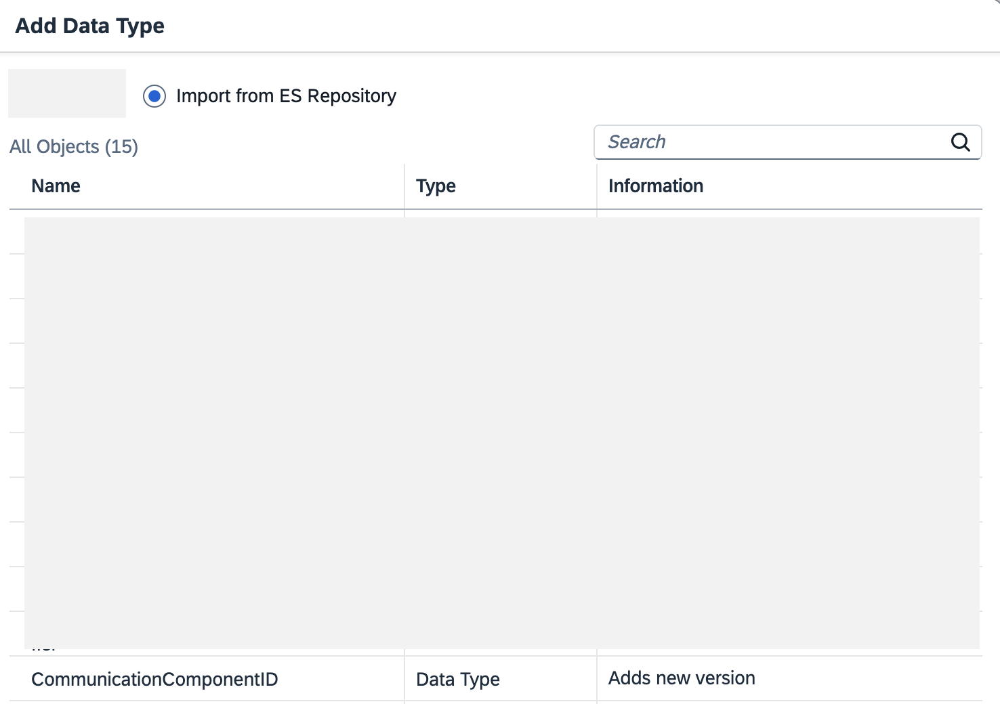

    - Error; ID already exists: Means that an artifact with the same ID as the selected primary data type or message type already exists in an integration package. Choose **Resolve**, to assign another ID for this artifact. Then, choose **View Summary**.
    
    <!-- border -->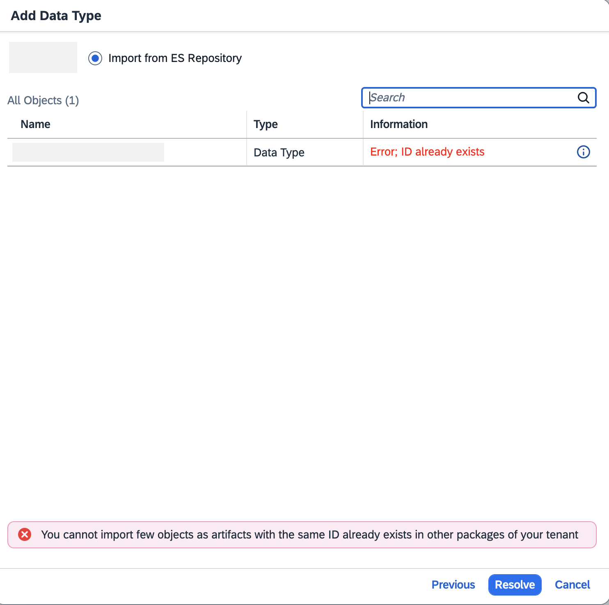

10.   Choose **Add**. Import results with the details of created, skipped, failed artifacts appear. In the **Artifacts** tab, choose the added artifact to launch it in editor. 

     <!-- border -->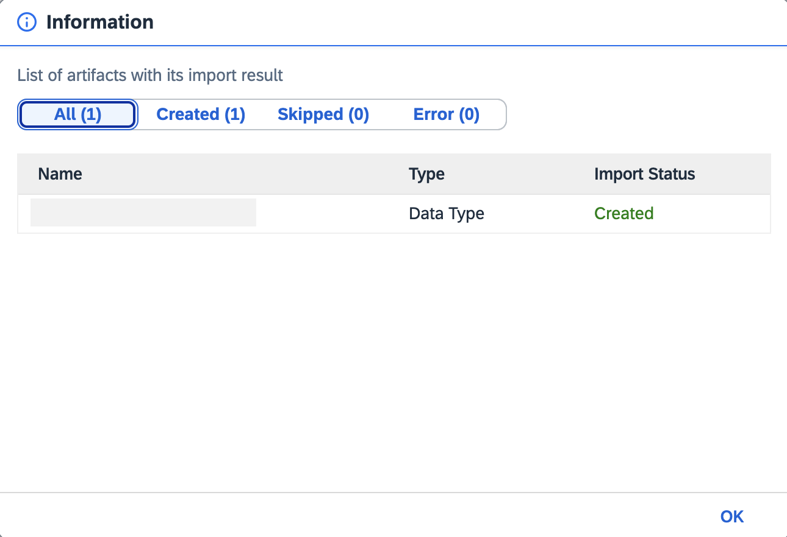

11.   Choose **Edit** to bring the artifact in editing mode.
    You can now start adding new nodes to the data type or message type artifacts or edit the existing details of the artifact. 

     <!-- border -->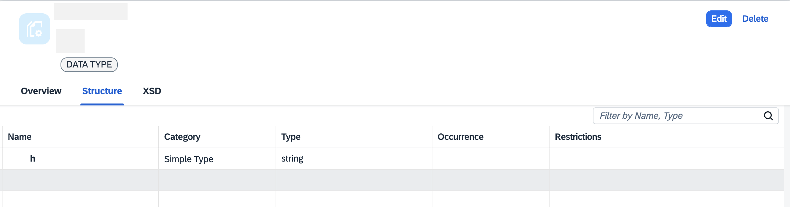

### Create new DT & MT

1. Choose **Design** > **Integrations and APIs** to view the list of integration packages.
2. Select the integration package in which you want to create a Data Type or Message Type and choose **Edit**. You can also create a new integration package first. See [here](https://help.sap.com/docs/integration-suite/sap-integration-suite/creating-integration-package?version=Cloud&locale=en-US).
3. Navigate to the Artifacts tab and **Add** > **Data Type** or **Add** > **Message Type** to add a data type or message type artifact respectively.

    <!-- border -->

4. In the dialog box, choose **Create**.

    <!-- border -->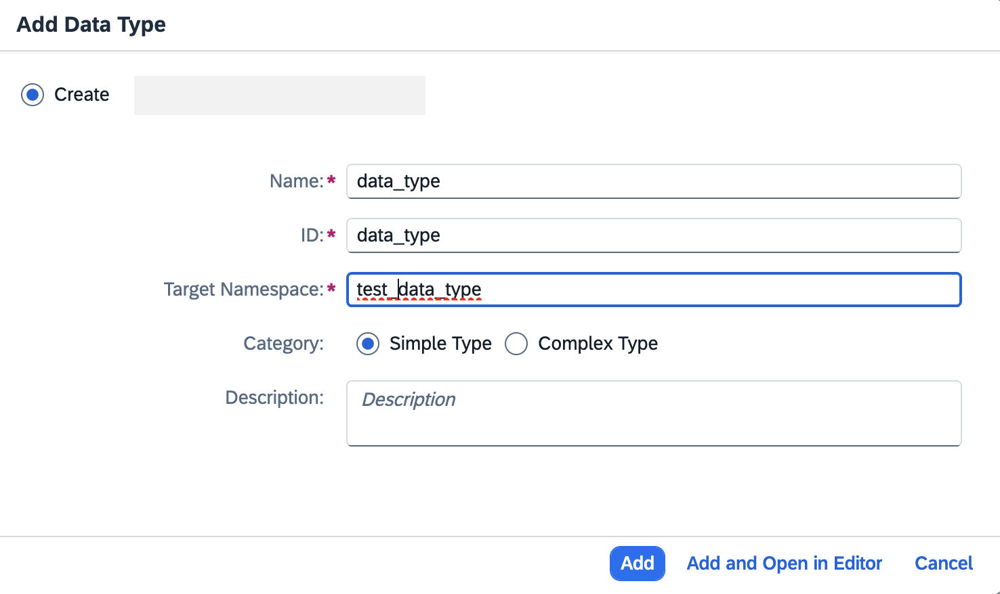

5. Enter the value in the fields.
> Note: Begin the target namespace with an alphabet. It can contain numbers and special characters except tilde (~), back-quote (`), and caret(^).
6. Choose **Add** to stay in the **Artifacts** tab. CHoose the added artifact to launch it in editor.
Or, choose **Add and Open in Editor** to directly open the artifact's **Structure** tab.
7. Choose **Edit** to bring the artifact in editing mode. 
   You can now start adding new nodes to the data type or message type artifacts or edit the existing details of the artifact. 
   
See you in the next tutorial to study the rules and process to edit these artifacts. 

More information links:
- [Outbound Sap Cloud Connector](https://help.sap.com/docs/integration-suite/sap-integration-suite/outbound-sap-cloud-connector?q=cloud%20connector)
- [Cloud Connector](https://community.sap.com/t5/technology-blogs-by-sap/installation-and-configuration-of-sap-cloud-connector/ba-p/13505443)