---

author_profile: https://github.com/HarshitaSuryavanshi
title:  Editing Data Type & Message Type Artifacts
description: Learn how to edit the data type and message type artifacts.
keywords: tutorial
auto_validation: true
time: 20
tags: [ tutorial>intermediate, software-product>sap-integration-suite]
primary_tag: software-product>sap-business-technology-platform
parser: v2
---

## You will learn
-  How to edit the data type and message type artifacts and the dependencies.

## Prerequisites
 - You have enabled the Cloud Integration capability of [SAP Integration Suite](http://bit.ly/3VmWOOZ) and have subscribed to standard or above service plans.
 - [Configuring SAP Cloud Connector with on premise Enterprise Service Repository (ESR)](https://help.sap.com/docs/connectivity/sap-btp-connectivity-cf/cloud-connector?version=Cloud&locale=en-US).
 - [Configure connection to ESR](https://help.sap.com/docs/integration-suite/sap-integration-suite/configuring-connectivity-to-es-repository).
 
 ## Intro
Once you create the data type and message type artifacts you might need to edit those. But before editing, you must be aware about all the details of these artifacts. Let's learn different terminologies and details that you can view for these artifacts and then, how to edit those.

Both these artifacts have three tabs each:

- Overview: Lists the general details
- Structure: Represents the nodes in a hierarchical format in a table
- XSD: Displays the XML Schema Definition (XSD) that is, the text view of artifact in read-only mode. When you edit the data type or message type artifact, the data in the XSD tab is automatically updated.

### View Data Type 

Now before proceeding, let's understand some terms here: 

| Terms | Description |
| :------- | :-------------------------- | 
| Elements & Attributes             | `Data type consists of elements and attributes. The difference between elements and attributes is that attributes don't have any child node, and you can't use the same attribute more than once in an element.` |
| Category                          | `Category can be Simple or Complex. The root nodes can be of two types; Complex or Simple. Only Complex Types can have child nodes.`|                                                                           
| Complex and Simple Data Type      | `Complex data types can have child nodes whereas simple types cannot.`|                                                                                                                                                                                                                                                                                                                           
For data type artifact, you can find following details of in the Overview and Structure tabs. 

|   Tab    |            Field            |                              Description                               |
| :------- | :-------------------------- | :--------------------------------------------------------------------- |
| Overview | `Name`                      | `Name of the data type`                                                |
| Overview | `ID`                        | `Unique ID of the artifact`                                            |
| Overview | `Namespace `                | `Target namespace to which data type belongs to or where it's created` |
| Overview | `Version`                   | `The current version of data type`                                     |
| Overview | `Created On & Created By`   | `User who created the data type and on which date`                     |
| Overview | `Description`               | `Description text added while creating the data type`                  |
| Overview | `ES Repository information` | `ESR information linked with the data type `                           |

<!-- border -->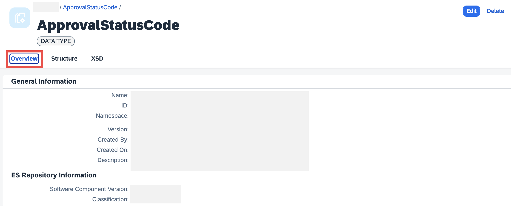

|    Tab    | Field  |       Description        |        Editable        |
| :-------- | :----- | :----------------------- | :--------------------- |
| Structure | `Name` | `Name of the data type` | `Yes except root node` |
| Structure | `Category`     | `Displays category of the node. Root node can be Simple or Complex Type. Child node can be Elements or Attributes`           | `No`  |
| Structure | `Type`         | `Built-in data type (example string, decimal, or integer) or reference to an existing data type for an element or attribute` | `Yes` |
| Structure | `Occurrence`   | `Appears only for attributes, can be required or optional`                                                                   | `Yes` |
| Structure | `Restrictions` | `Restriction of the value range of nodes`                                                                                    | `Yes` |

<!-- border -->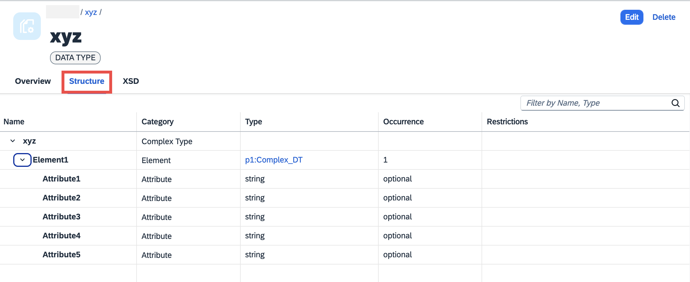

<!-- border -->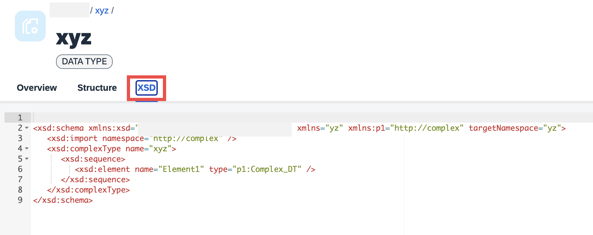

Most of these fields will be empty when you create new artifacts from Cloud Integration. To assign values in this case, you must edit the artifact. 

### Edit Data Type
For data types, you can only edit following details from Structure tab. 

When you select the node, you see following more details. Now, can click **Edit** to modify or add the details. So, basically for a data type you can edit only following fields:

<!-- border -->

- **Name**: You can change the name of any node except the root node. The name of two nodes can't be same.
- **Type**: You can switch from the primitive type to referenced data type, that is, if your data type is defined by built-in type then you can change and assign a user-defined data type or vice versa.
  - **If you switch from Primitive to User-Defined**: The namespace and package name of the referenced data type will be auto populated. 
    > Note: For root node and child attributes, you can reference only Simple Data Types. So, only those allowed Data Types will be listed in the dialog box.

    <!-- border -->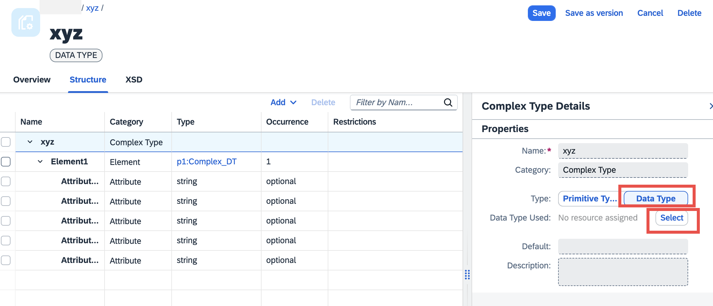
  
    <!-- border -->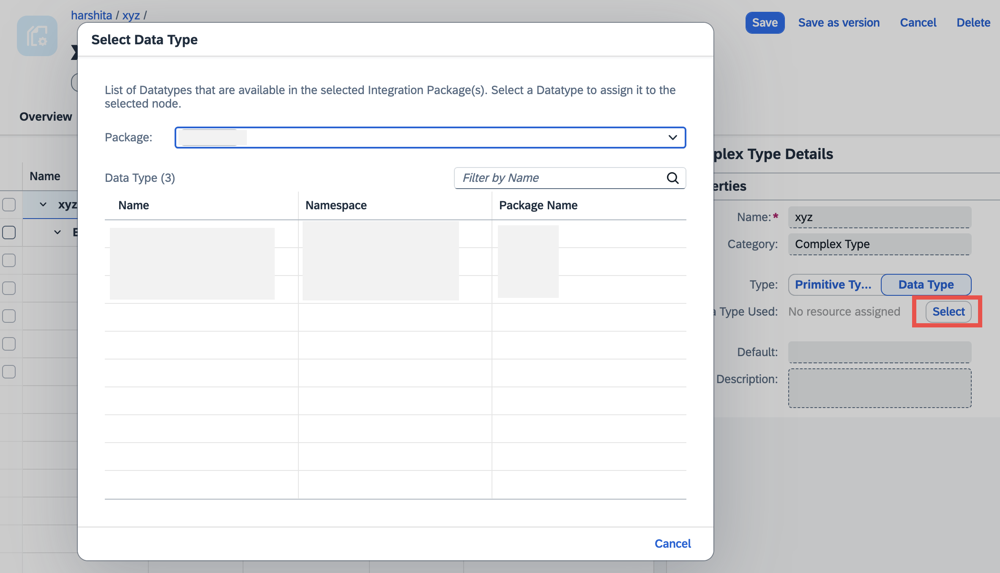

  - **If you switch from User-Defined to Primitive**: Choose the **Value** and namespace will be auto populated depending upon your choice of built-in or derived values. 

    <!-- border -->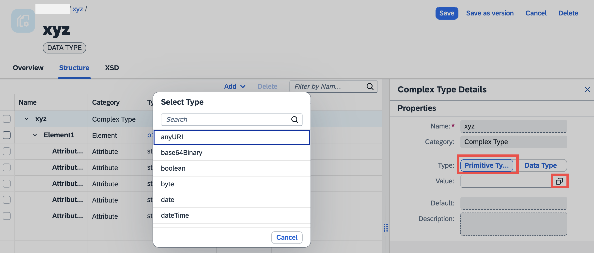

  Moreover, consider the following details before modifying or assigning a new type to any node:

  
|   Node |            Kind of Modification in Type            | Impact|
| :------------- | :-------------------------- |
| Child          | `Change`                     | `On current node only`                               |
| Parent Element | `Change`                     | `All child attributes deleted`                       |
| Root Node      | `Change`                     | `All sub elements deleted. Attributes are retained.` |
| Root Node      | `Assign`                     | `All sub elements deleted. Attributes are retained.` |
| Parent Element | `Assign`                     | `All sub elements deleted. Attributes are retained.` |
  
  

- Occurrence: If the selected node is an Attribute, you can decide whether it is **Required** or **Optional**.
- Max Occurs and Min Occurs: For elements, you can decide its maximum and minimum occurrences.

Now, based on what 'Type' is selected for a node, **Restrictions** are populated. These restrictions only appear for Simple Data types, elements or attributes with Primitive Type assigned to them. These are used to limit the value range of these nodes. To know more about the restrictions and its value range, see [Restrictions](https://help.sap.com/docs/integration-suite/sap-integration-suite/working-with-data-types?locale=en-US&version=CLOUD#loio97ad10142fc34269902006e488af1eff__table_xtn_yqp_l5b).

### Add or Delete Elements & Attributes of Data Type

**Adding Nodes**

When you edit a data type, other than editing the existing nodes, you can also add new nodes, that is, new elements and attributes. To do so follow these steps:

1. Select the node where you want to add a child element or attribute. Choose **Edit**.
2. Choose **Add** and select whether you wish to add Element or Attribute. If you wish to add multiple row of element or attributes, choose **Rows**. Specify the number of rows to be added and choose **Add**. 

  However, below mentioned are few conditions, which apply for such additions: 

<!-- border -->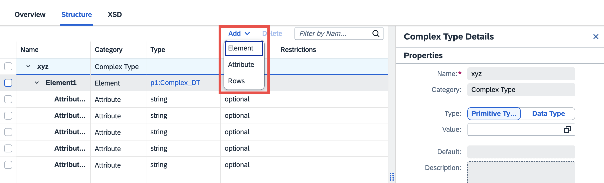

| Node       | Category    | Type            | Add Element         | Add Attribute |
| :----------| :------------| ---------------| :---------------    | :---------------   |
| Root     | `Complex`         | `Assigned (Any)`      | `No`          | `Yes`         |
| Root           | `Complex`| `Not assigned`| `Yes`| `Yes`         |
| Any            | `Simple`| `Any`| `No`                             | `No`          |
| Child	Element   | `Element`| `Primitive or user-defined simple data type` | `No`| `Yes`|
| Child	Element   | `Element`| `User-defined complex data type` |   `No` |`No`            |
| Child	Element   | `Element `| `Not assigned`| `Yes`|      `Yes`         |
| Child	Attribute | `Attribute`| `Any`|`No`| `No`|              

**Deleting Nodes**

You can also delete nodes from the data type. To do so follow these steps:

  1. Use the checkboxes to select the rows that you want to delete. Only editable nodes can be deleted. 
  2. Choose **Delete** just above the table. Following rules apply for node deletion:

<!-- border -->

| Node | Category | Type  | Delete Node |
| :--- | :------- | :----- | :---------- |
| Root | `Any`    | `Any` | `No`        |
| Child Element or Attribute | `Any` | `Primitive or unspecified` | `The selected node along with all child nodes are deleted`     |
| Child Element| `Any`| `User-defined data type` | `Parent node along with child nodes of the user-defined data type gets deleted`|

> Note: When you assign a user-defined data type to an element, the child nodes populated from that user-defined data type can only be deleted from the referenced data type only. So, from the current data type's structure, you can delete the parent element only. 
For example, in 'xyz' data type 'Element1' is a child element, which refers to 'tutorial_test' data type. Here, you will only be allowed to delete the parent element 'Element1' and not its child nodes (the checkboxes are disabled). To delete the child nodes, you must do it from 'tutorial_test' data type. 

<!-- border -->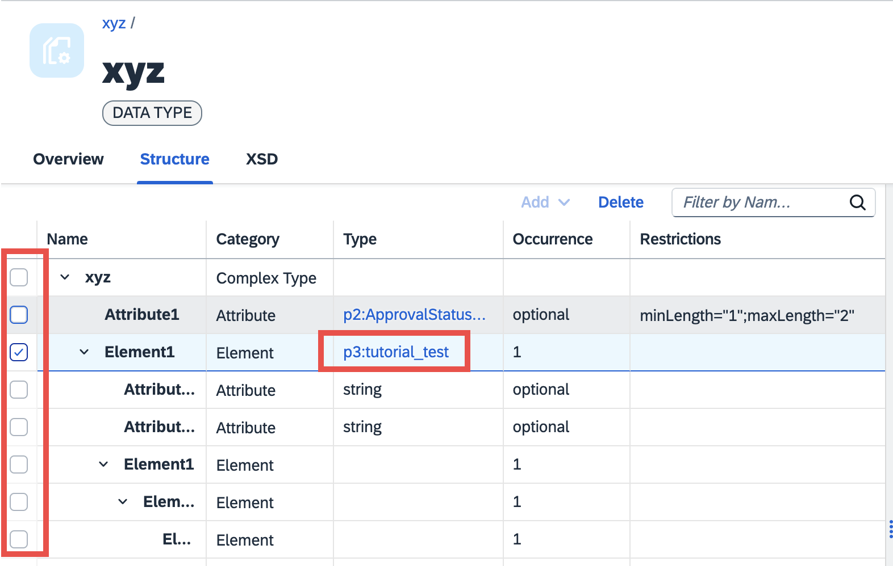

Once you edit the data types, you can then save the data types directly or save the data types as a new version. You can do so even if you have errors in your data type structure.

**Using Cut, Copy, Paste, Drag, Drop, Up, and Down** 

You can change the positions of the nodes by using quick actions like drag, and drop, move up and down. 
Use cut, copy, paste actions to modify the data type structure and reuse existing node formats respectively. 
None of these actions can be performed on the root node. Multi-select is not allowed for any of these actions.

<!-- border -->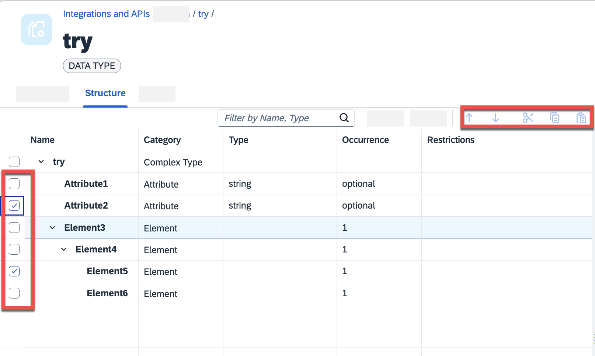

**Cut, Copy, Paste**

1. Use the checkbox to select the node to be cut, copied. 

  <!-- border -->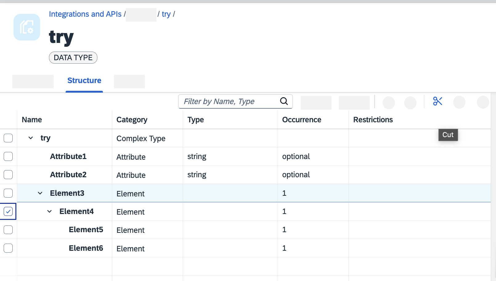

  <!-- border -->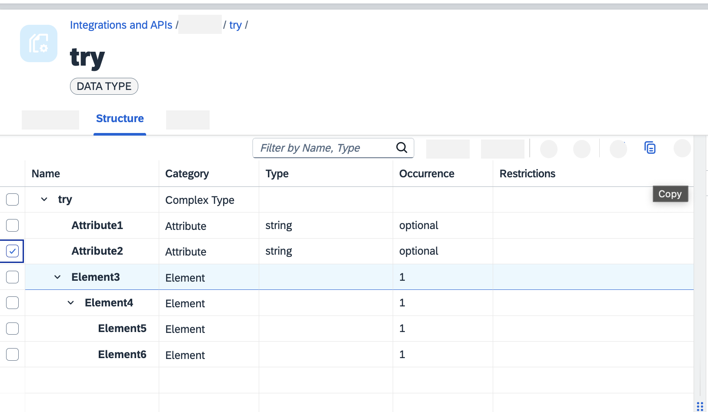

2. Select the node below which you wish to paste the cut or copied node.
   
   <!-- border -->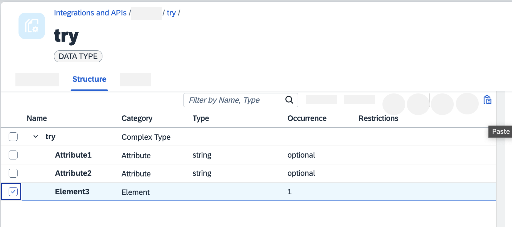

> Note: All the rules for deleting and adding the node will apply when you cut and paste the nodes respectively.   

**Drag and Drop**

Use drag and drop to change the positions of the nodes. 
> Note: The nodes re always added below the target drop node. All the rules for adding and deleting nodes will apply while placing the nodes at the desired location. If dropping of the node is not possible at the selected target location, the node retains its older position.

**Move Up and Down**

Use the up and down arrows (above the table) to change the positions of the nodes.

  1. Use the checkbox to select the node to be moved. 

  2. Use the up or down action buttons to change the position of the selected node.
   
   <!-- border -->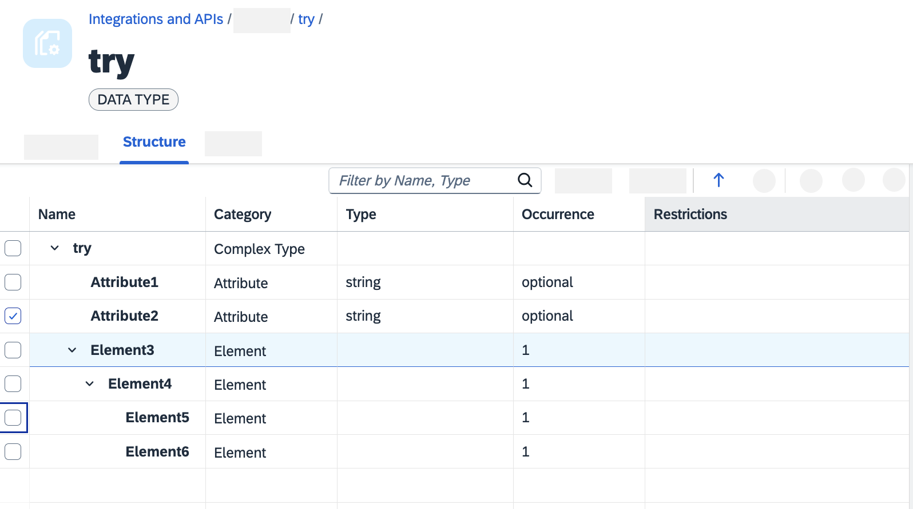

  <!-- border -->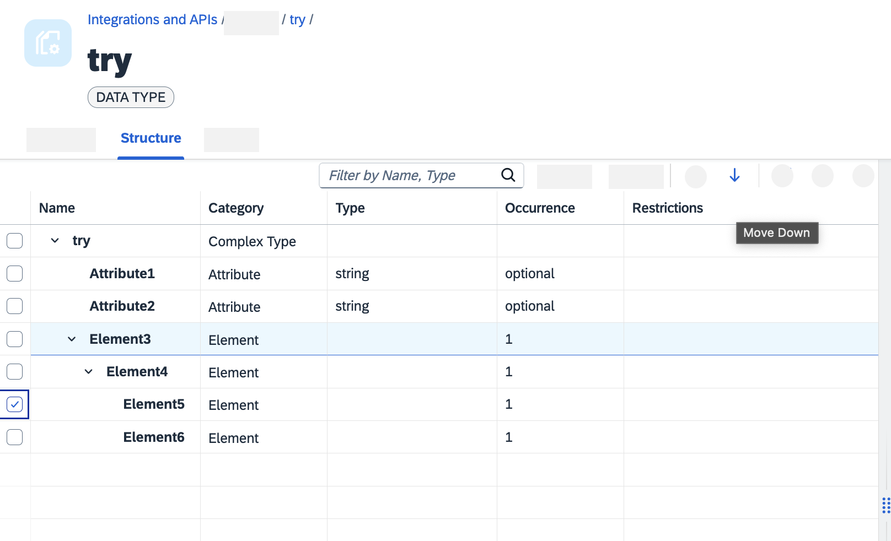

> Note: You cannot move up an immediate child node(first node under a parent) at all hierarchies. And, you cannot move last node in a hierarchy down.

### View Message Type

Message Types comprises a data type that describes the structure of a message. You can find the following details.

Following details you see as soon as you land on the Structure tab.

|             Tab              |     Field      |                                                              Description                                                               | Editable |
| :--------------------------- | :------------- | :------------------------------------------------------------------------------------------------------------------------------------- | :------- |
| Structure                    | `Name`         | `Name of the message type`                                                                                                             | `No`     |
| Structure                    | `Category`     | `It can be Elements or Attributes`                                                                                                     | `No`     |
| Structure                    | `Type`         | `Displays the referenced data type assigned to the root node and built-in data type (decimal, string, or integer) of the child nodes.` | `Yes`    |
| Structure                    | `Occurrence`   | `Appears only for attributes, can be required or optional`                                                                             | `No`     |
| Structure                    | `Restrictions` | `Restriction of the value range of nodes`                                                                                              | `No`     |
| Structure > Right-hand panel | `Namespace`    | `The namespace to which Message Type belongs to or where it's created. `                                                               | `Yes`    |

When you select a row you see additional details in view only mode. The Restrictions are non editable and depend upon the used user-defined data type. 

### Edit Message Type
For message types, you can only edit the Data Type Used from both Overview and Structure tabs.

From Structure & Overview tab:

1. Choose **Edit**.

  <!-- border -->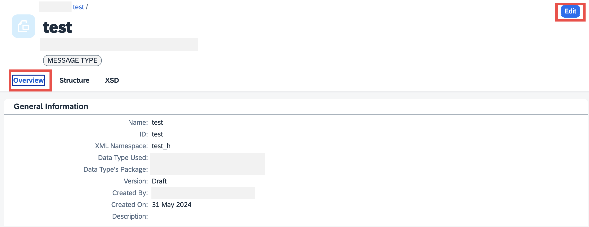

  <!-- border -->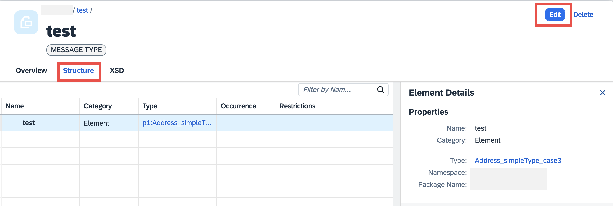

2. Select a row to view the additional details. 
3. Following fields can be edited in the right hand-panel of Structure tab or from Overview tab:
   - **Data Type Used**: Choose **Select**. Select the integration packages from which you wish to list the data types. Select the data type to be assigned. The structure of the selected data type gets loaded in the tree table.

  <!-- border -->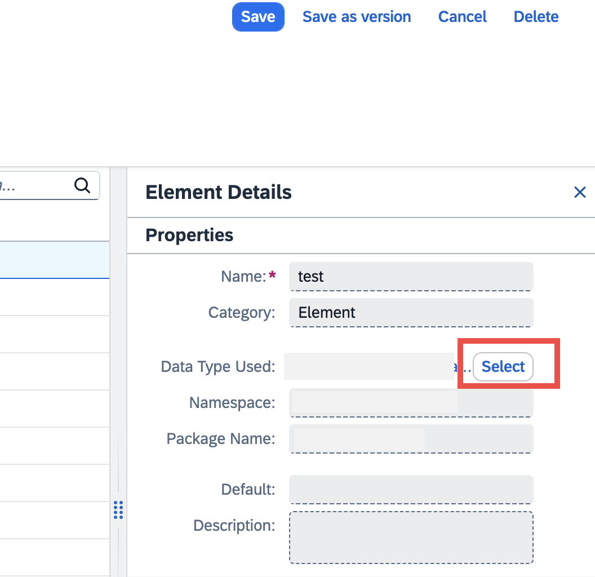

  <!-- border -->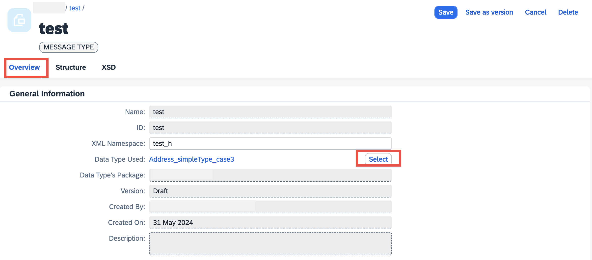

  <!-- border -->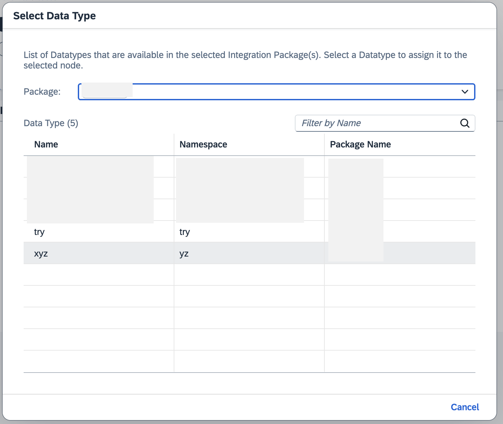

  > Note: You can edit the referenced data type of the root node only.

   - **Namespace** (Only editable from Overview tab): If the namespace is not mentioned, you can enter a new one or modify the existing one. 
  
    <!-- border -->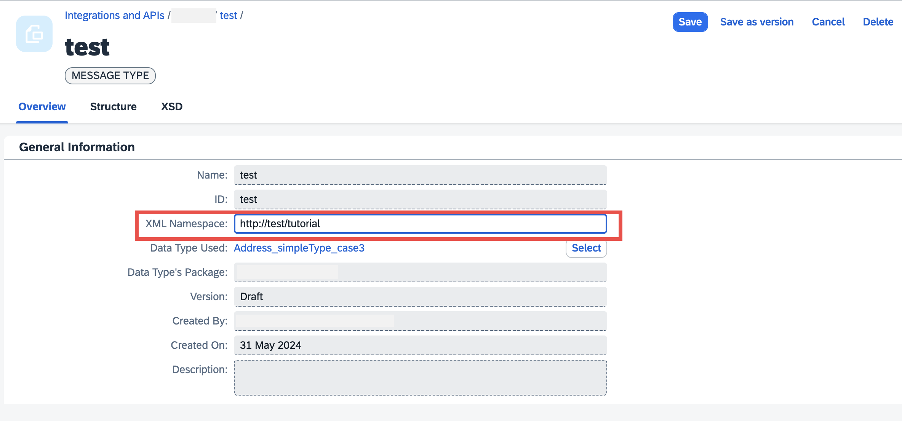
  
    > Note: 
      - XMLNamespace should begin with an alphabet and cannot contain tilde (~), back-quote (`), and caret(^).
      - The XMLNamespace 'http://www.w3.org/2001/XMLSchema' is dedicated to schema components and cannot be used. 
 

