## You will learn
-	How to connect Java Database Connectivity (JDBC) receiver adapter with your database (on the receiver system) and send, receive, or update data on the database.
-	How to interact with your database using SQL queries and XML.
-	How to perform operations on database using Batch Payload functionality.

## Prerequisites
 - You have enabled the Cloud Integration capability of [SAP Integration Suite](http://bit.ly/3VmWOOZ).
 - You have configured your [JDBC adapter](https://blogs.sap.com/2018/10/31/configuring-jdbc-adapter-a-step-by-step-guide/).

## Intro
The data that you are transferring (sending or receiving) is called payload. This payload sent to the JDBC adapter can be modified. You can modify multiple records in a single payload using either INSERT, UPDATE, or DELETE modes. This can be achieved using Batch Payload functionality.

There are two types of Batch operations:

-	Atomic: This mode considers each batch operation as a single unit. It updates the whole batch operation successfully or reverts the entire operation to its initial state if anything in the batch operation fails.

-	Non-Atomic: The operation in this mode varies based on the database and its driver. Generally, it updates all the successfully executed records and throws an exception if anything fails. It does not revert the failed records to its initial state.

Following the steps below, you will be able to set up a sample database, create an integration flow, upload drivers, and data sources required for JDBC receiver adapter. Then, you can create a payload, execute, and benefit from Batch Payload functionality.


### Choose your Database
Based on your requirements, choose a database you wish to work on. JDBC receiver adapters supports more than ten databases. To know more, see [JDBC: Supported Databases](https://help.sap.com/docs/CLOUD_INTEGRATION/368c481cd6954bdfa5d0435479fd4eaf/88be64412f1b46d684dfba11f2767c5b.html?locale=en-US&version=Cloud).

If you're connecting to on-premise database, then you must validate the connection in the **Cloud Connector**. For more information, see [JDBC: Access Control](https://help.sap.com/docs/CP_CONNECTIVITY/cca91383641e40ffbe03bdc78f00f681/f42fe4471d6a4a5fb09b7f3bb83c66a4.html?version=Cloud&locale=en-US).


### Create data source and upload driver
JDBC adapter supports third party and in-house databases on Neo and Cloud Foundry Business Technology environments. Before you establish the connection to these databases, or create an integration flow, you must upload drivers (applicable for HANA, ASE, PostgreSQL only) and add Data Sources.

Refer to [Configure JDBC Drivers](https://help.sap.com/docs/CLOUD_INTEGRATION/368c481cd6954bdfa5d0435479fd4eaf/77c7d9550e12494eb600ec82496ef215.html?locale=en-US&version=Cloud) to understand the process of uploading the drivers and the databases.
<!-- border -->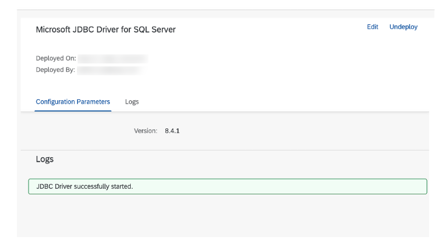

Refer to [Managing JDBC Data Sources](https://help.sap.com/docs/CLOUD_INTEGRATION/368c481cd6954bdfa5d0435479fd4eaf/4c873fac537248e58767f74e4a74d867.html?locale=en-US&version=Cloud) to understand the process to create a data source.
<!-- border -->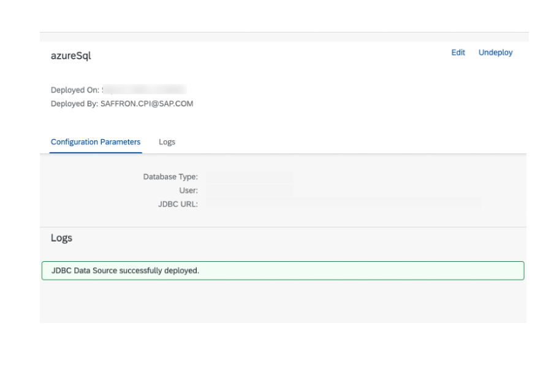

### Connect with Receiver/Database via JDBC adapter
Now, create a simple integration flow to understand the basic function of JDBC adapter. In this integration scenario, a sender is connected to the Start event via HTTPS Sender adapter and the End event is connected with receiver via JDBC adapter. This JDBC adapter enables the connection of the integration flow with the receiver's database. It allows you to send, receive, update the data of receiver's database.

  <!-- border -->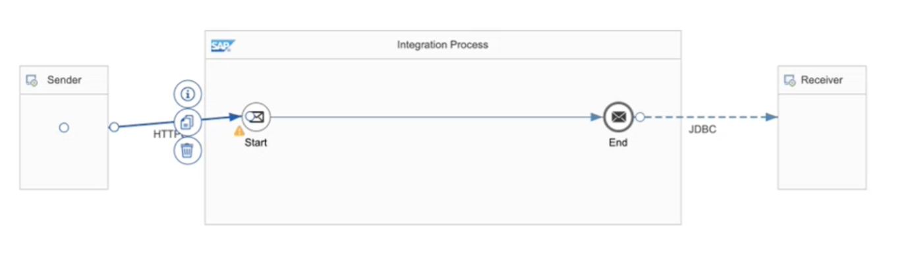

You must set the following properties:

-	For HTTPS adapter: Under **Connection tab** > **Address**: Define your end point.

  <!-- border -->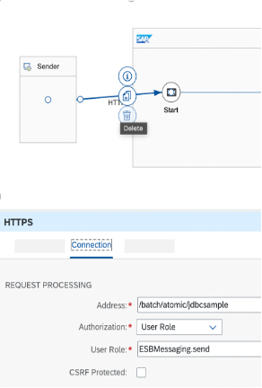

To understand about other settings, refer to [HTTPS Sender Adapter](https://help.sap.com/docs/CLOUD_INTEGRATION/368c481cd6954bdfa5d0435479fd4eaf/0ae4a78909c4479cbc3cc414250919de.html?locale=en-US&version=Cloud)

-	For the JDBC adapter: Under **Connection tab** > **JDBC Data Source Alias**, enter the name of database source to which the adapter should connect to.

  <!-- border -->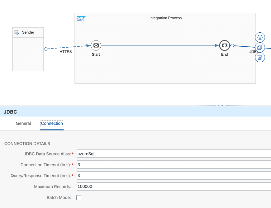

### Create sample database

To execute this scenario, create a table with few columns.

1. Add a content modifier and then add following query to its **Message Body**. To ensure duplicate row entry is restricted in your database, make one of the columns as primary key.

    `create table samplejdbc (emp_id integer primary key, emp_name varchar(255));`

      <!-- border -->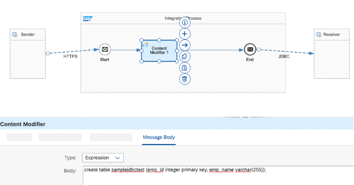

2. Deploy this integration flow. Now, try to execute this via [Postman]( https://www.getpostman.com/) (You can use any other HTTPS client application too.)
 You can find the endpoint in **Manage Integration Content** section as shows below.

    <!-- border -->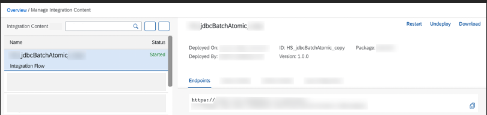

    In the **Request** section, enter this **End-point** and **Send** the blank query. This will set up connection of Postman with your integration flow.

    <!-- border -->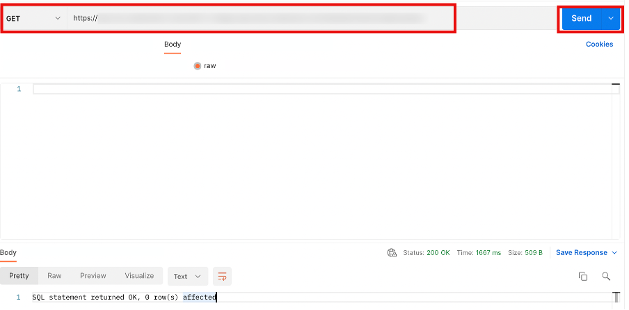

3. Before proceeding to the next step, remove Content Modifier from your integration flow. It was added to create a database successfully.


> For simplicity, Postman is used to push the payload, later you will also see how to use Groovy Script to push the payload.


### Execute Batch Payload

1. In your integration flow, edit the settings for JDBC Receiver adapter. Under **Connections** tab, select the **Batch Payload** checkbox and **Batch Operation** as **Atomic**. It's done because Batch supports XML payload in INSERT, UPDATE and DELETE modes only. Native SQL queries are supported with prepared statements only.

    <!-- border -->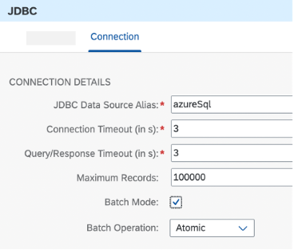

2. Open your HTTP client (in this case Postman) to create a payload. Enter the **Username** and **Password** under **Authorisation** tab.

    <!-- border -->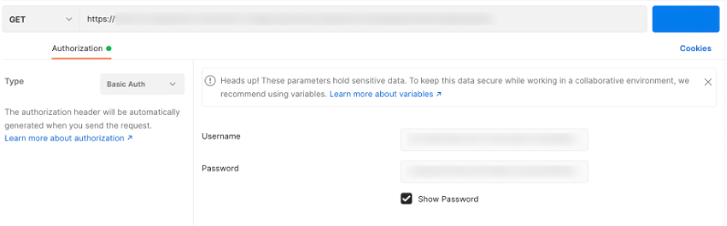

3. To create Payload, use INSERT mode and create a payload (with table name `samplejdbctest` ) to test Batch Payload scenario. To use these modes, you must follow the syntax. **Send** the following payload from **Request > Body** tab of postman:

    ```[2-21]
    <root>
    	<insert_statement1>
    		<dbTableName action="INSERT">
    			<table> samplejdbctest</table>
    			<access>
    				<emp_id>1</emp_id>
    				<emp_name hasQuot="Yes">v XXXXX</emp_name>

    			</access>
    		</dbTableName>
    	</insert_statement1>
    	<insert_statement2>
    		<dbTableName action="INSERT">
    			<table>samplejdbctest</table>
    			<access>
    				<emp_id>2</emp_id>
    				<emp_name hasQuot="Yes"> g28</emp_name>

    			</access>
    		</dbTableName>
    	</insert_statement2>
    </root>
    ```

      <!-- border -->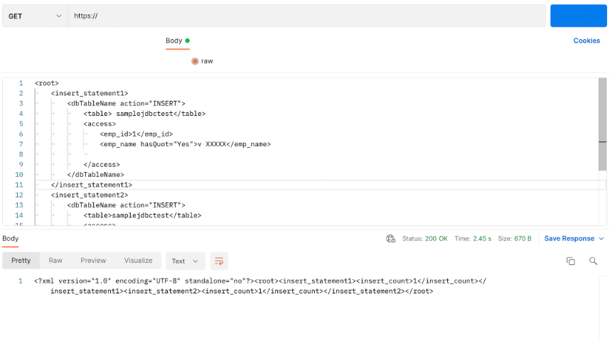

Notice that the JDBC adapter provides the content from the database in a specific format as described under [ Defining XML Documents for Message Protocol XML SQL Format](https://help.sap.com/docs/SAP_NETWEAVER_750/5cf7d2de571a45cc81f91261668b7361/2e96fd3f2d14e869e10000000a155106.html?version=7.5.4&locale=en-US)

To check the Message Processing Log (MPL) of this integration flow from your tenant, go to **Monitoring** > **Overview** > **All Integration flows**. Choose the latest record with your artefact name.

  <!-- border -->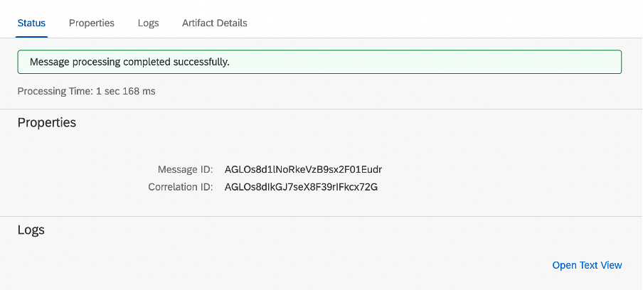

> Ensure to check the time stamp to determine which record to check.


### Atomic Batch operation

Atomic Batch Operation doesn't allow an action to be performed on the payload if an error is encountered. To verify that, follow these steps:


1. Copy the above payload and modify just one record and make it unique. For example, here the **`emp_id`** (of second record) is set as 3. Thus, making that record unique, but the first record is duplicate. Send this query.

    ```[15-17]
    <root>
    	<insert_statement1>
    		<dbTableName action="INSERT">
    			<table> samplejdbctest</table>
    			<access>
    				<emp_id>1</emp_id>
    				<emp_name hasQuot="Yes">v XXXXX</emp_name>

    			</access>
    		</dbTableName>
    	</insert_statement1>
    	<insert_statement2>
    		<dbTableName action="INSERT">
    			<table>samplejdbctest</table>
    			<access>
    				<emp_id>3</emp_id>
    				<emp_name hasQuot="Yes"> g28</emp_name>

    			</access>
    		</dbTableName>
    	</insert_statement2>
    </root>
    ```

      <!-- border -->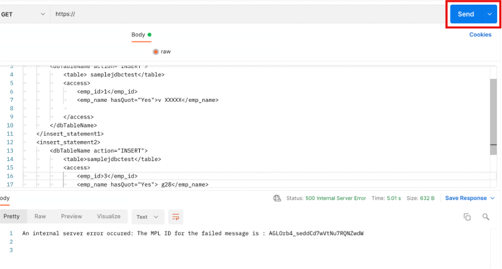

     Postman displays error. To get more clarity, check the MPL.  
    <!-- border -->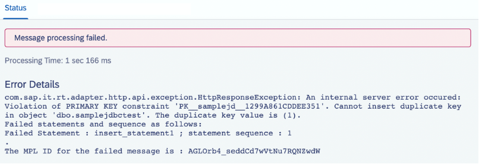


2. To confirm whether unique record (with `emp_id` 3) is inserted in the database or not, uncheck the **Batch Mode** checkbox and **Deploy** your integration flow.

    <!-- border -->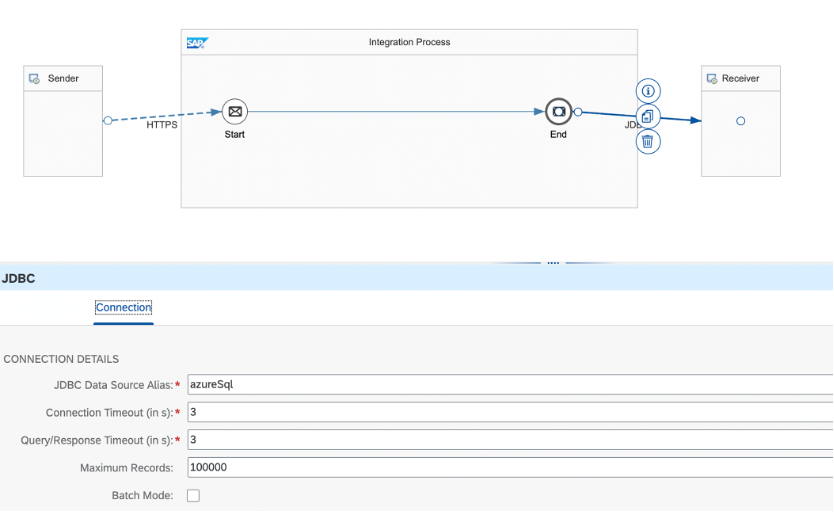

Then, **Send** the following query from Postman:

`select * from samplejdbctest`

  <!-- border -->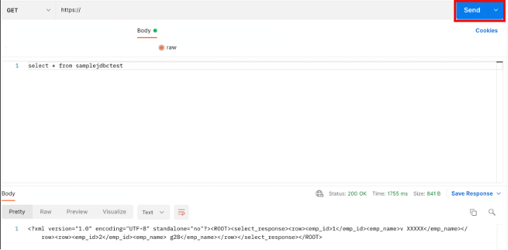

This response shows that no new data has been inserted. Hence, verifying the Atomic operation.

### Non-Atomic Batch operation


Depending upon your driver (which depends upon choice of database), the behaviour of Non- Atomic mode differs. Say for SQL server database, you would be able to insert the unique record and it would fail all the duplicate records. So, the complete payload doesn't fail. But for some other database and driver, it may act similar to Atomic mode and fail the payload even if single error is encountered.

1. In your integration flow, edit the settings for JDBC Receiver adapter. Under **Connections** tab, select the **Batch Payload** checkbox and select **Batch Operation** as Non-Atomic.

    <!-- border -->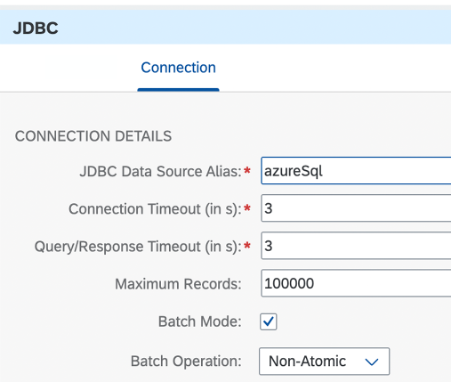

2. **Send** this payload from Postman. Here the **`emp_id`** (of second record) is set as 4. Thus, making that record unique, but the first record is duplicate.

    ```[15-17]
    <root>
    	<insert_statement1>
    		<dbTableName action="INSERT">
    			<table> samplejdbctest</table>
    			<access>
    				<emp_id>1</emp_id>
    				<emp_name hasQuot="Yes">v XXXXX</emp_name>

    			</access>
    		</dbTableName>
    	</insert_statement1>
    	<insert_statement2>
    		<dbTableName action="INSERT">
    			<table>samplejdbctest</table>
    			<access>
    				<emp_id>4</emp_id>
    				<emp_name hasQuot="Yes"> g28</emp_name>

    			</access>
    		</dbTableName>
    	</insert_statement2>
    </root>
    ```
      <!-- border -->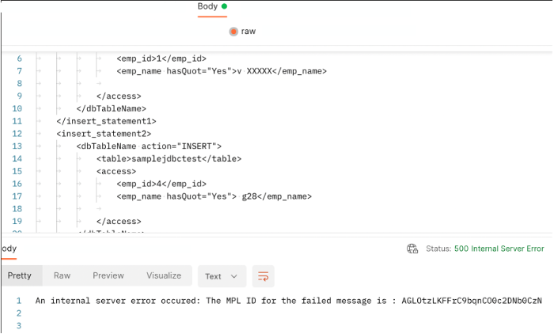

      Check the MPL too.

    <!-- border -->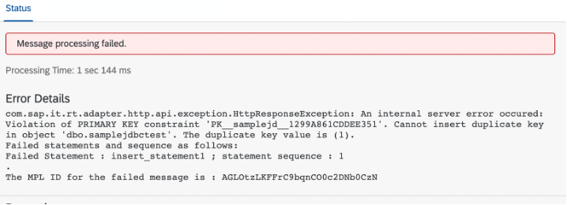

3. To confirm whether the unique record (with `emp_id` 4) is inserted in the database or not uncheck the **Batch Mode** checkbox and **Deploy** your integration flow.

4. **Send** the following query from Postman:
    `select * from samplejdbctest`  

      <!-- border -->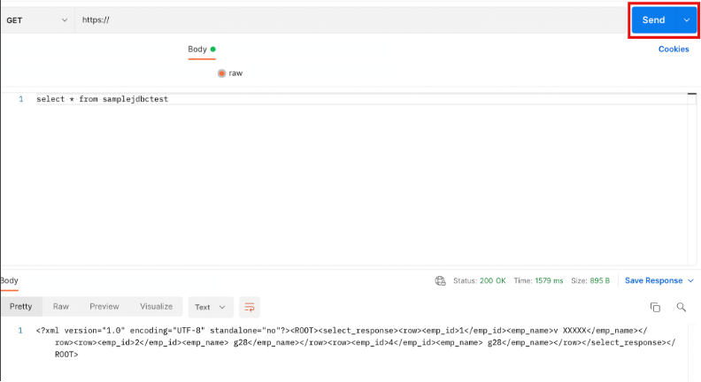

So, it is evident that using Non-Atomic mode, the new record is getting inserted and the duplicate record fails. So, the whole payload doesn't fail unlike Atomic Batch operation.

>The function/behaviour of Non-Atomic Batch Operation may depend upon the choice of database.

### Send payload using Groovy Script

You can also upload the payload using the **Groovy Script**. In this case you must use the prepared statements.


1. Uncheck **Batch Mode** in the integration flow.
<!-- border -->
Now, insert a new database table. Try to do it directly from Postman unlike database creation via **Content Modifier**. **Send** the following query from Postman.

    `create table testjdbcsample (emp_id integer primary key, emp_name varchar (255), join_date varchar(255), a1 integer, a2 integer, email varchar(255));`

      <!-- border -->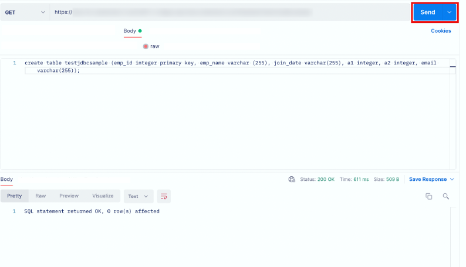

2. In the integration flow, insert the **Groovy script** to pass the payload and click **Select**.

    <!-- border -->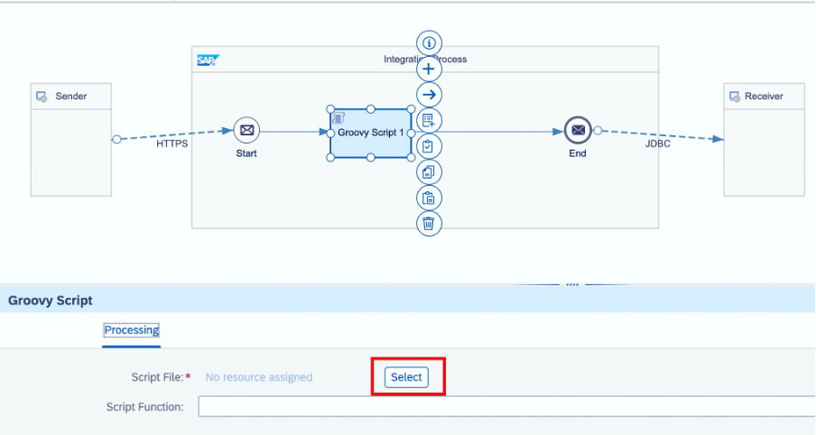

    ```
    import com.sap.gateway.ip.core.customdev.util.Message;
    import java.util.HashMap;
    import java.util.Arrays;

    //Insert script
    def Message processData(Message message) {

        //Headers
        List paramList = new ArrayList();
        paramList.add(Arrays.asList(108, 'test', 2021-01-01,1,1,'test@gmail.com'));
        paramList.add(Arrays.asList(107, 'test', 2021-01-01,1,1,'test@gmail.com'));
        paramList.add(Arrays.asList(111, 'test', 2021-01-01,1,1,'test@gmail.com'));
        paramList.add(Arrays.asList(105, 'test', 2021-01-01,1,1,'test@gmail.com'));
        message.setHeader("CamelSqlParameters",paramList);

        //Body
        message.setBody("INSERT INTO testjdbcsample (emp_id,emp_name,join_date,a1,a2,email) VALUES(?,?,?,?,?,?)");
        return message;
    }
    ```
3. Select the **Batch Mode** checkbox and click **Deploy**.

4. Run a blank query in Postman to send the entered payload via Groovy Script and establish a connection between Postman and your integration flow.
    <!-- border -->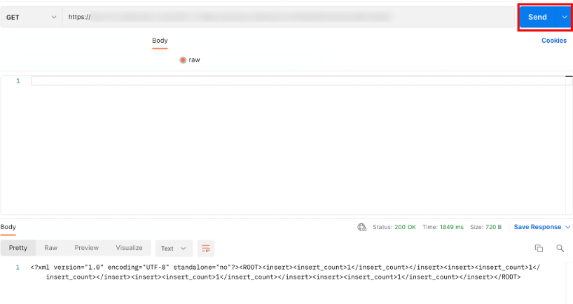

5. Now, verify if the payload has been successfully sent to the database. Remove **Groovy Script**, deselect the **Batch Mode** and **Deploy** the integration flow. Then, run the following query from Postman:
`select * from testjdbcsample`
    <!-- border -->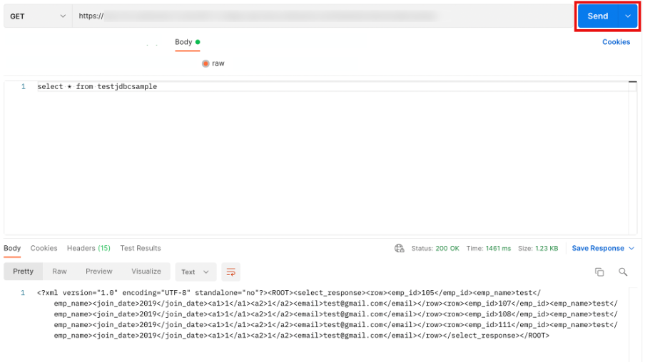

This displays the table data. Hence, a payload has been sent successfully via Groovy Script. You can now alter the table data and verify the Atomic and Non Atomic behaviours as earlier.

### Atomic Batch operation with Groovy Script
Replicate the above Atomic scenario with a Groovy Script.


1. Choose **Atomic Batch Mode** and add the following script in Groovy Script as explained in Step 8.

    Here, the third and fourth record of the original Groovy Script have been modified.

    ```[12-13]
        import com.sap.gateway.ip.core.customdev.util.Message;
        import java.util.HashMap;
        import java.util.Arrays;

        //Insert script
        def Message processData(Message message) {

            //Headers
            List paramList = new ArrayList();
            paramList.add(Arrays.asList(108, 'test', 2021-01-01,1,1,'test@gmail.com'));
            paramList.add(Arrays.asList(107, 'test', 2021-01-01,1,1,'test@gmail.com'));
            paramList.add(Arrays.asList(112, 'test112', 2021-01-01,1,1,'test@gmail.com'));
            paramList.add(Arrays.asList(106, 'test106', 2021-01-01,1,1,'test@gmail.com'));
            message.setHeader("CamelSqlParameters",paramList);

            //Body
            message.setBody("INSERT INTO testjdbcsample (emp_id,emp_name,join_date,a1,a2,email) VALUES(?,?,?,?,?,?)");
            return message;
        }
    ```  
2. **Send** a blank query in Postman to send the entered payload via Groovy Script.

3. Check the error from MPL.

    <!-- border -->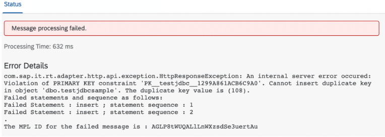

4. Remove **Groovy Script**, switch off the **Batch Mode** and **Deploy** the integration flow. Then, run the following query from Postman to check the database updates, if any:

`select * from testjdbcsample`

  <!-- border -->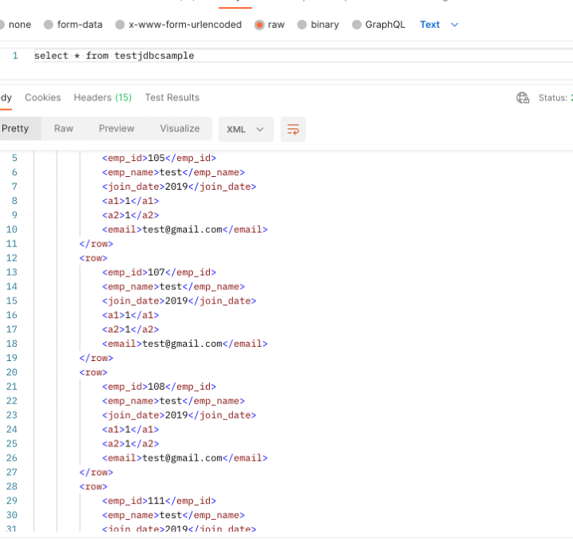

This proves the Atomic mode functionality as the database table is not updated. It is the same as it was after Step 8. The new record didn't insert because there were duplicate records.


### Non-Atomic Batch operation with Groovy Script

1. Choose **Non-Atomic Batch Mode** and add the following script in Groovy Script as explained in Step 8.

    ```[12-13]
    import com.sap.gateway.ip.core.customdev.util.Message;
    import java.util.HashMap;
    import java.util.Arrays;

    //Insert script
    def Message processData(Message message) {

        //Headers
        List paramList = new ArrayList();
        paramList.add(Arrays.asList(108, 'test', 2021-01-01,1,1,'test@gmail.com'));
        paramList.add(Arrays.asList(107, 'test', 2021-01-01,1,1,'test@gmail.com'));
        paramList.add(Arrays.asList(112, 'test112', 2021-01-01,1,1,'test@gmail.com'));
        paramList.add(Arrays.asList(106, 'test106', 2021-01-01,1,1,'test@gmail.com'));
        message.setHeader("CamelSqlParameters",paramList);

        //Body
        message.setBody("INSERT INTO testjdbcsample (emp_id,emp_name,join_date,a1,a2,email) VALUES(?,?,?,?,?,?)");
        return message;
    }
    ```
2. **Send** a blank query in Postman to send the entered payload via Groovy Script.

3. Check the error from MPL.
    <!-- border -->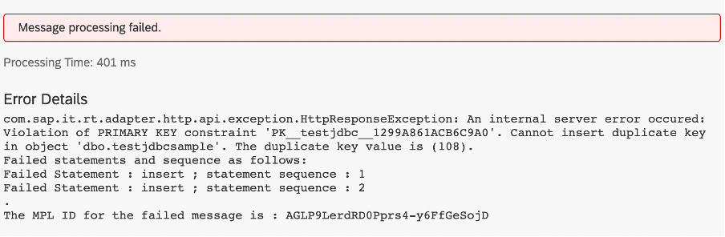

4. Remove **Groovy Script**, switch off the **Batch Mode** and **Deploy** the integration flow. Then, run the following query from Postman to check the database updates, if any:

`select * from testjdbcsample`
    <!-- border -->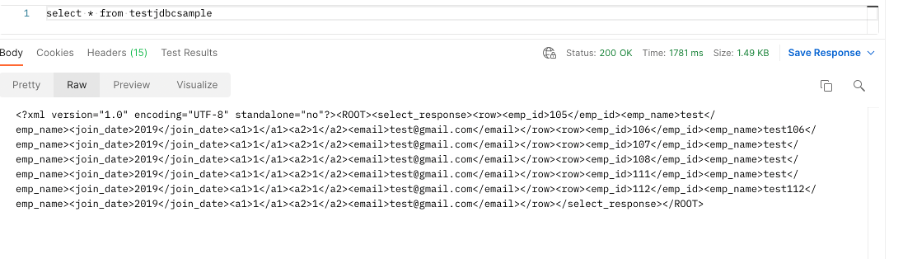

This shows that the database table has been appended with the new records, proving the Non-Atomic mode operation.

Congratulations! You've learned how to use Batch Mode functionality. Now, you can try to implement the desired type of Batch Mode in your business requirements.  

---
