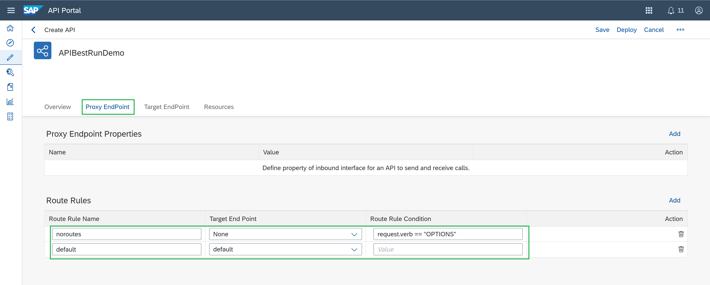

# Configure SAP API Management policies to avoid CORS issues and generate an API Key
<!-- description --> Learn how to set up API Management policies to avoid CORS issues when calling the API endpoint from SAP Build Apps (formerly SAP AppGyver), also you will learn how to apply security policies to enable the API consumption via an API Key.

## Prerequisites

 - You have a SAP BTP account or trial account with access to the SAP Integration Suite.
 - You have completed the previous tutorial [Send SMS using SAP Cloud Integration while consuming a Twilio API](btp-integration-suite-integral-cpi-urlencoded).


## You will learn

  - How to set up API Management policies to avoid CORS issues when calling the API endpoint.
  - How to apply security policies to enable the API consumption via an API Key.

### Set up the policy to avoid CORS issues

1. Go to your SAP API Portal (in the main SAP Integration Suite portal).

2. Create an API and select URL. Here you're going to paste your IFlow endpoint from past tutorials. Give it a name: `APIBestRunDemo`. Give it a path: `/https/salesOrder`, and service type `REST`.

    

3. After creating it, go to the Proxy Endpoint tab and add the following in this order, and save it:

    

4. Now, go to Policies (if it doesn't show up in the top-right of your screen, click on the 3 dots).

    Here you'll add the required policies to avoid CORS issues while calling this API from SAP Build Apps and configure the API Key policy later on.

5. On the Edit Mode, start adding the Policies as followed:

    In the PostFlow inside the Proxy Endpoint configuration, add an `Assign Message` policy as an `OutgoingResponse` and name it `setCORS`. Like this:

    

6. Copy and paste this script:

    <!-- cpes-file db/schema.cds -->
    ```XML
    <!-- This policy can be used to create or modify the standard HTTP request and response messages -->
    <AssignMessage async="false" continueOnError="false" enabled="true" xmlns='http://www.sap.com/apimgmt'>
            <Set>
                <Headers>
                    <Header name="Access-Control-Allow-Origin">*</Header>
                    <Header name="Access-Control-Allow-Headers">set-cookie, origin, accept, maxdataserviceversion, x-csrf-token, authorization, dataserviceversion, accept-language, x-http-method, content-type, X-Requested-With, apikey</Header>
                    <Header name="Access-Control-Max-Age">3628800</Header>
                    <Header name="Access-Control-Allow-Methods">GET, PUT, POST, DELETE</Header>
                    <Header name="Access-Control-Expose-Headers">set-cookie, x-csrf-token, x-http-method</Header>
                </Headers>
            </Set>
            <IgnoreUnresolvedVariables>false</IgnoreUnresolvedVariables>
            <AssignTo createNew="false" type="response">response</AssignTo>
    </AssignMessage>
    ```
    >Notice that you're already adding `apikey` as a header in the policy.

    You should look it like this:

    

7. In the ProxyEndpoint click on `+` to add one. Name it `preflight` and in the condition string paste: `request.verb == "OPTIONS"`. Like this:

    

    This is all you need to avoid CORS issues when calling our API from SAP Build Apps.

    >On write "preflight" step, you may find a bug on the API Management UI, where the Update button stay on grey/disable. To avoid it and save your changes, you must create a dummy assign message anywhere, save it and then remove it.

### Create a Key Value Map for your SAP Cloud Integration Credentials

1. Before adding the needed policies, create first a Key Value Map with your CPI credentials (to access the Cloud Integration Platform API endpoint). You will need this credential to reference it in the API Key Policy.

    Go to Configure (click on the tool icon) -> go to the `Key Value Maps` tab and create one.


    

2. Put `CPICredentials` as the name and declare your CPI credentials (username and password). Check the `Encrypt Key Value Map` box.


    

### Add the Verify API Key Policy

Go back to your API policies.

In the TargetEndpoint, add 3 policies in the PreFlow.

1. Add a Key Value Map Operations policy, name it and leave it as a Incoming Request. This is needed to get the CPI Credentials created before, as a Key Value Map. Like this:

    

    Copy and Paste this script (you will be referencing 'CPICredentials' with the mapIdentifier parameter):

    <!-- cpes-file db/schema.cds -->
    ```XML
    <KeyValueMapOperations mapIdentifier="CPICredentials" continueOnError="false" enabled="true" xmlns="http://www.sap.com/apimgmt">
    <!-- Read parameter with key "username" and assign its value to private variable BasicAuthUsername-->
    <Get assignTo="private.BasicAuthUsername" index='1'>
    <Key><Parameter>username</Parameter></Key>
    </Get>
    <!-- Read parameter with key "password" and assign its value to private variable BasicAuthPassword-->
    <Get assignTo="private.BasicAuthPassword" index='1'>
    <Key><Parameter>password</Parameter></Key>
    </Get>
    <Scope>environment</Scope>
    </KeyValueMapOperations>
    ```       
    Like this:

    

2. Add a Basic Authentication policy, name it and leave it with the `IncomeRequest` stream. Like this:

    

    Copy and paste this script:

    <!-- cpes-file db/schema.cds -->
    ```XML
    <BasicAuthentication async='true' continueOnError='false' enabled='true' xmlns='http://www.sap.com/apimgmt'>
        <!-- Operation can be Encode or Decode -->
        <Operation>Encode</Operation>
        <IgnoreUnresolvedVariables>false</IgnoreUnresolvedVariables>
        <!-- for Encode, User element can be used to dynamically populate the user value -->
        <User ref='private.BasicAuthUsername'></User>
        <!-- for Encode, Password element can be used to dynamically populate the password value -->
        <Password ref='private.BasicAuthPassword'></Password>

        <!-- Assign to is used to assign the encoded value of username and password to a variable. This should not be used if the operation is Decode -->
        <AssignTo createNew="true">request.header.Authorization</AssignTo>
    </BasicAuthentication>
    ```  

    You should look it like this:

    

3. Add a API Key verification policy to request the API Key every time the API is called (you'll later need to create the API Product and subscribe to the application to get the API Key). Add the `Verify API Key` policy, same in the PreFlow. Like this:

    

    <!-- cpes-file db/schema.cds -->
    ```XML
    <!--Specify in the APIKey element where to look for the variable containing the api key-->
        <VerifyAPIKey async='true' continueOnError='false' enabled='true'
            xmlns='http://www.sap.com/apimgmt'>
        <APIKey ref='request.header.ApiKey'/>
    </VerifyAPIKey>
    ```

    This should be the first policy to be triggered. Make sure it is set it up as the first one (you can change the order with the arrows in the top-right). Like this:

    

4. Click on Update, Save and Deploy your API project.

    

### Create an API Product and Subscribe to the Application

1. Now you need to create the API Product. Go to the pencil icon (develop), click on the `Products` tab and create one. Put this name to your Product `APIBestRunDemoProduct`.

    

3. Reference your API to your Product.

    

4. Publish your Product, click on `Publish`.

5. Then, go to the API Business Hub Enterprise portal.

    

    You should be able to see it in your SAP API Business Hub:

    

6. Enter the API product and subscribe it by creating a new Application:

    

    Name it `APIBestRunDemoApplication`, like this:

    


7. Here's where you can get your API Key, crucial to authenticate to this API endpoint when consuming its service.

    

Now you've successfully created policies to avoid CORS issues and enable an API Key to authenticate and consume your API endpoint from SAP Integration Suite.

### Add additional tasks into your Integration Flow

Right now, as following the whole exercises, the IFlow is returning us the SMS message sent by consuming the Twilio API. But for the purpose of the exercise with SAP Build Apps, you're going to use as the return message, mainly the receipt URL when the payment transaction is successfully done with Stripe. For this, you need to save this message in the IFlow and retrieve it at the end of the IFlow.

Remember the previous tutorial about "Set up Write, Filter and Get Tasks in the Integration Flow…" for filtering the payment data and later calling the SAP C4C OData service? well, you are going to do the same, but in this case to retrieve the receipt URL from the Stripe request response.

1. Go back to SAP Cloud Integration and to your Integration Flow. Add a Write task after the Stripe Connector request reply, and configure the task as following:

    

2. And now add a Get task at the end of the IFlow to retrieve this returned message:

    

    Save and deploy your IFlow.

Now, it's time to set up the integration with SAP Build Apps. Check out the next and final tutorial of this series: [Integrate SAP Build Apps with SAP Integration Suite](btp-integration-suite-integral-appgyver).

### Check your knowledge

### One more time, check your knowledge