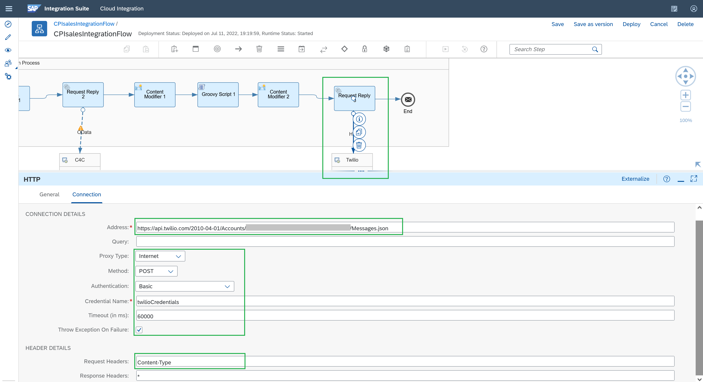

# Send SMS using SAP Cloud Integration while consuming a Twilio API

<!-- description --> Learn how to pass parameters with URL encoded form to a HTTP receiver adapter, to send SMS messages using a Twilio API, as a notification that the Order has been successfully created.

## Prerequisites

 - You have a SAP BTP account or trial account with access to the SAP Integration Suite.
 - You have completed the previous tutorial [Consume a SAP Sales and Service Core API to create Sales Orders using SAP Cloud Integration](btp-integration-suite-integral-sales-core).
 - You have a Twilio account or trial account. In the Twilio documentation, you'll see 3 needed URL encoded parameters to be sent to trigger the API call, which are:

    - From <Twilio sender's phone number>
    - To <Recipient's phone number>
    - Body <Body of the message / SMS to send>

    Keep in mind that in fact the recommended way to consume Twilio APIs, is by leveraging its Connector with SAP Open Connectors, as you used in a previous tutorial with Stripe. This exercise is to learn how to do it with a standard HTTP adapter.

## You will learn

  - How to pass parameters with URL encoded form to a HTTP receiver adapter, to send SMS messages using a Twilio API, as a notification that the Order has been successfully created.

### Get the Sales Order Id from SAP Sales and Service Core

To continue from the previous tutorial where you configured a SAP Sales and Service Core API to create sales orders, now what you need to get the sales order id and send a SMS with a custom message, consuming the Twilio "create a message" API. Here's the Twilio API [documentation](https://www.twilio.com/docs/sms/api/message-resource#create-a-message-resource).

1. Add a Content Modifier task and in the Exchange Property tab, add a new property:
    * Action: Create
    * Name: `salesOrderId`
    * Source Type: `XPath`
    * Source Value: `/CustomerOrderCollection/CustomerOrder/ID`
    * Data Type: java.lang.String

    Like this:

    

    Now as you are going to send dynamic SMS with different sales orders Id for every time you run the demo, you need to add a Groovy Script task to configure our new needed Body for the Twilio SMS API.

2. Add a Groovy Script and create a new script by clicking in the page and plus + icon while selecting the Groovy task:

    

    Copy and paste this code:

    <!-- cpes-file db/schema.cds -->
    ```Javascript
    import com.sap.gateway.ip.core.customdev.util.Message;
    import java.util.HashMap;
    def Message processData(Message message) {
        //Properties
        def properties = message.getProperties();
        salesOrder = properties.get("salesOrderId");
        messageText = ("Thank you for your purchase, your order id is " + salesOrder)
        message.setProperty("encodedMessageText", java.net.URLEncoder.encode(messageText, "UTF-8"));
        return message;
    }
    ```

    You should see it like this:

    

### Prepare headers and body to send x-www-form-urlencoded data to the Twilio service

As you can see, you don't need to add the headers here or the body, as you will use another Content Modifier to set them up. You are just getting the `salesOrderId` from the SAP Sales and Service core API response and concatenating it with the text message you want to send as a body in the SMS. You can also configure the same to get the phone number of the related customer and use it in the encoded message body to dynamically change the recipient's phone number as needed. For this exercise, just do it with the sales order id.

1. Add another Content Modifier and you are going to add the Content-Type as a header. Keep in mind that SAP Cloud Integration is case sensitive, so be sure to type down Content-Type with the C and T in capital letters.

    In the source value, copy and paste: application/x-www-form-urlencoded

    

2. Go now to the Message Body, and here you're going to use the type "Expression" (as the sales order and phone number will change in real life in every order).

    As Twilio requires the message to be sent with an encoded URL, you can practice/check the message to be encoded. This is the web page that I used to encode the body as Twilio needs it.

    Remember how Twilio needs the parameters to be sent:

    - From <Twilio sender's phone number>
    - To <Recipient's phone number>
    - Body <Body of the message / SMS to send>

    And by passing these parameters together, its needed to add the ampersand symbol "&" between them. Like this (this is an example):

    `From=inputValue1&To=inputValue2&Body=inputValue3`

    

3. Go back to your second Content Modifier and in the Message Body tab, change the type to Expression and add your encoded text message and needed parameters:

    

### Add the request call to post the message to the Twilio SMS API

1. Add a Request Reply task, a Receiver's box and a HTTP receiver adapter.

    >Keep in mind that in fact the recommended way to consume Twilio APIs, is by leveraging its Connector with SAP Open Connectors, as you demonstrate in a previous tutorial with Stripe. However I wanted to conduct the API consumption directly just for testing and documentation purposes.

    In the connection tab you'll need to specify your Twilio's API endpoint (remember to check the documentation). Create your Twilio developer account's credentials in SAP Cloud Integration, and extremely important: add as a Request Header the "Content-Type" header as defined in the 2nd content type. This is key to send the URL encoded parameters to trigger the Twilio create a message's API.

    


### Create Twilio credentials in SAP Cloud Integration

1. Click on Security Materials -> create and select User Credentials type and paste your Twilio API credentials: `account_sid` as user and `auth_token` as password. You can find your credentials in your Twilio developers' console.

    You should see it like this:

    

    Save and deploy your IFlow.

### Test your Integration Flow

1. Test the whole Integration Flow. Remember to activate the "Trace" mode in your already deployed IFlow:

    

2. Use Postman for testing my CPI API endpoint with the same initial payload mentioned in the previous tutorials:

    <!-- cpes-file db/schema.cds -->
    ```JSON
    {
    "AppGyverSalesOrder": {
        "customer": {
        "ObjectID": "<Object ID from SAP C4C>",
        "BuyerPartyID": <BuyerPartyID from SAP C4C>
        },
        "paymentData": {
        "amount": <Payment transaction amount to be processed in Stripe>,
        "customer": "<stripe customer id>",
        "currency": "<currency selected in stripe account>",
        "source": "<card id>",
        "description": "Test payment via CPI"
        },
        "product": [
        {
            "ProductID": "<Product ID from SAP C4C>",
            "Quantity": <Product quantity to be purchased>
        }
        ]
    }
    }
    ```

    

    If you want to, check in the Monitor Processing Message and Trace how the message was encoded:

    

    And the SMS:

    

Great! you've successfully have learned how to send SMS in Cloud Integration consuming a Twilio API.

Now it's time add security policies to the API endpoint using SAP API Management. Check this next tutorial: [Configure SAP API Management policies to avoid CORS issues and generate an API Key](btp-integration-suite-integral-api-management).

### Check your knowledge

### One more time, check your knowledge


