# Consume a Stripe service from SAP Open Connectors and SAP Cloud Integration to create payment transactions
<!-- description --> You'll learn how to consume Open Connectors in your Cloud Integration, in this case for consuming a Stripe service to create payment transactions.

## Prerequisites

 - You have a SAP BTP account or trial account with access to the SAP Integration Suite.
 - You have a Stripe account or trial account.
 - You have a Postman account.
 - You have completed the previous tutorial [Build an Integral SAP Integration Suite project and Consume it from a SAP Build Apps Custom App](btp-integration-suite-integral-project).

## You will learn

  - How to consume a SAP Open Connector service from SAP Cloud Integration to connect to a 3rd party application. In this case Stripe, for a payment transaction

### Create a Stripe Open Connector Instance

1.  Go to your Open Connectors portal and enable a Stripe Connector, place your pointer in the connector and click in Authenticate. Bear in mind that this step by step tutorial is for demo purposes.

    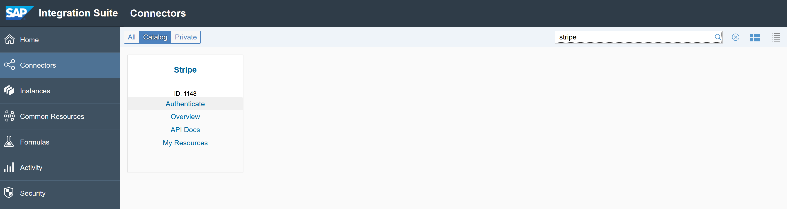

2. Search your Stripe secret Key and copy it into the Stripe connector as the API Key.

    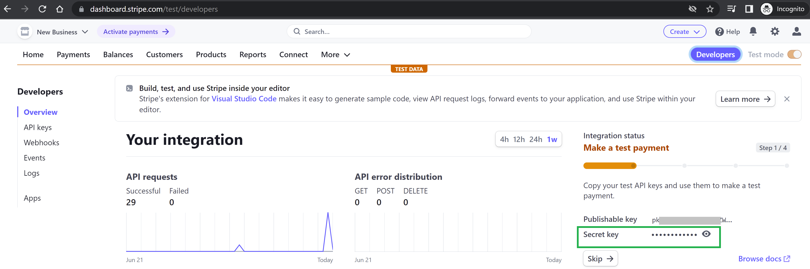

3. Go back to your Open Connector portal and add a name and create the connector's instance.

    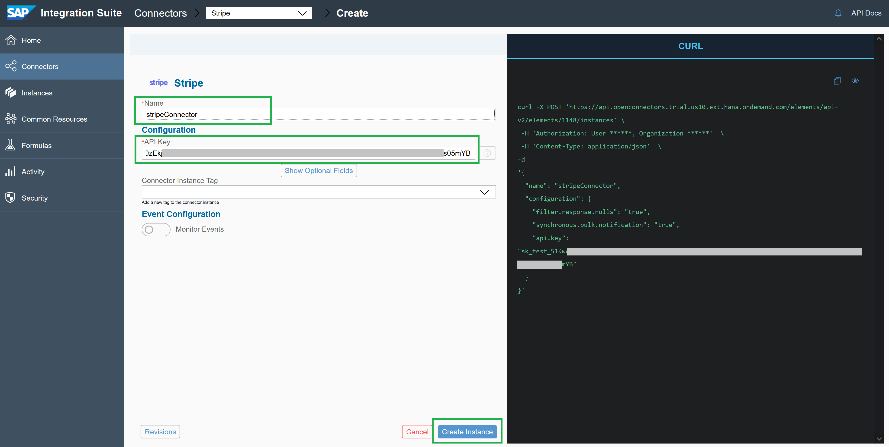

4. Click on "Test in the API Docs".

    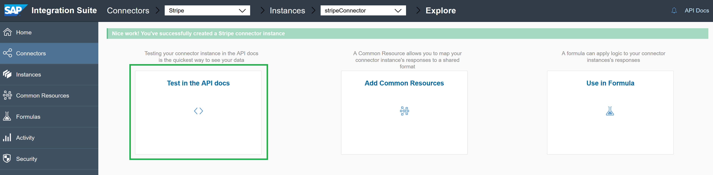

5. Run a quick test by getting the balances.

    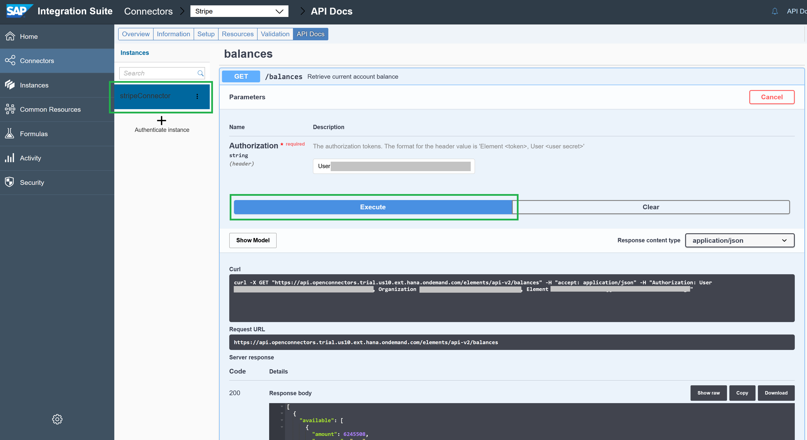

### Get your Open Connector Stripe Instance Credentials

1. Copy your Open Connectors credentials. You are going to use them to enable the credentials in Cloud Integration.

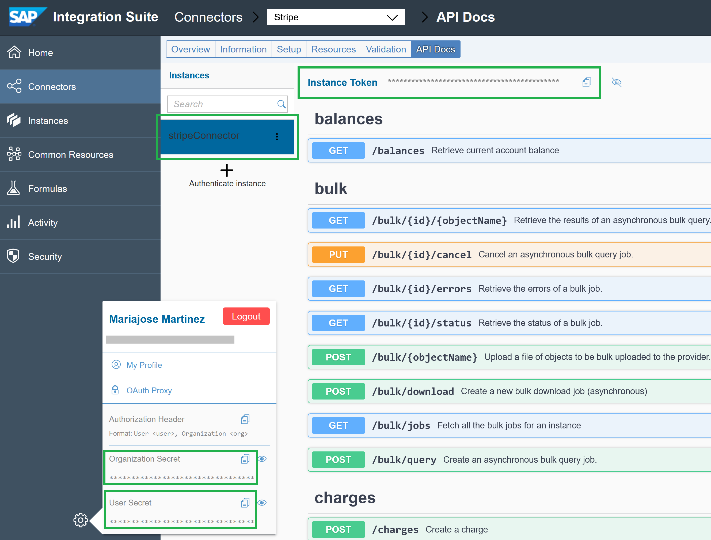

### Create an Open Connectors Credentials in SAP Cloud Integration

1. Go to you Cloud Integration environment. In the eye icon (Monitor), in the Manage Security Material tile, create an User Credentials artifact.

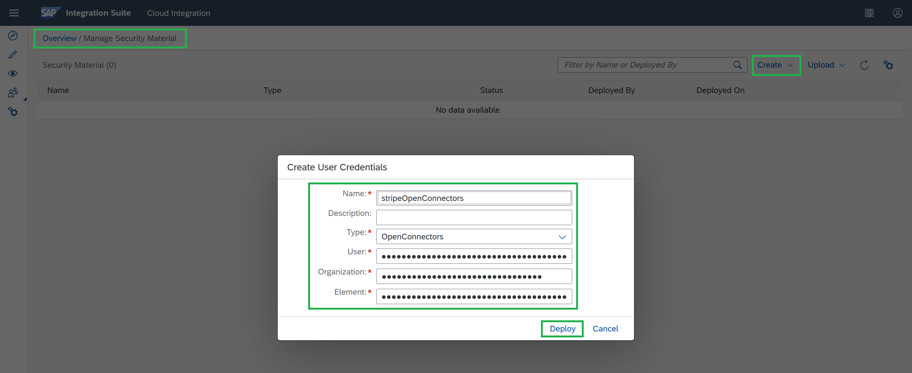

### Create a new SAP Cloud Integration Project

1. Go to the pencil icon (Design) and create a new package:

    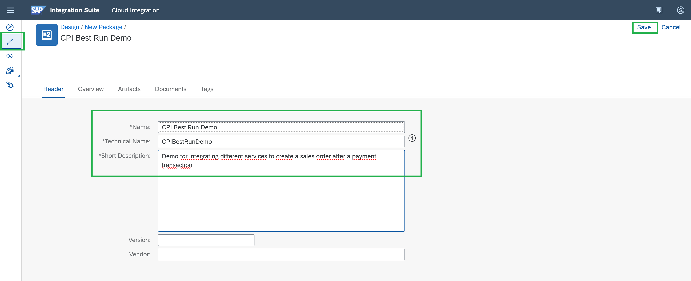

2. Go to the Artifacts tab and create an Integration Flow, name it as you want:

    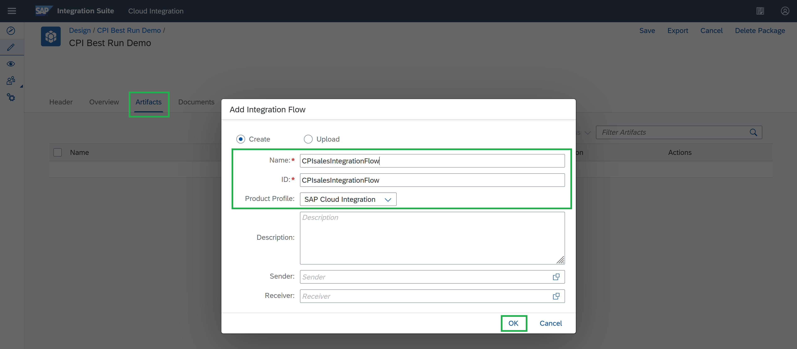

### Start building your Integration Flow

1. Click on your Integration Flow to start designing it. Then, click on Edit and change the Sender name. Type "AppGyver" as the application sending the call request to this IFlow, in the Sender box.

2. In the connection tab, add a path to the "address" and uncheck the CSRF box, you are not going to enable it for this Integration flow (IFlow).

    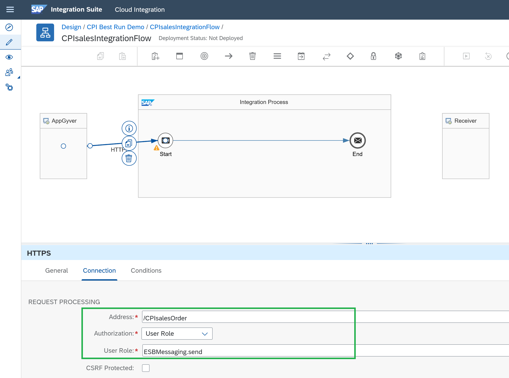

Before doing any data storage or message mapping, configure the IFlow to test the call to stripe.

3. Change the Receiver name to "Stripe"
4. Add a Request Reply task in the IFlow, select Open Connectors as the adapter
5. Select the Open Connector adapter, go to the connection tab, and add:
    - The API endpoint as the base URI (this one you get from testing the connector as illustrated above)
    - Select the credential you just created `stripeOpenConnectors`
    - In Resource, select the API path to create charges in Stripe, which is "charges"
    - Change the method to POST, as you are going to execute a POST call.
    - Leave JSON as the format.

    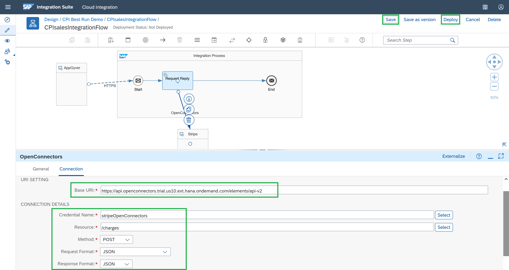

6. Save and Deploy the IFlow.

### Test your Integration Flow & Monitor its logs

1. Click on the eye icon and wait until the Integration Flow is deployed. Once it is, copy the API endpoint and change the log configuration to "trace" to trace the messages passing through the IFlow.


    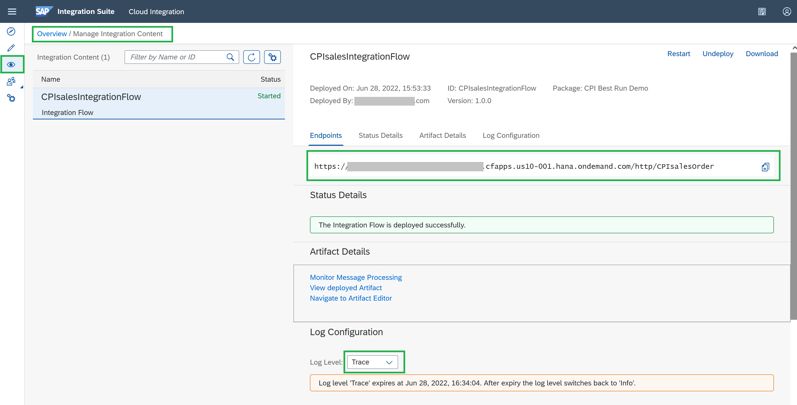

2. Go to Postman. Enter your SAP BTP account credentials with Basic Auth, modify this following JSON with your Stripe data and use it as the payload for testing with Postman:

    ```JSON
    {
        "amount": 21234,
        "customer": "<stripe customer id>",
        "currency": "<currency selected in your stripe account>",
        "source": "<card id>",
        "description": "My test from CPI & Postman"
    }
    ```

Like this:

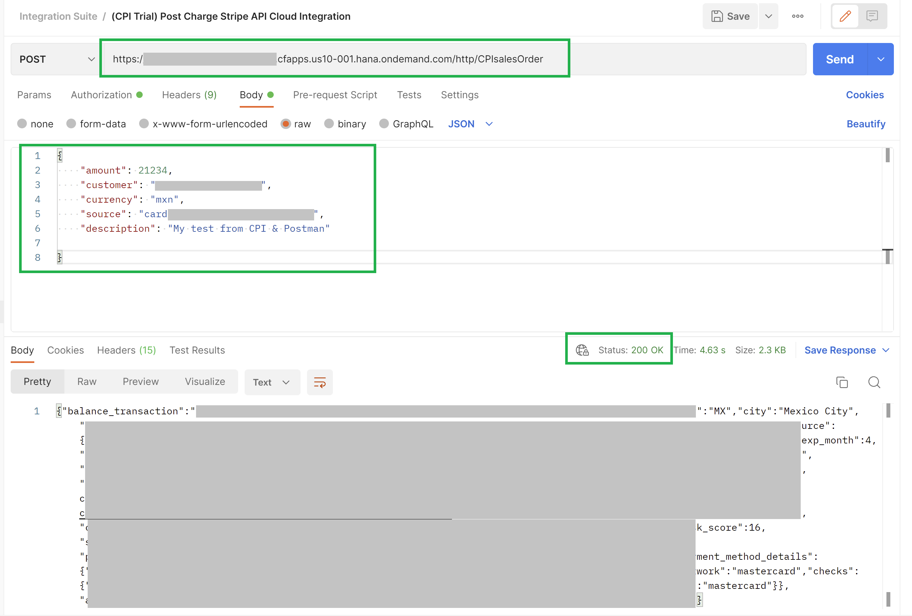

3. Go back to your Cloud Integration and click on "Monitor Message Processing" to monitor the request.

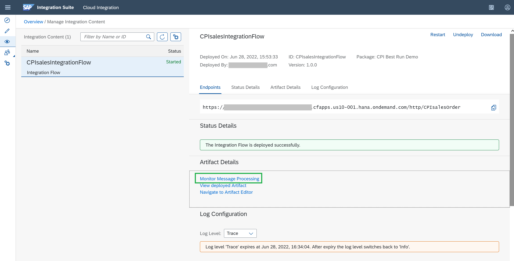

4. Click on "Trace" in the logs..

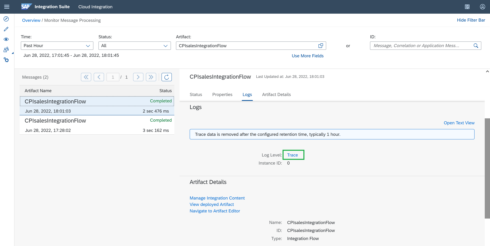

5. Check how it worked from the CPI side.

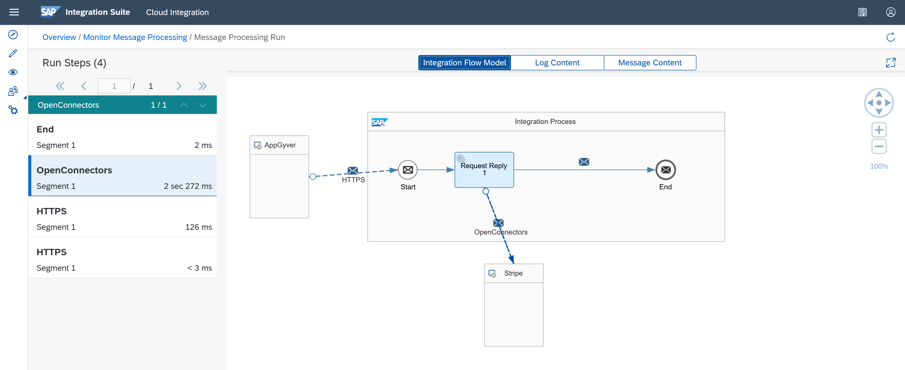

Now you've successfully integrated a 3rd party connector leveraging SAP Open Connectors' content, with SAP Cloud Integration, in this case to execute payment transactions with Stripe.

As a next step, you are going to add the request call to SAP Sales and Service Core (formerly SAP Cloud for Customer or C4C) to create a Sales Order. But first you need to set up the needed payload message for the Message Mapping before calling the SAP Sales and Service Core API.

Check the next tutorial: [Save, Filter and Get your needed data in your Integration Flow](btp-integration-suite-integral-cpi-tasks).

### Check your knowledge

### One more time, check your knowledge