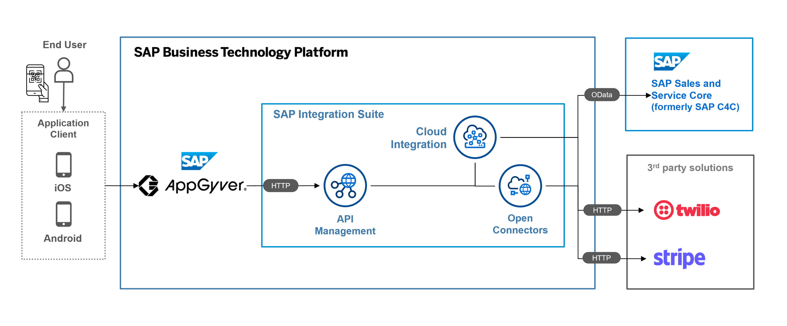
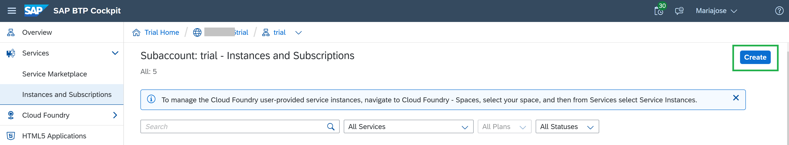
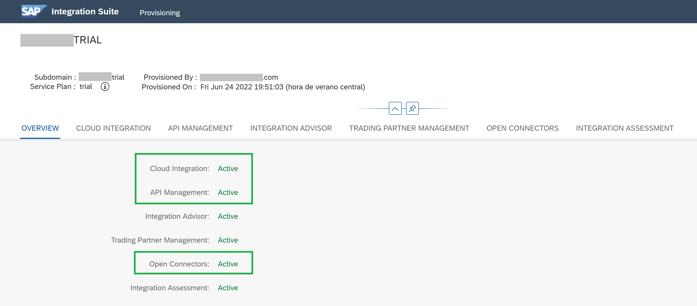
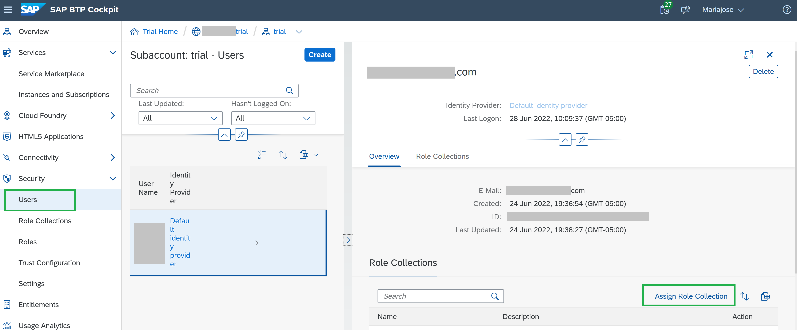
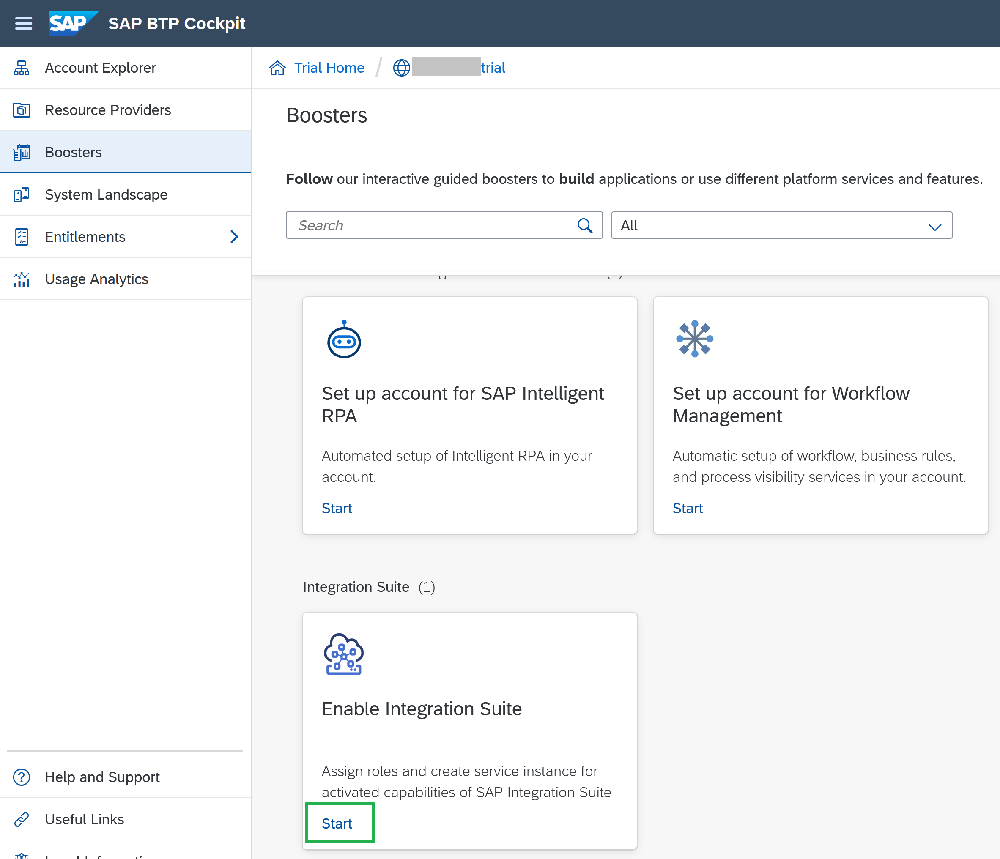
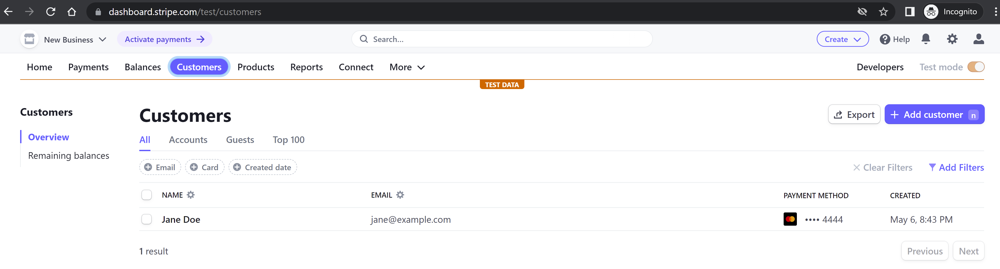
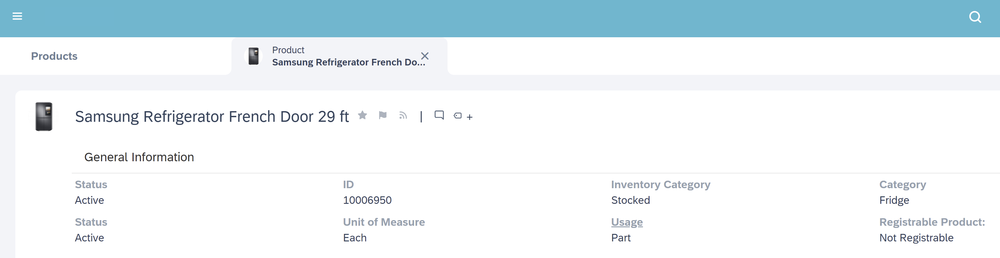
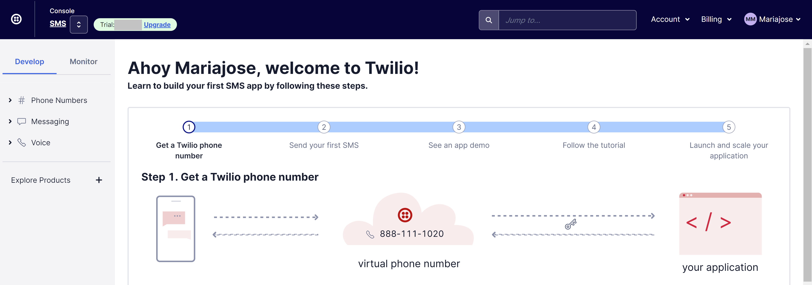

# Set Up Prerequisites for your SAP Integration Suite & SAP Build Apps Mission
<!-- description --> This mission is intended for consultants/users who want to boost their integration skills, using SAP Integration Suite capabilities and SAP Build Apps (formerly SAP AppGyver) to quickly develop a custom app that can consume SAP Integration Suite APIs. 

## Prerequisites

 - Follow the steps to cover the prerequisites for this tutorial series.
 - You have a Postman account.

## You will learn

  - How to consume a SAP Open Connector service to connect to a 3rd party application. In this case Stripe, for a payment transaction
  - How to generate a Sales Order consuming an OData service from a SAP Sales and Service Core (formerly SAP Cloud for Customer or C4C) environment
  - How to set up SMS as notification after the sales order is successfully created, using a Twilio API
  - How to apply API Management Policies to SAP Cloud Integration to avoid CORS issues and to securely trigger calls to the API with an API Key without having to expose the SAP BTP / Integration Suite credentials
  - How to integrate it with SAP Build Apps, by enabling in the Data Connection the API Key to call the Cloud Integration Flow from SAP Build Apps

## Intro

To illustrate, here's the demo scenario's architecture:

>For authentication purposes, you'll use the SAP default Identity Provider which is already configured in the SAP BTP trial account or your own Identity Provider if you have set this up before in your SAP BTP account.

Let's get started with setting up the prerequisites.

### Create a SAP Integration Suite Instance

1.  Create a SAP Integration Suite instance in the "Instances and Subscriptions" tab:

    

2.  Click on the already generated SAP Integration Suite instance and add the capabilities: Cloud Integration, API Management (with its API Business Enterprise Hub) and Open Connectors.

    

3.  Go back to the `Security-->Users` tab and make sure you add the `MessageSend` role, because you'll need it to execute requests to the Integration Flow
    >I had to add it manually in by Assigning its Role Collection.

    

4.  Go back to the `Trial Home--> <BTP Account Id>` and click on **`Boosters`** to start the Integration Suite Booster (this task will create the instance, roles and services keys needed to use the service).

    

### Create a Stripe account

1. If you don't have a have a Stripe account, create a trial one [here](https://stripe.com/docs/development).
2. When done, go to "Dashboards" and create a new customer information.
3. Add a testing card to this new customer, you can select one [here](https://stripe.com/docs/testing). I created a customer called "Jane Doe".

    

### Access your SAP Sales and Service Core tenant

For this exercise, you'll need a SAP Sales and Service Core tenant (formerly SAP Cloud for Customer or SAP C4C) with admin rights. Unfortunately a trial isn't available. But if you don't have an account you may want to test this Sales Order creation exercise with any other platform, such as your SAP S/4HANA Cloud directly (if On Premise, follow this [blog post](https://blogs.sap.com/2022/05/09/create-purchase-orders-in-s-4hana-by-enabling-a-public-api-from-a-s-4hana-on-premise-system-using-sap-api-management-and-cloud-connector/) to know how to expose your API). If you don't have a  S/4HANA environment, maybe you want to try the free trial [here](https://www.sap.com/products/erp/s4hana-private-edition/trial.html).

- In SAP Sales and Service Core, you have created the product with which you will simulate the purchase. As the example shown below:

     

### Create a Twilio account

If you don't have a Twilio developers account, create a trial one [here](https://www.twilio.com/try-twilio).

- Configure a Twilio phone number (as the sender's phone number)
- Validate your phone number (to be able to test reception of SMS messages from Twilio)
- And copy and paste your Twilio developer account Id, API's user and password, you will use this later.

    

### Create an Build Apps account and application

1. If you don't have a SAP Build Apps account, create a trial one [here](https://www.appgyver.com/) or enroll to the Free-Tier trial model [here](https://www.sap.com/products/technology-platform/trial.html)

2. Create a custom app, follow this [blog post](https://blogs.sap.com/2022/05/08/get-data-from-a-json-object-by-scanning-a-qr-code-with-sap-appgyver/) to create an app that reads a QR code to get data from it.

After getting the prerequisites mentioned above already set up, go to the next tutorial: [Consume a Stripe service from SAP Open Connectors and SAP Cloud Integration to create payment transactions](btp-integration-suite-integral-openconnectors).

### Check your knowledge
