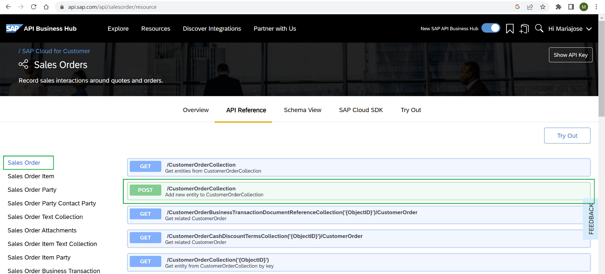
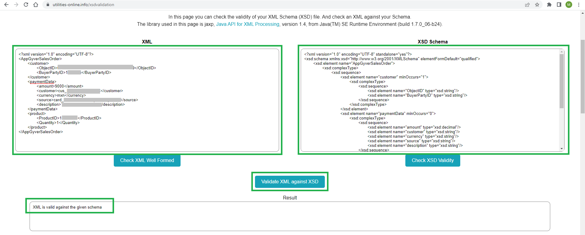

## Prerequisites

 - You have a SAP BTP account or trial account with access to the SAP Integration Suite.
 - You have a SAP Sales and Service Core (SAP Cloud for Customer / SAP C4C) tenant.
 - You have completed the previous tutorial [Save, Filter and Get your needed data in your Integration Flow](btp-integration-suite-integral-cpi-tasks).


## You will learn

  - How to create a Message Mapping artifact to correctly pass the needed payload to SAP Sales and Service Core to create the sales order. Plus you'll see how to configure and test your XSD schemas for the source and target messages.

### Add the SAP Sales and Service Core service to the Integration Flow

Once you have your SAP Sales and Service Core tenant (formerly SAP Cloud for Customer or SAP C4C):

1. Click on [SAP API Business Hub](https://api.sap.com/api/salesorder/resource), to start testing your C4C API.

2. Click on "Try Out" and enter your tenant domain.

3. Add `/CustomerOrderCollection` as the Resource Path to POST new Sales Orders in C4C. Your API endpoint is `https://<your C4C* domain>/sap/c4c/odata/v1/c4codataapi`. 

    

    >In order to call the SAP Sales and Service Core API to create a Sales Order in your Integration Flow, a Message Mapping will be needed to map the XML of the incoming payload to the needed structure in SAP Sales and Service Core. This will be cover in a later step.

4. Go back to your Integration Flow and add a Request Reply task.

5. Add a new Receiver and link it with the Request Reply task using an OData Adapter (select the OData V2). For more information, check the documentation [here](https://help.sap.com/docs/CLOUD_INTEGRATION/368c481cd6954bdfa5d0435479fd4eaf/c5c2e38e0c87472e996dfda04920bfc4.html).

7. Add your SAP Sales and Service Core API endpoint and credentials.

    

### Create the SAP Sales and Service Core credentials in SAP Cloud Integration

To create the credentials, follow the same steps used to create the Open Connector credentials in the previous tutorial. 

1. Click on the 'eye icon' (Monitor) -> 'Security Material' tile and create the credentials to access your SAP Sales and Service Core (SAP C4C) environment. Use 'User Credentials' as the Type. And Deploy it.

    

### Configure the SAP Sales and Service Core target fields for the request call

1. Go back to the Integration Flow and by selecting the OData adapter, go to the Connection tab and add:

    - Address: paste your SAP C4C API endpoint as mentioned above.
    - Proxy type: Internet
    - Authentication: Basic
    - Credential Name: paste the credential name you configured
    - And check the box "CSRF Protected": this is very important because it automatically requests the CSRF token (simulates the GET request call) to later request the POST call to create the sales order.

    

2. Go to the Processing tab. Search in the Resource Path for `CustomerOrderCollection` and download the XSD schema (this will be your XSD schema for your target message).

    

3. Click on Select and Leave the data as it shows and click on Step 2.

    

4. Change the Operation to "Create (POST) and look for `CustomerOrderCollection` as the entity (as mentioned at the beginning of the blog). Go to the Sub Level "1", this is important to be able to send `CustomerOrderItems` (such as product items).

5. In the Fields, check the box to:

    - `ObjectID`
    - `BuyerPartyID`
    - Inside `CustomerOrderItem`, select:
        - `ProductID`
        - `ObjectID`
        - Quantity

    You could add more fields if you want to, but for the purpose of this tutorial, you can leave it with those.

    

    You should see them like the following image.

6. Select these values:
    - As Content Type: Atom
    - Content Type Encoding: UTF-8

        


### Create a Message Mapping Artifact

1. Create the Message Mapping artifact. Click on the path at the top "CPI Best Run Demo". Be sure to be on Edit mode to add the artifact.

    

    Enter the artifact. And you will see this page:

    

    The source message is going to be the payload coming from the SAP Build Apps application (which you have not created yet here), but in other words it's the payload from the application that you are going to send to the Cloud Integration Flow.

    The Target Message is the XSD schema you created in the previous step while configuring the `CustomerOrderCollection` Post rules, with the fields you selected (mainly `ProductID`, `BuyerID`, quantity, etc.).

2. Upload the XSD schema from the `CustomerOrderCollection`. Be sure to be on Edit mode.

    - Source: Integration Flow
    - Package: CPI Best Run Demo
    - Integration Flow: `CPIsalesIntegrationFlow`

3. Select and add the generated XSD schema.

    

4. Click on "Add target message" and select the XSD schema.

    You should see it like this (it is on red because you haven't mapped them with the source message yet).

    

5. Upload the needed source XSD schema. Manually convert the JSON Payload structure to a XSD structure.

    Remember this is the payload structure of the exercise:

    <!-- cpes-file db/schema.cds -->
    ```JSON
    {
    "AppGyverSalesOrder": {
        "customer": {
        "ObjectID": "<Object ID from SAP C4C>",
        "BuyerPartyID": <BuyerPartyID from SAP C4C>
        },
        "paymentData": {
        "amount": <Payment transaction amount to be processed in Stripe>,
        "customer": "<stripe customer id>",
        "currency": "<currency selected in stripe account>",
        "source": "<card id>",
        "description": "Test payment via CPI"
        },
        "product": [
        {
            "ProductID": "<Product ID from SAP C4C>",
            "Quantity": <Product quantity to be purchased>
        }
        ]
    }
    }
    ```

    By converting it to XML, it should look like this (replace the XXXX with your data):

    <!-- cpes-file db/schema.cds -->
    ```XML
    <?xml version="1.0" encoding="UTF-8"?>
    <AppGyverSalesOrder>
        <customer>
            <ObjectID>XXXXXX</ObjectID>
            <BuyerPartyID>XXXXXX</BuyerPartyID>
        </customer>
        <paymentData>
            <amount>XXXXXX</amount>
            <customer>XXXXXX</customer>
            <currency>XXXXXX</currency>
            <source>XXXXXX</source>
            <description>XXXXXX</description>
        </paymentData>
        <product>
            <ProductID>XXXXXX</ProductID>
            <Quantity>XXX</Quantity>
        </product>
    </AppGyverSalesOrder>
    ```

    You can also download the target XSD schema to use it as a guide to build the source XSD schema.

6. Create the source XSD schema. Save the following schema as a local file. Later, you'll use it to upload it to the Message Mapping artifact.

    <!-- cpes-file db/schema.cds -->
    ```XSD
    <?xml version="1.0" encoding="UTF-8" standalone="yes"?>
    <xsd:schema xmlns:xsd="http://www.w3.org/2001/XMLSchema" elementFormDefault="qualified">
        <xsd:element name="AppGyverSalesOrder">
            <xsd:complexType>
                <xsd:sequence>
                    <xsd:element name="customer" minOccurs="1">
                        <xsd:complexType>
                            <xsd:sequence>
                                <xsd:element name="ObjectID" type="xsd:string"/>
                                <xsd:element name="BuyerPartyID" type="xsd:string"/>
                            </xsd:sequence>
                        </xsd:complexType>
                    </xsd:element>
                    <xsd:element name="paymentData" minOccurs="0">
                        <xsd:complexType>
                            <xsd:sequence>
                                <xsd:element name="amount" type="xsd:decimal"/>
                                <xsd:element name="customer" type="xsd:string"/>
                                <xsd:element name="currency" type="xsd:string"/>
                                <xsd:element name="source" type="xsd:string"/>
                                <xsd:element name="description" type="xsd:string"/>
                            </xsd:sequence>
                        </xsd:complexType>
                    </xsd:element>
                    <xsd:element name="product" minOccurs="1" maxOccurs="unbounded">
                        <xsd:complexType>
                            <xsd:sequence>
                                <xsd:element name="ProductID" nillable="false" minOccurs="1" type="xsd:string"/>
                                <xsd:element name="Quantity" minOccurs="1" type="xsd:double"/>
                            </xsd:sequence>
                        </xsd:complexType>
                    </xsd:element>
                </xsd:sequence>
            </xsd:complexType>
        </xsd:element>
    </xsd:schema>
    ```

    ```
    Remember that when you are setting the possible values for each XSD element, using minOccurs and maxOccurs, you need to make it consistent with the Message Mapping artifact messages' structures. You'll be able to see them in the source and target message's structure, and these are the definitions:

    - 1..1 -> needs and allows only one value.
    - 0..1 -> doesn't need a value but if there is, it would be only one.
    - 0..* -> it can go from no value to multiple values.
    ```

### Test your XML structure with the needed XSD source schema.

1. Save the Payload converted to XML in a local file (use this name "payloadInputSimulation.xml"), to test the Message Mapping. 

2. Validate it with the source XSD schema before uploading the source XSD schema to the Message Mapping artifact.

    A helpful editor: Notepad++ and XML vs XSD validation in this [link](https://www.utilities-online.info/xsdvalidation).

    This is how it looks (using the validation's link above):

    

### Upload your source XSD schema into the Message Mapping Artifact and map it to the target XSD schema

1. Save the XSD schema as local files in your computer, and upload it as the source XSD schema file as you uploaded the target one. Name it appgyverSchema.xsd

    

2. Click on "Add source message" and select it. You should see it like this:

    

3. Now it is time to map them together.

    For the 2 ones that are hanging (`CustomerOrderItem` father and `ObjectiID` child) map them to a constant as shown in the screenshot.

    

4. Save it, deploy it and click on Simulate on the top-right, to test the Message Mapping. It is important you save it and deploy it first to avoid issues while doing the simulation testing.

5. Upload the Payload converted to XML and click on "Test". It can take some seconds/minutes to load the first time. When it is done, you should see this message "Mapping test completed".

    

### Add the Message Mapping Artifact to the Integration Flow

1. Click on the pencil icon "Design", select your package and enter your Integration Flow artifact.

2. Add the Message Mapping you just created as a Resource for the Integration Flow to consume. Make sure you click anywhere (blank space in your Integration Flow) and maximize the configuration panel below in the Edit mode. Go to the tab "Resources" and inside click on the "References" tab. Click on Add and add your Message Mapping artifact.

    

3. Add a Message Mapping task in the Integration Flow. Once selected, go to the "Processing tab" click in select and in the Reference resource you should see it, select it.

    

    You should see it like this:

    

    Don't mind the warning signs, the Integration Flow is going to work. With this message mapping, you are ensuring that the payload message is readable to send the payload to C4C and create the Sales Order with the info provided.

    Integration Suite works best with XML messages, there are some transactions you can run with messages in JSON, but for complex message transformations or mappings like you did above, it is highly recommended (and needed) to adopt XML and XSD format/structures.

### Deploy and test your Integration Flow

1. Save your IFlow and deploy it. If you want to export your package, make sure you save your Integration Flow and Message Mapping with versions.

    When the deployment is finished, test the integration again using Postman as you did in the previous tutorial when testing the Stripe Open Connector.

2. Click on the eye icon "Monitor", and click on "Manage Integration Content". When the Status changes to "Started", change the Log Level to "Trace" to be able to trace any potential error, then copy the API endpoint to use it on Postman, with your SAP Business Technology Platform credentials, send the JSON payload (as mentioned previously).

    

3. Execute the call in Postman and return to Cloud Integration, click on Monitor Message Processing to check the messages until the end. Remember to activate the Trace log after deploying your IFlow. You should able to see all calls in 200 OK, and the end response message from SAP Sales and Service Core with a XML format.

    And you should see the Message content in the "Monitor Message Processing" capability, with the response of the API, with a Sales Order already generated, like this:

    

Now you have already set up in the right way the OData receiver adapter to create Sales Orders in SAP Sales and Service Core, while configure a Message Mapping artifact to transform the payload with the XML and XSD schema needed for this Sales Order creation.

Now as a next step, you are going to send a SMS as a notification that the order was successfully created, leveraging a Twilio SMS API in the next tutorial: [Send SMS using SAP Cloud Integration while consuming a Twilio API](btp-integration-suite-integral-cpi-urlencoded).

### Check your knowledge

### One more time, check your knowledge

