# Build and Govern MCP Servers with SAP Integration Suite
<!-- description -->Leverage the MCP Gateway in SAP Integration Suite to expose third-party API's as MCP servers for AI Agents to consume
## You will learn
- How to work with the new API Artifact within SAP Integration Suite
- Host custom MCP servers with MCP gateway
- Govern your MCP ressources by enforcing policies
- Make your MCP servers discoverable and consumable in Developer Hub
- Test your results with the MCP Inspector
## Prerequisites
- You have created a trial account on SAP BTP: [Get a Free Account on SAP BTP Trial](https://developers.sap.com/tutorials/hcp-create-trial-account)
- You have a subaccount and dev space in your region and setup your [SAP Integration Suite Trial](https://developers.sap.com/tutorials/cp-starter-isuite-onboard-subscribe)
- You have activated your [ServiceNow Trial environment](https://www.servicenow.com/docs/r/platform-administration/start-trial.html)
## Intro
The purpose of this tutorial is to give you an introductory, hands-on experience with the new MCP Gateway capability, which can be leveraged within SAP Integration Suite. While you can work through this tutorial using the public trial, please keep in mind that if you would like to use this feature in a productive environment, you will need either the Premium or [Enhanced Edition](https://community.sap.com/t5/technology-blog-posts-by-sap/sap-integration-suite-enhanced-edition-the-trust-layer-for-agentic-ai/ba-p/14376343) of SAP Integration Suite. 

If you are new to this topic, here is a brief introduction to the capability: The MCP Gateway is the enterprise control plane for MCP. Where an MCP Server hosts tools, the Gateway governs access to them — enforcing authentication, authorization, rate limiting, and payload protection, while providing full monitoring and traceability. SAP Integration Suite's MCP Gateway aggregates tools from SAP APIs, non-SAP APIs, integration flows, data sources, and external MCP Servers into a single governed entry point. In this hands-on tutorial, you will work with this new feature by generating a new API Artifact for a third-party API — in this case, ServiceNow. After that, you will use this API Artifact to host an entirely new MCP Server and enforce policies and guardrails that are taken into account during runtime execution. At the end, you will publish this new MCP resource as a product within the SAP Developer Hub to make it discoverable and consumable from your preferred AI Agent development environment.

---
### Step 1: Enable Integration Cell runtime
1.	Inside SAP Integration Suite, go to **Settings** on the left-hand side and select **Runtimes**
2.	Check if the Integration Cell runtime is available – please keep in mind that apart from this trial environment you need to leverage SAP Integration Suite Enhanced Edition in order to leverage this feature in a productive environment.
3.	Enable the feature. The Integration Cell provisioning may take up to 30 Minutes.
   
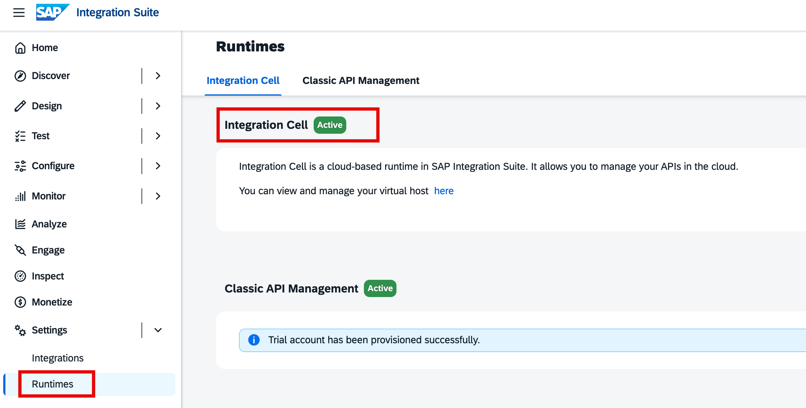

### Step 2: Setup a Destination
1. Once you have requested your ServiceNow Trial [here](https://developer.servicenow.com/app.do#!/home) you can access your instance via [this link](https://developer.servicenow.com/dev.do#!/manage-instance).
2. Here you need to copy your instance URL, username and password. The instance URL is required in order to setup the RESTful API call to post a service ticket:

    ```
    https://dev[yourinstanceID].service-now.com/api/now/table/incident
    ```
   
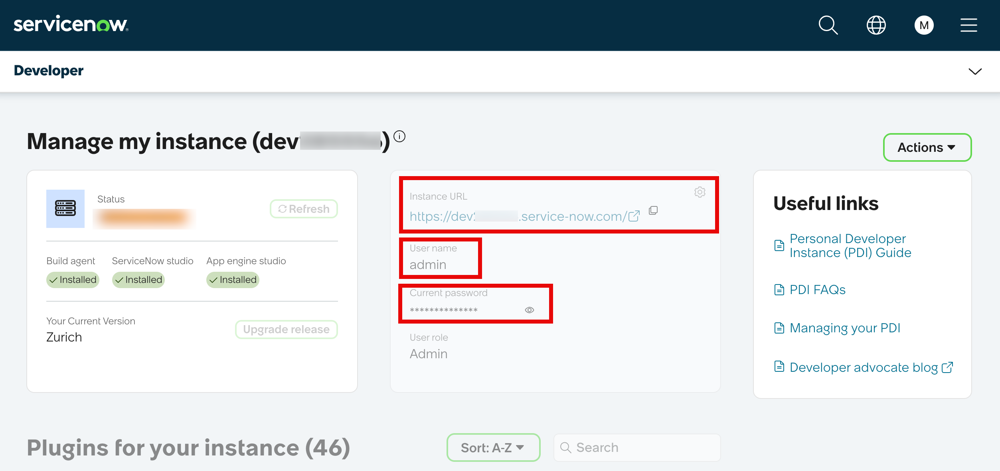

4. Navigate to your BTP Cockpit and select the tab **Connectivity** on the left-hand side and then select **Destinations**. Create a new Destination from scratch by clicking on **Create**.

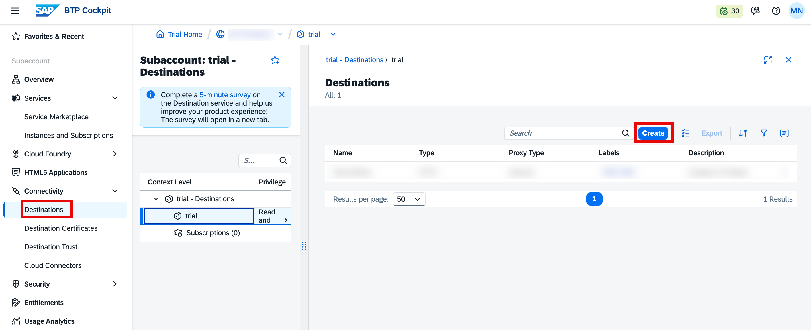

5. Then you need to define the main properties:

- **Name:** ServiceNow
- **Authentication:** BasicAuthentication
- **Proxy Type:** Internet
- **URL:** `https://dev[yourinstanceID].service-now.com`
- **User:** admin
- **Password:** `[yourServiceNowInstancePassword]`
- **Additional Properties:** IntegrationCell.Include = true
- **Additional Labels:** IntegrationCell.Include = true

At the end your destination should look like this:
    
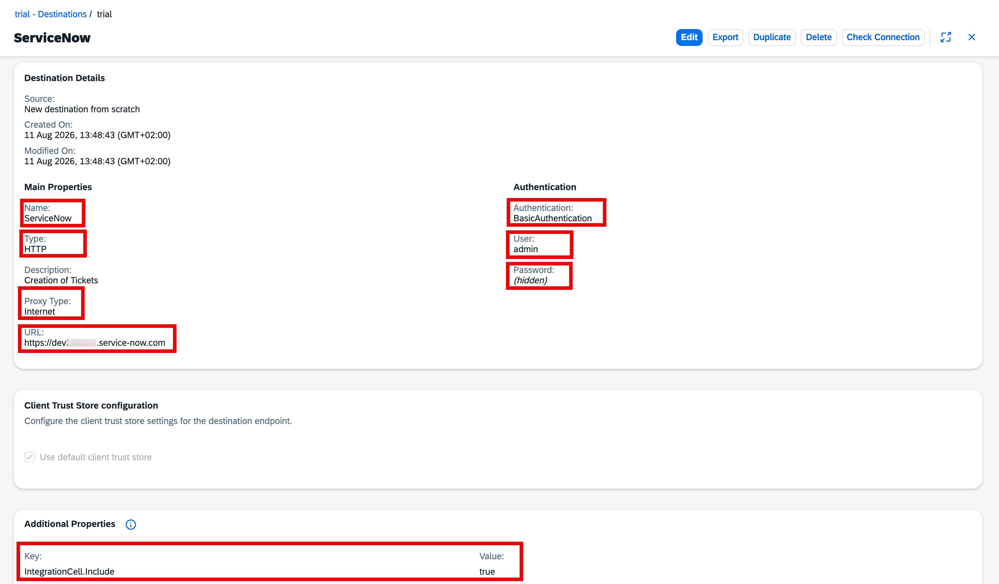

6. Now you can establish your new Destination by clicking again on **Create**.

### Step 3: Create the API Artifact
1. As a next step we create a new Integration Package to start working on our artifacts. Here you simply need to jump to your Integration Suite instance and navigate to the tab **Design** on the left-hand side and click on **Integrations and APIs**. As a next step click **Create**.
   
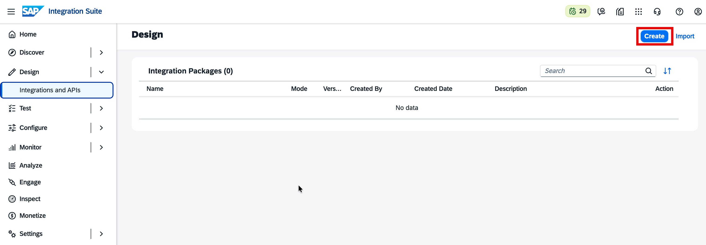

3. Specify following values for your new Integration Package:

  - **Name:** ServiceNow
  - **Short Description:** The purpose of this Integration Package is to establish MCP and API access for Ticket Creation
  - **Version:** 1.0.0

Now click on **Save**.
    
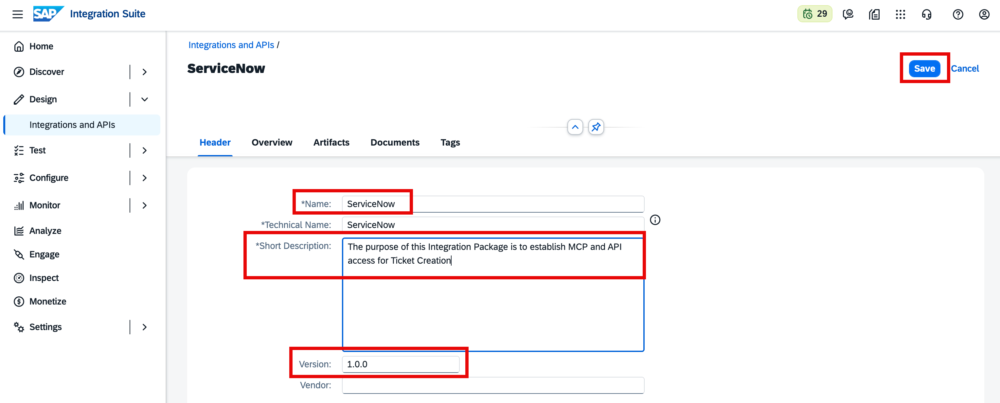

4. Under the tab **Artifacts** you need to click on **Add** and select the **API** artifact:

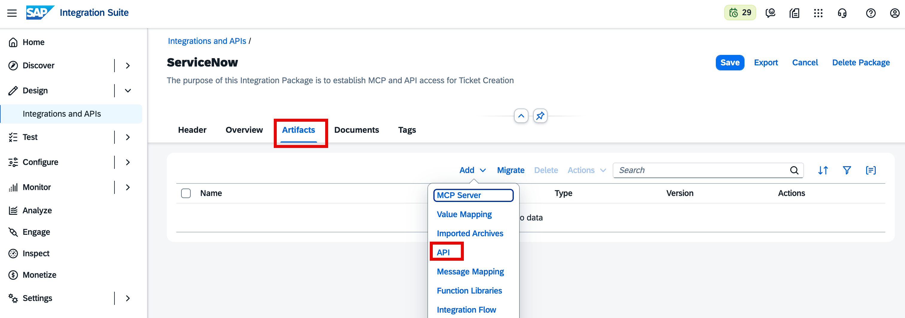

5. Select the **Integration Cell** as runtime profile and click on **Next**:

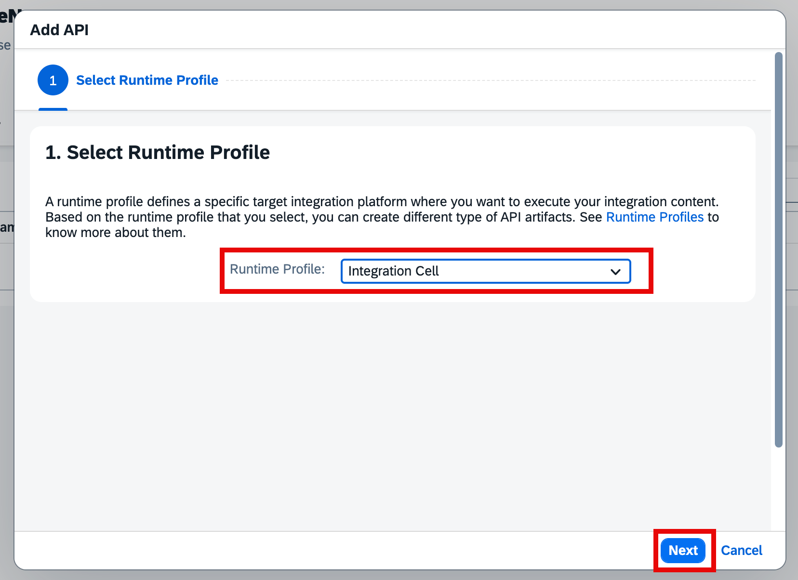

6. Since we have already created the Destination in the BTP Subaccount in advance we do not need to create a new API endpoint from scratch — here we simply select the **API Provider** as the corresponding source:

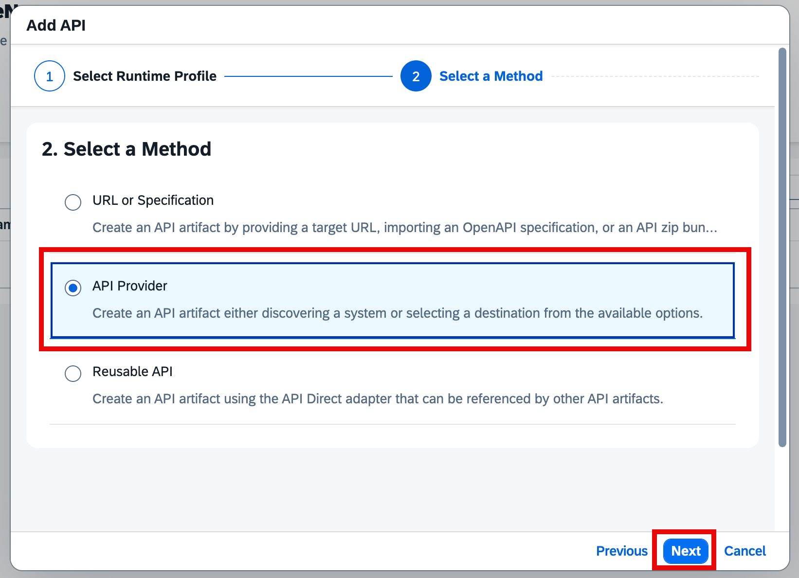

7. Navigate to the tab **Destination** and select the ServiceNow Destination, which you have previously generated — if you can't find your Destination, check if you have added the correct **Additional Properties** and **Additional Labels** within the destination. Click on **Next**.

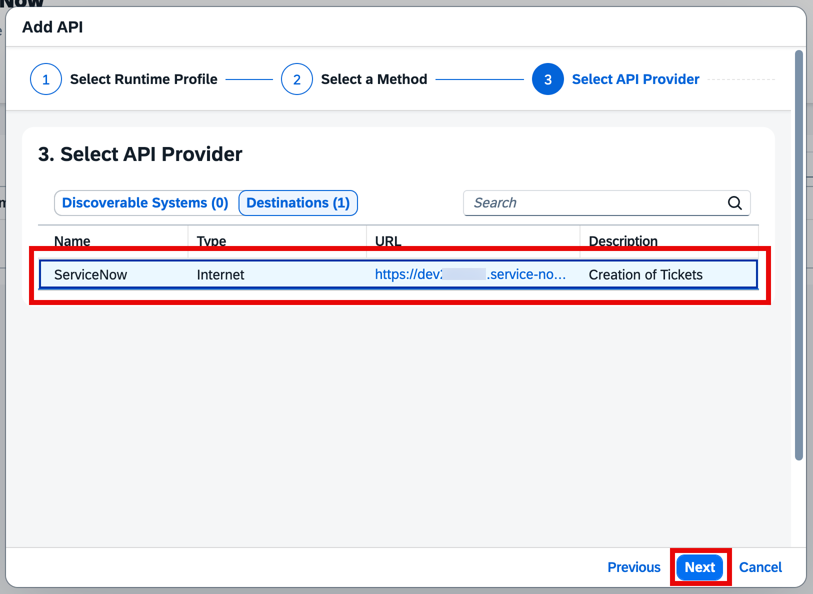

8. In order to complete your API artifact enter additional specifications in the next screen:
    - **Name:** ServiceNow API
    - **Relative URL:** /api/now/table
    - **API Base Path:** /ticketCreation
    - **API Version:** 1.0.0
    
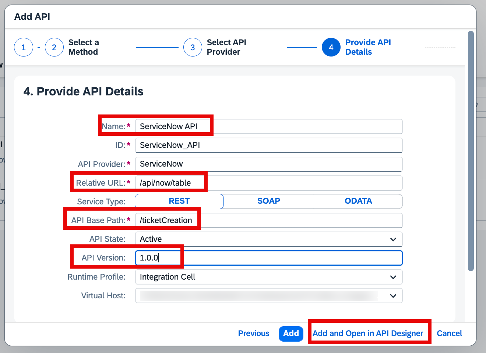

Click on **Add and Open in API Designer**.

9. Once the API Designer has opened click on the **Edit** button in order to change the **OpenAPI specification**.
    
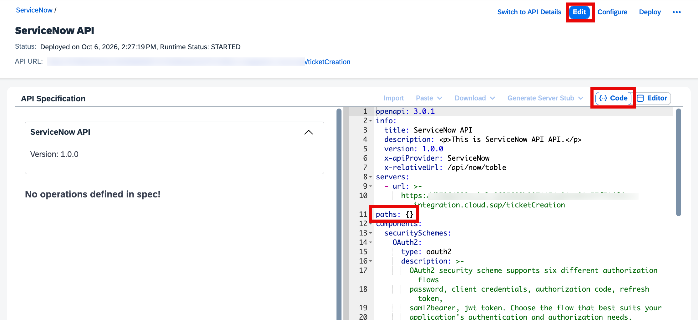

Here you need to navigate to the **Code** tab in order to modify your script. Here you can find a downloadable [example OpenAPI Specification](https://github.com/sap-tutorials/Tutorials-Contribution/raw/master/tutorials/btp-integration-suite-mcp-gateway/OpenAPISpecification_Example.yaml).

10. Add the incident operations to your OpenAPI specification.

Replace the empty `paths` with the incident operations. In the **Code** tab, find the line that reads exactly `paths: {}` and replace it with the block below. Change nothing else — leave your `servers` URL, your `tokenUrl`s, `securitySchemes`, and `security` exactly as Integration Suite generated them, since those are unique to your tenant.

```yaml
paths:
  /incident:
    get:
      summary: Query incidents
      description: Retrieves incidents matching an encoded query
      tags: [Incidents]
      parameters:
        - name: sysparm_query
          in: query
          required: false
          schema: { type: string }
          example: number=INC0010002
        - name: sysparm_limit
          in: query
          required: false
          schema: { type: integer }
          example: 100
        - name: sysparm_fields
          in: query
          required: false
          schema: { type: string }
          example: 'number,short_description,state'
        - name: sysparm_display_value
          in: query
          required: false
          schema:
            type: string
            enum: ['true', 'false', all]
          example: 'true'
      responses:
        '200':
          description: List of incidents matching the query
          content:
            application/json:
              schema:
                type: object
                properties:
                  result:
                    type: array
                    items:
                      type: object
                      properties:
                        number: { type: string, example: INC0010002 }
                        short_description: { type: string }
                        description: { type: string }
                        state: { type: string, example: '1' }
                        sys_id: { type: string, example: 46b66a40a9fe198101f243dfbc79033d }
        '400': { description: Bad request }
        '401': { description: Authentication required }
        '500': { description: Internal server error }
    post:
      summary: Create incident
      description: Creates a new incident record
      tags: [Incidents]
      requestBody:
        required: true
        content:
          application/json:
            schema:
              type: object
              required: [short_description, description]
              properties:
                short_description: { type: string }
                description: { type: string }
      responses:
        '201':
          description: Incident created successfully
          content:
            application/json:
              schema:
                type: object
                properties:
                  result:
                    type: object
                    properties:
                      number: { type: string, example: INC0010002 }
                      short_description: { type: string }
                      description: { type: string }
                      state: { type: string, example: '1' }
                      sys_id: { type: string, example: 46b66a40a9fe198101f243dfbc79033d }
        '400': { description: Bad request }
        '401': { description: Authentication required }
        '500': { description: Internal server error }
  '/incident/{sys_id}':
    get:
      summary: Get incident by sys_id
      description: Retrieves a specific incident by its system ID
      tags: [Incidents]
      parameters:
        - name: sys_id
          in: path
          required: true
          schema: { type: string }
          example: 46b66a40a9fe198101f243dfbc79033d
      responses:
        '200':
          description: Incident details
          content:
            application/json:
              schema:
                type: object
                properties:
                  result:
                    type: object
                    properties:
                      number: { type: string, example: INC0010002 }
                      short_description: { type: string }
                      description: { type: string }
                      state: { type: string, example: '1' }
                      sys_id: { type: string, example: 46b66a40a9fe198101f243dfbc79033d }
        '401': { description: Authentication required }
        '404': { description: Incident not found }
        '500': { description: Internal server error }
```

After pasting into the API Designer, check that `paths:` sits hard against the left margin and that `components:` still contains only `securitySchemes:`. Then validate at editor.swagger.io, click **Save** and then **Switch to API Details**

    
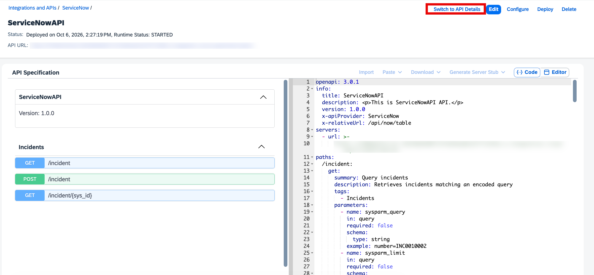

11. In order to make your API artifact consumable by an MCP server navigate to the **Policies** tab and select the **Authorization** step within the Policy Model flow. Under **Policy Settings** make sure that you andd **ESBMessaging.send** in the scope and tick the box for **Trust Upstream MCP Authorization**.

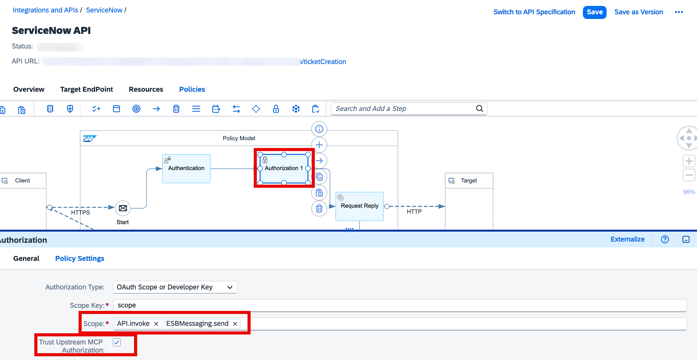

12. Stay in the **Policies** tab and select the **Authentication** step within the Policy Model Flow. Go to **Policy Settings** and make sure that **Basic** is added as an authentication type.

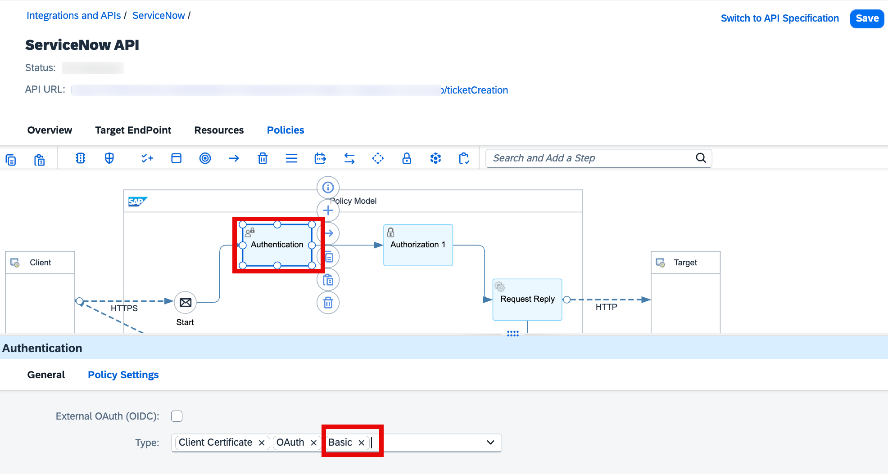

13. And as the final step of this chapter click on **Deploy** in order to leverage your API artifact and transform it into an MCP server.

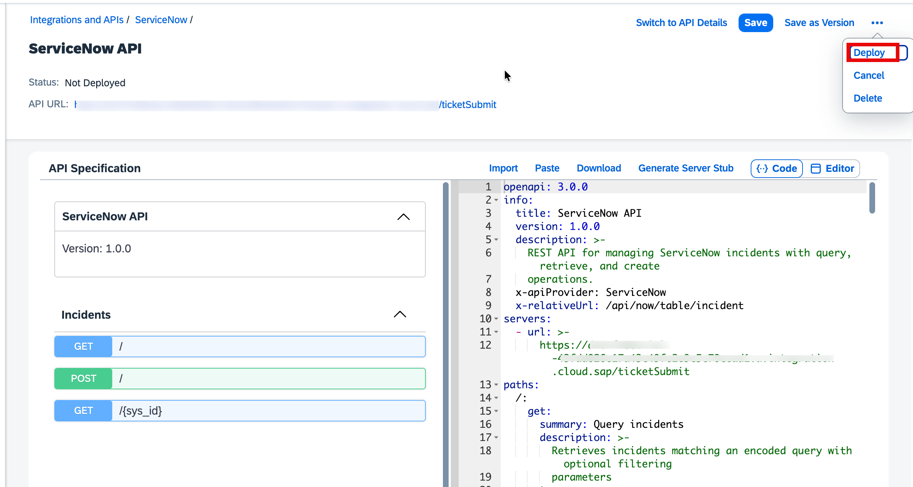

## Step 4: Create the MCP server based on the API artifact
1. Now we are going to leverage our freshly created API artifact and generate a custom MCP server out of it. Go back to your Integration Package that you have generated previously and click on **Add**. Here you select **MCP Server**.
   
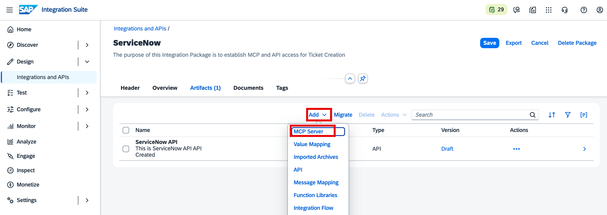

2. Here we do not need to create an API resource from scratch but we can base our MCP server on already existing artifacts. Therefore click on **API**.

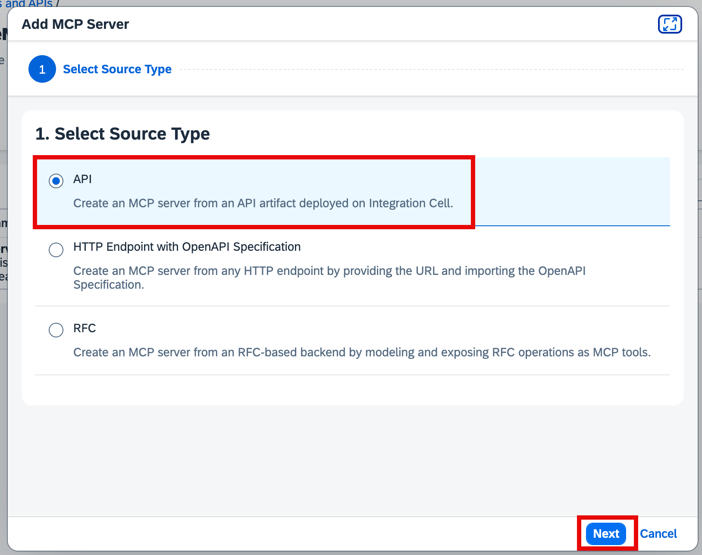

3. Make sure that you select the previously generated **ServiceNow API** and complete following specification:

- **API:** ServiceNow API
- **MCP Path:** /ticketCreationMCP
- **Version:** 1.0.0

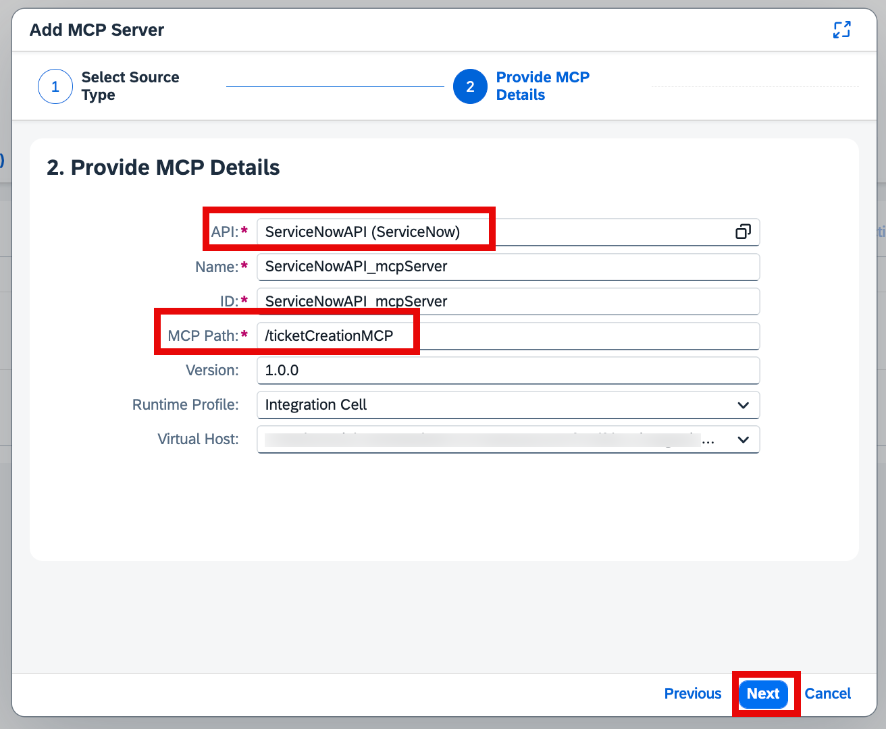

Once you have entered all the details click on **Next**.

4. The MCP Gateway capability allows you to select all operations from the API that should be accessible from the MCP server. In this case we can select all 3 operations and go ahead by clicking on **Add**.
   
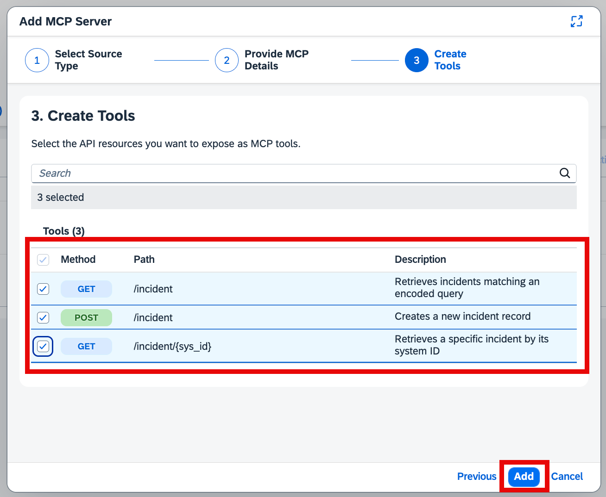

5. Now your MCP server has been generated within a couple of clicks. If necessary you can add an additional layer of governance by configuring **tools, resources, prompts and policies**. In our case we keep it as it is and **Deploy** our MCP Server to the **Integration Cell** runtime profile:

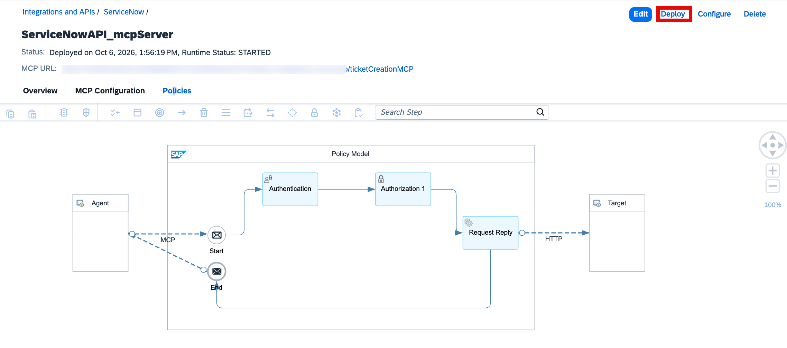

### Step 5: Create a Product and AI Agent Subscription in the Developer Hub
1. To make your new MCP server discoverable and consumable for your entire organization we are going to establish a new Product in the Developer Hub. For this navigate to the top right of your screen and select the **Developer Hub**.
   
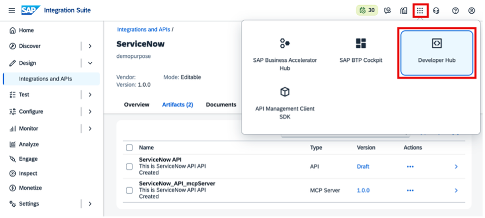

3. In the Developer Hub you can expose integration artifacts such as APIs, Events and MCPs to other developers in your organization. For this click on **Content** within the **Admin Center**.

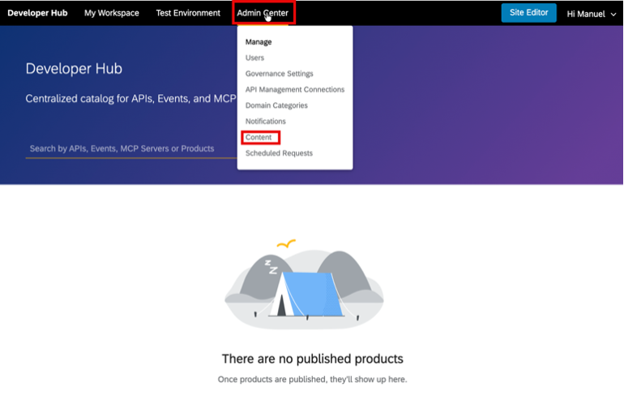

4. Here you can select your Integration Cell instance within the **Business System** tab. This will open all your APIs and MCPs which have been deployed in your environment.

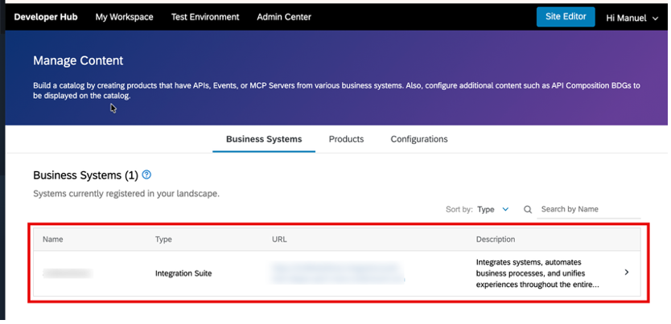

5. Once your Business System is opened you have to select the **MCP Servers** tab and search for your MCP server, which you have previously deployed. Once selected click on **Create Product**.

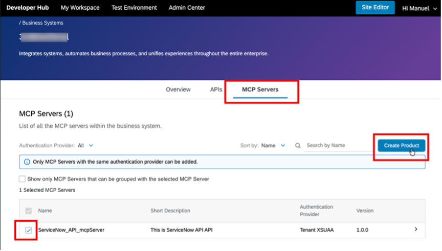

6. Give your new MCP Product an appropriate name and description so other developers can properly identify and consume this resource:

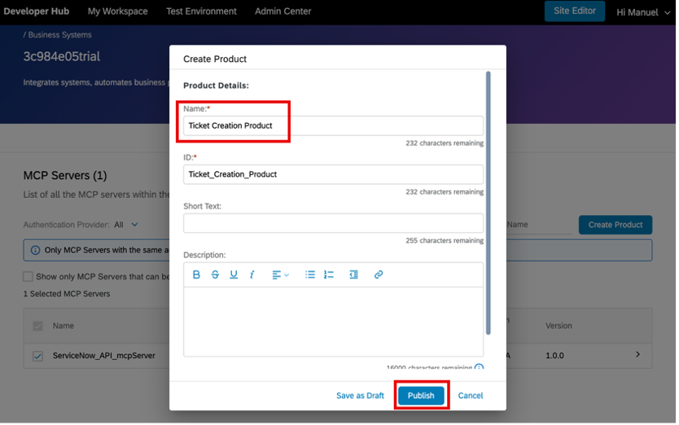

7. After a couple of minutes your new Product has been deployed and is now visible in the Developer Hub landing page. Click on your **Product*** in order to proceed:

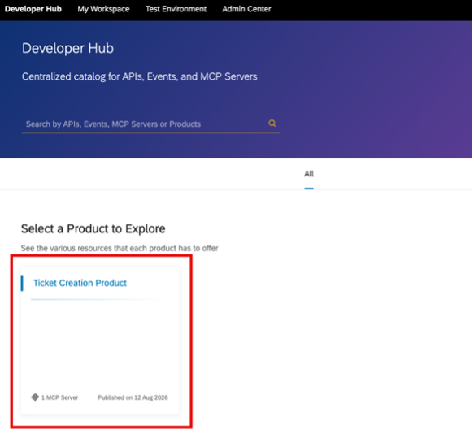

8. To make sure that an AI Agent can now consume this resource we have to establish a new Subscription by clicking on **Create New Subscription for Agent**:

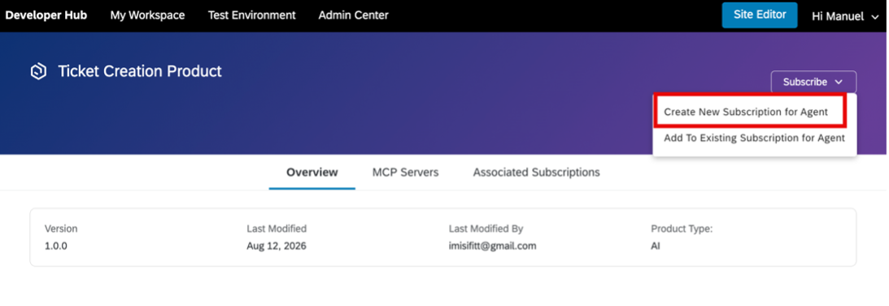

9. Give your subscription an appropriate name and description and click on **Create**.

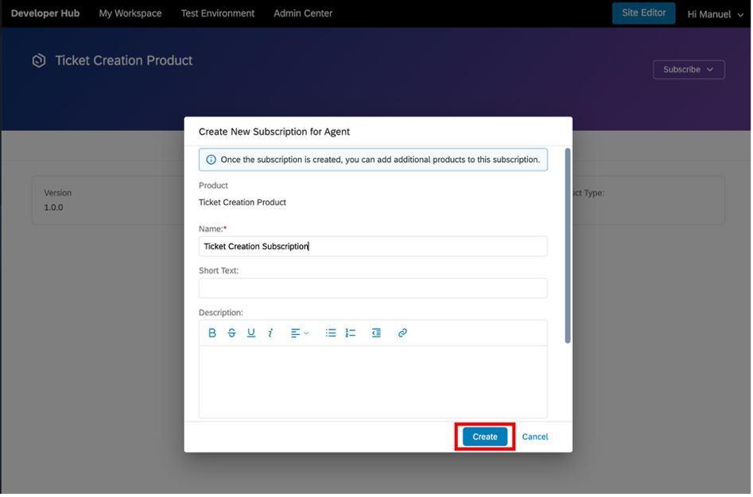

10. After waiting a couple of minutes your new Subscription is now available which exposes the corresponding OAuth credentials. Now your MCP server can be picked up by both SAP and non-SAP AI Agents:

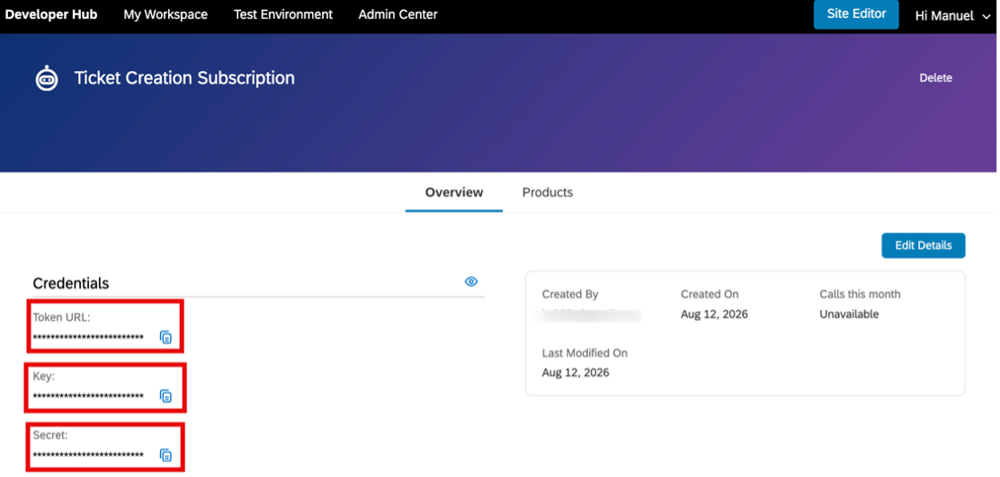

### Step 6: Test your MCP server by using the MCP Inspector
1. Now that our new MCP server has been deployed and hosted with the proper subscription, we can test it. For this I recommend the **MCP Inspector**, an open-source tool from the Model Context Protocol project (created by Anthropic). Because Integration Suite uses machine-to-machine (client-credentials) authentication, we first need to retrieve a **Bearer token**. Run the command for your operating system in a terminal.

    [OPTION BEGIN [macOS]]
    Requires `jq` — install with `brew install jq` if needed. In Terminal:

    ```bash
    TOKEN=$(curl -s -X POST '[your-token-URL]' \
      --data-urlencode 'grant_type=client_credentials' \
      --data-urlencode 'client_id=[your-key]' \
      --data-urlencode 'client_secret=[your-secret]' \
      | jq -r '.access_token')
    printf 'Bearer %s' "$TOKEN" | pbcopy
    ```
    [OPTION END]

    [OPTION BEGIN [Windows]]
    In **PowerShell**:

    ```powershell
    $resp = Invoke-RestMethod -Method Post `
      -Uri '[your-token-URL]' `
      -Body @{
        grant_type    = 'client_credentials'
        client_id     = '[your-key]'
        client_secret = '[your-secret]'
      }
    "Bearer $($resp.access_token)" | Set-Clipboard
    ```
    [OPTION END]

    Substitute the Token URL, Key, and Secret with the values from the Developer Hub, and **keep the single quotes** around them — your key and secret may contain characters like `$` or `|` that would otherwise be misinterpreted. The command prints nothing on success: your Bearer token is now on the clipboard, ready to paste into the Inspector.
2. To launch the MCP Inspector, run the following in your terminal (requires Node.js, which provides `npx` — get it from nodejs.org if needed):

    ```bash
    npx @modelcontextprotocol/inspector
    ```

    The Inspector starts a local proxy and opens automatically in your browser. Use the URL printed in the terminal to open it, since it may include a required authentication token.
3. Once the MCP Inspector has opened click on **Add Servers** and select **+Add manually**.
   
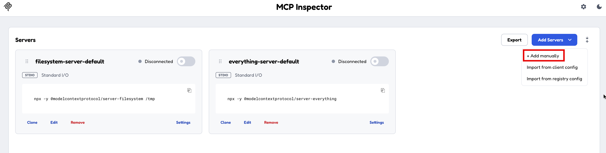

5. Here you need to give your Server an ID and change the transport mechanism to **streamable-http**. As a final step you need to paste your MCP server URL which you can find within your MCP Project inside SAP Integration Suite. Click on **Add**.

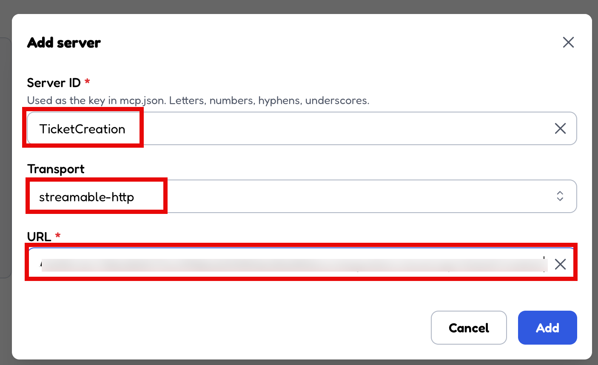

6. Navigate to your new Server ID and select **Settings**.

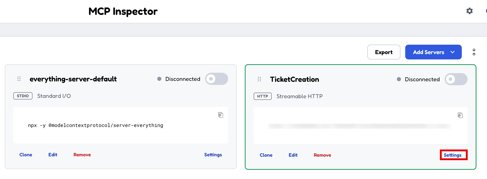

7. Inside the Server Settings you need to add a **Custom Header**. Simply click on **Add Header** and use **Authorization** as the label. For the value, paste the Bearer token you copied in Step 1 — it already includes the Bearer prefix, so paste it exactly once. The value should read `Bearer [your-bearer-token]`, not Bearer Bearer.

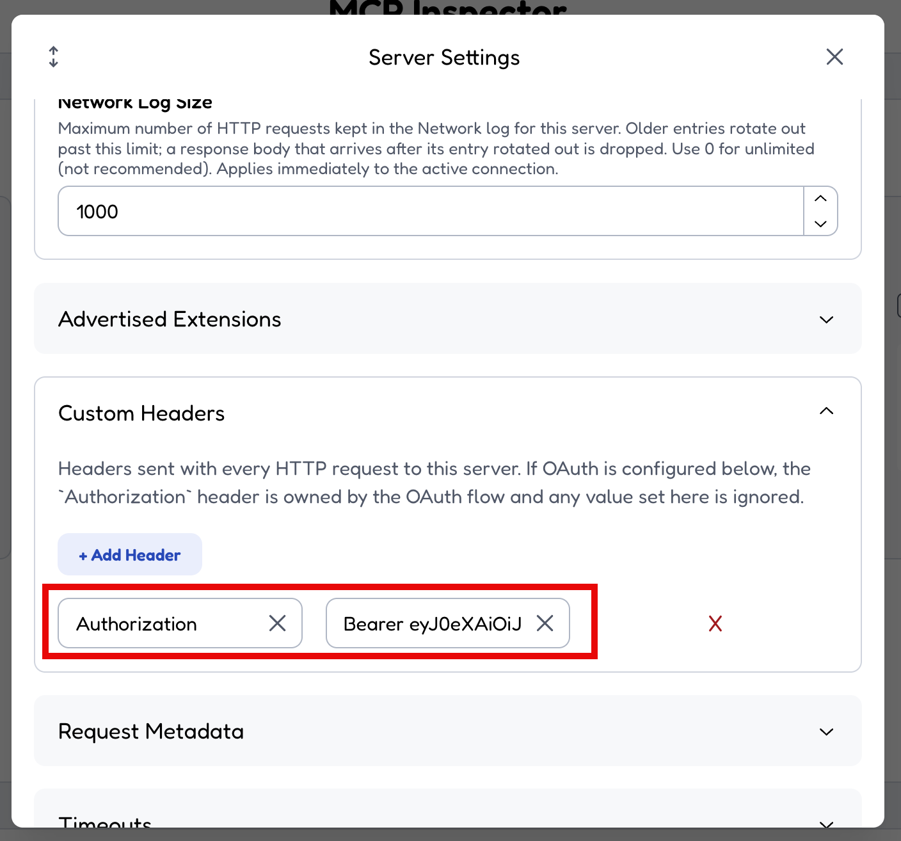

8. Once you have added the Bearer token for authorization you can switch the toggle of your server to **Connected**. Once the connection has been verified you then need to navigate to the **Tools** tab.

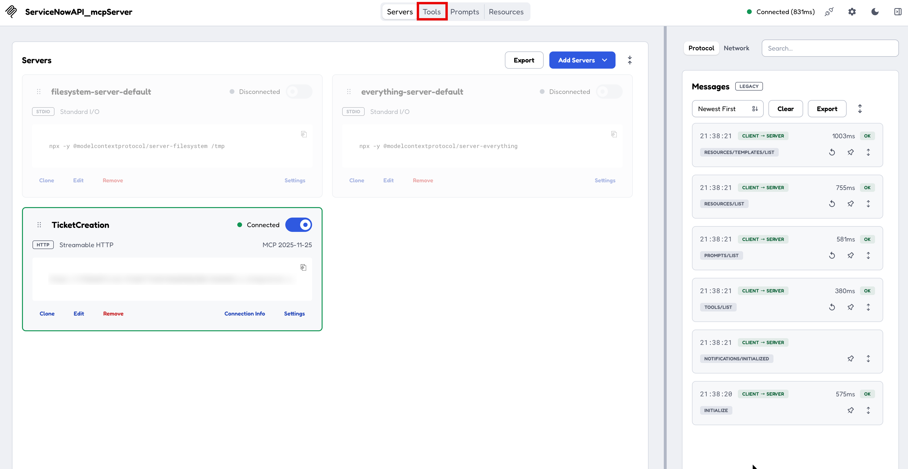

9. The Tools tab gives you access to all the MCP operations, which you have selected in your deployment. In our case we have the ability to **Post** and **Get** tickets within ServiceNow. You can try out the Post-Call **Create Incident** by providing a short description of your incident, as you can see in the screenshot below.

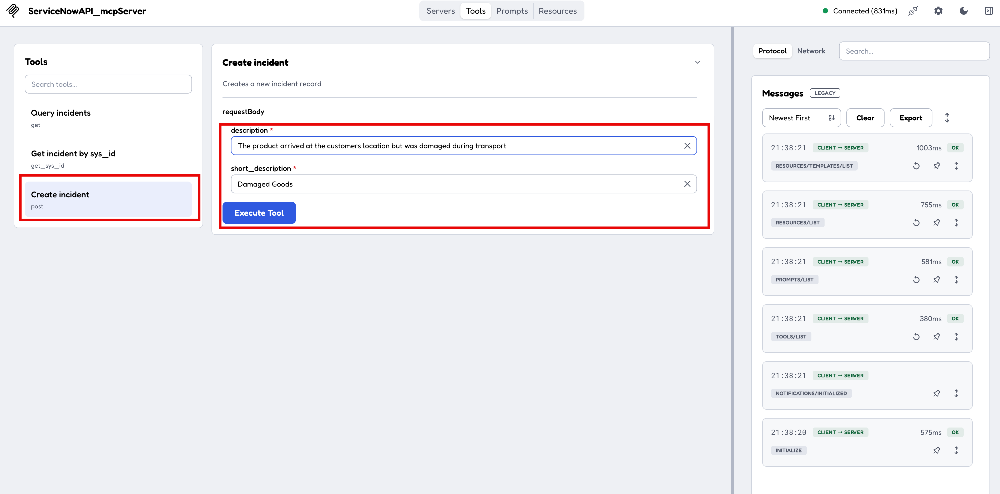

10. After a couple of seconds, the MCP server posted a new incident in ServiceNow and you get access to the result body. You even get access to a new incident ID.

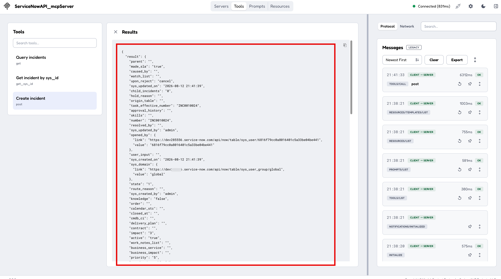

Take the incident ID and search for it within your ServiceNow trial environment via this link — make sure you include your ServiceNow instance and the incident ID in the URL:

```
https://[your-instance].service-now.com/nav_to.do?uri=incident.do%3Fsysparm_query%3Dnumber%3D[your-ticket-ID]
```

The final result should look like this:
    
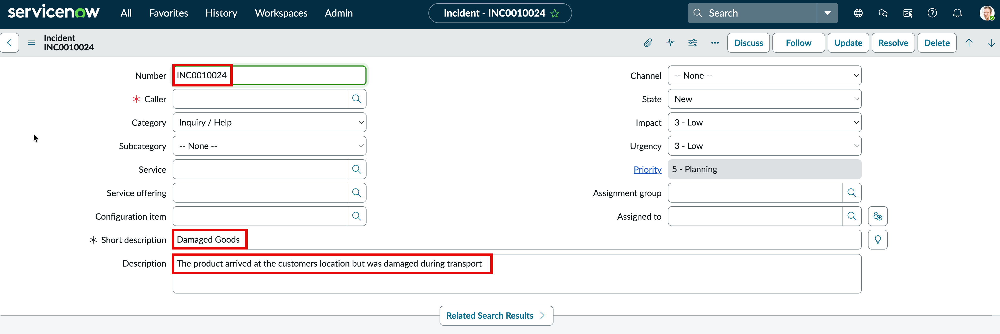
