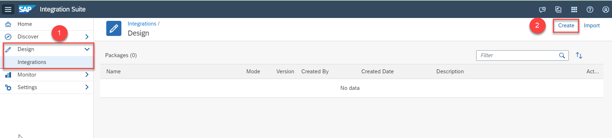

# Design an Integration Flow to Connect with Open Connectors 
<!-- description --> Design an integration flow to integrate the capabilities Cloud Integration and Open Connectors that creates an endpoint to fetch data from BambooHR trial system.

## You will learn
  - How to design and deploy an integration flow using Cloud Integration's web-based integration flow editor
  - How to design an integration flow to fetch data via an API of Open Connectors

### Create an Integration Package and Integration Flow

1. In your SAP Integration Suite home page, choose **Design** > **Integrations** > **Create** to create an integration package.

    <!-- border -->
    
    > An integration flow is always associated to an integration package.

2. In the **Header** tab, provide a **Name** and **Short Description** for your integration package. Choose **Save**.

    <!-- border -->

    >The **Technical Name** gets populated automatically based on the name that you provide.

3. Choose **Artifacts** tab. Here you will create your first integration flow. Choose **Add** > **Integration Flow**.

4. Enter a **Name** for the integration flow and choose **OK**.

      <!-- border -->

5. Choose **Save** and open the integration flow by selecting it.

6. Choose **Edit** to start editing the integration flow.

    Choose **Restore** at the bottom right corner to bring up the **Property Sheet**. Property sheet is the place where you configure the parameters for every step in the integration flow.

      <!-- border -->

### Connect Sender Channel with HTTPS Adapter

In this step, you define your sender channel and sender adapter. In this case, we use an HTTPS sender adapter. This will help you create a simple HTTP endpoint which you can invoke to execute the integration scenario.

1. Choose the **Sender** step. Create the sender channel by clicking the arrow icon on **Sender** and dragging it to the **Start** step.

    <!-- border -->

2. In the **Adapter Type** prompt, select the **HTTPS** adapter.

    <!-- border -->

3. In the property sheet, select the **Connection** tab. In the **Address** field, enter **`/employees/getdetails`**.

    Optionally, you can enter any value of your choice, but ensure that you use **"/"** symbol before specifying the endpoint name. Deselect the **CSRF Protected** checkbox (this will be selected by default).

    <!-- border -->

### Add Request Reply Step

From the palette, choose **Call** > **External Call** > **Request Reply**. Connect it to the message path.

  <!-- border -->

  <!-- border -->

### Connect Request Reply to Receiver

1. Move the **Receiver** step right below the **Request Reply** step by selecting it and dragging it. You do this to ensure that your integration flow is elegantly designed.

    > **TIP:** Use the pan and zoom controls for resizing the canvas.

2. Drag the arrow icon on **Request Reply** to the **Receiver** step.

    <!-- border -->

3. In the **Adapter Type** dialog, select **OpenConnectors**.

4. Select the **Connection** tab in the Property Sheet. 

5. In the **Base URI** field, paste the copied request URL from **Step 5** of [Establish Connection Between Your BambooHR Trial and Open Connectors](btp-integration-suite-nonsapconnectivity-openconnectors).

    > Do not paste the full URL. Paste only till **/api-v2**. If your request URL is **`https://<request-URL>/elements/api-v2/employees`**, paste only **`https://<request-URL>/elements/api-v2`**.

6. For the **Credential Name**, choose **Select**. A list of available user credentials that are applicable for Open Connectors come up. Select the user credential that you created.

    <!-- border -->

7. For the **Resource**, choose **Select**.

    > At this point, Cloud Integration tests the connection to the mentioned Base URI using the mentioned credential name. This is a way for you to check if everything is going as expected. This connection testing helps you choose the right API resource.

    <!-- border -->

8. For **Method**, choose **GET** operation.

    <!-- border -->

9. Leave the other fields as is. Choose **Save** to keep all your configuration changes.

Now you have configured the Open Connectors receiver adapter to fetch a list of employees from your BambooHR trial account when you attempt to invoke the HTTP endpoint.

### Deploy the integration flow

Now that you have designed your integration flow, let's deploy it for further execution.

1. Choose **Deploy** to deploy the integration flow. Choose **Yes** in the confirmation dialog for deployment. Upon deployment confirmation, choose the **Deployment Status** tab in the property sheet.

    <!-- border -->

2. In the **Deployment Status** tab, you can see details about the deployment for the integration flow. The expected deployment status is **Deployed** and runtime status is **Started**.

    <!-- border -->

Later in the mission, you will use the endpoint of the deployed integration flow. Using **Postman**, you will invoke the endpoint to fetch data from your BambooHR trial system.

---