# Establish Connection Between Your BambooHR Trial and Open Connectors
<!-- description --> Use the APIs of Open Connectors to establish a connection to your BambooHR trial account.

## You will learn
-	How to connect to BambooHR from SAP Integration Suite
-	How to create a security material in the Cloud Integration capability for Open Connectors

### Access Open Connectors

1. In your SAP Integration Suite home page, under **Capabilities** section, look out for the tile **Extend Non-SAP Connectivity**. Choose **Discover Connectors**.

    <!-- border -->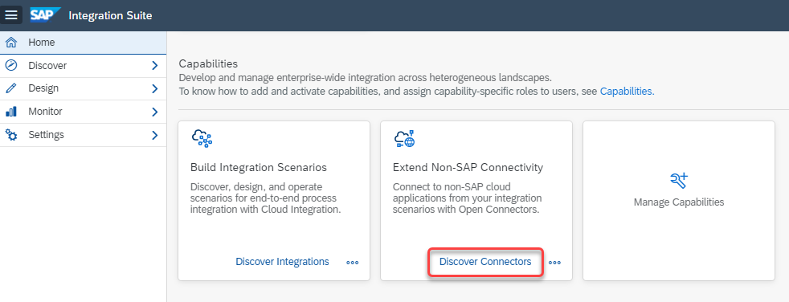    

    You're now directed to the Open Connectors web page.

2. Choose **Connectors**.

    <!-- border -->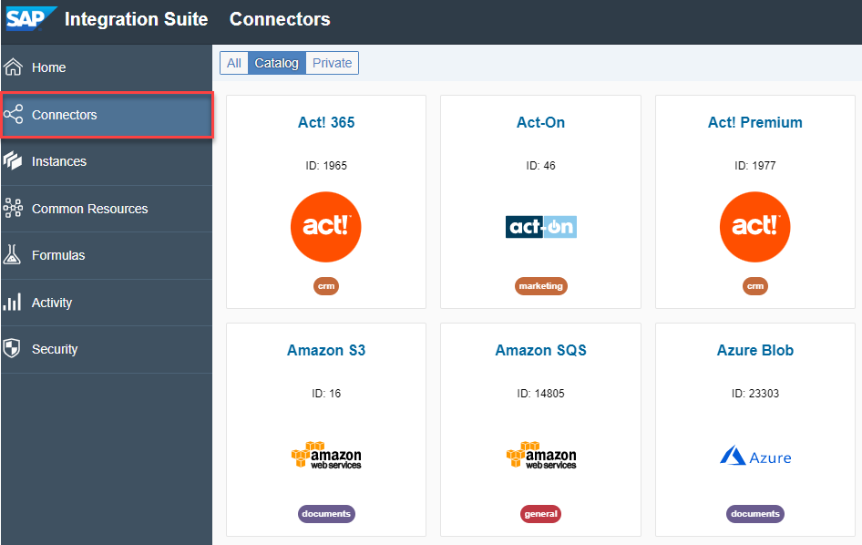   

    You see a catalog of various third-party applications that are supported by Open Connectors.

### Authenticate with your BambooHR's Domain Name and API Key

1. In the list, look out for **Bamboo HR** and choose **API Docs**.

    <!-- border -->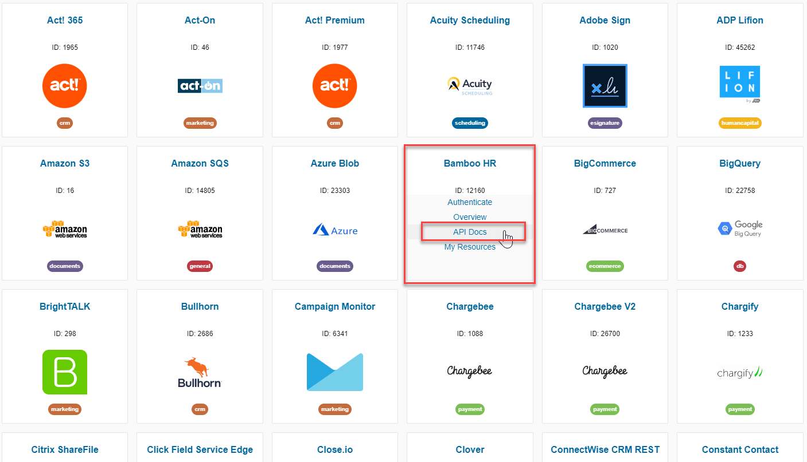 

    You see a list of operations that are supported by BambooHR via REST APIs.  

2. Choose **Authenticate Instance** to connect to your BambooHR system.

    <!-- border -->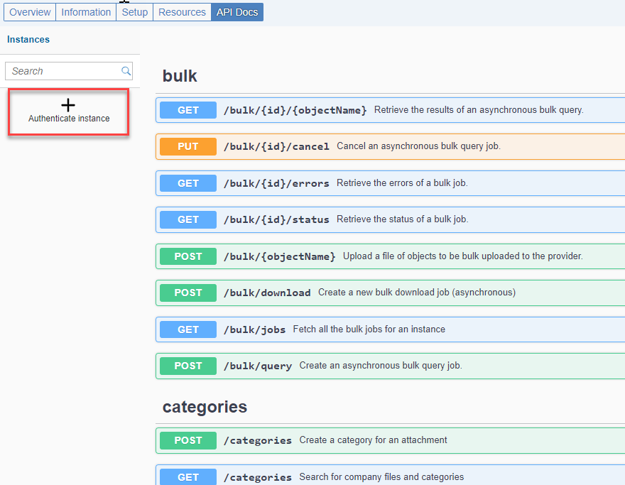 

3. Enter a name for the instance.

4. In the **Company Name** field, enter the domain name that you created for your BambooHR trial. You've copied this value in [Preparing Your BambooHR Trial Account](btp-integration-suite-nonsapconnectivity-settingup-thirdparty).

5. In the **API Key** field, enter the API Key that you generated for your BambooHR trial. You've copied this value in [Preparing Your BambooHR Trial Account](btp-integration-suite-nonsapconnectivity-settingup-thirdparty).

6. Choose **Create Instance**.

    <!-- border -->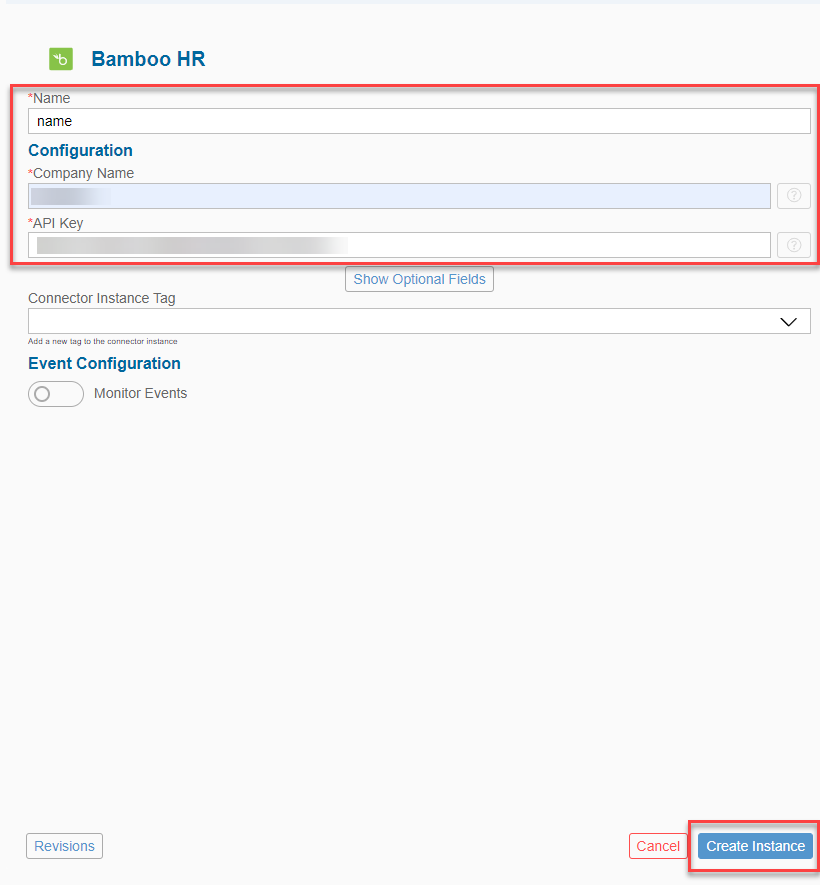

### Test the API Docs

You've now successfully created a BambooHR connector instance. In this step, you test an API to fetch employee details from the sample data that is available in your BambooHR trial account.

1. Choose **Test in the API docs**.

    <!-- border -->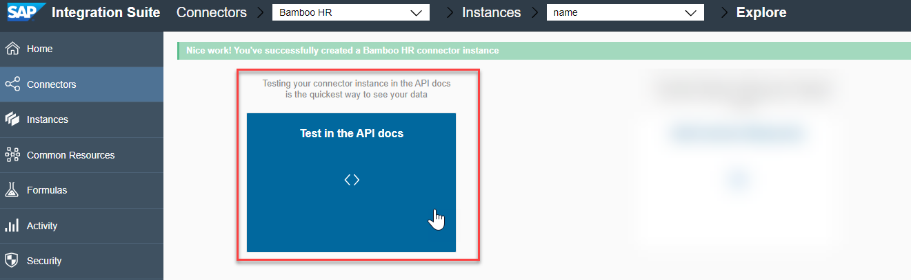

2. In the list of APIs, look out for the category **employees** and the GET API **/employees**.

    This API fetches a list of all employees (sample data) in your BambooHR trial system.

    <!-- border -->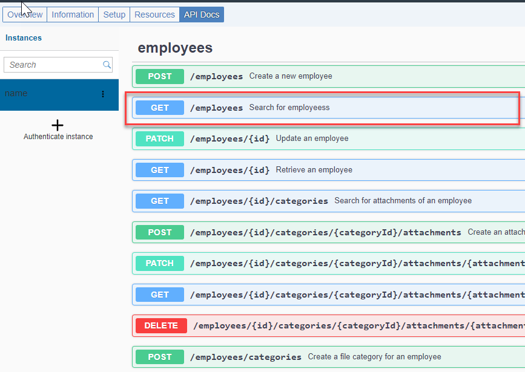

3. Choose **Try Out** and **Execute** to test the API.

    You see a successful response with response code 200 and a response body containing employees data from your BambooHR trial system.
    
    <!-- border -->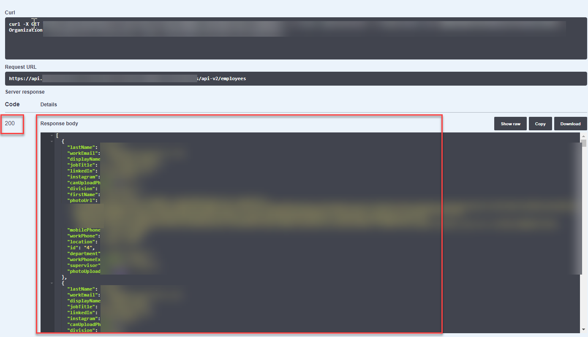

    You've now successfully established a connection between your BambooHR trial system and the Open Connectors capability of SAP Integration Suite.

### Create a Security Material in Cloud Integration

In a later tutorial of this mission, you'll establish an integration between Cloud Integration and BambooHR through Open Connectors. For this integration to work as expected, Open Connectors must authenticate you via a user credential. 

In this step, you'll create a security material in Cloud Integration that takes care of this authentication.

1. In the successful API response, copy the authorization values for the properties **User**, **Organization**, and **Element**.

    <!-- border -->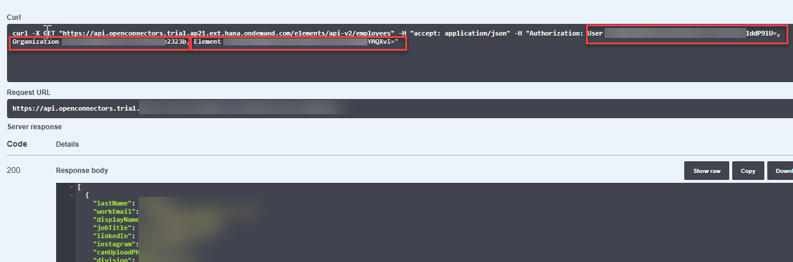

2. In your SAP Integration Suite home page, choose **Monitor > Integrations**.

    In case Open Connectors had opened in the same tab, click **SAP Integration Suite** at the top left to navigate to the SAP Integration Suite home page.

3. Choose **Security Material**.

4. Choose **Create > User Credentials**.

5. Enter a name for the user credentials.

6. For **Type**, select **OpenConnectors**. 

7. Paste the values that you copied from Open Connectors. Choose **Deploy**.

    <!-- border -->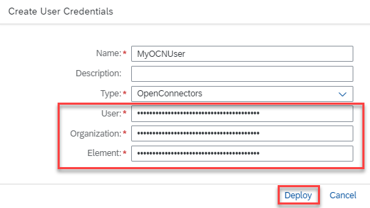

### Copy the Request URL

In a later tutorial of this mission, you will have to provide a request to this **GET /employees** API so that Cloud Integration invokes it.

In the successful API response, copy the **Request URL**.

<!-- border -->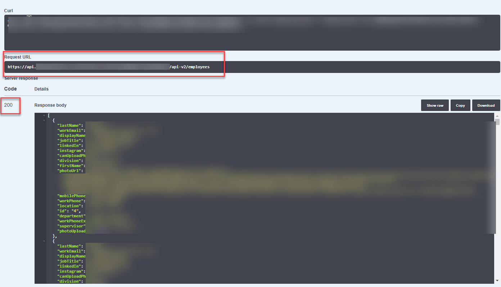

---
