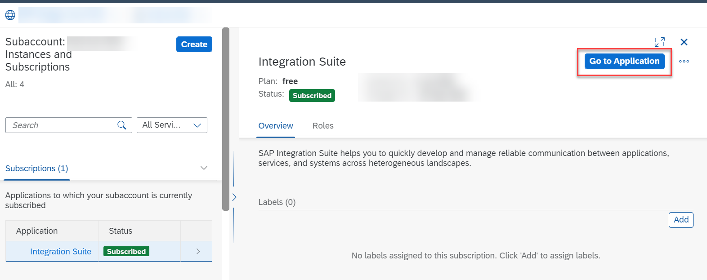
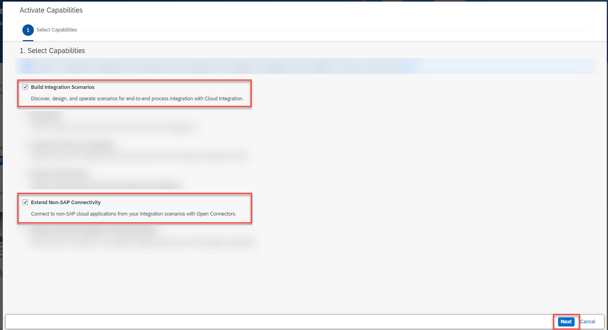
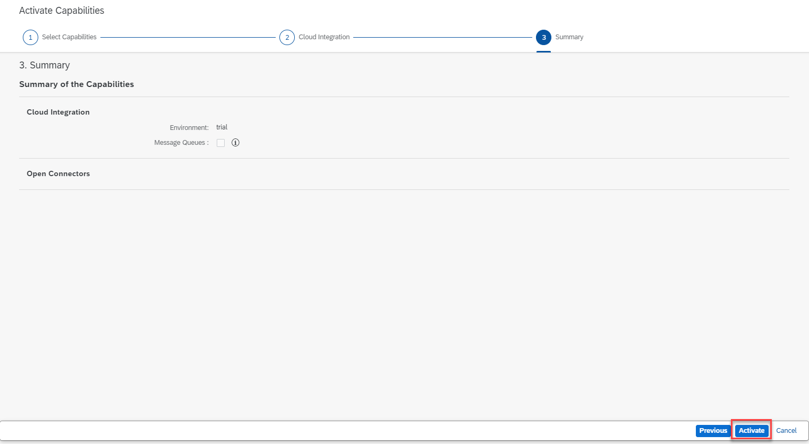
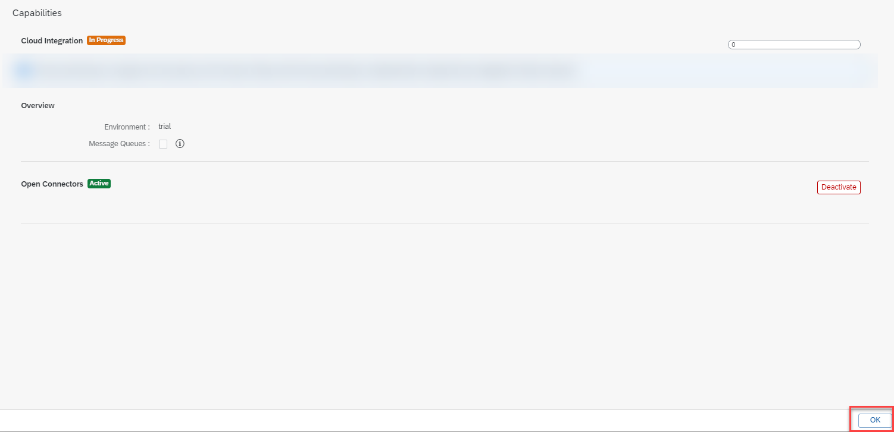
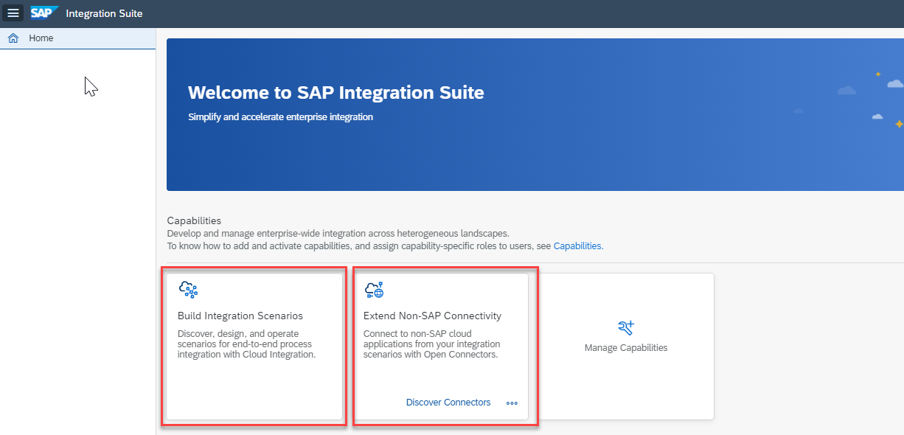
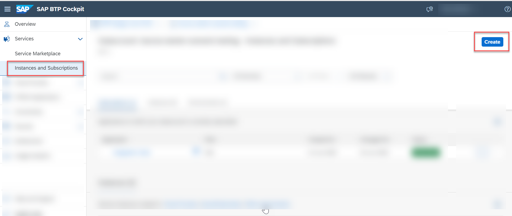
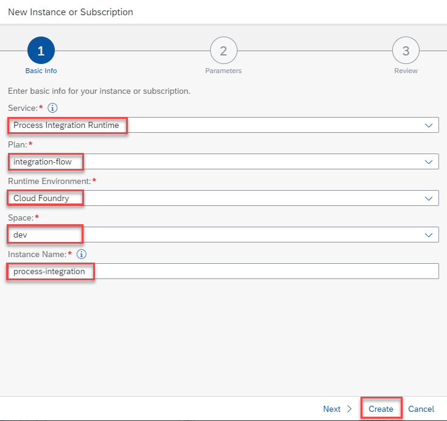
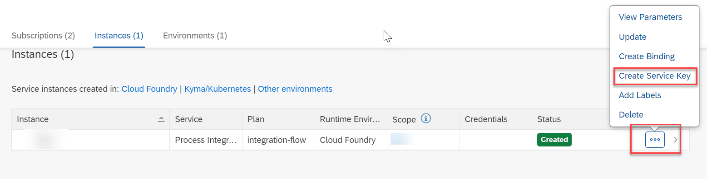
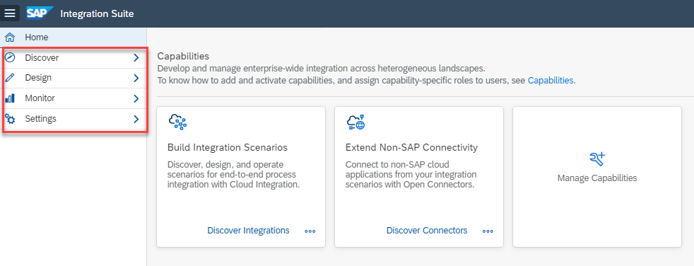

# Preparing Your SAP Integration Suite Tenant 
<!-- description --> Prepare your existing SAP Integration Suite tenant or set up a trial account.

## Prerequisites
- If you don't have an SAP Integration Suite tenant, create a **trial account on SAP Business Technology Platform:** [Get a Free Trial Account on SAP BTP](hcp-create-trial-account).
- If you have an SAP Integration Suite tenant, start from **Step 3**.

## You will learn
-	How to start your SAP Integration Suite trial
-	How to subscribe to the service and assign user roles
-	How to provision and activate the capabilities

> **IMPORTANT**: Trial accounts are not intended for productive usage or team development. If you're using Integration Suite from a production account for your proof of concepts or real-time business cases, refer to the [product documentation](https://help.sap.com/docs/integration-suite/sap-integration-suite/what-is-sap-integration-suite?version=CLOUD) on SAP Help Portal for step-by-step explanation of the initial set up and further information.

### Enter your trial account

This step is relevant only if you're setting up your trial account. If you already have an SAP Integration Suite Tenant, start with **Step 3**.

>**WHERE TO START**:

> - **Are you new to SAP BTP Trial?** - skip this note and continue with the tutorial.

> - You already have a SAP BTP trial account but new to SAP Integration Suite:

>     - If you have already activated Cloud Integration (Process Integration) service in a subaccount:
          - **Option 1**:
          Create a **`New Subaccount`** and then proceed to **Step 2** of this tutorial.
          For a new subaccount, you must assign entitlements by adding service plans and the quotas. For more information, see [Configure Entitlements and Quotas for Subaccounts](https://help.sap.com/viewer/ea72206b834e4ace9cd834feed6c0e09/Cloud/en-US/c90f3d522ee04e65bd87cdec8808e5ce.html).          
          - **Option 2**:
          To continue with an existing subaccount, unsubscribe from Cloud Integration and then proceed to **Step 2**.

> - If you have already subscribed to Integration Suite in your existing trial account, proceed to **Step 3**. You can consume only one SAP Integration Suite tenant per trial account.

1. In your web browser, open [SAP BTP trial cockpit](https://cockpit.hanatrial.ondemand.com/).

2. Navigate to the trial global account by choosing **Enter Your Trial Account**.

    <!-- border -->

3. From your global account page, choose the appropriate subaccount's tile to navigate.

    <!-- border -->

### Subscribe to SAP Integration Suite

This step is relevant only if you're setting up your trial account. If you already have an SAP Integration Suite tenant, start with **Step 3**.

1. Select **Services > Instances and Subscriptions**.

2. Choose **Create**.

    <!-- border -->

3. In the **New Instance or Subscription** dialog, choose **Integration Suite** from the list of services.

    >If SAP Integration Suite is not visible in the **Services** list, you must assign SAP Integration Suite trial entitlements. To assign entitlements, see [Manage Entitlements on SAP BTP Trial](cp-trial-entitlements).

    >- In the tutorial [Manage Entitlements on SAP BTP Trial](cp-trial-entitlements), after **Step 3.5**, there is a list of available services on the left pane.

    >- Filter for **Integration Suite** and select the service.

    >- Select the service plan, add it to your subaccount, and continue with this tutorial.

4. Choose the default plan which is **trial** and then choose **Create**. You are subscribed to the service now.

    <!-- border -->

5. Select **Security > Users**. Choose the entry against your name. In the **Role Collections** section, choose **Assign Role Collection**.

    <!-- border -->

6. In the dialog that appears, select **Integration_Provisioner**. Choose **Assign Role Collection**.

    <!-- border -->

7. Click **Go to Application** in the **Integration Suite** overview page. Now you are directed to the Integration Suite home page.

    <!-- border -->

### Activate the capabilities

>**IMPORTANT**: Ensure that you unsubscribe from the standalone services (like Cloud Integration) if you have already subscribed to them in the same subaccount.  If the standalone subscription exists, you will be unable to activate respective capability via Integration Suite.

>**Navigational Steps**: Go to **Instances and Subscriptions** and delete the subscriptions.

1. In the SAP Integration Suite home page, choose **Add Capabilities** to activate the capabilities offered by SAP Integration Suite.

    <!-- border -->

    For this tutorial, you must select the **Build Integration Scenarios** and **Extend Non-SAP Connectivity** capabilities. Choose **Next**.

    <!-- border -->

    You do not have to select anything specific for Cloud Integration capability for this scenario. Choose **Next**.

    <!-- border -->

2. Choose **Activate** to provision the selected capabilities.

    <!-- border -->

3. Choose **OK**.

    The activation takes a while to complete.
    >**IMPORTANT**: Before you proceed, please wait for the capabilities to be activated.

    <!-- border -->

4. Verify that the activated capabilities are seen on the home page.

    <!-- border -->

>Though activation is complete, you can't yet access the activated capabilities. To access each capability, you must first assign capability-specific roles which is explained in the next step.

### Assign roles for the activated capabilities

In this step, you assign yourself the necessary roles to access and use the activated capabilities.

1. Navigate to your SAP BTP subaccount. Choose **Security > Users**. Choose the entry against your name.

2. In the **Role Collections** section, choose **Assign Role Collection**. Assign the following role collections:

    |  Capability                   | Role Collection
    |  :-------------               | :-------------
    |  Cloud Integration            | `PI_Administrator`
    |  Cloud Integration            | `PI_Business_Expert`
    |  Cloud Integration            | `PI_Integration_Developer`
    |  Open Connectors              | `OpenConnectors_User`

### Create a service instance and a service key

 A **service instance** defines how a service of SAP BTP (in our case, the **Process Integration Runtime** service) can be called from a remote component. In the context of SAP Integration Suite, a service instance is the definition of an OAuth client. The service key generated out of the service instance contains credentials and other information that is required for authentication to execute and monitor integration artifacts.

 Create an instance of the **Process Integration Runtime** service to access the endpoints after deploying the integration artifacts.

1. Choose **Services > Instances and Subscriptions**.

2. Choose **Create**.

    <!-- border -->

3. In the **New Instance or Subscription** dialog, choose **Process Integration Runtime** from the list of services.

4. Choose **integration-flow** from the list of  plans.

5. Choose **Cloud Foundry** as the runtime environment.

6. Select a space in your Cloud Foundry org to create the instance.

7. Provide a name for your service instance, then choose **Create**.

    <!-- border -->

    A service instance is created.

8. Under **Actions**, choose **Create Service Key**.

    <!-- border -->

9. Provide a name for the service key and choose **Create**.

10. Open the service key. You will need the values **clientid** and **clientsecret** in the final step of this mission for authorizing yourself.  

### Verify the activated capabilities

Refresh the Integration Suite home page to see capability-specific menu items being added to the left navigation.

<!-- border -->

---