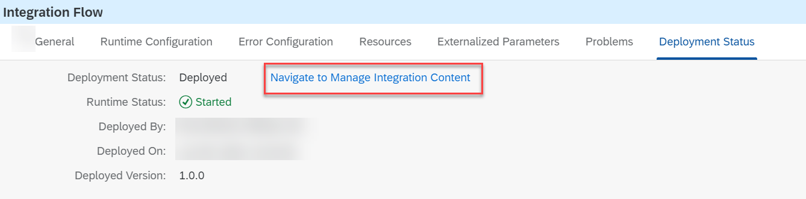
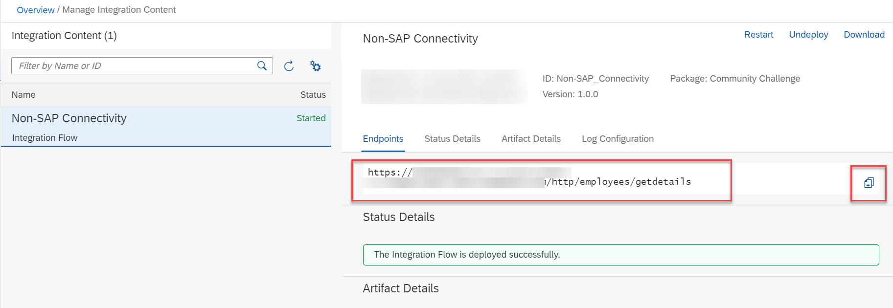

# Test Your Integration Scenario
<!-- description --> During this step, you will test the end-to-end integration scenario that you have built so far.

## You will learn
  - How to test your integration scenario using Postman

### Get the endpoint of the deployed integration flow

In this step, you copy the endpoint address of the deployed integration flow.

1. Open your integration flow.

2. On the **Deployment Status** tab of the property sheet, choose the **Navigate to Manage Integration Content**.

    <!-- border -->

3. On the **Endpoints** tab, choose **Copy** icon. If you don't see an endpoint, wait for a few minutes until the endpoint appears.

    <!-- border -->

### Test the integration scenario

During this step, you test your integration design using Postman. You can use any testing platform of your choice.

1. Open your **Postman** application.

2. Paste the copied endpoint in the request URL field and choose **GET** as the method.

3. Go to your SAP BTP subaccount. Copy the **clientid** and **clientsecret** from your service key. Refer to step 5 in [Preparing Your SAP Integration Suite Tenant](btp-integration-suite-nonsapconnectivity-settingup-suite).

4. For Authorization, choose **Basic Auth**. Paste the **clientid** and **clientsecret** as the username and password.

5. Hit the **Send** button. You receive a HTTP status 200 with the data from BambooHR system in the **Body** field.

Congratulations!
You've now successfully solved the integration problem that was shown in [The Use Case for the Challenge](btp-integration-suite-nonsapconnectivity-usecase). You see the data coming from your BambooHR trial system.

### Optional Step: Integrate with your own application

As an alternative to Postman, if you have an application of your own for testing purposes, use the same as your receiving system.

For example, create a simple button in your UI. Do a REST integration so that upon clicking the button, you can invoke the endpoint to fetch the data from BambooHR trial system and display the data in your application UI.

---