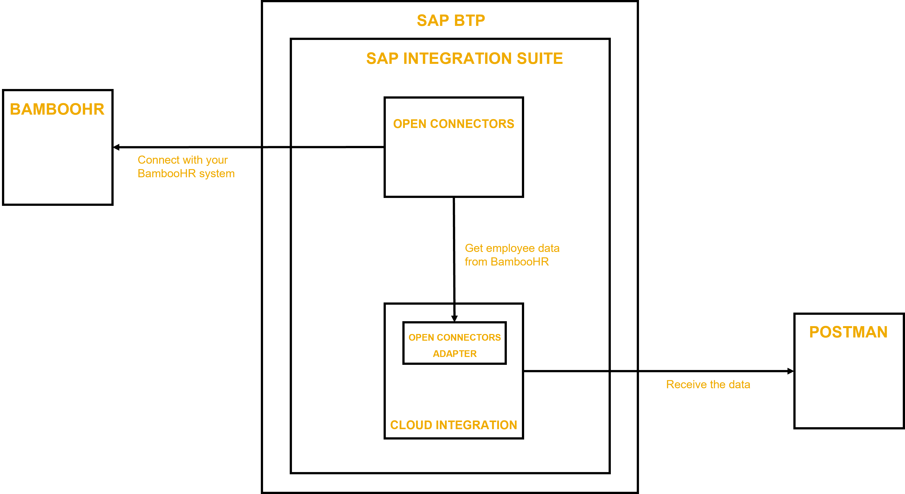

# The Use Case: Connectivity to Non-SAP Applications using SAP Integration Suite
<!-- description --> Understand the integration problem that you're going to solve before you get started.

## You will learn
 - What is SAP Integration Suite
 - About the integration problem that you're going to solve

### What is SAP Integration Suite

SAP Integration Suite is an enterprise-grade integration platform as a service (EiPaaS) that allows you to smoothly integrate on-premise and cloud-based applications and processes with tools and prebuilt content managed by SAP.

SAP Integration Suite combines the integration capabilities such as Cloud Integration (Process Integration), API Management, Integration Advisor, Trading Partner Management, Integration Assessment, Open Connectors, and Migration Assessment into a cohesive and simplified toolkit for enterprise integrations. To provide a comprehensive integration experience, these services are not available separately, but only as part of SAP Integration Suite.

SAP Integration Suite is available in simple [service plans](https://help.sap.com/docs/btp/sap-business-technology-platform/commercial-models?version=Cloud). To know more about these plans, see the SAP Integration Suite [service catalog](https://discovery-center.cloud.sap/#/serviceCatalog/f810c887-8d25-4942-9849-354837951066).

### The Use Case

By using this integration scenario, you design and execute an integration flow that reads information from a third-party software. To accomplish the scenario, you use SAP Integration Suite, and in particular, its capabilities *Cloud Integration* and *Open Connectors*.

You use *Open Connectors* to: 
1. identify and establish connection to a third-party software
1. fetch data from the third-party software via APIs  

You use *Cloud Integration* to: 
1. design a custom integration flow to fetch data from Open Connectors
1. deploy the integration flow to a cloud-based runtime location

Finally, use an open API platform like Postman to securely invoke the deployed integration artifact to see that you're able to fetch data from a third-party software using SAP Integration Suite.

For the sake of providing an example, we're using a BambooHR trial system that already contains sample data. You can also use a third-party system of your choice to which connectivity is supported via Open Connectors. Currently, Open Connectors provides connectivity to more than 170 third-party applications and solutions. See [Connectors Catalog](https://help.openconnectors.ext.hana.ondemand.com/home/catalog).

  <!-- border -->

---
