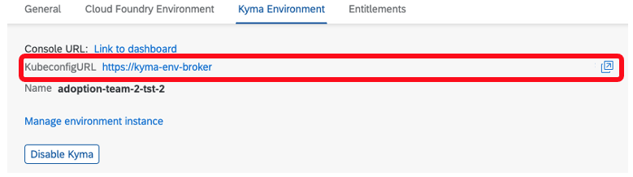
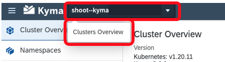
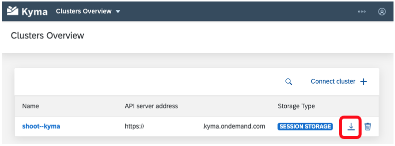
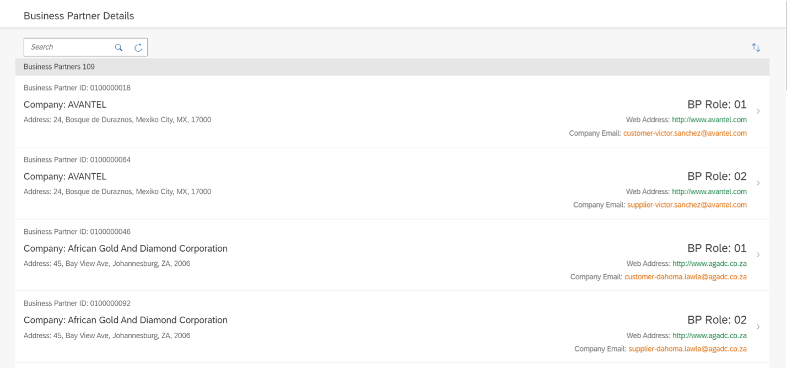

# Consume SAP BTP Services In SAP Kyma
<!-- description --> Build an Extension Application on Kyma using SAP BTP services.

## Prerequisites
  - Get an Account on SAP BTP to Try Out Free Tier Service Plans.[Get an Account on SAP BTP](btp-free-tier-account)
  - You have a Kyma-runtime environment on SAP Business Technology Platform (BTP) [Enable SAP BTP, Kyma-Runtime](cp-kyma-getting-started).
  - You have installed [Docker](https://docs.docker.com/get-started/#download-and-install-docker).
  - You have [Docker Hub](https://hub.docker.com/) account.
  - You have installed [Kubernetes command-line tool](https://kubernetes.io/docs/tasks/tools/#kubectl).
  - You've installed `kubectl CLI`, including the plugin `kubectl oidc-login` for authentication. See [Installing the Kubernetes Command Line Tool](cp-kyma-download-cli).
  - In addition, we recommend [`krew`](https://krew.sigs.k8s.io/docs/user-guide/setup/install/) to install and use the `kubectl` plugin for `Kubernetes   OpenID  Connect (OIDC)` authentication, also known as  `kubectl oidc` plugin.
  - You have an [account on the SAP Gateway Demo System (ES5)](gateway-demo-signup) created
  - You have [connected SAP BTP to your SAP Gateway Demo System (ES5) account](cp-portal-cloud-foundry-gateway-connection).

## You will learn
  - How to consume SAP BTP services in sap Kyma-runtime
  - How to deploy applications into Kyma-runtime
  - How to use SAP BTP APIs, Service Manager and Service Operator to consume services from other environments
  - How to create service instances using sap-btp-service-operator [Working with SAP BTP Service Operator](https://help.sap.com/viewer/09cc82baadc542a688176dce601398de/Cloud/en-US/b5a35bfa87b5444080e6e6e6d361fa20.html).
  In this tutorial, we use the simple **`fiori`** sample application to learn some best practices to setting up your Kyma-runtime And communicate with SAP BTP so you can use the Destination and the SAP Authorization & Trust Management  services.

---

### Download the Kyma runtime kubeconfig


The `kubectl` tool relies on a configuration file called the `kubeconfig`, to configure access to the cluster. This step details how this can be obtained from both the BTP Cockpit and the Console UI.

To obtain the `kubeconfig` from the SAP BTP Cockpit:

1. Within your BTP account, navigate to the sub-account where the Kyma-runtime is enabled.

2. Choose the menu option **Overview**

3. Scroll down to the **Kyma-Environment** details

4. Choose the link next to **`KubeconfigURL`** to download the `kubeconfig`

    

To obtain the `kubeconfig` from the Console UI:   

1. Navigate to the Console UI of your Kyma-runtime.

2. Log onto the Kyma-runtime.

3. At the top-left of the Kyma-runtime window you will find a drop down which displays the name of the currently connected runtime.

4. Select the drop down and choose the option **Clusters Overview**

    

5. Choose the **`Download Kubeconfig`** option to download the file.

    


### Set the KUBECONFIG environment variable


To configure the access to your Kyma-runtime cluster, you have to set the `kubeconfig` environment variable to point to the location of the `kubeconfigfile` downloaded from your Kyma-runtime  cluster.

[OPTION BEGIN [Mac and Linux]]

1. Open a command line prompt on your computer. In the command line screen, type in the following:

    ```Shell/Bash
    export KUBECONFIG=<KUBECONFIG_FILE_PATH>
    ```

    Replace the `<KUBECONFIG_FILE_PATH>` section with the file path, including the file name and extension, of the `Kubeconfig` you downloaded in the previous step.

2. Test the configuration by running this command:  

    ```Shell/Bash
    kubectl config get-contexts
    ```

    This should return a response similar to:

    |CURRENT|NAME|CLUSTER|AUTHINFO|NAMESPACE|
    |-------|----|-------|--------|---------|
    |*      | `shoot--kyma-stage--c-#######`|`shoot--kyma-stage--c-#######`|`shoot--kyma-stage--c-#######`| |

3. You are now set up to use the Kyma-runtime on SAP BTP Platform.

[OPTION END]

[OPTION BEGIN [Windows]]

1. Open a command line prompt on your computer. In the command line screen, type in the following:

    ```PowerShell
    $ENV:KUBECONFIG="<KUBECONFIG_FILE_PATH>"
    ```

    ```DOS
    set KUBECONFIG="<KUBECONFIG_FILE_PATH>"
    ```

    Replace the `<KUBECONFIG_FILE_PATH>` section with the file path, including the file name and extension, of the `Kubeconfig` you downloaded in the previous step.

2. Test the configuration by running this command:  

    ```Shell/Bash
    kubectl config get-contexts
    ```

    This should return a response similar to:

    |CURRENT|NAME|CLUSTER|AUTHINFO|NAMESPACE|
    |-------|----|-------|--------|---------|
    |*      | `shoot--kyma-stage--c-#######`|`shoot--kyma-stage--c-#######`|`shoot--kyma-stage--c-#######`| |

3. You are now set up to use the Kyma-runtime on SAP BTP Platform.

[OPTION END]


### Create service instances


   In the **`fioriapp`** sample application, the Destination and the SAP Authorization & Trust Management services will be consumed in Kyma-runtime. To use these SAP BTP services you have to create the respective service instances and service bindings. Use the `createservice.yaml` file which will create the `destination` service instance with plan `lite` and the `xsuaa` service instance with plan `application`.

1. The applications can be found in the [btp-hyperscaler-extension]
   (https://github.com/SAP-samples/btp-hyperscaler-extension) repository. Within the repo you can find each of their Deployment files within the respective folder.

2. Download the code by choosing the green **Code** button and then choosing one of the options to download the code locally.

    You can instead run the following command within your CLI at your desired folder location:

    ```Shell/Bash
    git clone https://github.com/SAP-samples/btp-hyperscaler-extension
    ```
3. Create your own `sapfiori` namespace in your `Kyma cluster`.

    ```Shell/Bash
    kubectl create namespace sapfiori
    ```
    > Note: Incase of login fails run command  "kubectl krew install oidc-login".

4. Replace the  `<Custom-Domain>` in `<Folder path>/btp-hyperscaler-extension/kyma/createservice.yaml` file.

    Find your Cluster-domain and replace in the Createservice.yaml, run the below command and copy the `Kubernetes control pane` URL

    ```Shell/Bash
    kubectl cluster-info
    ```

    ```Shell/Bash
    Example: https://api.xxx.kyma.ondemand.com
    ```

    And your `Cluster Domain` will be `xxx.kyma.ondemand.com`


5. create the `destination` service instance with plan *lite* and the `xsuaa` service instance with plan
   *application* by running the below command.

    ```Shell/Bash
    kubectl apply -n sapfiori -f <Folder Path>/btp-hyperscaler-extension/kyma/createservice.yaml
    ```
    > Replace your folder path in above command.
    > The create service file is represented as declarative YAML object which describes what you want to run inside your namespace. You can find the file at `/btp-hyperscaler-extension/master/kyma/createservice.yaml`.

6. Check that the status of the service instance in your cluster by using the following command:

    ```Shell/Bash
    kubectl get serviceinstances -n sapfiori
    ```
    **This should return the status of created service instances.**

    |NAME|CLASS|PLAN|STATUS|AGE|
    |-------|----|-------|--------|---------|
    |`destination-instance-fiori`| `ClusterServiceClass/destination`|`lite`|`Ready`|`##`|
    |`xsuaa-instance-fiori`| `ClusterServiceClass/xsuaa`|`application`|`Ready`|`##`|

    >To know more about consuming services using SAP BTP service operator [Working with SAP BTP Service Operator](https://help.sap.com/viewer/09cc82baadc542a688176dce601398de/Cloud/en-US/0ccebd7cec24411dacd5ad17799534e0.html).


### Build and deploy app into kyma Cluster


To build and deploy the **`fioriapp`** sample application in your cluster, you have to create a pod, which encapsulates the container and ensures that a specified quorum of running instances is fulfilled. To do that, use the `deployment.yaml`.

1. Build the docker image of the **`fioriapp`**.

    ```Shell/Bash

    cd `btp-hyperscaler-extension/basicfioriapp`

    docker build . -t `<docker-username>/fioriapp` -f Dockerfile
    ```
    >Replace `<docker-username>` with your username

2. Push the docker image of the `fioriapp` to your Container Image Library.

    ```Shell/Bash

    docker push `<docker-username>/fioriapp`

    ```
    >Replace `<docker-username>` with your username

3. Update the docker image in the `<Folder path>/btp-hyperscaler-extension/kyma/deployment.yaml` file.

    * Replace `<docker-username>` with your username

4. Execute the below command to deploy the application into kyma-cluster.

    ```Shell/Bash
    kubectl apply -n sapfiori -f <Folder path>/btp-hyperscaler-extension/kyma/deployment.yaml

    ```
    > Replace your folder path in above command.
    > The deployment file is represented as declarative YAML object which describes what you want to run inside your namespace. You can find the file at `/btp-hyperscaler-extension/master/kyma/deployment.yaml`.

5. Execute the following command to check the deployed application pod status

    ```Shell/Bash
    kubectl get pods -n sapfiori
    ```

    This should return the status of deployed application.

    |NAME|READY|STATUS|RESTART|AGE|
    |-------|----|-------|--------|---------|
    |`fioriapp-##-##`| `2/2`|`Running`|`##`|`##`|


### Apply resources to Kyma runtime


   kind Service is an abstract way to expose an application running on a set of Pods as a network service. Now we have the Deployment of **`fioriapp`**, let's deploy the Kubernetes Service to allow other Kubernetes resources to communicate with your microservice.
   Create `APIRule` to defines the API endpoint which exposes the application to the Internet.

1. Execute the below command to Create the Service and Expose the microservice.

    Replace the  `<Custom-Domain>` in `<Folder path>/btp-hyperscaler-extension/kyma/service.yaml` file.

    ```Shell/Bash
    kubectl apply -n sapfiori -f <Folder path>/btp-hyperscaler-extension/kyma/service.yaml
    ```
    > Replace your folder path in above command.
    > The deployment file is represented as declarative YAML object which describes what you want to run inside your namespace. You can find the file at `/btp-hyperscaler-extension/master/kyma/service.yaml`.


### Run the deployed application


To access the API we can use the `APIRule` we created in the previous step.

1. Open the kyma-runtime console

2. From the menu, choose **Namespaces**

3. Choose the `sapfiori` Namespace.

4. From the menu, choose **Discovery and Network > `API Rules`**.

5. Choose the **Host** entry for the **`fioriapp`** `APIRule` to open the application in the browser.  Application should return the list of business partners

    `https://fioriapp.<cluster>.kyma.ondemand.com`

    <!-- border -->

**Congratulations!** You have successfully completed the tutorial.


---
