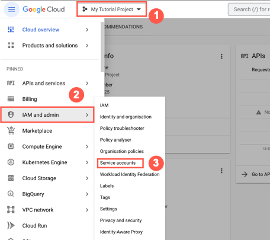
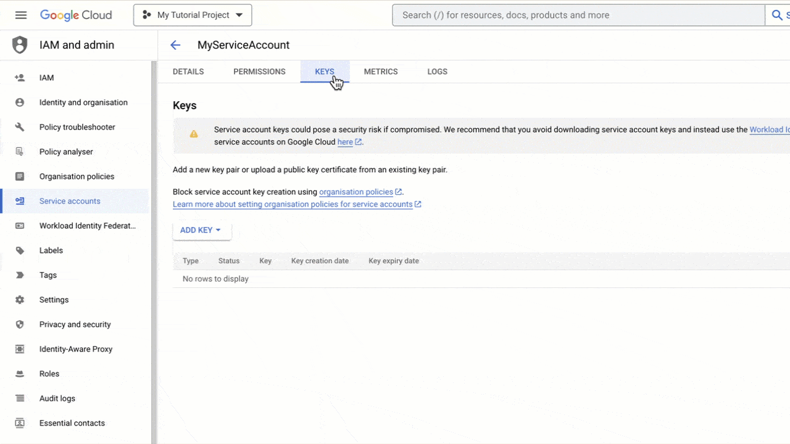
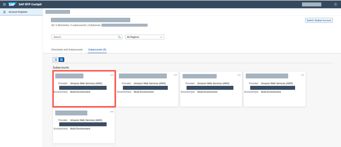
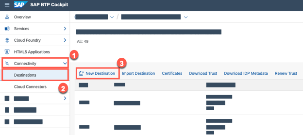
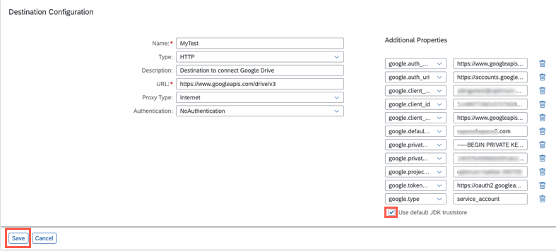
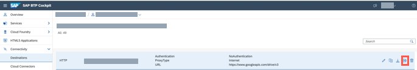

## Prerequisites
 - You've added entitlements for Document Management Service, Integration Option. For more information about entitlements, see [Configure Entitlements and Quotas for Subaccounts](https://help.sap.com/docs/btp/sap-business-technology-platform/configure-entitlements-and-quotas-for-subaccounts?version=Cloud)
 - You've created a service instance and service key of Document Management Service, Integration Option. For more information, refer to this tutorial [Create a Service Instance and then a Service Key of SAP Document Management Service, Integration Option](btp-sdm-gwi-create-serviceinstance).
 - You've added the roles `	SDM_User` and `SDM_Admin` for your user.
 - You've downloaded the JSON file with public/private key pair that is generated and downloaded to your local folder. For more information about the detailed steps, see [Configure Service Account Access](https://developers.google.com/workspace/guides/create-credentials?hl=en#create_credentials_for_a_service_account).

### You will learn
 - How to download key from the Google Cloud console
 - How to configure a basic HTTP destination
 - What are some of the additional properties you need to add while configuring the destination?
 - How to specify the Google parameters that are required to create a destination

### Information
  Destinations are key building blocks in SAP BTP, and are used to define connections for outbound communication from your application to remote systems. These remote systems can be on-premises or in the cloud. A destination has a name, a URL, authentication details, and some other configuration details.

---

[ACCORDION-BEGIN [Step 1: ](Download public/private key pair from Google Cloud)]

1. Logon to the [Google Cloud](https://console.cloud.google.com/projectselector2/iam-admin/serviceaccounts?pli=1&supportedpurview=project) console.

2. In the Google Cloud console, navigate to **Menu**, select your project and choose **IAM & Admin** > **Service Accounts**.

    !

3. Select and click on your service account. If it is not available, you can create a new one and select it.

    !

4. Once you are on the service account page, click **Keys** > **Add key** > **Create new key**. Select **JSON**, then click **Create**.

    !

>**Results:** Your new public/private key pair is generated and downloaded to your machine as a new file. The values from this file will be used in the next step, so please keep it accessible.

[DONE]
[ACCORDION-END]

[ACCORDION-BEGIN [Step 2: ](Access your subaccount)]
Click on the tile of your Cloud Foundry subaccount.

  !

[DONE]
[ACCORDION-END]

[ACCORDION-BEGIN [Step 3: ](Open the Destinations view)]
 Navigate to **Connectivity** and click on the **Destinations** button on the left panel. Click **New Destination** to open a new destination configuration form.

  !

[DONE]
[ACCORDION-END]

[ACCORDION-BEGIN [Step 4: ](Create new destination)]
Enter all the following fields in the destination configuration section and confirm with **Save**.

  Field Name     | Value
  :------------- | :-------------
  Name           | **`MyTest`**
  Type           | **`HTTP`**
  Description    | **`Destination to connect Google Drive`**
  URL            | **`https://www.googleapis.com/drive/v3`**
  Proxy Type     | **`Internet`**
  Authentication | **`NoAuthentication`**

  And the following ***Additional Properties:***

  >  Note:  Open the downloaded JSON file with public/private key pair from Google service accounts. For more information about the detailed steps, see [Configure Service Account Access](https://developers.google.com/workspace/guides/create-credentials?hl=en#create_credentials_for_a_service_account).

  Property Name     | Value
  :------------- | :-------------
  `google.auth_provider_x509_cert_url` | *An `auth_provider_x509_cert_url` obtained from the JSON file*
  `google.auth_uri` | *The Google authentication URI obtained from a JSON file*
  `google.client_email` | *A client email obtained from a JSON file.*
  `google.client_id` | *A client ID obtained from a JSON file*
  `google.client_x509_cert_url` | *A client X509 certificate URL obtained from a JSON file*
  `google.private_key` | *Enter the Google Cloud private key*
  `google.private_key_id` | *A private key ID obtained from a JSON file*
  `google.project_id` | *A project ID obtained from a JSON file*
  `google.token_uri` | *A token URI obtained from a JSON file*
  `google.type` | **`service_account`**

  When you specify a URL with the HTTPS scheme, a checkbox Use default **JDK truststore** will appear. Ensure that this is checked.

  !

[DONE]
[ACCORDION-END]

[ACCORDION-BEGIN [Step 5: ](Check connection)]

Click on the `Check Connection` icon on the newly created Destination to see if everything works.

  !

[DONE]
[ACCORDION-END]

[ACCORDION-BEGIN [Step 6: ](Test yourself)]

 [VALIDATE_6]

[DONE]
[ACCORDION-END]

---
