## Prerequisites
  - You have created an account on SAP BTP to try out either free tier or standard service plans: [Get an Account on SAP BTP to Try Out Free Tier Service Plans](https://bit.ly/3LYSOBr).
  - You are entitled to use the Document Management Service, Integration Option: [Manage Entitlements Using the Cockpit](https://bit.ly/41B95SU).

### You will learn
  - How to create a service instance of Document Management Service, Integration Option.
  - How to create a service key for your service instance.

### The Use Case:

You'll export table data from SAP S/4HANA Cloud, public edition to Google Sheets. You'll achieve this scenario by integrating SAP S/4HANA with Google Workspace using the SAP Document Management Service.

Here SAP S/4HANA acts as a source system and Google Drive acts as a target system. You'll also create trust between these systems via SAP BTP cockpit.

  

---

[ACCORDION-BEGIN [Step 1: ](Create a service instance)]

1. Log on to your SAP BTP subaccount. Navigate to **Service Marketplace** and search for **Document Management Service, Integration Option**. Click **Create** to start the service instance creation dialog.

    !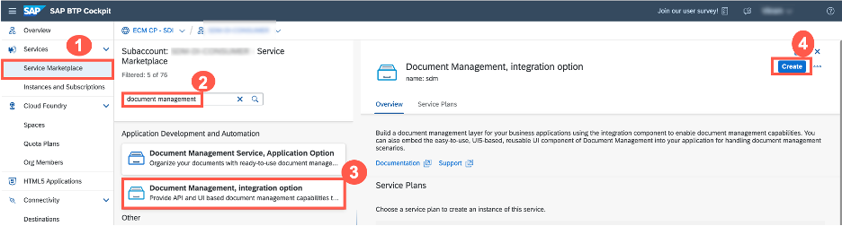

2. In the dialog, choose the **Standard** plan and select the **Space** that you can use. Enter a name for your new instance, for example, `For Demo` and click **Create**.

    !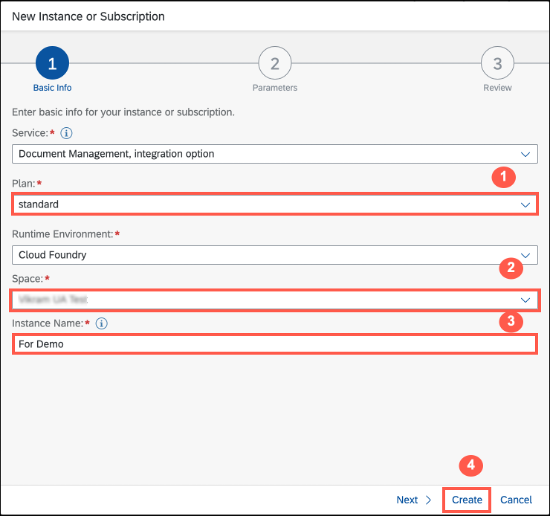

3. In the next **Information** dialog, click on **View Instance** to navigate to the list of your service instances.

    !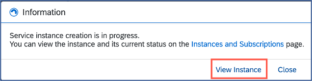

[DONE]
[ACCORDION-END]

[ACCORDION-BEGIN [Step 2: ](Create a service key)]
You are now able to create a service key for your new service instance. Service keys are used to generate credentials to enable apps to access and communicate with the service instance.

1. In the same subaccount, navigate to **Instances and Subscriptions** and choose the demo instance you created in the previous step, then click the **...** dots to open the menu and select **Create Service Key**.

  !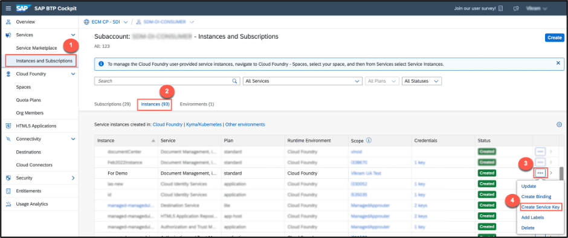

2. In the dialog, enter `My tutorial` as the name of your service key. Click **Create** to create the service key.

    !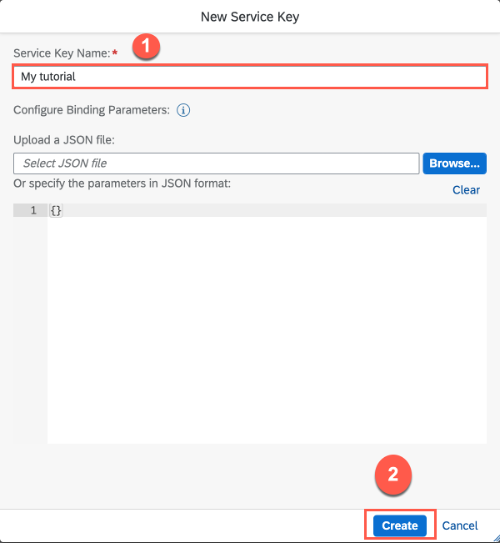

3. You can now view the service key in the browser or download it. Click on the **Service Key** and click **View**.

    !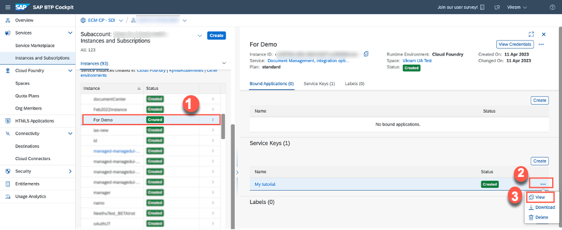

4. In the credentials view dialog, click on **Form**.

    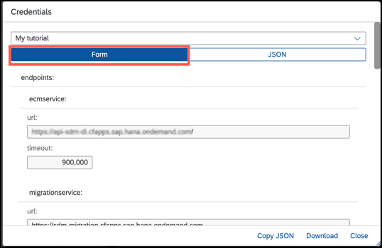

5. Scroll down to copy the values from the following fields and paste them into the secure area (for example, notepad or any text editor).

    1.  **`clientid:`**

    2.  **`clientsecret:`**

    3.  **`url:`**

      !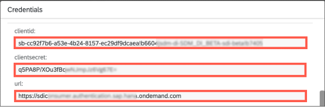

[DONE]
[ACCORDION-END]

[ACCORDION-BEGIN [Step 3: ](Create a role collection)]
  Create a role collection manually. You can skip this step if you already created the role collection and can use it.

1. Navigate to your **Subaccount** in the **SAP BTP Cockpit**.

2. Choose **Security** &rarr; **Role Collections** on the left.

3. Choose the ( &#x2B; ) icon in the top right corner of the screen to create a new role collection.

4. Enter **Name** `SDM_roles`.

5. Choose **Create**.

    !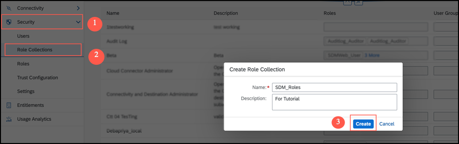

**The newly added role collection appears now in the list, but it doesn't contain any roles. To add a role:**

1. Choose the **`SDM_roles`** role collection and then choose **Edit**.

    !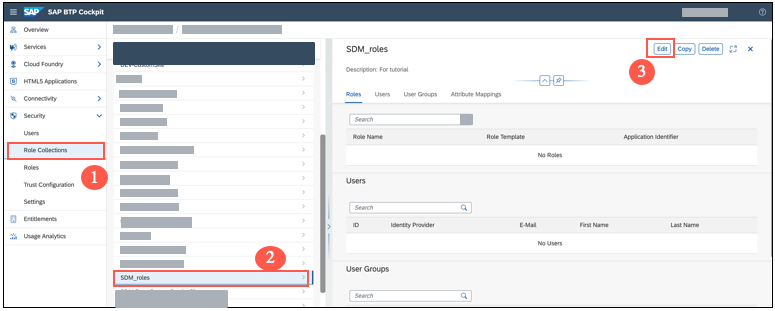

2. Open the value help for **Role Name**.

    !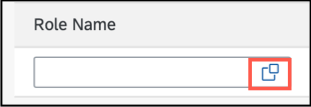

3. Select `SDM_Admin` in list of roles and then choose relevant **`Application Identifier`** from the dropdown.
    >**Note:** The **Application Identifier** should match the second part of your `clientid`.
    For example, if your `clientid` is `tt-d12345cb-6d78-901b-2345-6ab78901a2c3!b456789|xyz-id-abc-s4-test-tutorial-account!b012344` the your **Application Identifier** that you need to select is `xyz-id-abc-s4-test-tutorial-account!b012344`.

    !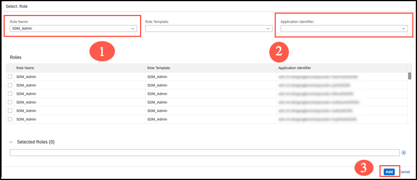

    Choose **Add**.

4. Choose **Save**.

    !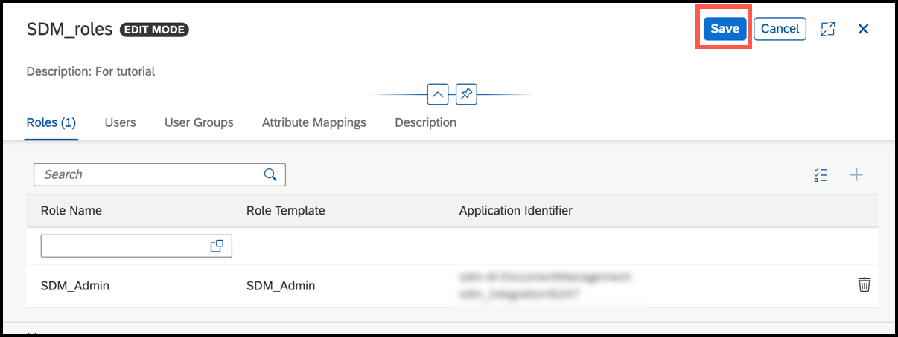

[DONE]
[ACCORDION-END]

[ACCORDION-BEGIN [Step 4: ](Test yourself)]

[VALIDATE_6]

[DONE]
[ACCORDION-END]

---
