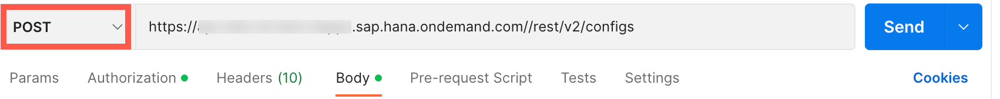
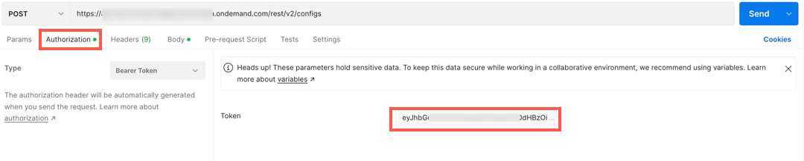
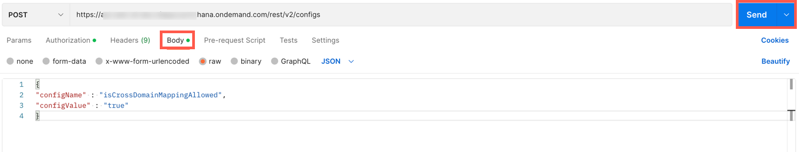
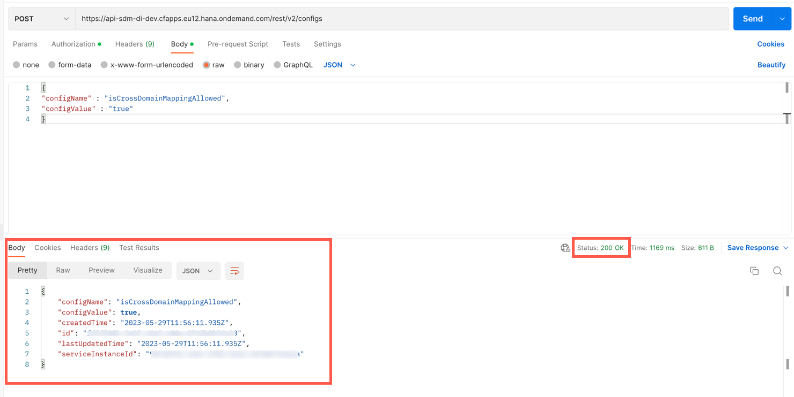

## Prerequisites
 - You've copied the **`ecmservice:url`** value from the service key of Document Management Service, Integration Option. For more information, see  [Create a Service Instance and then a Service Key of SAP Document Management Service, Integration Option](btp-sdm-gwi-create-serviceinstance).
 - You've generated a JSON Web Token (JWT) that serves as your authorization for making API calls. For more information, see [Generating the JSON Web Token (JWT)](btp-sdm-gwi-onbrepo-jwt-token).
 - You've the admin permission for Document Management Service, Integration Option via the **`SDM_Admin`** scope.
 - You've installed the [Postman](https://www.postman.com/downloads/) app.
 - You've created an HTTP destination and added the following additional property. For more information, see [Create a Destination](btp-sdm-gwi-create-destination).

|  Property Name     | Value
|  :------------- | :-------------
|  **`google.default_domain`** | **`Enter the domain.`** For example, `abcworkspace.com`   

### You will learn
  - How do you manage cross domain mapping at the service instance level

### Introduction

  If your domains are different, we need to map your system user account to the Google Workspace domain. For example, if you're using the domain abc.com (jhon.thane1@abc.com) and have a Google Workspace account with the domain abcworkspace.com (jhon.thane1@abcworkspace.com), you need to maintain cross-domain mapping


---


[ACCORDION-BEGIN [Step 1: ](Get url from the service key)]
Copy the `url:` parameter from your service key.

  !

[DONE]
[ACCORDION-END]

[ACCORDION-BEGIN [Step 2: ](Send your API request)]
1. Open the Postman. Click on **New** and then select **HTTP Request** to open a new tab on Postman to work on.

  !

2. Select the **POST** method and enter the request URL as like this:
    `<url>/rest/v2/configs`.

    > **Example:**  You must ensure that you are appending the suffix `/rest/v2/configs` to the URL. So that the final sample request URL looks like this: `https://api-abc-test.apps.sap.hana.ondemand.com/rest/v2/configs`.

      !

3. Navigate to **Authorization** tab and select the type **Bearer Token**. Enter the JSON web token that you generate in tutorial [Generating the JSON Web Token (JWT)](btp-sdm-gwi-onbrepo-jwt-token).

    !

4. Navigate to the **Body** tab and copy paste the following code snippet.

    ```JSON
    {
      "configName" : "isCrossDomainMappingAllowed",
      "configValue" : "true"
    }
    ```
    !

    Click **Send**.

    >**Results:** When a successful response is received, the status is `200 OK`.

    !

[DONE]
[ACCORDION-END]


[ACCORDION-BEGIN [Step 3: ](Test yourself)]

  [VALIDATE_6]

[DONE]
[ACCORDION-END]


---
