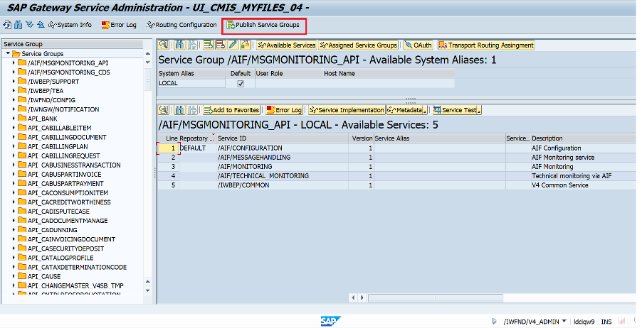
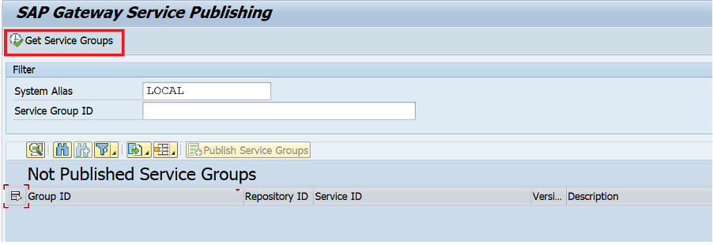
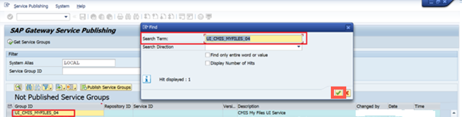
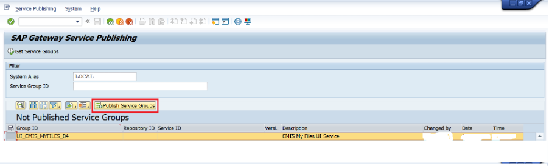
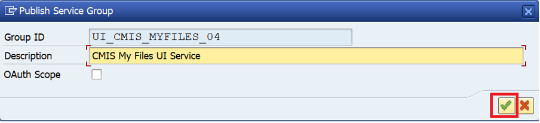
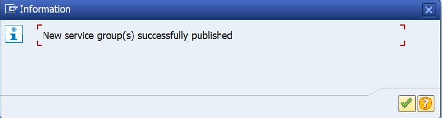

## Prerequisites
 - You've access to the S/4HANA Cloud, public edition backend system
 - You've required authorizations. For more information, see [SAP Gateway Administrator Role](https://help.sap.com/docs/ABAP_PLATFORM_NEW/68bf513362174d54b58cddec28794093/24f82651c294256ee10000000a445394.html?version=202210.002).
 - You've noted down the **System Alias** of your customer system landscape. System aliases must be assigned to a service group to define communication between the **SAP Gateway Foundation** hub system and the backend system.

### You will learn
  - How to publish a service group

> Remember: 
>
-	You can skip this step if you have already published a service group. Services assigned in the backend system to an existing and already published service group are automatically addressable by consumers.
>
- System aliases for OData V4 service groups must be manually created.
 The steps followed in this tutorial completely depend on your system landscape.

---

[ACCORDION-BEGIN [Step 1: ](Run the transaction "/IWFND/V4_ADMIN")]
Navigate to **SAP Gateway Service Administration** via transaction `/IWFND/V4_ADMIN` on the SAP Gateway Foundation Hub and click **Publish Service Groups**.

  !

[DONE]
[ACCORDION-END]

[ACCORDION-BEGIN [Step 2: ](Select system alias)]
On the **SAP Gateway Service Publishing** window, enter the **System Alias** in the respective field.
> **Note:** It is recommended that a System Alias must be used based on your landscape.

  !

[DONE]
[ACCORDION-END]

[ACCORDION-BEGIN [Step 3: ](Get service groups)]
1. Click on **Get Service Groups**. The first service group ID should appear in the list.

    >**Note:** If the group was already published, a message is displayed "Selected service group not found or already published".

    !

2. Find **Service Group ID** as **`UI_CMIS_MYFILES_04`** and select it.

    !

3. Choose **Publish Service Group**.

    !

4. Choose **OK**.

    !

    !

[DONE]
[ACCORDION-END]

[ACCORDION-BEGIN [Step 4: ](Test yourself)]

  [VALIDATE_6]

[DONE]
[ACCORDION-END]

---
