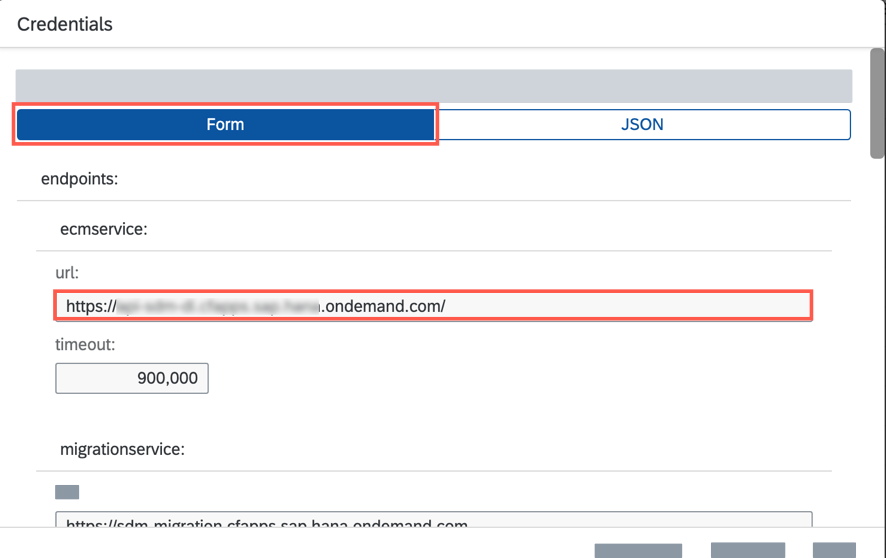
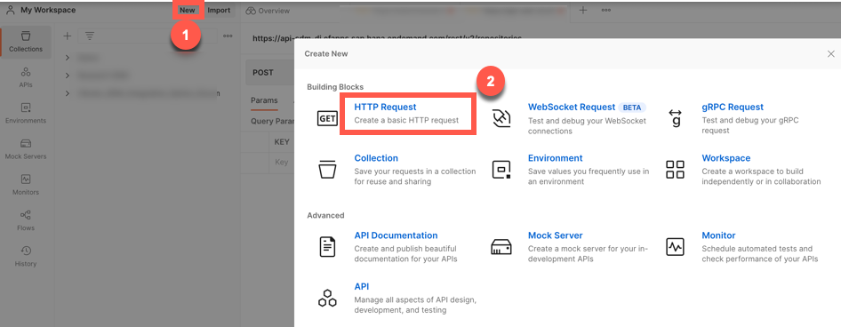
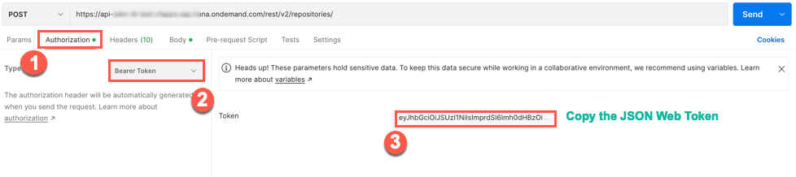
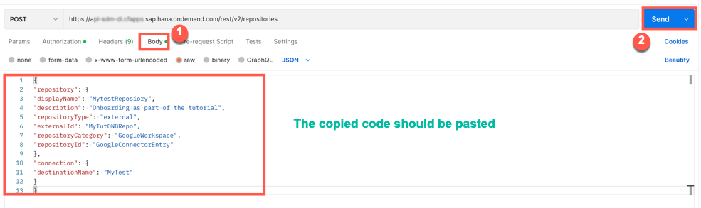
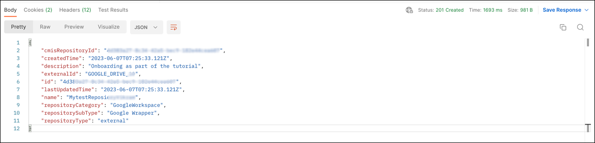

## Prerequisites
 - You've copied the **`ecmservice:url`** value from the service key of Document Management Service, Integration Option. For more information, see the tutorial [Create a Service Instance and then a Service Key of SAP Document Management Service, Integration Option](btp-sdm-gwi-create-serviceinstance).
 - You've copied the **`repositoryId`** and saved it. For more information, see [Find the Repository IDs](https://help.sap.com/docs/document-management-service/sap-document-management-service/create-repository-using-onboarding-api-for-google-drive?locale=en-US&version=Cloud#find-the-repository-ids) and [Steps to Find the ID of a Shared Drive or a Folder](https://help.sap.com/docs/document-management-service/sap-document-management-service/create-repository-using-onboarding-api-for-google-drive?locale=en-US&version=Cloud#steps-to-find-the-id-of-a-shared-drive-or-a-folder)
 - You've generated a JSON Web Token (JWT) that serves as your authorization for making API calls. For more information, see the tutorial [Generating the JSON Web Token (JWT)](btp-sdm-gwi-onbrepo-jwt-token).
 - You've the admin permission for Document Management Service, Integration Option via the **`SDM_Admin`** scope.
 - You've installed the [Postman](https://www.postman.com/downloads/) app.

### You will learn
  - How to onboard a repository using API.

---

[ACCORDION-BEGIN [Step 1: ](Get URL from the service key)]
Copy the `url:` parameter from the generated service key.

  !


[DONE]
[ACCORDION-END]

[ACCORDION-BEGIN [Step 2: ](Get started with onboarding repository)]
1. Open the Postman. Click on **New** and then select **HTTP Request** to open a new tab on Postman to work on.

    !

2. Select the **POST** method and enter the request URL as like this:
    `"url">/rest/v2/repositories`.

    > **Example:**  You must ensure that you are adding the parameter `/rest/v2/repositories` as suffix to the request URL. So that the final sample request URL looks like this: `https://api-abc-de.cfapps.sap.hana.ondemand.com/rest/v2/repositories`

      !

3. Navigate to **Authorization** tab and select the type **Bearer Token**. Enter the JSON web token that you generate in this tutorial [Generating the JSON Web Token (JWT)](btp-sdm-gwi-onbrepo-jwt-token).

    !

4. Navigate to the **Body** tab and copy paste the following code snippet.

    ```JSON
    {
      "repository": {
        "displayName": "MytestReposiory",
        "description": "Onboarding as part of the tutorial",
        "repositoryType": "external",
        "externalId": "MyTutONBRepo",
        "repositoryCategory": "GoogleWorkspace",
        "repositoryId": "GoogleConnectorEntry"
      },
      "connection": {
        "destinationName": "MyTest"
      }
    }
    ```

    >**Note** Please modify the details according to your needs. It is not necessary to follow the same code snippet. A few details, such as display name, and destination names, may change. It is important that you read the Prerequisites again.

    !

    Click **Send**.

5. When a successful response is received, the status is `200 OK`.

    **Results**

    !

[DONE]
[ACCORDION-END]


[ACCORDION-BEGIN [Step 3: ](Test yourself)]

  [VALIDATE_5]

[DONE]
[ACCORDION-END]


---
