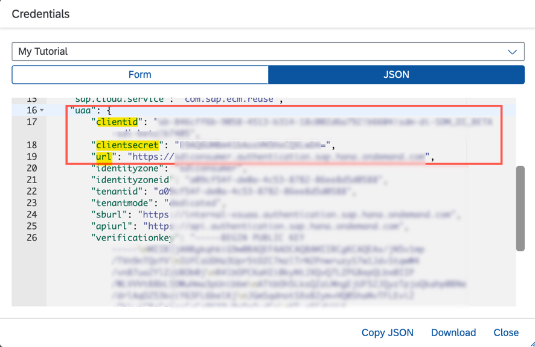
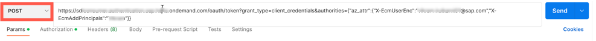
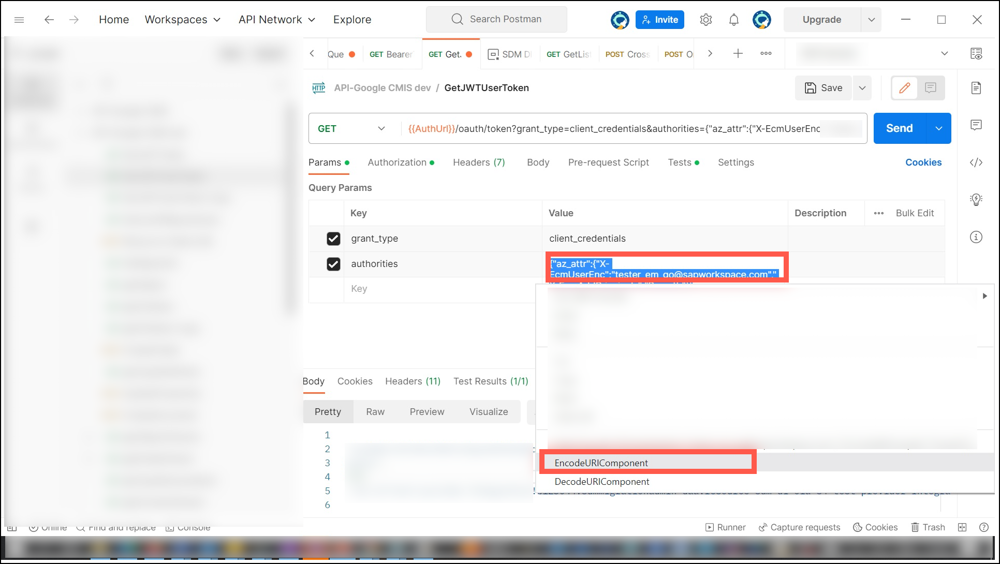

## Prerequisites
 - You've copied the `clientId`, `clientSecret`, and `url` values from the service key of Document Management Service, Integration Option. For more information, see the tutorial [Create a Service Instance and then a Service Key of SAP Document Management Service, Integration Option](btp-sdm-gwi-create-serviceinstance).
 - You need Postman REST client. See [Install Postman REST Client](api-tools-postman-install).

### You will learn
  - How to generate JSON web token

---

[ACCORDION-BEGIN [Step 1: ](Get access token details from your service key )]
You will need the following values from your service key in order to get your JSON web access token.

Navigate to the service that you created in the previous tutorial [Create a Service Instance and then a Service Key of SAP Document Management Service, Integration Option](btp-sdm-gwi-create-serviceinstance).
  !

[DONE]
[ACCORDION-END]

[ACCORDION-BEGIN [Step 2: ](Get JSON web token)]

1. Open the Postman client. Click on **New** and then select **HTTP Request** to open a new tab on Postman to work on.

    !

2. Select the **POST** method and enter the following details:

    1. Copy the `url` from your service key and append this

        ```
        /oauth/token?grant_type=client_credentials&authorities=<AUTHORITIES>
        ```
    2. Verify that your request **URL** looks like the following:

        ```JSON
          "url">/oauth/token?grant_type=client_credentials&authorities={"az_attr":{"X-EcmUserEnc":"abc@xyz.com","X-EcmAddPrincipals":"abc"
        ```

    3. For **AUTHORITIES**, encode the following values:

        ```JSON
            "az_attr":{"X-EcmUserEnc":"<Your BTP user Email ID>","X-EcmAddPrincipals":"<Your first name>"
        ```

        !

      4. For encoding, you need to select all the values in the **authorities** field, right click and select the option **EncodeURIComponent**.

        !


3. Navigate to **Authorization** tab and enter the following:

    |  Field Name     | Value
    |  :------------- | :-------------
    |  Type | **`Basic Auth`**
    |  Username | **`clientId`**
    |  Password | **`clientSecret`**

    Click **Send**.

    !

4. When a successful response is received, the status is `200 OK`. Copy the  `access_token` and save it in a secure area.

    !


[DONE]
[ACCORDION-END]


[ACCORDION-BEGIN [Step 3: ](Test yourself)]

  [VALIDATE_5]

[DONE]
[ACCORDION-END]


---
