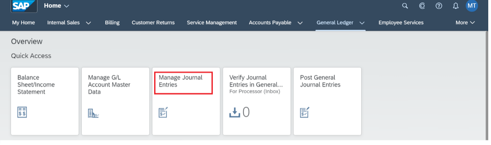
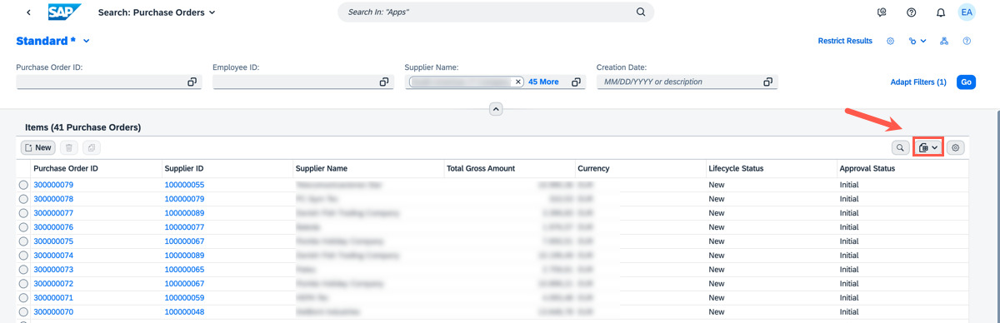
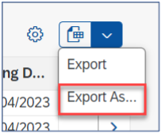
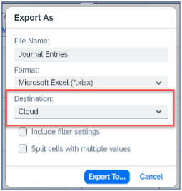
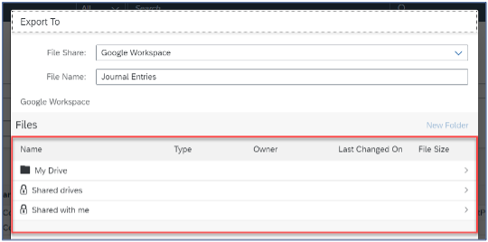
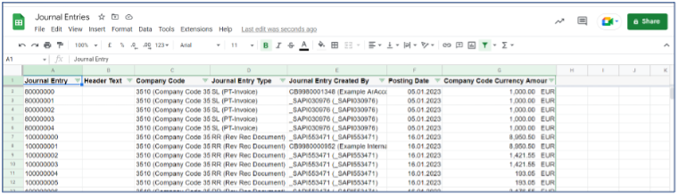

## Prerequisites

- You've an account in the Google Workspace.
- You've necessary privileges for SAP S/4HANA Cloud, public edition.

### You will learn

- How to export data from SAP UI (User Interface) tables.

---
[ACCORDION-BEGIN [Step 1: ](Access your application )]
Log on to your S/4HANA Cloud, public edition. Open the **Manage Journal Entries** or **Purchase Orders** or any other applications that is offering a table-based export.

  !

[DONE]
[ACCORDION-END]

[ACCORDION-BEGIN [Step 2: ](Export table details)]
1. The user interface of an application that offers a table base export looks like this: You can use any such application which gives the option to export a table. *This tutorial uses the Purchase Orders application*.

    !

2. Navigate to the drop-down menu (you'll have to figure out this option in your application). Click on **Export As**.

    !

3. Check if the destination option is available, select **Cloud** and click on **Export To**.

    !

4. Check if the entries in the file browser window are loaded (like folders and files are visible).

    !

5. Select a folder and click **Export**. If prompted enter the Google Workspace credentials of the user and then the exported data shall be visible in Google Sheets.

    !

[DONE]
[ACCORDION-END]
