## Prerequisites
 - You've access to SAP S/4HANA Cloud, public edition with admin privileges.

### You will learn
  - How to create a new business role
  - How to maintain restrictions

---

[ACCORDION-BEGIN [Step 1: ](Create business role)]

1. Logon to your SAP S/4HANA Cloud, public edition. Search for **Maintain Business Roles** app.

    !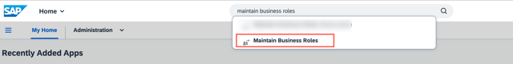

2. Click on **New** at the bottom of the screen.

    !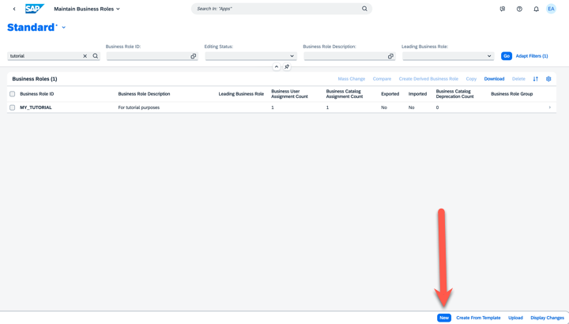

3. In the **New Business Role** window, enter the following details:

    |  Field Name     | Value
    |  :------------- | :-------------
    |  Business Role ID | **`FOR_TUTORIAL`**
    |  Business Role Description | **`For tutorial purposes`**

      !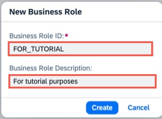

4. Choose **Create**.

[DONE]
[ACCORDION-END]

[ACCORDION-BEGIN [Step 2: ](Add business catalog)]

1. Navigate to **Assigned Business Catalogs** tab and select **Add**.

    !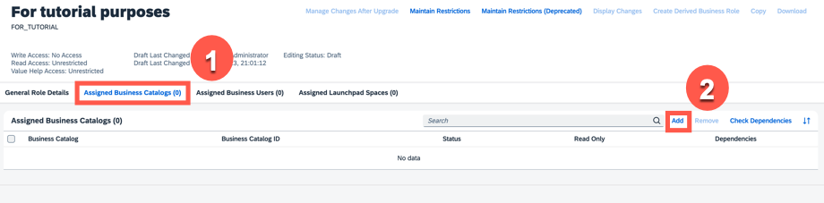

2. Search for `file management`, select `File Management - My Files` and click **Apply** and **OK**.

    !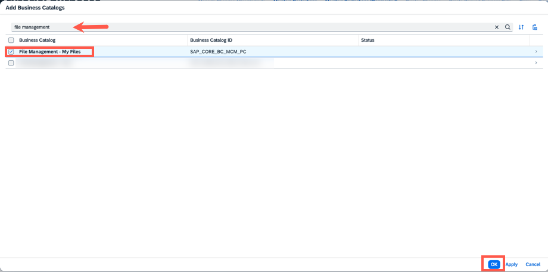

[DONE]
[ACCORDION-END]

[ACCORDION-BEGIN [Step 3: ](Maintain restrictions)]

1. In the same business role, select **Maintain Restrictions**.

    !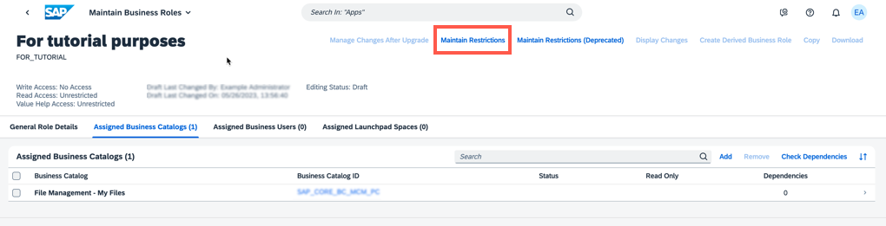

2. Select **Access Categories** from the left-side navigation menu and maintain the following values:

    |  Field Name     | Value
    |  :------------- | :-------------
    |  Write, Read, Value Help | **`Restricted`**
    |  Read, Value Help | **`Restricted`**

    !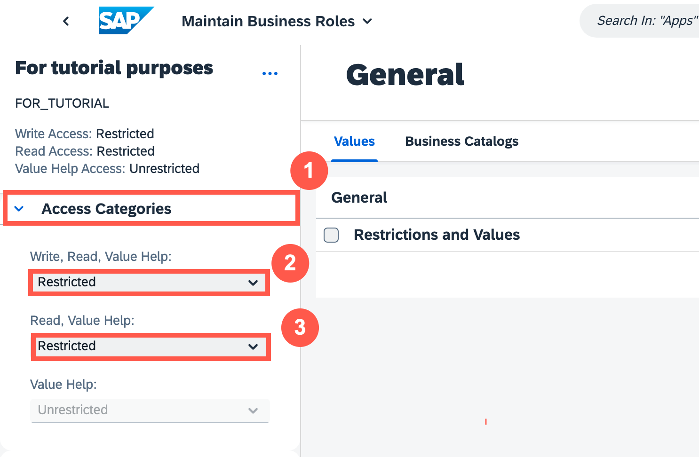

3. Select **Assigned Restriction Types** and choose `File Share Content`.

    !

4. In the **Restrictions and Values** section, enter the following details.  

    |  Field Name     | Value
    |  :------------- | :-------------
    |  File Share Type | **`2`**
    |  File Share ID | **`ZTEST`**
    |  File Share Content Group | **`Unrestricted Access`**

    >**Remember**: During the process of creating a communication system, you maintained **File Share ID** value. Please make sure the same **File Share ID** is being used.

    File Share Type

      !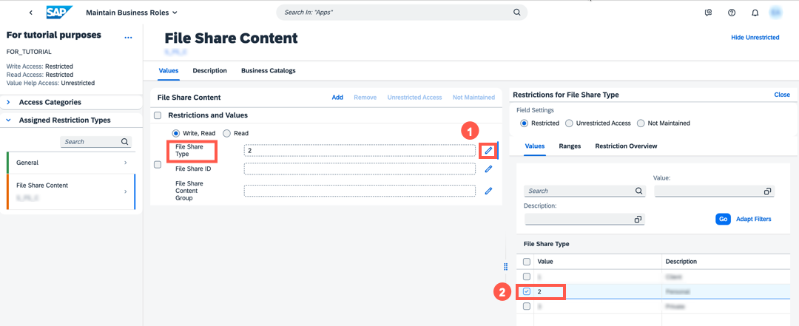

    File Share ID

      !

    File Share Content Group  

      !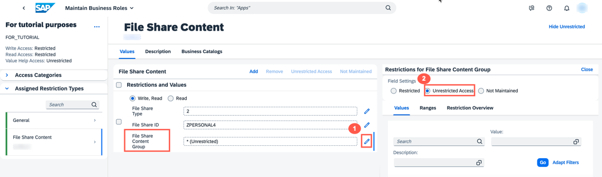

[DONE]
[ACCORDION-END]

[ACCORDION-BEGIN [Step 4: ](Add business user)]

1. Select **Assigned Business Users** and click **Add**.

    !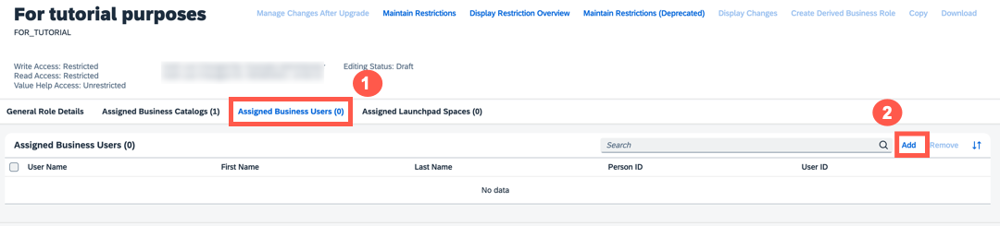

2. Search for your **User Name**, select it and click **Apply** and **OK**.
    >A username that you have maintained. Please select the valid username you have used in both SAP BTP and S/4HANA Cloud, public edition.

    !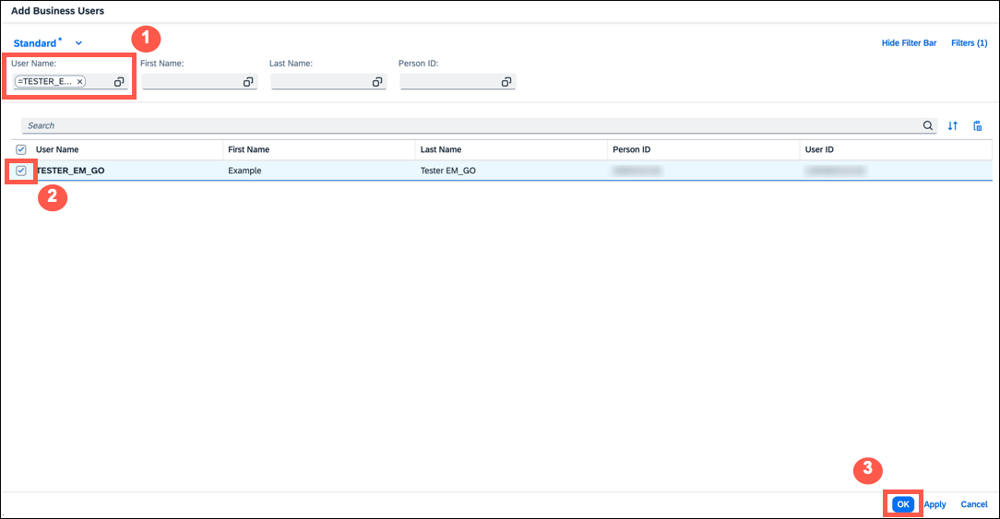

3. Choose **Save**.

    !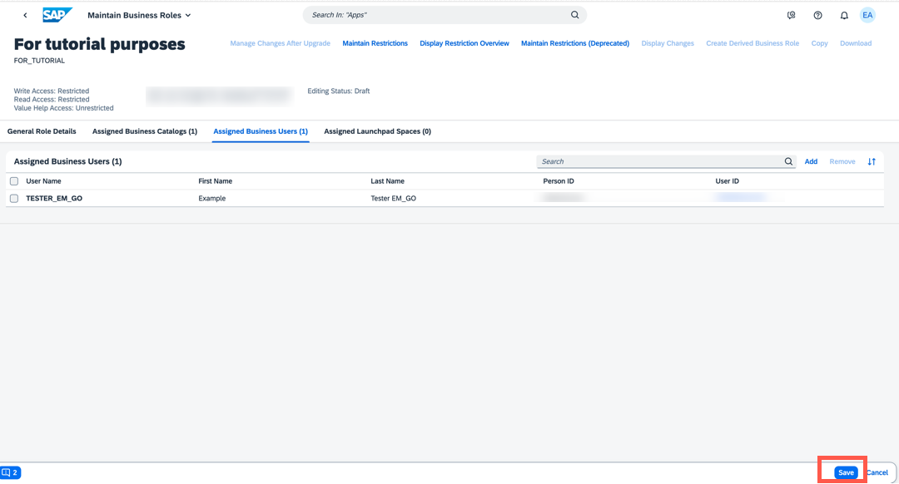

[DONE]
[ACCORDION-END]

[ACCORDION-BEGIN [Step 5: ](Test yourself)]

  [VALIDATE_6]

[DONE]
[ACCORDION-END]

---
