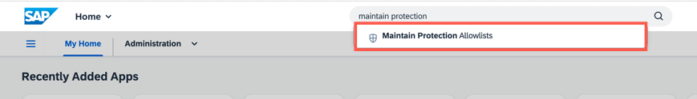
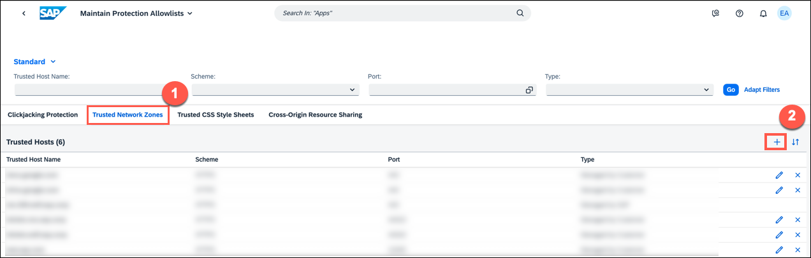
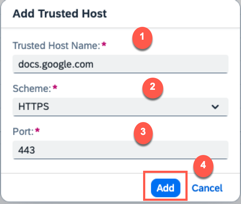

## Prerequisites
 - You've an admin access to SAP S/4HANA Cloud, public edition.

### You will learn
- How to maintain protection allow list on SAP S/4HANA Cloud, public edition.

---

[ACCORDION-BEGIN [Step 1: ](Log into SAP S/4HANA Cloud)]
  Log on to SAP S/4HANA Cloud, public edition and search for the **`Maintain Protection Allowlists`** app from the SAP Fiori Launchpad.
  !

[DONE]
[ACCORDION-END]

[ACCORDION-BEGIN [Step 2: ](Create trusted network zone)]
  Navigate to the **Trusted Network Zones** tab and click **(+) Create**.

   !

[DONE]
[ACCORDION-END]

[ACCORDION-BEGIN [Step 3: ](Manage details)]
1. In the **Add Trusted Host** dialog, add the following details:

    |  Field Name     | Value
    |  :------------- | :-------------
    |  Trusted Host Name | **`docs.google.com`**
    |  Scheme | **`HTTPS`**
    |  Port | **`443`**

      !

2. Choose **Add**

[DONE]
[ACCORDION-END]

[ACCORDION-BEGIN [Step 4: ](Test yourself)]

  [VALIDATE_6]

[DONE]
[ACCORDION-END]
