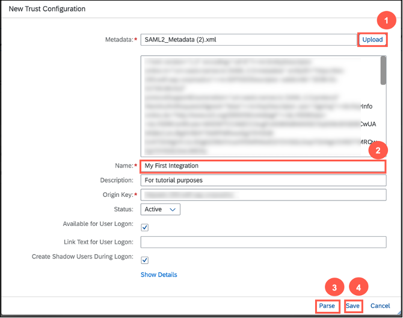
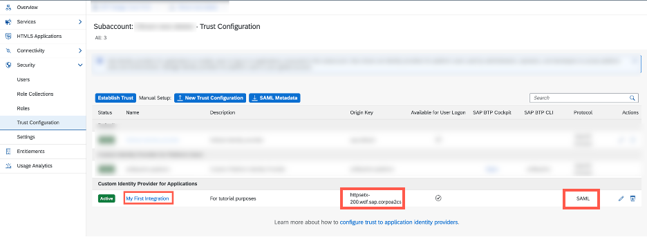
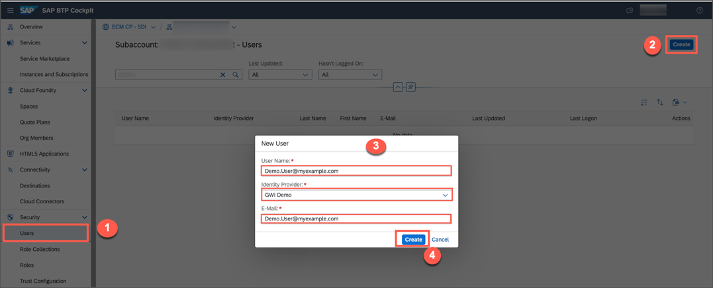

## Prerequisites
 - You've access to the SAP BTP subaccount and have necessary admin privileges.
 - You've access to the SAP S/4HANA Cloud, public edition system.
 - You've access to the Google Workspace Account. For more information, see [Configure Service Account in Google Cloud Platform](https://help.sap.com/docs/IRPA/1154f48dd7ab430ea52badeb4359e4b4/40baf1a31fad4e86892795f7fe59d971.html).

## You will learn
  - How to configure trust between SAP S/4HANA Cloud, public edition and SAP BTP system.
  - How to manage trust configurations between SAP S/4HANA Cloud, public edition and SAP BTP.

---

[ACCORDION-BEGIN [Step 1: ](Download SAML2.0 metadata from SAP S/4HANA cloud)]
1. Log in to SAP S/4HANA Cloud, public edition with the required admin privileges. Search for **Communication Systems**.

    !

2. Find the Communication System by using the filter **Own SAP Cloud System = Yes**.  You can see the list of Communication Systems and choose the relevant one.

    !

3. Once you open the details of Communication System, Click on **Download SAML2.0 Metadata**. An **`*.xml`** file gets downloaded to your local system.

    !


[DONE]
[ACCORDION-END]

[ACCORDION-BEGIN [Step 2: ](Create trust configuration)]
1. Log on to your BTP Subaccount and navigate to the **Trust Configuration** option in the left side menu and click **New Trust Configuration**.

    !

2. In the **New Trust Configuration** window that opens, upload the **`SAML2.Metadata.xml`** that you downloaded in the previous step (Reference: `Step 1.3`), and enter the name of your choice. Click on **Parse** and **Save**.  

    !

3. Verify the trust configuration by clicking on the recently created trust configuration in the above step (Reference: `Step 2.2`).

    !

4. Click on **Show Details** and ensure that the *Subject* and *Issuer* provided are correct.

    !

    !


[DONE]
[ACCORDION-END]


[ACCORDION-BEGIN [Step 3: ](Add users in SAP BTP)]

1. Navigate back to the SAP BTP Cockpit home screen and go to the **Users** tab. Click **Create**.

    In the **New User** dialog, enter the **Username**, select the newly created **Identity Provider**, add the email address of the user, and click **Create**.

    !

    >**IMPORTANT**: The e-mail address of the user must be identical to the one used in the SAP S/4HANA system. The mail address can be identified using the Maintain Business User or Manage Workforce option.

2. Select the newly created user from the list and click on **Assign Role Collection**.

    !

3. Assign the user role collection of the **SAP Document Management Service, Integration Option** (For example, `SDM_roles` or the role collection that you created) which is defined in the subaccount. For more information, see the 3rd step in this tutorial [Create a Service Instance and then a Service Key of SAP Document Management Service, Integration Option](btp-sdm-gwi-create-serviceinstance).

    !

[DONE]
[ACCORDION-END]

[ACCORDION-BEGIN [Step 4: ](Download SAML metadata from SAP BTP cockpit)]

1. In the same subaccount, navigate to the **Trust Configuration** and click **SAML Metadata**. A metadata file gets downloaded to your local system.

    !

2. Go to the file in your explorer and right-click on the downloaded file in your local system from the previous step.  Open it with any editor (like **Notepad, Notepad++, Code, Sublime Text, etc.**) scroll down to the bottom of the file to get the token endpoint and copy the URL that is located at the string:

    ```JSON
      <md:AssertionConsumerService Binding="urn:oasis:names:tc:SAML:2.0:bindings:URI" Location="https://example.com"index="1"/>
    ```
    !

[DONE]
[ACCORDION-END]

[ACCORDION-BEGIN [Step 5: ](Test yourself)]

[VALIDATE_2]

[DONE]
[ACCORDION-END]


---
