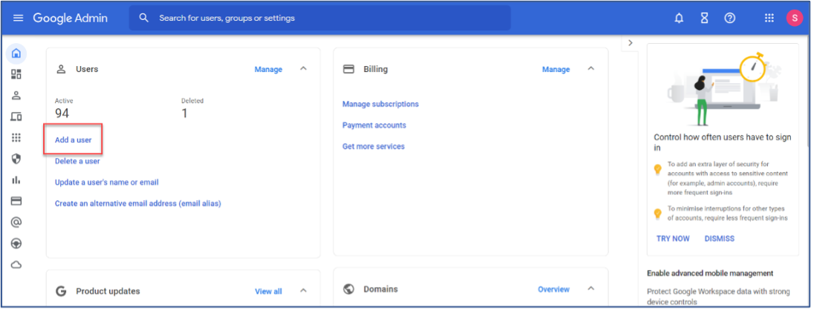
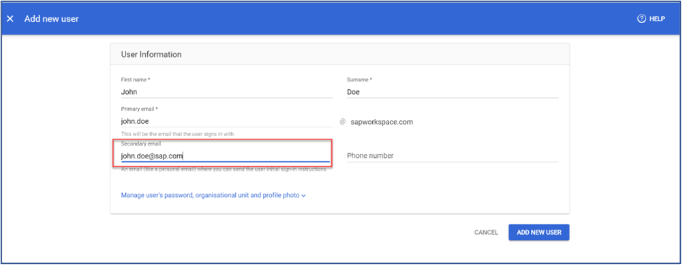

## Prerequisites
 - To complete the Google Workspace integration, you need a Google Workspace account. For more information, see Setting Up a Google Workspace Account
 - You've necessary administrator privileges.

### You will learn
  - How to add users to the Google Workspace admin console.
  - How to manage user information.

> **Tip**: You can skip this tutorial if you have already created a user in the Google Workspace console. If it has not yet been created, follow these steps:

---

[ACCORDION-BEGIN [Step 1: ](Add User)]
1. Log in to your **Google Workspace** account using *`admin.google.com`* and click on **Add a User**.

    !

2. Enter the **User Information** and specify the password for your user.

    !

[DONE]
[ACCORDION-END]

[ACCORDION-BEGIN [Step 2: ](Test yourself)]

[VALIDATE_6]

[DONE]
[ACCORDION-END]

---
