# Getting Started with SAP Document Management Mobile Application
<!-- description --> The SAP Document Management Service mobile app is available for both Android and iOS platforms. This robust application brings the functionality of the SAP Document Management Service to your fingertips, wherever you may be. This tutorial will guide you through the onboarding steps, enabling you to integrate the SAP Document Management Service mobile app within your own Document Management Service, Application Option user interface. Furthermore, you will learn how to effectively manage and control the application features using the SAP Mobile Services cockpit, enhancing overall efficiency and productivity.

## Prerequisites
 - You've access to the SAP BTP subaccount.
 - You've subscribed to the service **Document Management Service, Application Option** in the SAP BTP cockpit. For more information about the initial setup, see [Subscribing to Document Management Service, Application Option](https://help.sap.com/docs/document-management-service/sap-document-management-service/subscribing-to-document-management-service-application-option?locale=en-US&version=Cloud).
 - You've necessary administrator privileges and included the role **`SDM_MobileAdmin`** into your account.
 - You've assigned **`SDM_User`** role to the users who are required to use the mobile application. 
 
## You will learn
  - How to subscribe to SAP Document Management Service, Application Option
  - How to access the QR code from the SAP Mobile Services cockpit.
  - How to onboard mobile applications.
  - How to sync your repositories.

---
### Check entitlements
>Note: If you have already added the entitlements, you can skip this step. 

1. Enter your **Global Account** &rarr; **Account Explorer**.
   
2. In the **Subaccounts** tab, choose your subaccount. 
   
    <!-- border -->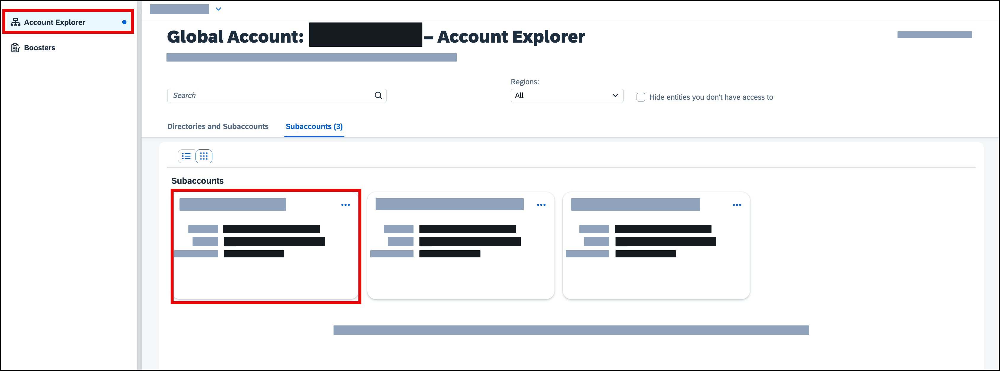

3. Click on **Entitlements** and choose **Configure Entitlements**(For new account) or **Edit** (For existing account). 

    <!-- border -->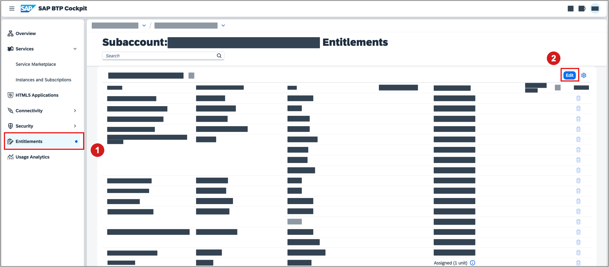

4. Click on **Add Service Plans** to see all available entitlements.

    <!-- border -->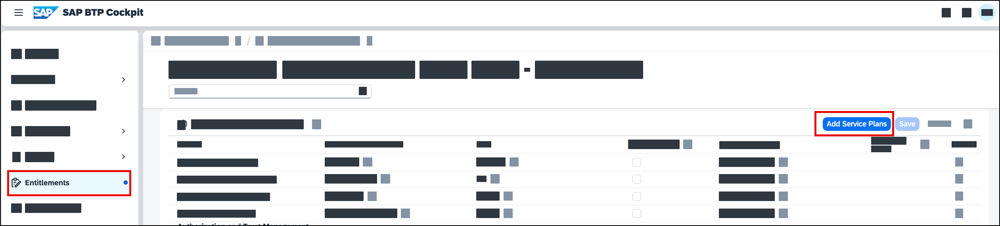

5. Use the filter bar to search for **`Document Management`** to reduce the number of available entitlements. Click the checkbox to select the service plan **'Standard'**. Finally, confirm your selection by clicking on **`Add 1 Service Plan`**.

    <!-- border -->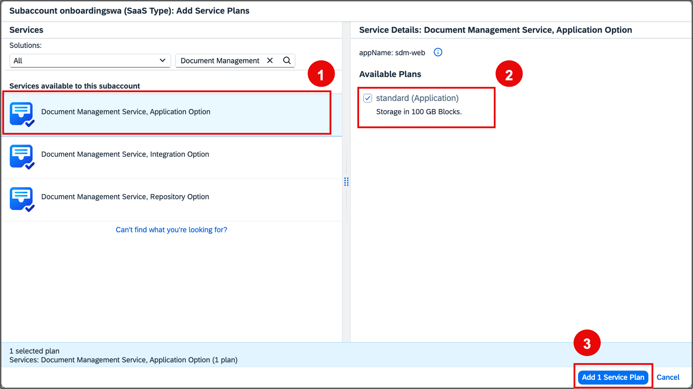

6. Choose **Save** to confirm your selection. 
    
    <!-- border -->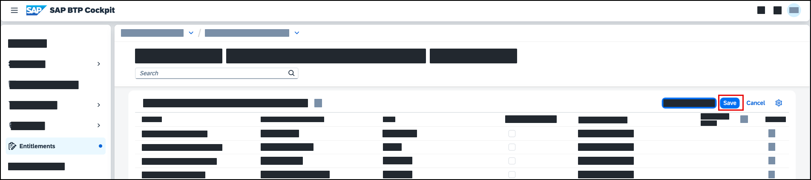

### Subscribe to SAP Document Management Service, Application Option
>Note: If you have already subscribed to the service, you can skip this step. 

1. Click **Service Marketplace** on the side navigation pane, search for **Document Management Service, Application Option**, and click tile.

    <!-- border -->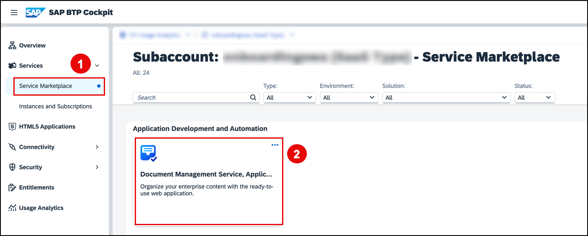

2. Click **Create**.

    <!-- border -->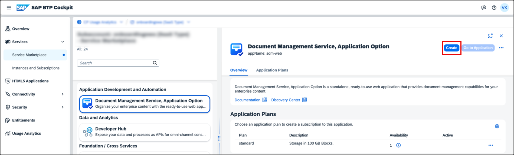
    
3. In the dialog, choose the **`Standard`** subscription plan and click **Create**.

    <!-- border -->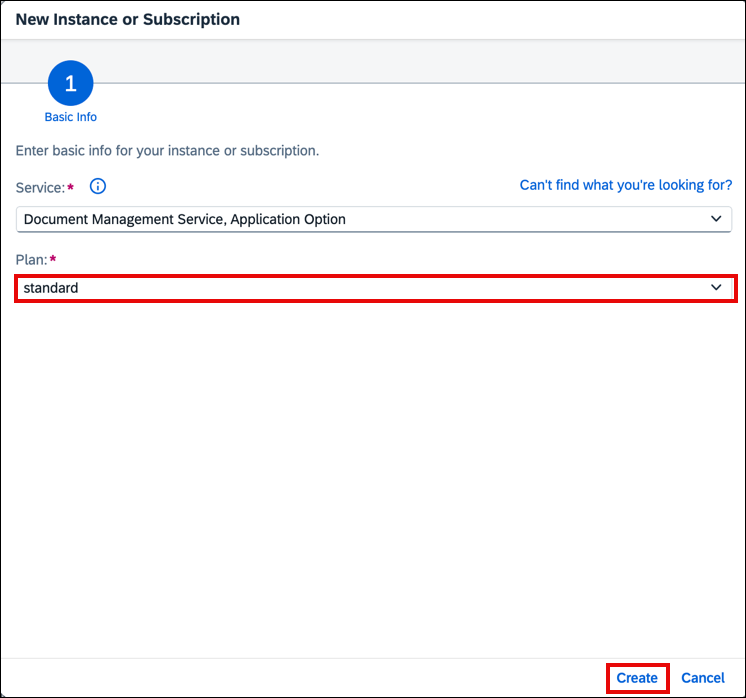

4. Your subscription is being set up. To review your existing subscriptions, choose **View Subscription**.

    <!-- border -->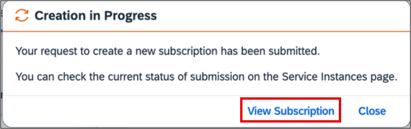

### Assign roles
To use the application, ensure that your user account is associated with a role collection that provides the necessary permissions.

1. Open the SAP BTP cockpit and navigate to your subaccount.

2. Choose **Security** &rarr; **Role Collections**, and then choose **Create**.
    
    <!-- border -->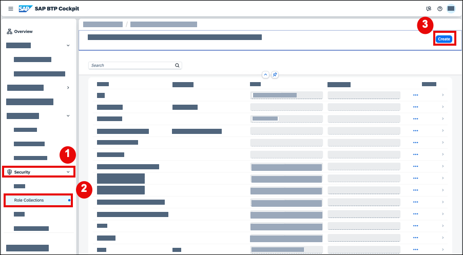

3. In the **Create Role Collection** dialog, enter **`Mobile Admin`** in the **Name** field and choose **Create**.

    <!-- border -->

4. Choose the role collection **`Mobile Admin`** from the list of role collections and choose **Edit** on the right.

    <!-- border -->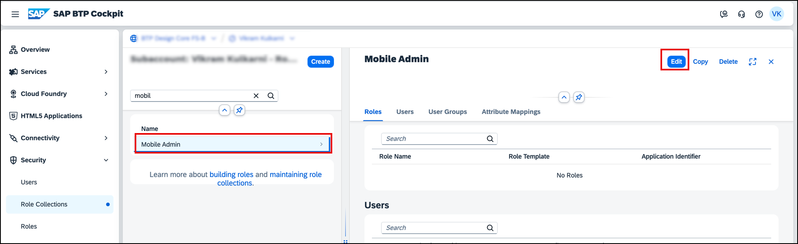

5. Open the value help in the **Role Name** field. 

    <!-- border -->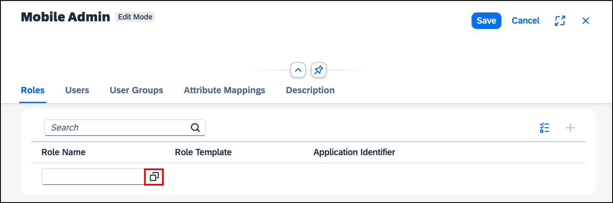

6. Search for the role **`SDM_MobileAdmin`** and **`SDM_User`**, select it, and choose **Add**.
   
    <!-- border -->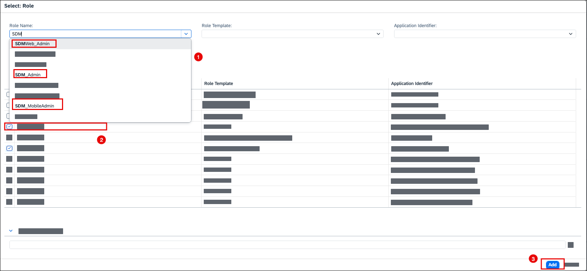

7. Choose **Save**. 
   

### Assign role collection to a user

1. Choose **Security** &rarr; **Users**, and then choose a user from the available list. 

2. Under **Role Collections** on the right, choose **Assign Role Collection**.

    <!-- border -->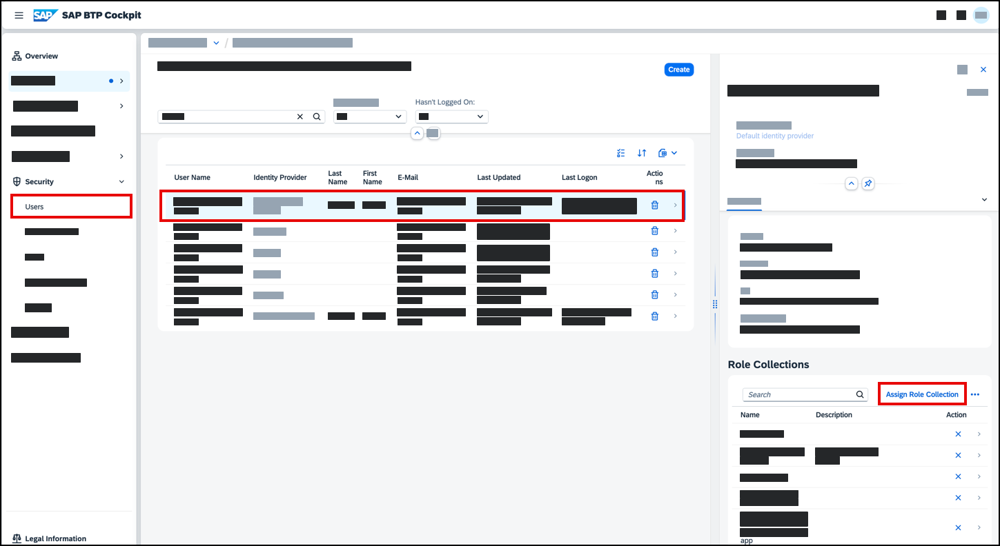

3. In the **Assign Role Collection** dialog, select the **Mobile Admin** role collection and choose **Assign Role Collection**.

    You have now assigned the **Mobile Admin** role collection to your user.

    >Note: You might need to log out and log back in to make sure your new role collection is taken into account.

### Creating a repository

1. In your subaccount, navigate to **Services** &rarr; **Instances and Subscriptions**, click the button next to **Document Management Service, Application Option**.

    <!-- border -->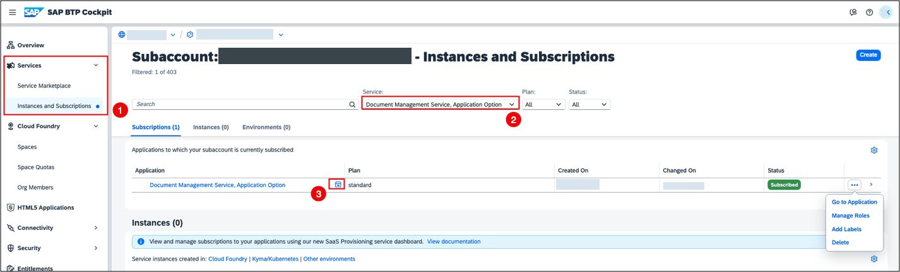

2. Log on and click the **Document Management Service Admin**.

    <!-- border -->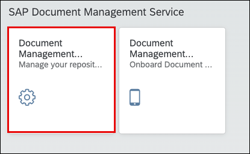

3. Click **Add Repository**.

    <!-- border -->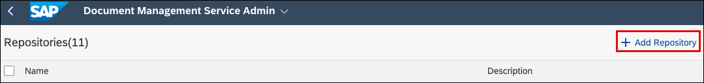

4. Choose **Internal** as a Repository Type, enter the **Display Name** of your choice, and click **Add**. 

<!-- border -->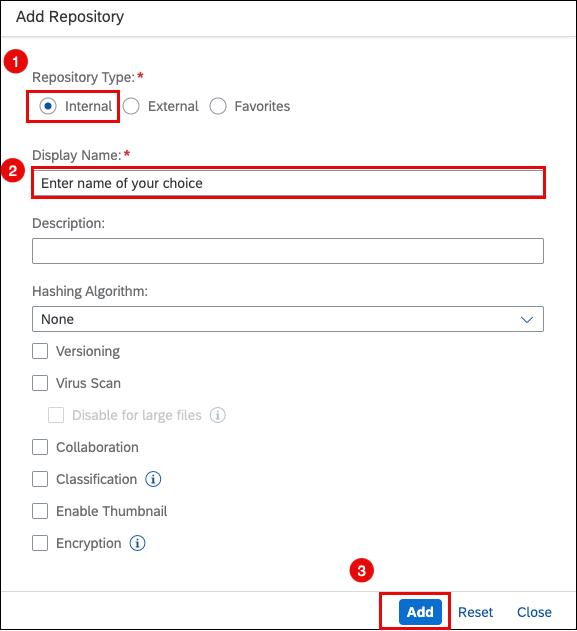

>The repository you've set up will be available for access via the mobile application in the subsequent steps.

### Go to the application and access the QR code

1. In your subaccount, navigate to **Services** &rarr; **Instances and Subscriptions**, click the button next to **Document Management Service, Application Option**.

    <!-- border -->

2. Log on to the application.

3. Click the **Document Management Service Mobile Admin** tile.
    
    <!-- border -->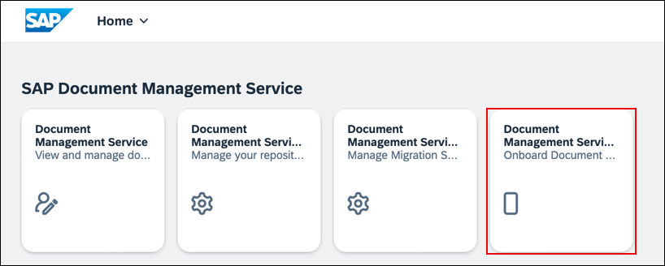

4. On the Getting Started page, click **Start Onboarding**.

    <!-- border -->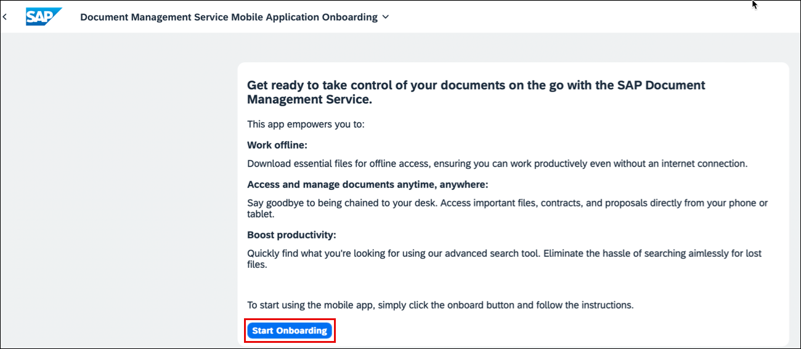

5. Click **Mobile Services Cockpit**.

    <!-- border -->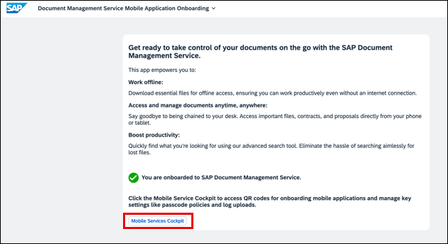

6. Navigate to the **APIs** tab.

    <!-- border -->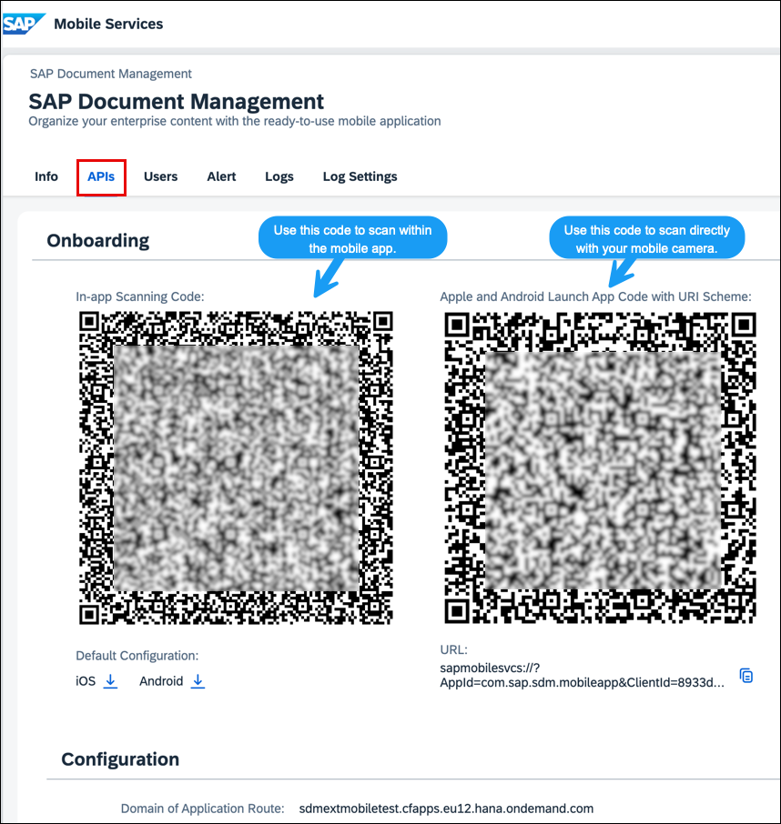

>**Results:** You've accessed the QR code. Keep this tab open and proceed with the next step.

### Installing mobile application
<!-- description --> In this step, you are installing the mobile application on your device.
>>**Note:** If you are planning to test the mobile app with the different users, it's required to assign the role of **`SDM_User`** to the respective users within the SAP BTP subaccount.

1.  Download the app. For iOS devices, go to the [App Store](https://apps.apple.com/in/app/sap-document-management/id6504613204). For Android devices, visit the [Google Play Store](https://play.google.com/store/apps/details?id=com.sap.sdm.mobileapp&hl=en_IN&gl=US).

2.  Start the app. 

3.  Click **Agree**. 

    <!-- border -->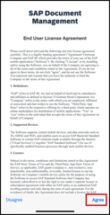

4.  On your device, choose **Scan**. 

    <!-- border -->

5.  Scan the QR code from the previous step to proceed.
   
    <!-- border -->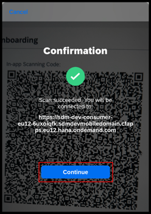

6. Choose **Continue**. 
   
    <!-- border -->

    >**Results**: A repository that you created in the earlier steps is displayed.

7. To refresh the list manually, pull down on the list and release it.
    
    <!-- border -->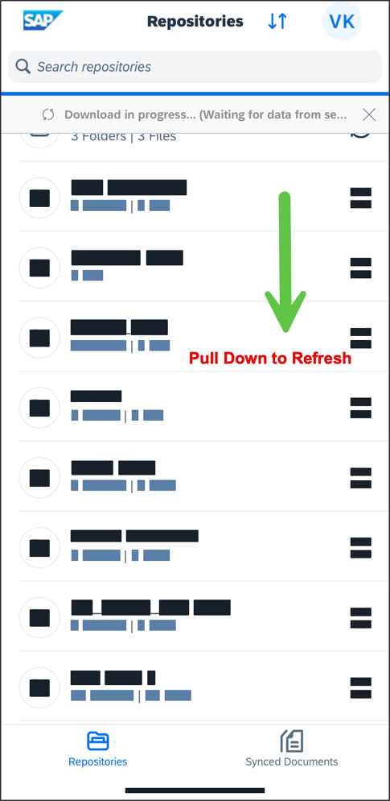

   
