# Transport an SAP Fiori Application using SAP Continuous Integration and Delivery and SAP Cloud Transport Management 
<!-- description --> Configure the SAP BTP services SAP Continuous Integration and Delivery and SAP Cloud Transport Management to build and deploy changes to an SAP Fiori application across a staged development and test landscape.

## Prerequisites

 - You have an SAP BTP account. If you don't have one, create an SAP BTP trial account following the tutorial [Get an Account on SAP BTP Trial](hcp-create-trial-account). The tutorial shows the steps in SAP BTP Trial.
 - You've set up SAP Cloud Transport Management service in a central administrative subaccount. If you haven't done that, follow the tutorial [Get Started with SAP Cloud Transport Management](btp-transport-management-getting-started). You need a subscription to SAP Cloud Transport Management and an instance of the service.
    If you've set up the SAP Cloud Transport Management in an SAP BTP Trial account as described in that tutorial, you can follow the steps of the current tutorial, as it builds on that setup.  
 - You have an account on [GitHub](https://github.com). You will need it to fork the [Bookshop Sample Repository](https://github.com/SAP-samples/cap-bookshop-wdi5) that serves as the source code repository for your SAP Fiori application.
 
## You will learn

   - How to use SAP Business Application Studio to clone an existing SAP Fiori application and make changes to it.
   - How to set up the SAP Continuous Integration and Delivery service to build the modified application and transfer it to SAP Cloud Transport Management service.  
   - How to configure SAP Cloud Transport Management service so that you can import the app into another subaccount. 
   
---


### Introduction

In this tutorial, you work with the following entities:

- **SAP BTP global account and subaccounts**: You have a source (DEV), and a test (trial) subaccount, as well as a central administrative (Central Services) subaccount.  
- **Git repository on GitHub**: It contains the SAP Fiori application (Bookshop app) that you want to transport. You clone the repository to SAP Business Application Studio, and connect it to SAP Continuous Integration and Delivery service.
- **SAP Business Application Studio (DEV Subaccount)**: Your development environment, connected to the Git repository. You use it to push source code changes to the repository.  
- **SAP Continuous Integration and Delivery service (Central Services subaccount)**: Monitors the Git repository for source code changes. When changes are detected, it automatically runs the configured pipeline, which builds an MTAR file from the source code and exports it to SAP Cloud Transport Management service. 
- **SAP Cloud Transport Management service (Central Services subaccount)**: Deploys a transport request available in the import queue of **trial**.   
    
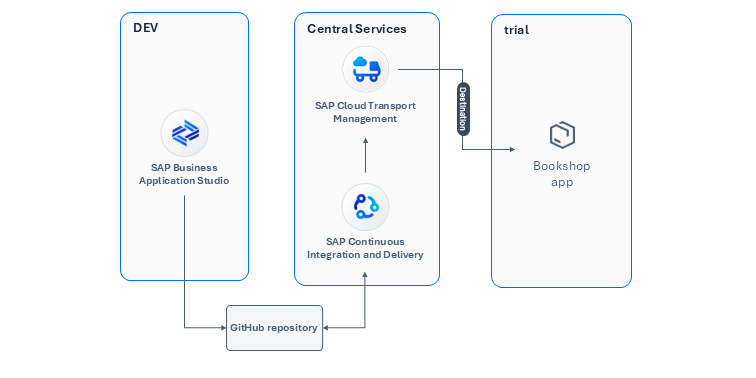
    

You'll complete the following tasks:

1. **Prepare your environment**: Create a new subaccount, assign entitlements, subscribe to SAP Business Application Studio and SAP Continuous Integration and Delivery, configure required roles, set up a destination for SAP Cloud Transport Management, and fork the Bookshop sample Git repository containing the SAP Fiori application source code. 
2. **Set up the CI/CD and transport infrastructure**: Configure a CI/CD pipeline and a transport landscape.
3. **Develop and deploy changes**: Make development changes in SAP Business Application Studio, push them to the Git repository, automatically trigger the CI/CD pipeline, and generate a transport request. Deploy the changes to your target trial subaccount.
  
     

### Create new DEV Subaccount

In this step, you create a new **DEV** subaccount in the SAP BTP Trial global account, enable Cloud Foundry, and create a space.


>If you work in SAP BTP Trial, use the **DEV** subaccount as the development subaccount, and the default **trial** subaccount as the target subaccount. The following steps show the creation of the **DEV** subaccount. 

1. In the Account Explorer of your SAP BTP Trial global account, choose **Create > Subaccount**.

    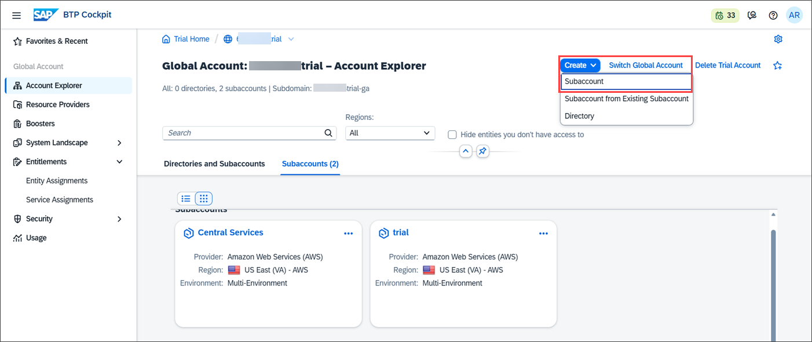

2. In the **Create Subaccount** dialog, enter a name, here `DEV` (1), select a region, here `US East` (2), and choose **Create** (3).

    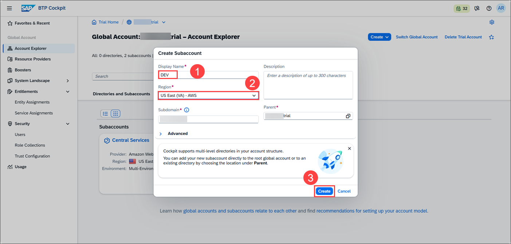

3. Open the new subaccount and choose **Enable Cloud Foundry**.

    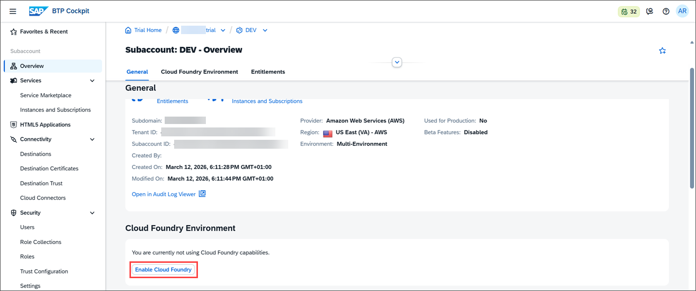

4. In the **Enable Cloud Foundry** dialog, choose **Create**.

    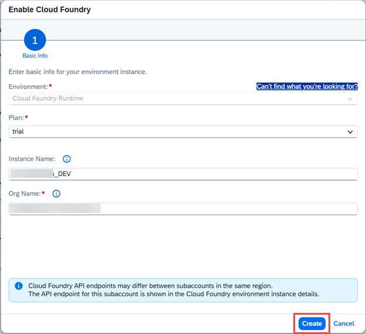

5. Create a space in the Cloud Foundry org. Choose **Create Space**.

    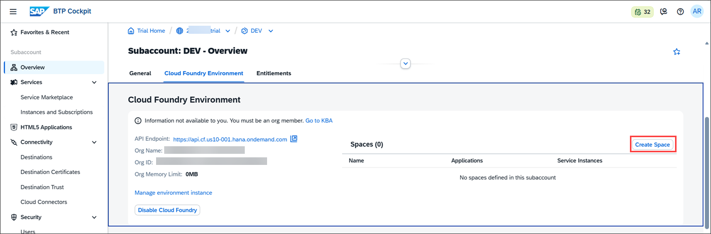

6. In the **Create Space** dialog, enter a space name, here `DEV` (1), and choose **Create** (2).

    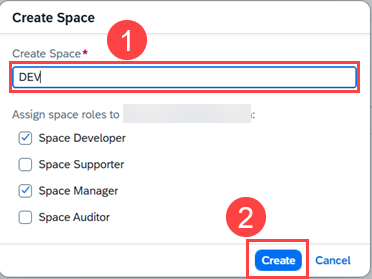

    >If you want to create another subaccount, for example, a PRD subaccount, you can proceed accordingly. However, this is not possible in SAP BTP trial. The **trial** subaccount is the only subaccount that can be used to deploy the app.
    
    The result looks as follows: You have a **Central Services** subaccount where you've subscribed to SAP Cloud Transport Management service, and where you will subscribe to the Continuous Integration and Delivery service. Additionally, you have the **DEV** subaccount for app development and the **trial** subaccount for deploying and testing the app. 

    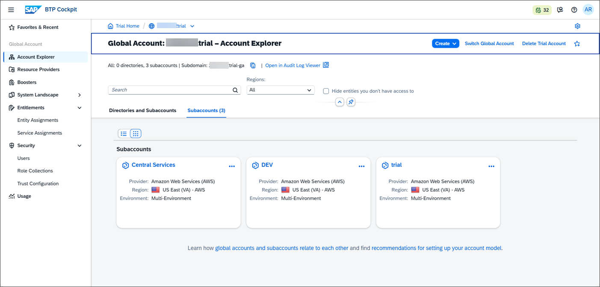

More information: [Managing Subaccounts Using the Cockpit](https://help.sap.com/docs/BTP/65de2977205c403bbc107264b8eccf4b/55d0b6d8b96846b8ae93b85194df0944.html)

### Subscribe to SAP Business Application Studio

In this step, you entitle the **DEV** subaccount to use SAP Business Application Studio and subscribe to it.

1. In the **DEV** subaccount, go to **Entitlements** (1). Filter for `Business` to verify that there's no entitlement for SAP Business Application Studio (2). Choose **Edit** (3).

    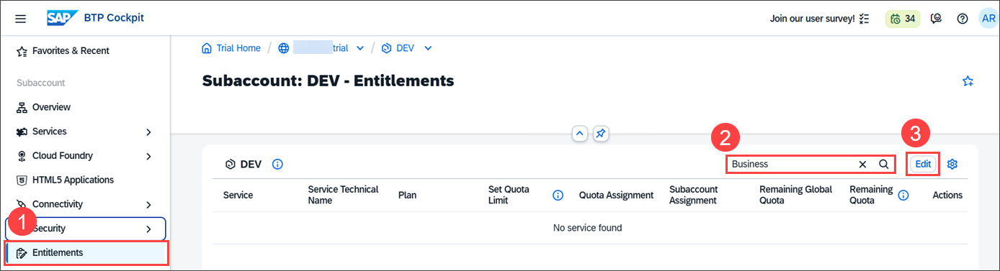

2. Choose **Add Service Plans**.

    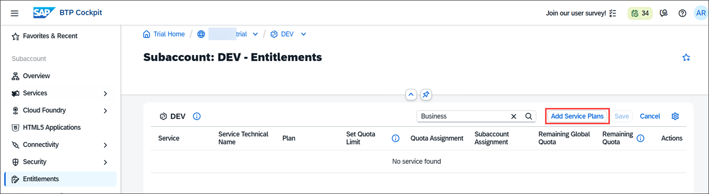

3. In the **Add Service Plans** dialog, enter `SAP Business` to filter the entries (1). Select **SAP Business Application Studio** (2). Select the **trial (Application)** plan (3), and choose **Add 1 Service Plan** (4).

    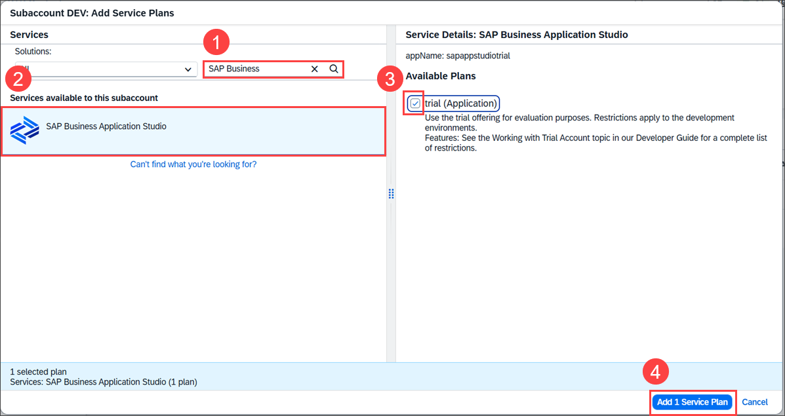

4. The entitlement for SAP Business Application Studio is now added to the subaccount. Choose **Save**.

    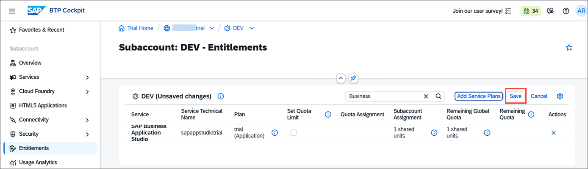

5. The entitlement is saved.

    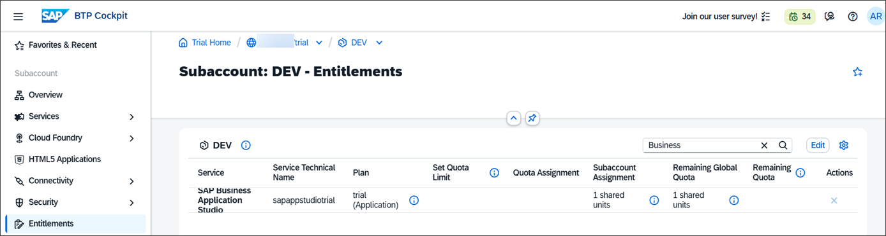

6. To subscribe to the service, go to **Services > Service Marketplace** (1). Find **SAP Business Application Studio**, and choose **Create** from its context menu (2).

    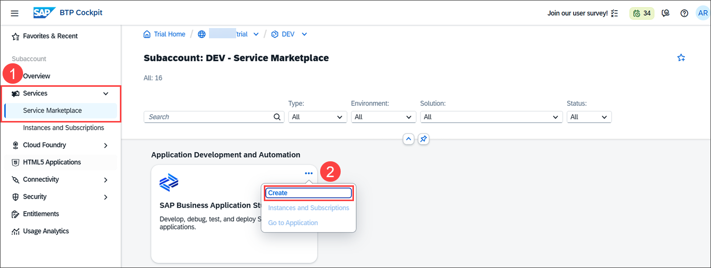

7. In the **New Instance or Subscription** dialog, the service and plan are pre-selected. Choose **Create**.

    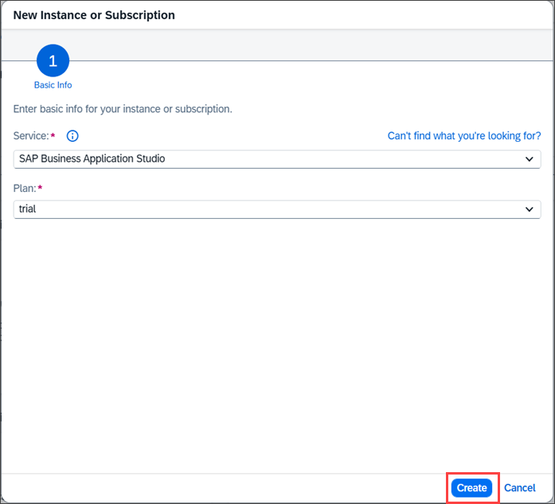

8. When the subscription is finished, SAP Business Application Studio shows the status **Subscribed**.

    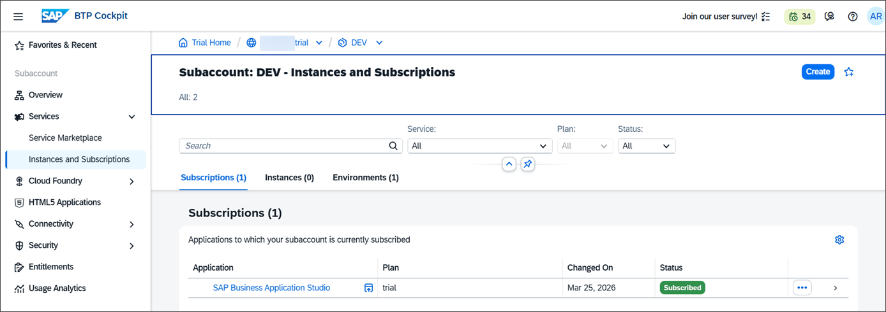

>In general, to use the service, you need to grant the required user permissions `Business_Application_Studio_Developer` to your user as described in [Manage Authorizations and Roles](https://help.sap.com/docs/bas/sap-business-application-studio/manage-authorizations-and-roles?version=Cloud). If you run the tutorial in SAP BTP trial, however, the subaccount administrator role in DEV is sufficient for the purpose of the tutorial.   
     
More information: [Set Up SAP Business Application Studio](https://help.sap.com/docs/bas/sap-business-application-studio/getting-started?version=Cloud)


### Subscribe to SAP Continuous Integration and Delivery

In this step, you subscribe to SAP Continuous Integration and Delivery in the **Central Services** subaccount. If you are using SAP BTP trial, the **trial** subaccount is entitled for SAP Continuous Integration and Delivery by default. You first need to move the entitlement from **trial** to **Central Services**.

1. In the global account, choose **Entitlements > Entity Assignments** (1). Choose the subaccounts selector icon (2).

    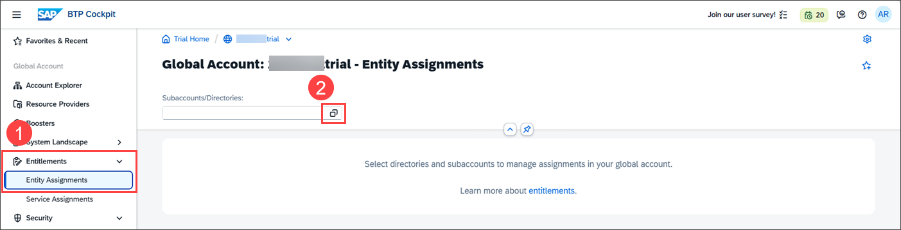

2. In the **Select Subaccounts and Directories** dialog, select the **Central Services** and **trial** subaccounts (1). Choose **Select** (2).

    >It's sufficient to select only **Central Services** and **trial**. However, the following screenshots show all three subaccounts selected.  

    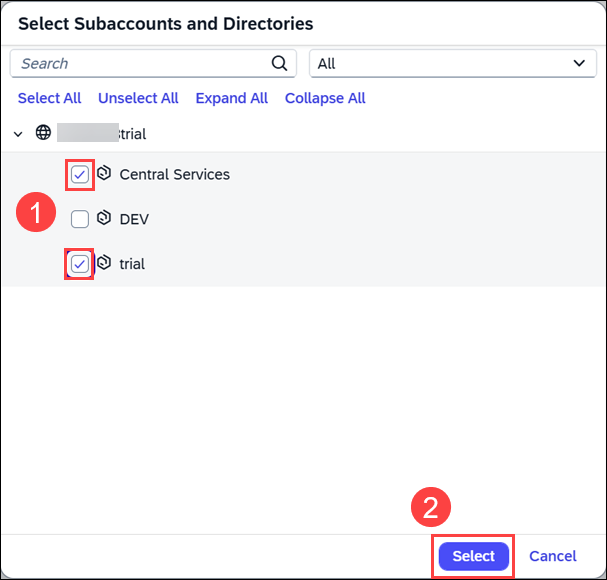

3. In the **Entity Assignments** view, filter for `continuous` in both subaccounts (1) to verify that there's an entitlement to *Continuous Integration & Delivery* service in the **trial** subaccount. Choose **Edit** for **trial** (2).

    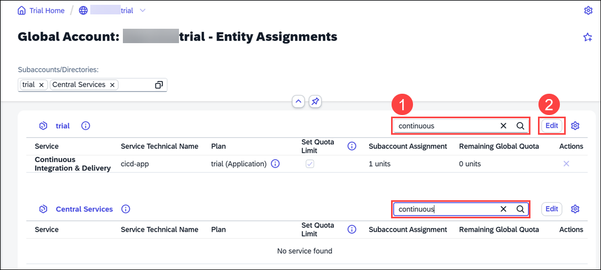

4. To remove the *Continuous Integration & Delivery* service plan assignment, choose the **×** in the **Actions** column.

    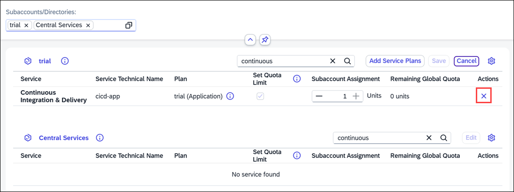

5. Choose **Save** to confirm the removal of the entitlement from the **trial** subaccount.

    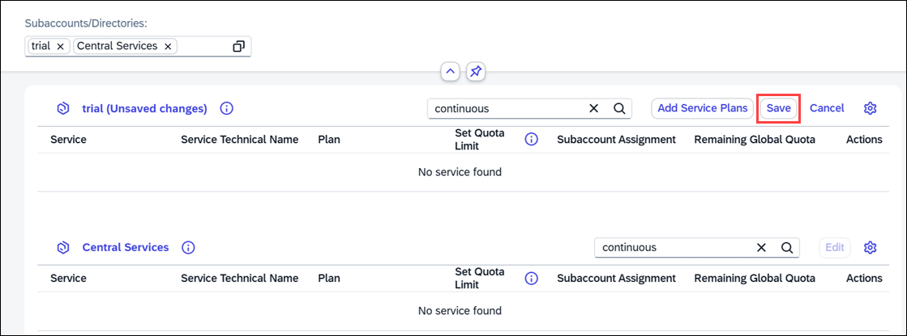

6. Now assign the entitlement to the **Central Services** subaccount. Choose **Edit** for **Central Services** (1).

    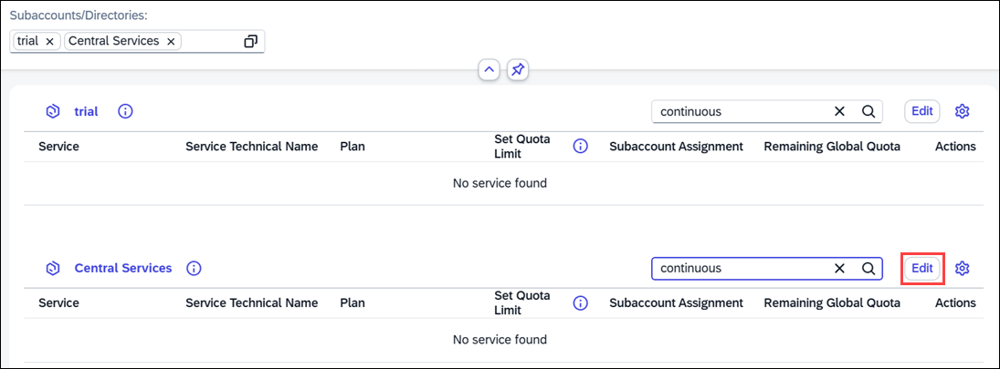

7. Choose **Add Service Plans**.

    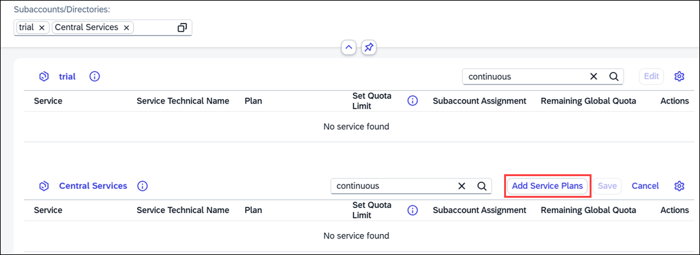

8. In the **Add Service Plans** dialog, enter `continuous` (1). Select **Continuous Integration & Delivery** from the list (2). Select the **trial (Application)** plan (3), and choose **Add 1 Service Plan** (4).

    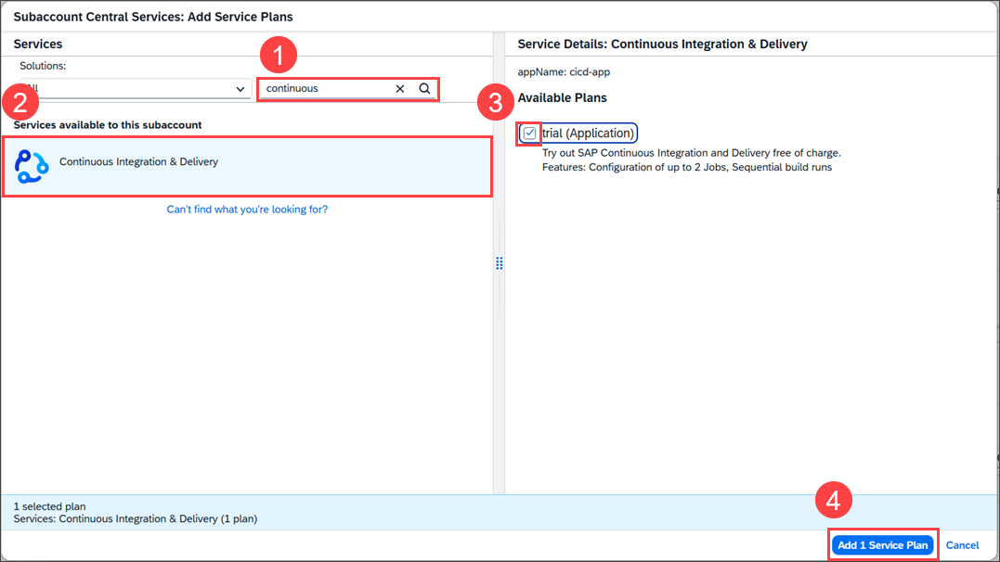

9. Choose **Save** to confirm adding the entitlement to the **Central Services** subaccount.

    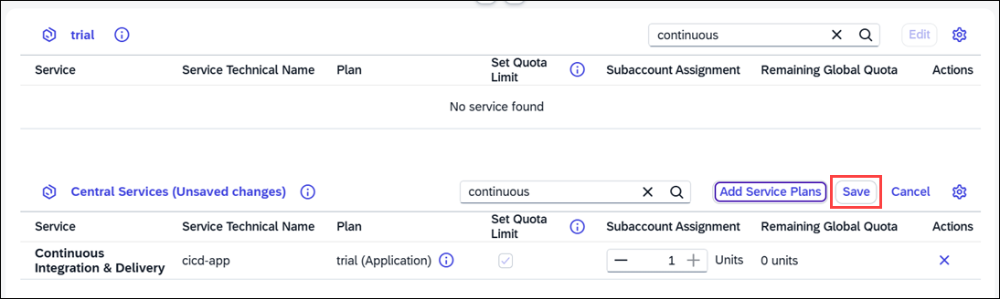

    You can now subscribe to SAP Continuous Integration and Delivery.

10. In the **Central Services** subaccount, choose **Services > Service Marketplace** (1). In the **Search** field, enter `Continuous` (2). From the context menu on the tile, choose **Create** (3). 

    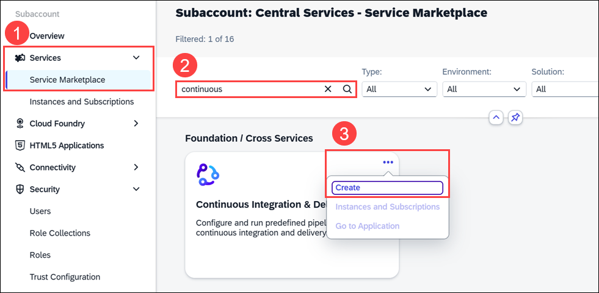

11. In the **New Instance or Subscription** dialog, keep the **trial** plan selected, and choose **Create**.
   
    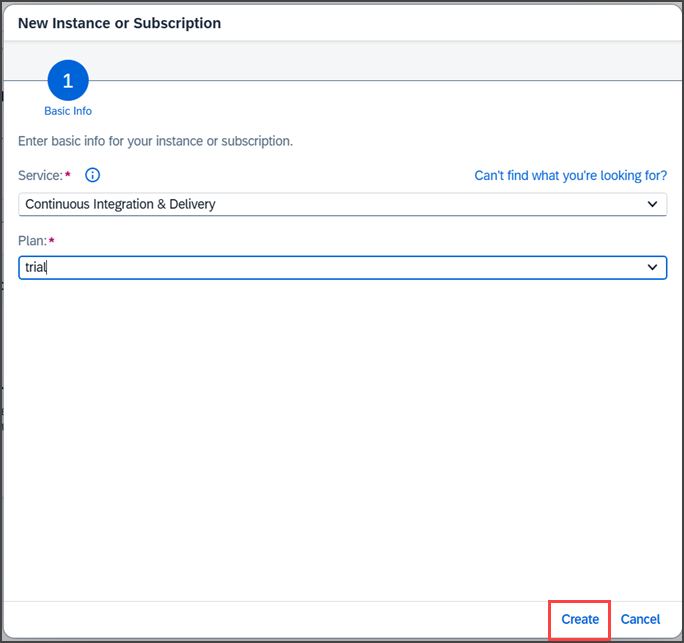

    You are now subscribed to SAP Continuous Integration and Delivery.
   
    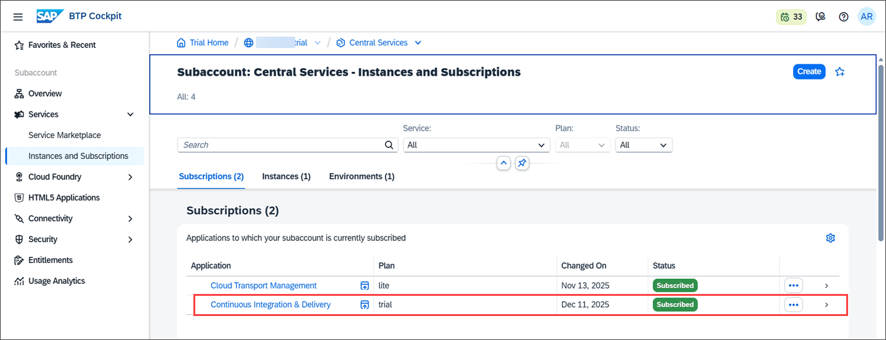

Before you proceed to the UI of the service, assign the required role collections to your user and the users who will work with it.

More information: [Enabling the Service](https://help.sap.com/docs/CONTINUOUS_DELIVERY/99c72101f7ee40d0b2deb4df72ba1ad3/c8ed09df9ebd4556ae2375feac829c24.html)

### Assign Role Collections for SAP Continuous Integration and Delivery

In this step, you assign the required role collections to your user so that you can access SAP Continuous Integration and Delivery.

1. From the navigation pane, choose **Security > Users** (1). Choose your user name (2). In the details view of your user, select the **Role Collections** tab (3). Choose **Assign Role Collection** (4). 

    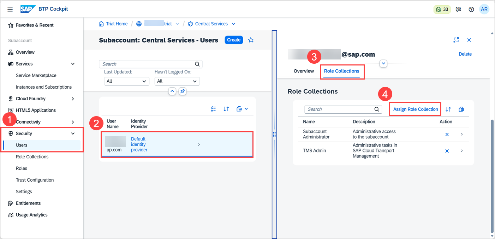

2. From the role collection list, select **CICD Service Administrator** and **CICD Service Developer** (1). Confirm your choice with **Assign Role Collection** (2).

    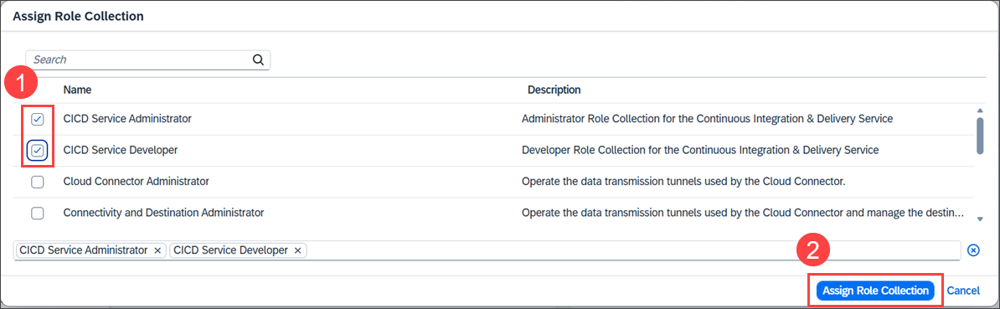

More information: [Assigning Roles and Permissions](https://help.sap.com/docs/CONTINUOUS_DELIVERY/99c72101f7ee40d0b2deb4df72ba1ad3/c679ebdbe76142bd9fb1071e5e53511d.html)

You've completed the configuration steps for SAP Continuous Integration and Delivery. In the next step, you prepare the source code repository that you will use for the app development. Afterwards, you will go to SAP Continuous Integration and Delivery service to add this repository and create a pipeline.

### Prepare Source Code Repository for App Development

In this step, you fork the GitHub [Bookshop Sample Repository](https://github.com/SAP-samples/cap-bookshop-wdi5) so that it is available for cloning in SAP Business Application Studio in a later step.

1. Log in to your GitHub account and go to the [Bookshop Sample Repository](https://github.com/SAP-samples/cap-bookshop-wdi5) on GitHub. On the main page of this repository, choose **Fork** on the top right.

    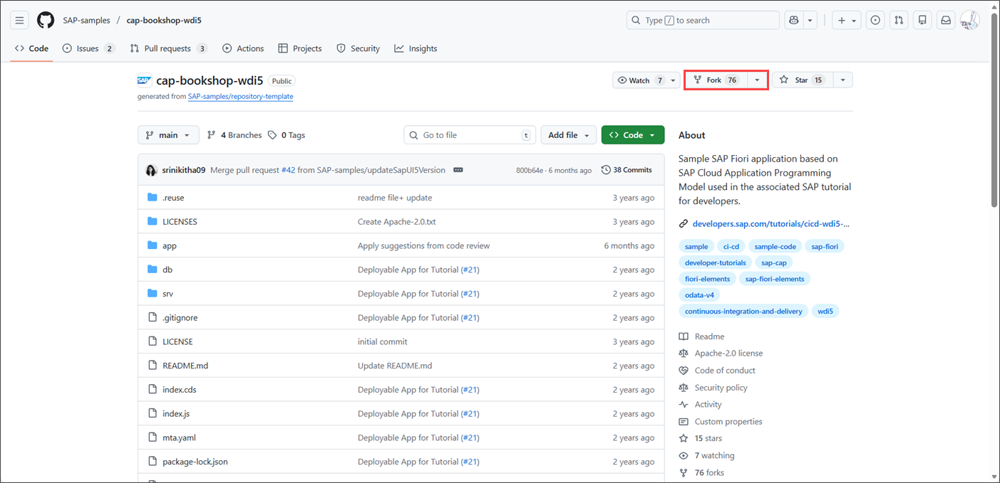

2. Select an **Owner** that matches the GitHub account that you want to use for this tutorial (1).  You can leave all other information unchanged. Select **Create fork** (2).

    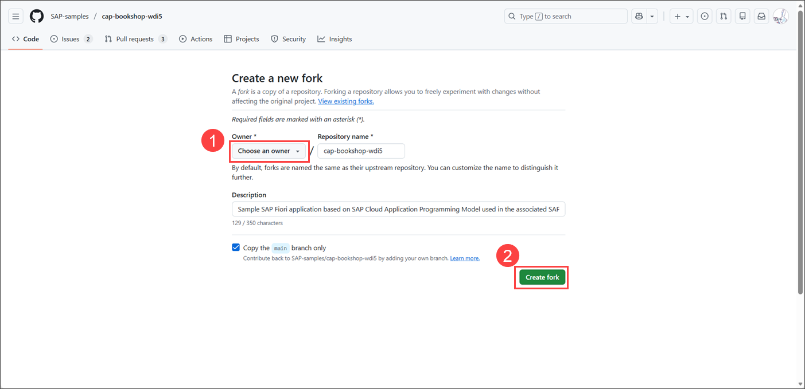

More information: [Working with forks](https://docs.github.com/en/pull-requests/collaborating-with-pull-requests/working-with-forks)

### Add GitHub Repository to SAP Continuous Integration and Delivery

In this step, you add the forked GitHub repository to SAP Continuous Integration and Delivery to prepare it for pipeline setup.
    
1. In your **Central Services** subaccount, go to **Services > Instances and Subscriptions** (1). To open the service's user interface, select **Continuous Integration & Delivery** in the **Subscriptions** overview (2).

    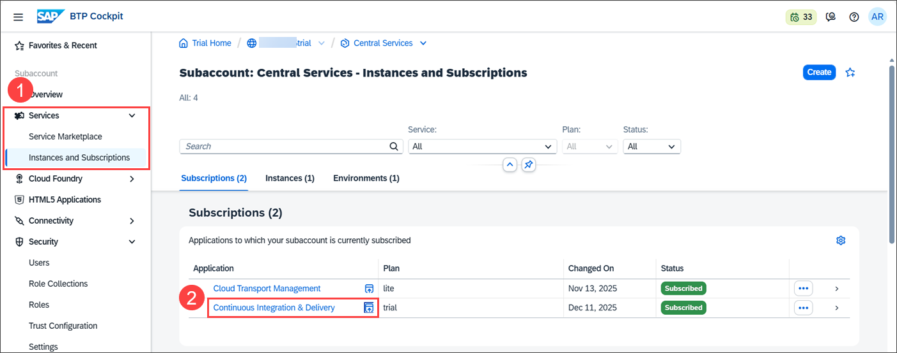

2. The user interface opens on the **Jobs** tab, which is initially empty. Select the **Repositories** tab. No repositories are connected. To connect the SAP Continuous Integration and Delivery service with the forked repository, choose the **+ (Add repository)** button.

    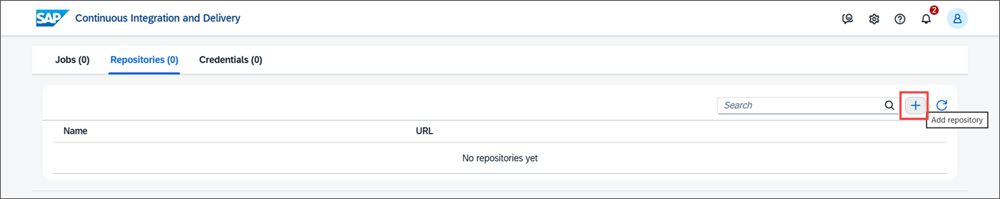

3. Before you continue adding the repository in SAP Continuous Integration and Delivery, go to the forked **Bookshop** repository on GitHub, and copy the clone URL that you will need in the next step. Choose **<> Code** (1) and the **Copy URL to Clipboard** button (2).

    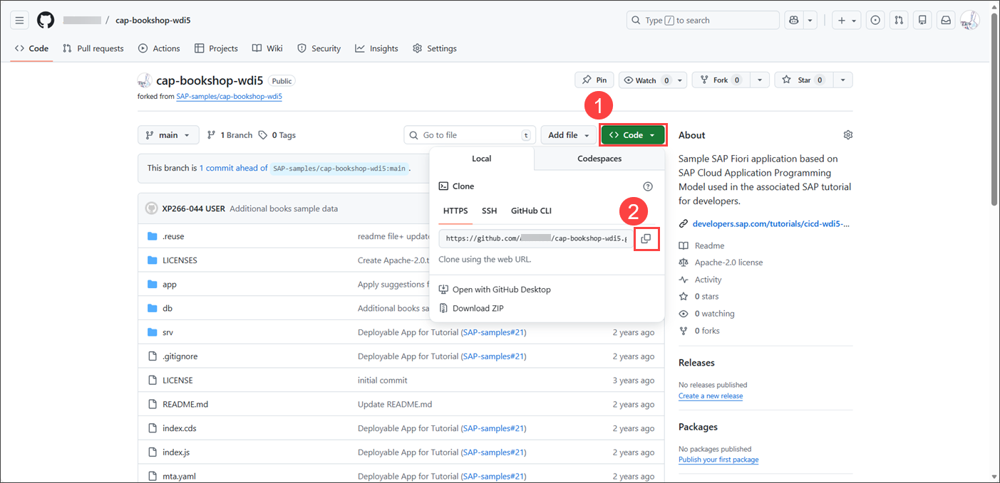

4. Back in the **Add Repository** dialog in SAP Continuous Integration and Delivery service, enter a **Name** for the repository, here `BookshopSample`, and paste the **Clone URL** you just copied.

    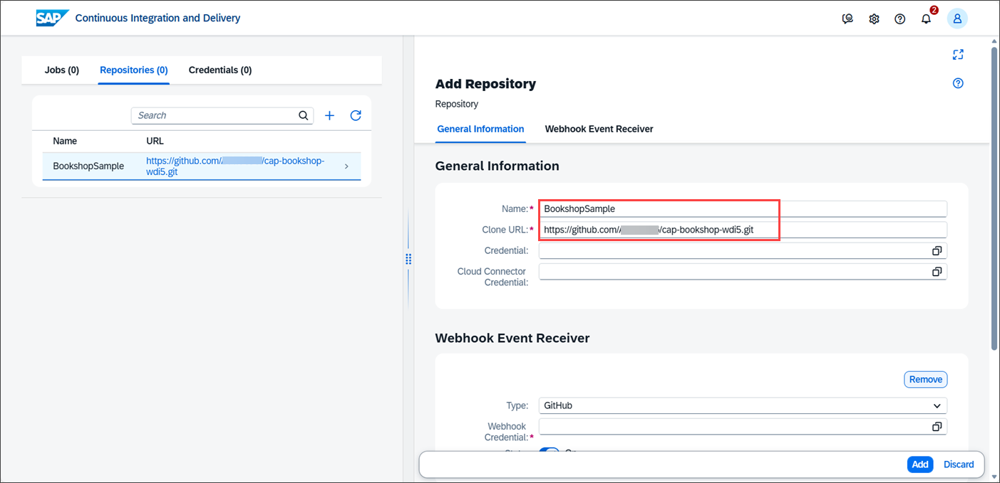

    Don't close the dialog yet. In the next step, you'll add a GitHub webhook credential.

5. To create a webhook credential, in the **Webhook Event Receiver** section, choose the multiselect button.

    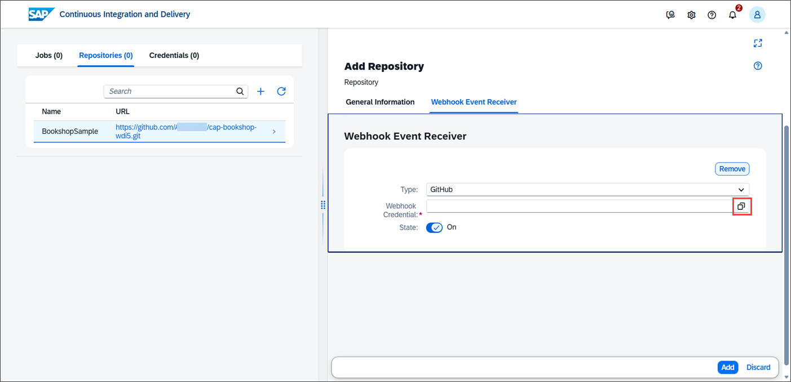

6. The **Select Credentials** dialog opens. Choose **+ (Create credentials)**.

    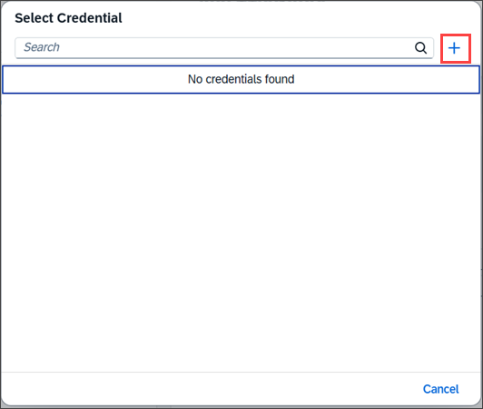

7. In the **Create Credentials** dialog, enter a name for the webhook credential, here `webhook-credential` (1). To create a secret, choose **Generate** (2).

    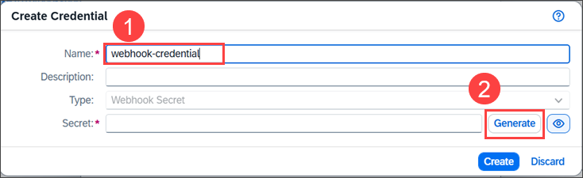

8.  Use the button to copy the secret (1). **Note down the secret, as it will not be shown again.** Choose **Create** (2).

    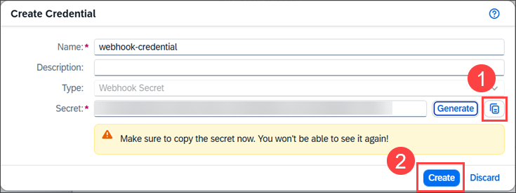

    A toast message confirms that the credential was created. 

9. To add the repository, choose **Add**. 

    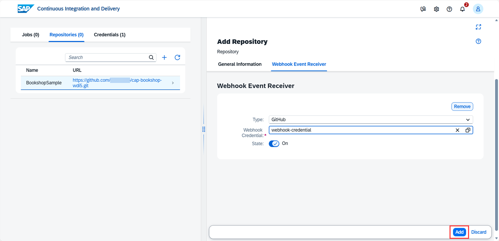

10. The repository was added to the service and appears in the repositories overview. Copy the **Payload URL** in the **Webhook Data** section and **note it down**.

    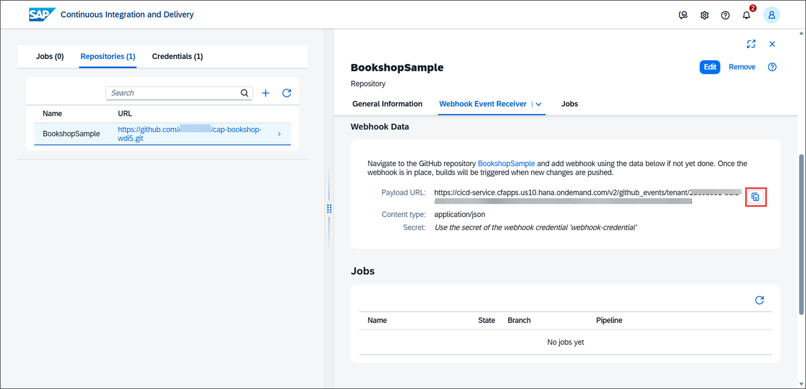

More information: [Add a Repository](https://help.sap.com/docs/continuous-integration-and-delivery/sap-continuous-integration-and-delivery/add-repository?version=Cloud)


### Add Webhook in GitHub Repository

In this step, you add a webhook to your GitHub repository that automatically triggers deployments upon changes.

1. In your repository in GitHub, go to the **Settings** tab (1). Choose **Webhooks** (2).

    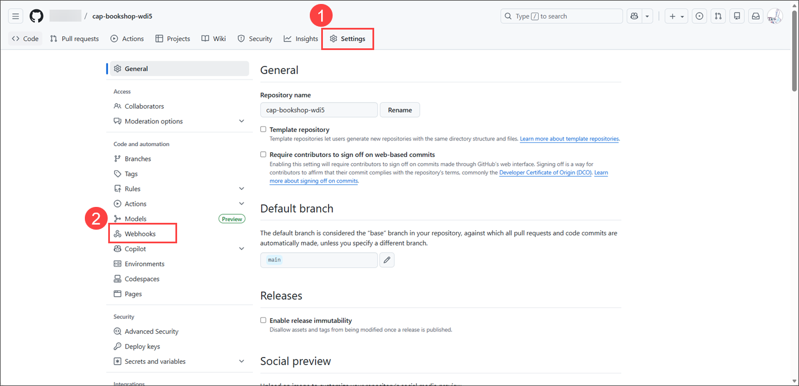

2. Choose **Add webhook**.

    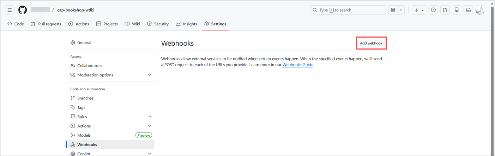

3. Enter the **Payload URL** you copied from the service (1). Select the **Content type** as **application/json** (2). Enter the **Secret** you copied from the **Webhook Data** in SAP Continuous Integration and Delivery (3). Leave all other settings at their default values. Choose **Add webhook** (4).

    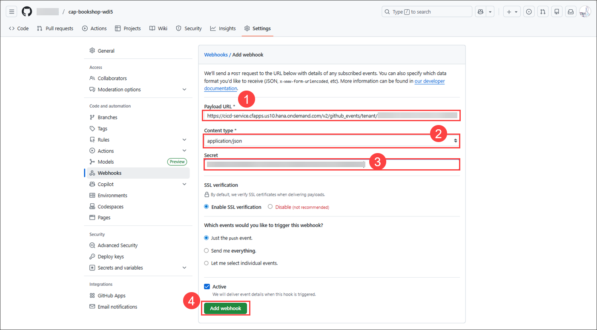

    The result should show the message *Last delivery was successful*.

    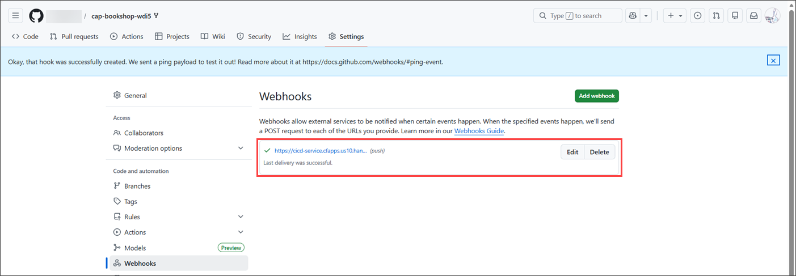

More information: [Creating Webhooks](https://help.sap.com/docs/CONTINUOUS_DELIVERY/99c72101f7ee40d0b2deb4df72ba1ad3/a273cffe863b4663b23942a9bb73071d.html)


### Set Up CI/CD Pipeline

In this step, you create a pipeline job in SAP Continuous Integration and Delivery and integrate Cloud Transport Management into that job. 

#### Create a Pipeline Job 

1. In SAP Continuous Integration and Delivery, go to the **Jobs** tab and choose **+ (Create job)**.

    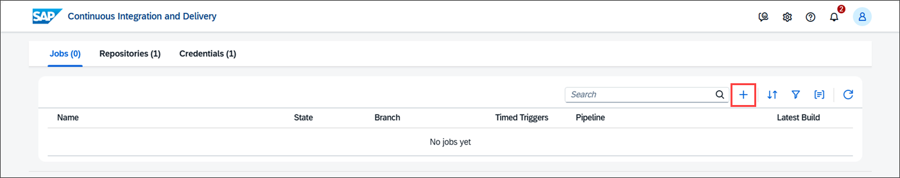

2. In the **General Information** section of the **Create Job** pane, enter the following values:
   
    | Field | Value |
    | ---------- | ------------- |
    | **Name** | Choose a unique name for your job. We recommend using a name that contains both your GitHub repository name and branch, for example **`bookshop-main-job`**. |
    | **Repository** | Select the repository you just created (if not already selected). |
    | **Branch** | Enter **`main`**. |
    | **Pipeline** | Keep the default **`Cloud Foundry Environment`** selected. |

    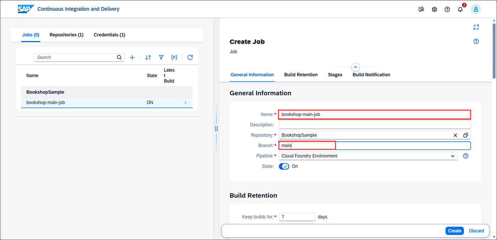

You can keep all values in the **Build** stage unchanged. Don’t close the dialog yet. In the next step, you'll integrate SAP Cloud Transport Management into the job.


#### Integrate Cloud Transport Management into the Job

To integrate Cloud Transport Management into your job, in the **Release** stage of your job, you need to provide the following information: 
- Name of the transport node that's used for the upload to SAP Cloud Transport Management
- Service key of Cloud Transport Management for authentication

1. Scroll down to the **Release** stage in your job details. Choose the **+** button next to **Cloud Transport Management** to open the section.  

    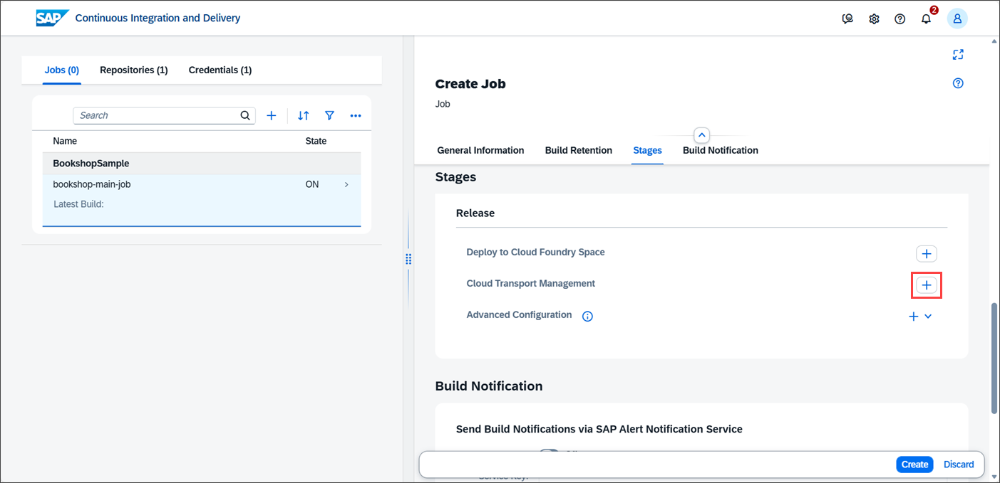

2. Enter `DEV` as the name of the initial transport node that you will create later in SAP Cloud Transport Management service (1). To add the service key, choose the value help button (2).

    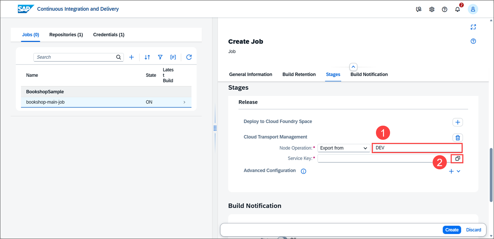

3.  As a result, the **Select Credentials** window opens. Choose the **+**  button, which opens the **Create Credential** dialog.

    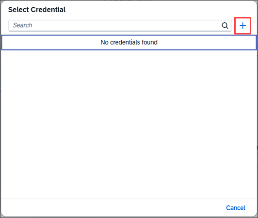

4. In another browser window, in the **Central Services** subaccount, go to **Services > Instances and Subscriptions** (1). In the **Instances** area, find the Service Key of the Cloud Transport Management instance. Choose the **1 key** link (2).

    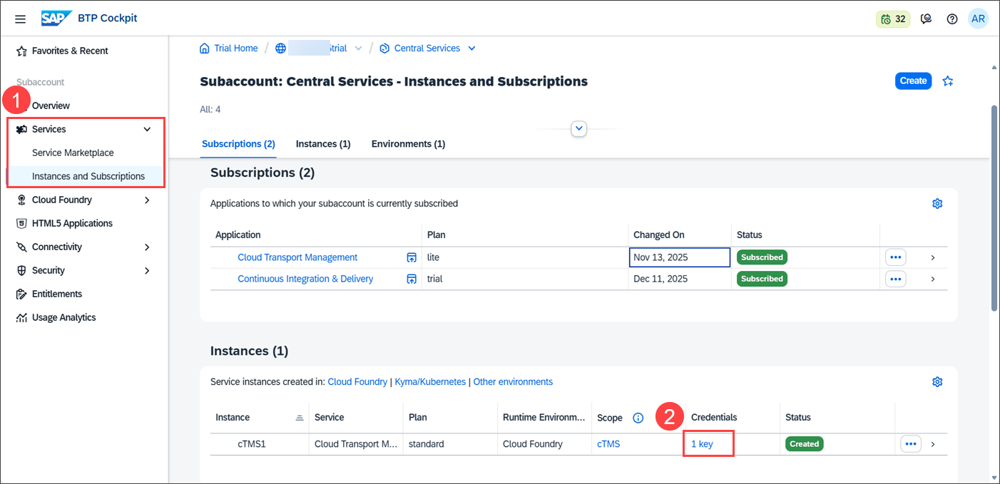

5. Choose **Copy JSON** to copy the entire service key.

    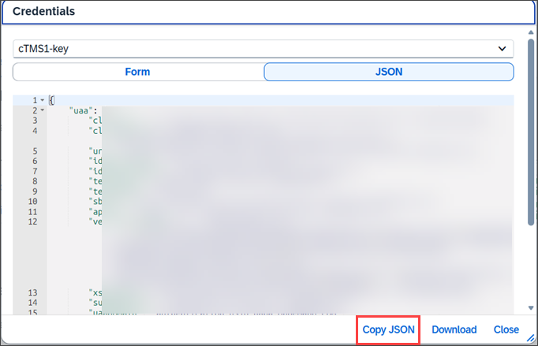

6. Return to the **Create Credential** dialog in SAP Continuous Integration and Delivery service. Enter a name for the service key, for example `ctms-servicekey` (1), paste the copied service key into the **Service Key** text box (2), and choose **Create** (3).

    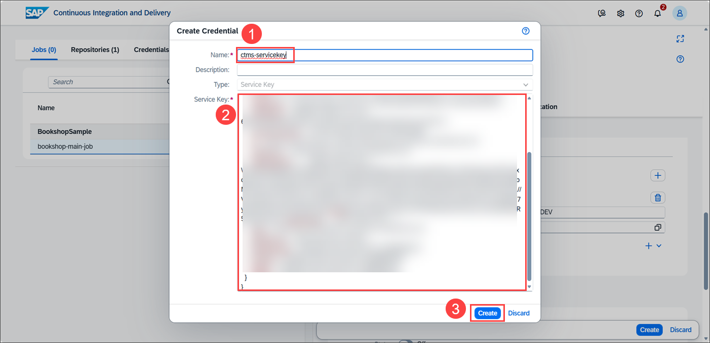

7. To create the job, choose **Create**.

    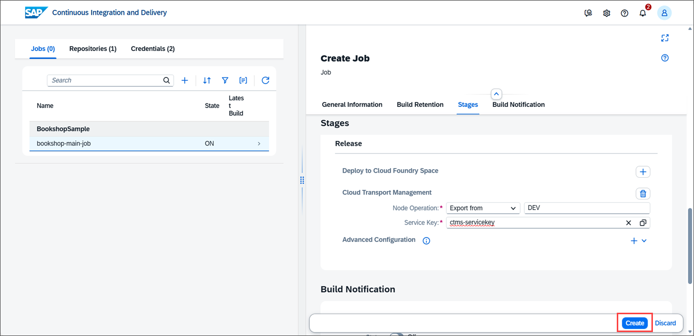

    You've successfully created your first CI/CD job with the Build and Release stages enabled. 

    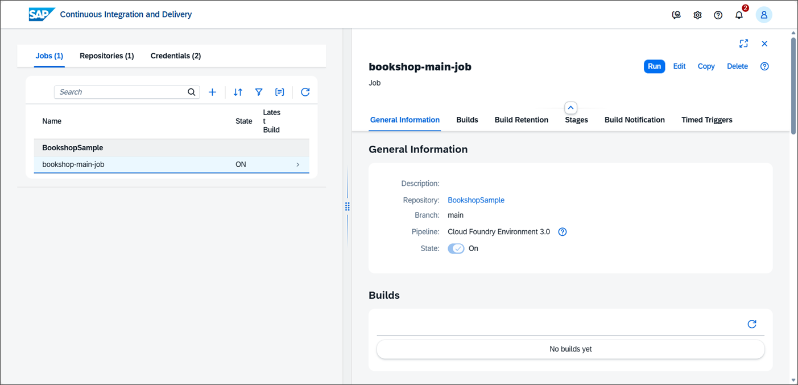

Changes committed to your GitHub repository will be automatically picked up by your delivery pipeline, built and put into the import queue of SAP Cloud Transport Management service. 
However, before a transport request can be received by SAP Cloud Transport Management service, you need to create your transport landscape in the next step.

More information: [Configuring Jobs](https://help.sap.com/docs/CONTINUOUS_DELIVERY/99c72101f7ee40d0b2deb4df72ba1ad3/e293286b06df426ab1cfa235332a2606.html) and 
[Integrate Cloud Transport Management into Your Job](https://help.sap.com/docs/CONTINUOUS_DELIVERY/99c72101f7ee40d0b2deb4df72ba1ad3/a0f029b80e054eb0afd0adb0900d4c19.html)

[VALIDATE_9]


### Create Destination to SAP Cloud Deployment Service

You've already set up SAP Cloud Transport Management service in the **Central Services** subaccount as part of the prerequisite tutorial [Get Started with SAP Cloud Transport Management](btp-transport-management-getting-started). In this step, you create a destination in the **Central Services** subaccount that SAP Cloud Transport Management uses to deploy content to the **trial** subaccount. You will reference it in your **trial** node when you create the transport landscape in SAP Cloud Transport Management service in the next step.

1. Go to the **Central Services** subaccount.
   
2. In the navigation area, choose **Connectivity > Destinations** (1). Choose **Create** (2).

    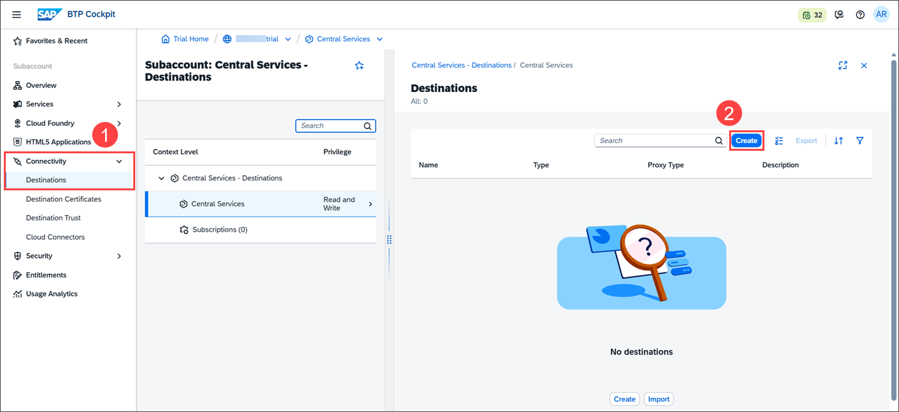

3. In the **Create New Destination** dialog, choose **From Scratch** (1), and **Create** (2).

    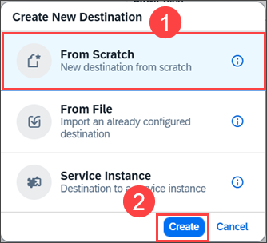

4. Before filling in the destination form, open the **trial** subaccount in another browser window. In the subaccount overview, choose the **Cloud Foundry Environment** tab. Note down the following values, as you will need them to construct the destination URL:

    | Value | How to use it |
    | ---------- | ------------- |
    | **API Endpoint** | Remove `https://api.cf.` — the remainder is the `<domain>` placeholder used in the **URL** and **Token Service URL** fields. |
    | **Org Name** | Use as the `<myorg>` placeholder in the **URL** field. |
    | **Space Name** | Use as the `<myspace>` placeholder in the **URL** field. |

    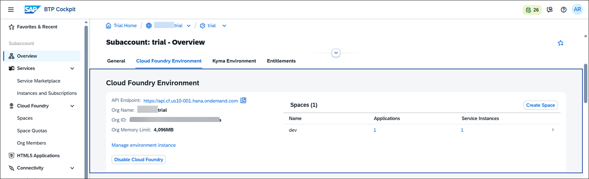

5. Back in the **Create Destination** dialog in the **Central Services** subaccount, select or enter the following data (1), and choose **Create** (2): 

    | Field | Value |
    | ---------- | ------------- |
    | **Name** | Enter any name, here **`Deploy-to-trial`**. |
    | **Type** | **`HTTP`** |
    | **Proxy Type** | **`Internet`** |
    | **URL** | Specify the URL to the SAP Cloud Deployment service in the **trial** subaccount. Use this pattern, replacing the placeholders with the values from the previous step: `https://deploy-service.cf.<domain>/slprot/<myorg>/<myspace>/slp` |
    | **Authentication** | Select **`OAuth2Password`**. |
    | **Client ID** | Enter **`cf`**. |
    | **Client Secret** | Select the **Set empty** checkbox.|
    | **Token Service URL** | Enter the URL to the Cloud Foundry UAA (CF UAA) authentication service. Use this pattern, replacing the placeholder with the domain value from the previous step: `https://login.cf.<domain>` |
    | **User** | Enter an email address of the user that is used for the deployment. For the tutorial, you can use your email address. |
    | **Password** | Enter your password. |
    
    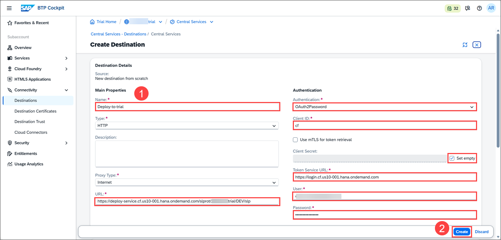

    The destination is created. Select the destination to see its details.

6. Choose **Check Connection**.

    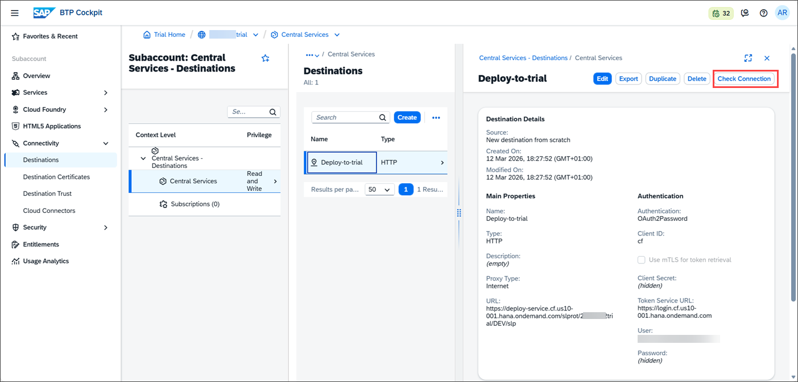

7. The destination check is expected to be successful. Note that this doesn't mean that the deployment will succeed. You'll need to run a test transport in a later step.

    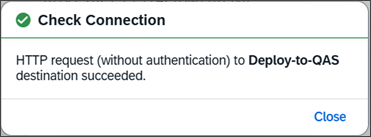


More information: [Creating Destinations Using SAP Cloud Deployment Service with OAuth2Password Authentication](https://help.sap.com/docs/TRANSPORT_MANAGEMENT_SERVICE/7f7160ec0d8546c6b3eab72fb5ad6fd8/a26a721eb2954315a6bb6d2e3cbb416c.html)

[VALIDATE_10]


### Configure Transport Landscape

In this step, you configure the transport landscape in SAP Cloud Transport Management by creating two transport nodes and a route to connect them.

1. Open the UI of SAP Cloud Transport Management Service in the **Central Services** subaccount where you have subscribed to the service, and open the **Instances and Subscriptions** view (1). In the **Subscriptions** area, choose the **Cloud Transport Management** link (2).

    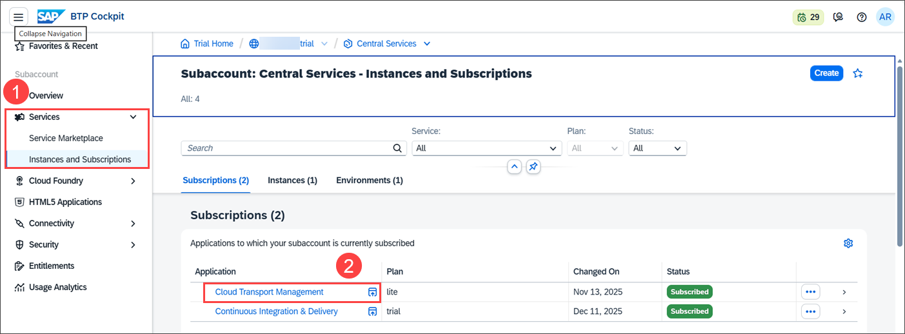

2. The overview page of SAP Cloud Transport Management opens. Go to the **Landscape Visualization**.  
   
    You will now create a new transport landscape. This includes the creation of two transport nodes (`DEV` and `trial`) and a transport route to connect them. To create the first (`DEV`) node, choose the **+ (Create a Node)** button.

    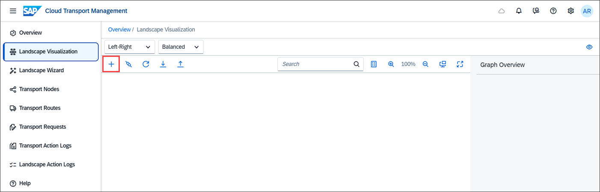

3. In the **Create Node** dialog, select or enter the following data (1), and choose **OK** (2).

    | Field | Value |
    | ---------- | ------------- |
    | **Name** | Enter any name, here **`DEV`**. |
    | **Allow Upload to Node**| Select the checkbox. |
    | **Forward Mode**| Keep the default **`Pre-Import`** selected. |
    | **Virtual Node**| Select the checkbox, since this is the first node. |

    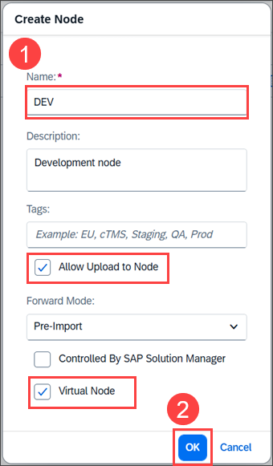

4. To create the second (`trial`) node, choose the **+** button again.

5. In the **Create Node** dialog, select or enter the following data (1), and choose **OK** (2).

    | Field | Value |
    | ---------- | ------------- |
    | **Name** | Enter any name, here **`trial`**. |
    | **Allow Upload to Node**| Do **not** select the checkbox.|
    | **Content Type**| Select **`Multi-Target Application`**. |
    | **Destination**| Select **`Deploy-to-trial`**. |

    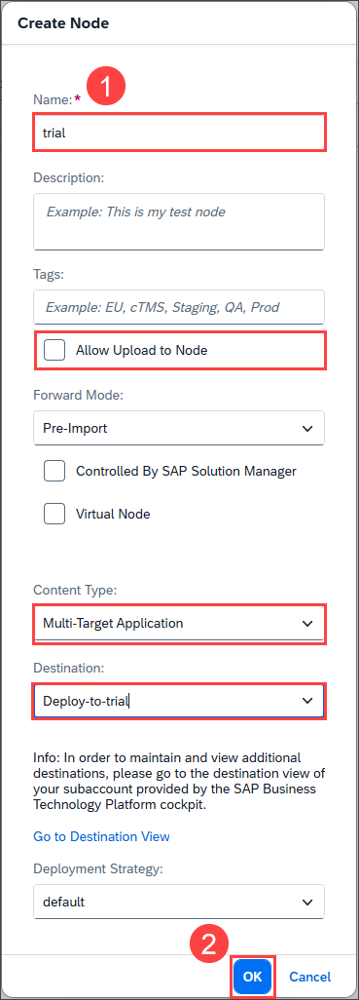

6. To create routes between the transport nodes, select `DEV` as the source node, and choose the connector icon from the context menu.

    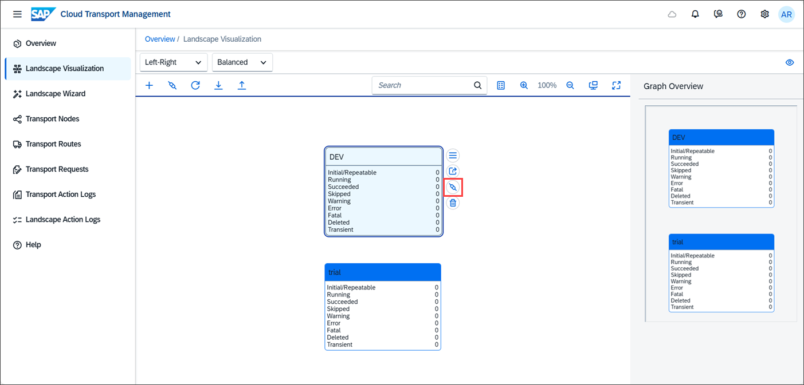

7. In the **Create Route** dialog, enter or select the following data (1), and choose **OK** (2).
   
    | Field | Value |
    | ---------- | ------------- |
    | **Name** | Enter any name, here **`DEV-to-trial`**. |
    | **Source Node** | Keep **`DEV`** selected. |
    | **Target Node** | Select **`trial`**. |

    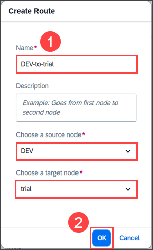

    The result should look as follows:

    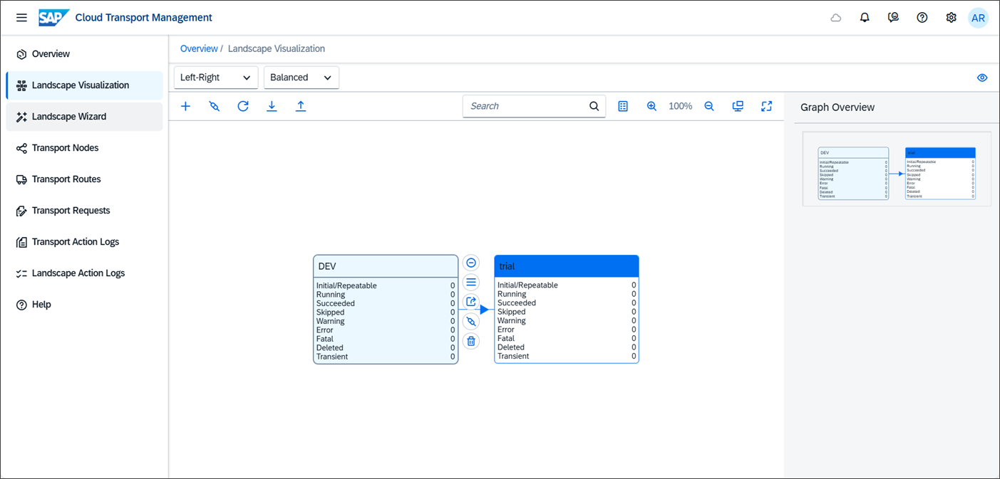

You've set up the transport landscape in SAP Cloud Transport Management.

More information: [Configuring the Landscape](https://help.sap.com/docs/TRANSPORT_MANAGEMENT_SERVICE/7f7160ec0d8546c6b3eab72fb5ad6fd8/3e7b04236d804a4eb80e42c6360209f1.html)


### Create a Transport of your Application

In this step, you open SAP Business Application Studio, clone the Bookshop sample repository, make small code changes, and release them to your Git repository.

1. In the **DEV** subaccount, go to **Services > Instances and Subscriptions** (1). To open SAP Business Application Studio, select the link (2).

    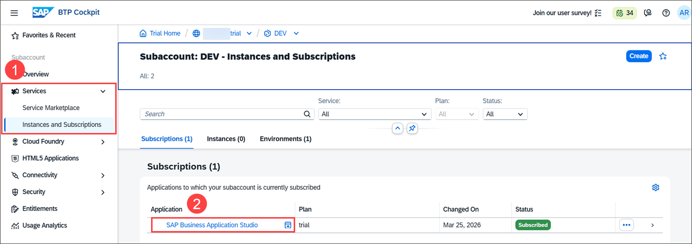

2. If this is the first time you open SAP Business Application Studio, you need to create a development space first. Choose **Create Dev Space**.
   
    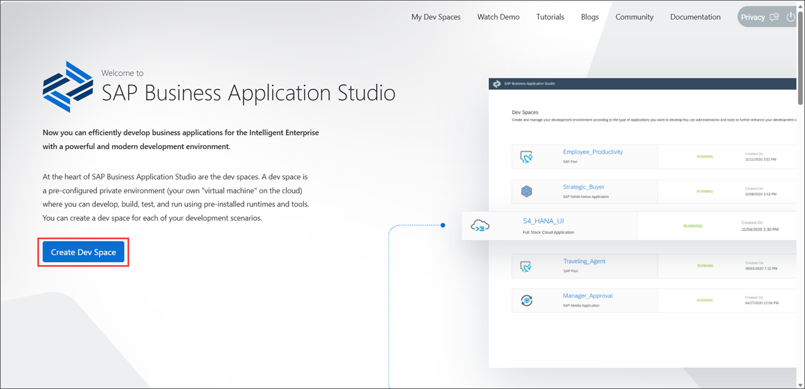

3. Enter a name for the new dev space, here `Dev` (1). Choose **Full Stack Cloud Application** (2). Choose **Create Dev Space** (3).

    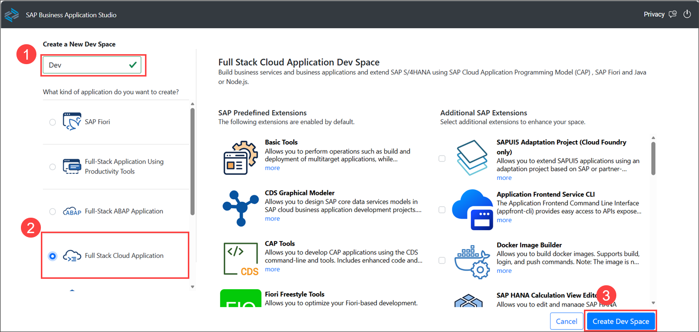

4.  It takes a while until the dev space is created. During this time, you see that it's starting. When it's created, the status changes to **Running**. Select the **Dev** link to start it.

    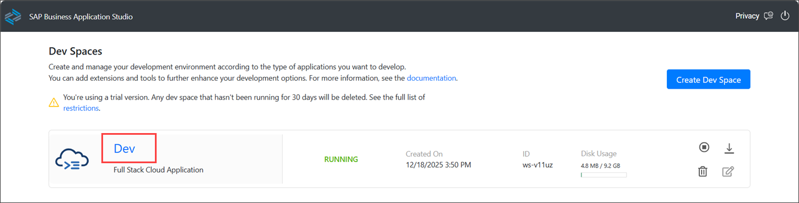

5. Choose **Clone from Git**.

    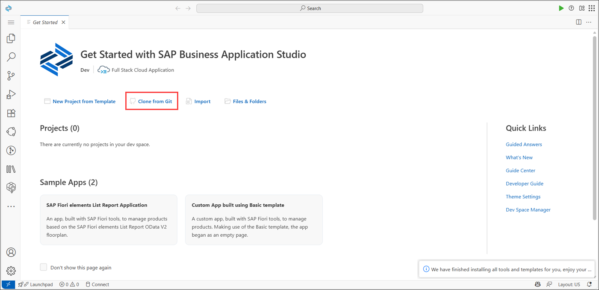

6. Enter the clone URL of your forked repository. Press `Enter`.

    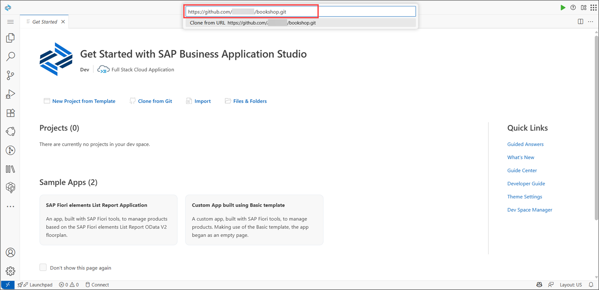

7. Confirm that you want to open the cloned repository.

    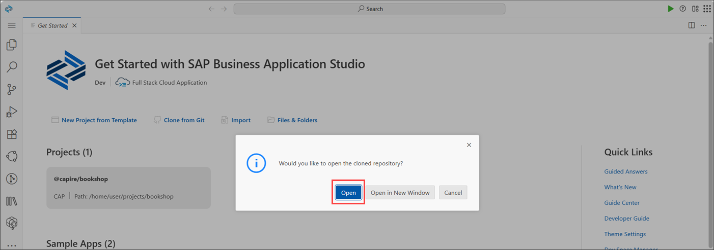

8. Now that your workspace was created, you can start development. 

    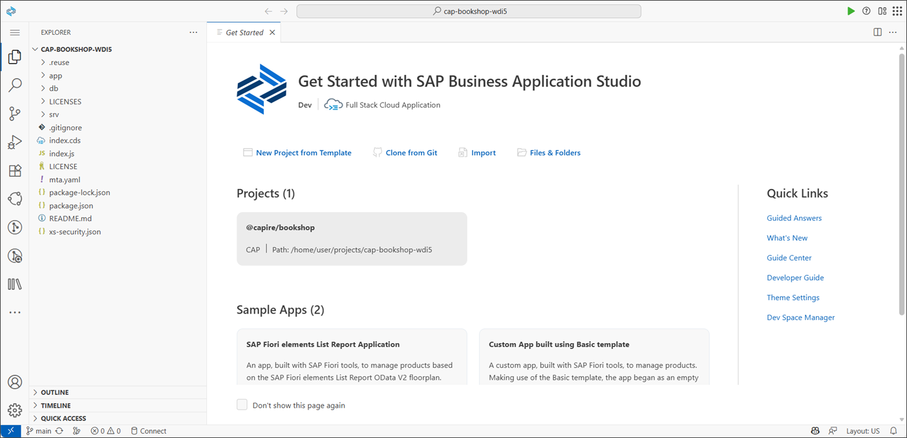

9. You will add additional sample data to your application. In your `CAP-BOOKSHOP-WDI5` workspace, go to **db > data > sap.capire.bookshop-Books.csv**.   

    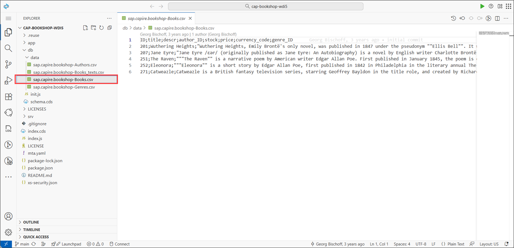

10. Add the following entries (1). 
        
    ```text
    275;The Phoenix Project;"The Phoenix Project: A Novel About IT, DevOps, and Helping Your Business Win is a business novel by Gene Kim, Kevin Behr, and George Spafford. It presents a fictional case study of a troubled IT organization and its journey towards DevOps, emphasizing the importance of collaboration, automation, and continuous improvement.";180;33;14.99;USD;19
    276;Italian Journey;"Italian Journey, a travelogue written by Johann Wolfgang von Goethe, recounts his travels through Italy between 1786 and 1788. The work is notable for its detailed descriptions of the Italian landscape, culture, and art, providing a valuable historical perspective.";190;44;11.50;EUR;13
    277;Life 3.0;"Life 3.0: Being Human in the Age of Artificial Intelligence is a non-fiction book by Swedish-American physicist and cosmologist Max Tegmark. The book explores the implications of artificial intelligence and discusses potential scenarios of advanced AI impacting human society.";200;55;19.99;USD;16
    278;A Transport Wizard's Tale;"A Transport Wizard's Tale: A tribute to the players who walked every street, spun every PokéStop, and caught every Pokémon. In memory of harry2ndstreet, whose adventures ended way too early.";42;10;0.00;USD;0
    ```
    To release them to your Git repository, open the **Source Control** on the side panel (2).    
    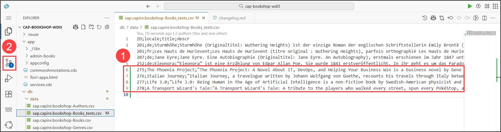

11. Stage your changes.
    
    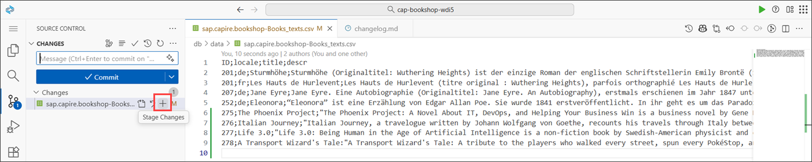

12. To commit your changes, enter a commit message, here `new book entries` (1), and choose **Commit** (2).
    
    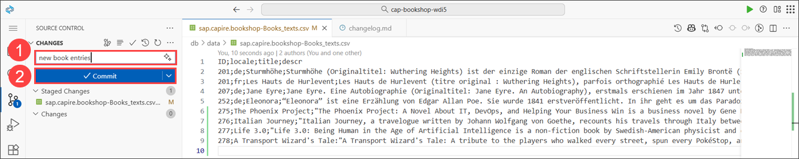

13. To push the changes to remote, choose **Sync Changes**.
    
    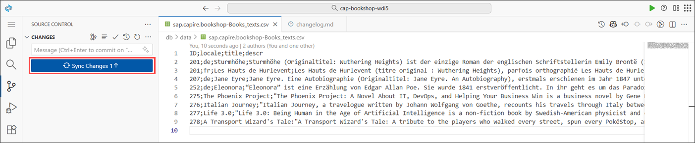

14. Confirm the push to the main branch.
    
    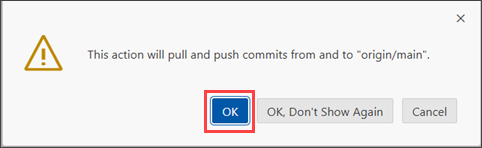

15. Choose the button to copy the verification code and open GitHub.
    
    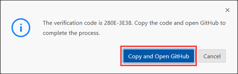

16. On the GitHub **Device Activation** page, choose **Continue**.

    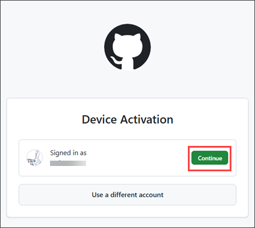

17. On the **Authorize your device** page, paste the verification code you copied in the step 16 (1) and choose **Continue** (2).

    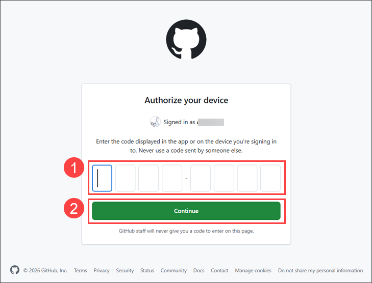

18. On the **Authorize SAP Business Application Studio** page, choose **Authorize SAP**.

    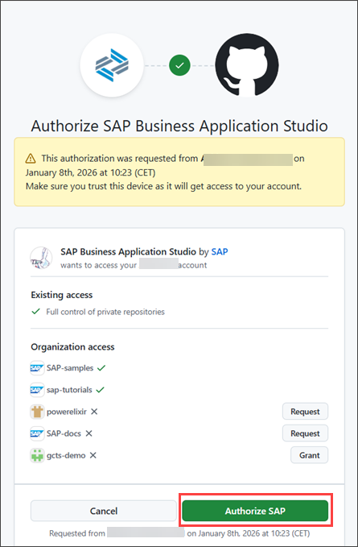

    GitHub confirms that your device is now connected.

    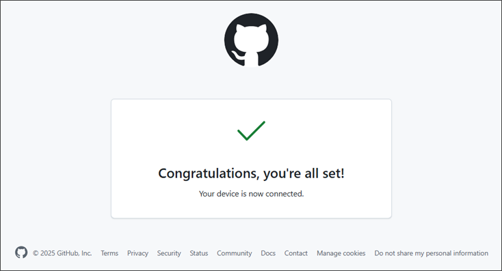

19. Go back to SAP Business Application Studio, and choose one of the options to save your credentials. 

    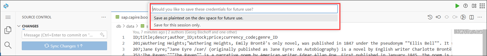

20. When SAP Business Application Studio asks you whether you want to regularly fetch changes from remote, you can answer with **No**.
    
    Afterwards, your code changes are added to your Git Repository.

21. Go to your repository on GitHub and verify that the changes were added.

    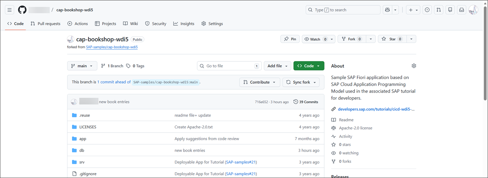

You have now created a development project in SAP Business Application Studio. You've made code changes, and released them to GitHub.  

In the next step, you check that this release triggered your pipeline and created a new transport request in SAP Cloud Transport Management service.

More information: [SAP Business Application Studio: Developer Guide](https://help.sap.com/docs/bas/sap-business-application-studio/developer-guide)


### Verify Pipeline Job and Transport

In this step, you verify that the pipeline job ran successfully in SAP Continuous Integration and Delivery and that a transport request was created in SAP Cloud Transport Management.

1. In SAP Continuous Integration and Delivery, on the **Jobs** tab, check that there's a success status in the **Latest Build** column. Choose the row to open the job details.  

    >If there's no success status, it's possible that the job is still running. You can still choose the row to open the log.

    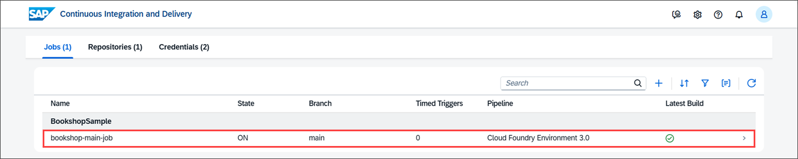

2. Choose the finished build result to check the execution log.

    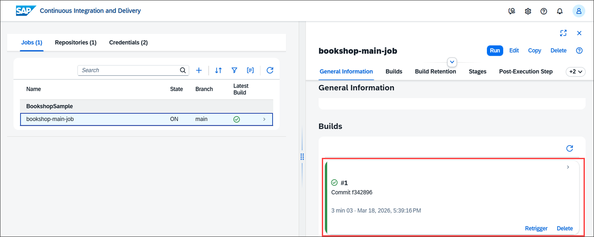

3. Browse through the different stages and choose the **Release** stage.

    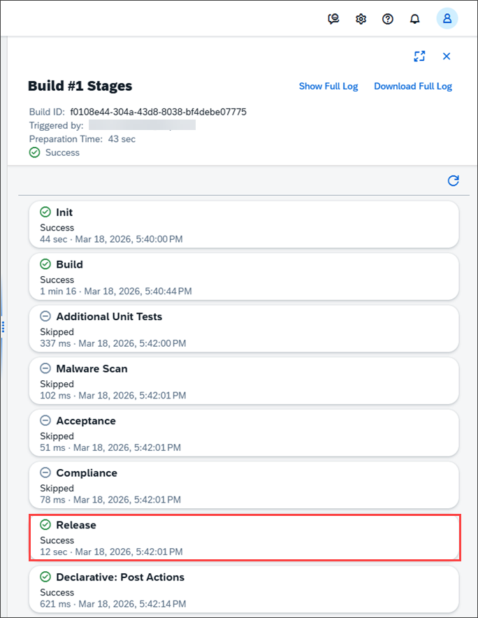

4. In the log file, search for `createdTransportRequestId`.
   
    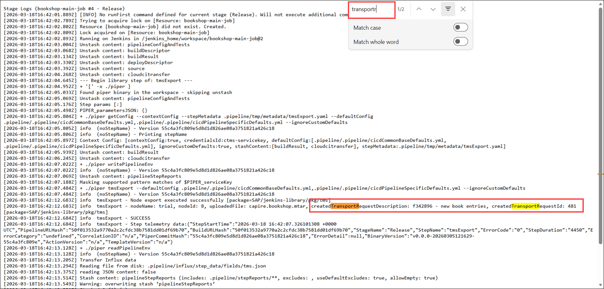

    This transport will be available in SAP Cloud Transport Management.

5. Open SAP Cloud Transport Management, and go to **Transport Nodes** (1). To open the import queue of `trial`, click on the arrow (2).

    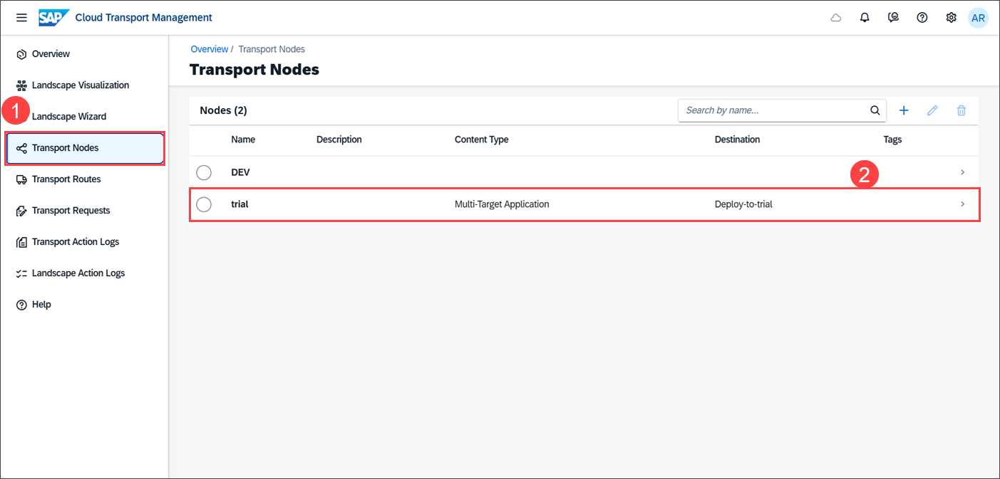

6. Make sure that the transport request number corresponds to the one that you saw in the log of the pipeline job, here `481`. The request is in status **Initial**.
   
    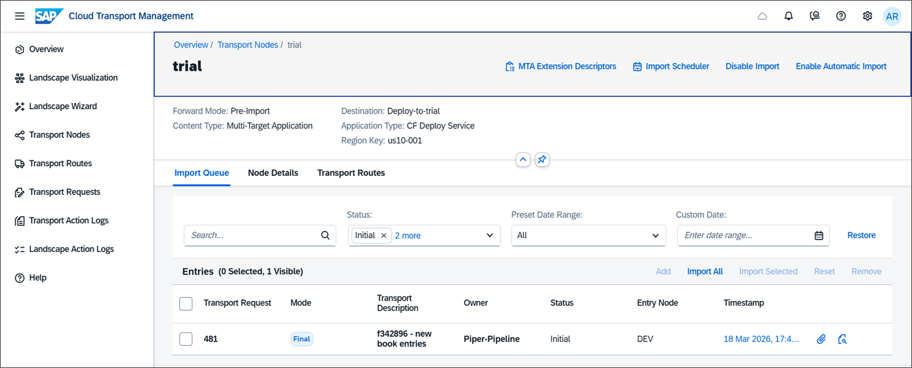

You've now verified the pipeline and release steps. The transport is available in SAP Cloud Transport Management for your delivery to **trial**.

More information: [Running and Monitoring CI/CD Jobs](https://help.sap.com/docs/CONTINUOUS_DELIVERY/99c72101f7ee40d0b2deb4df72ba1ad3/db8521cc85924f78b7e92b1ea69fdf94.html)

### Import the Transport Request

In this step, you import the transport request from the import queue of the **trial** node into the target subaccount.

1. In SAP Cloud Transport Management, open the import queue of the **trial** node. The transport request created by the pipeline is in the import queue with the status **Initial**. Choose **Import All**.

    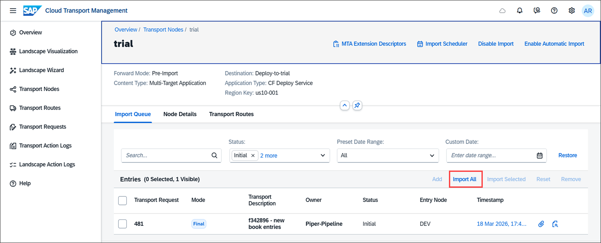

2. Confirm the import.

    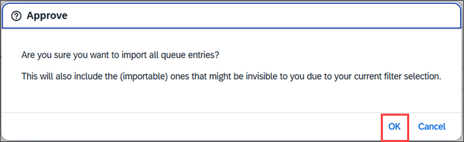

3. The import is running. The status of the transport request shows that the import is in progress.

    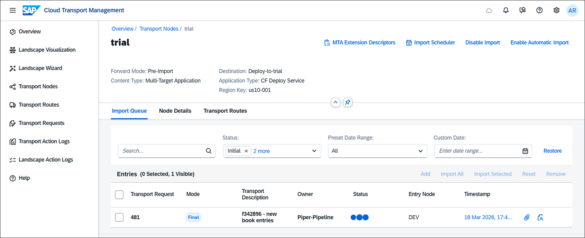

4. When the import finishes, the transport request status changes to **Succeeded**. To review the import log, choose the log icon.

    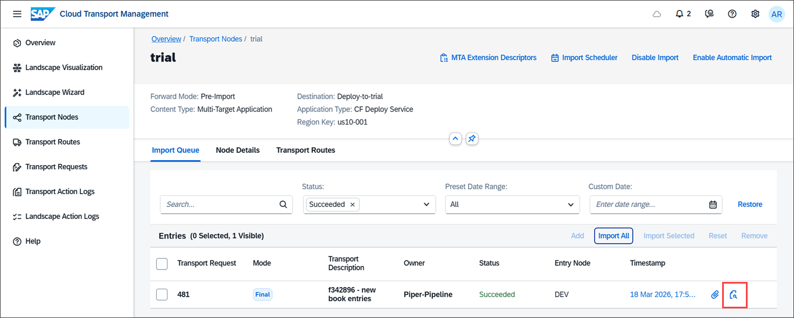

5. The log of the transport request shows the **Export to Node** and **Import to Node** actions, including the destination details and the entity that was deployed.

    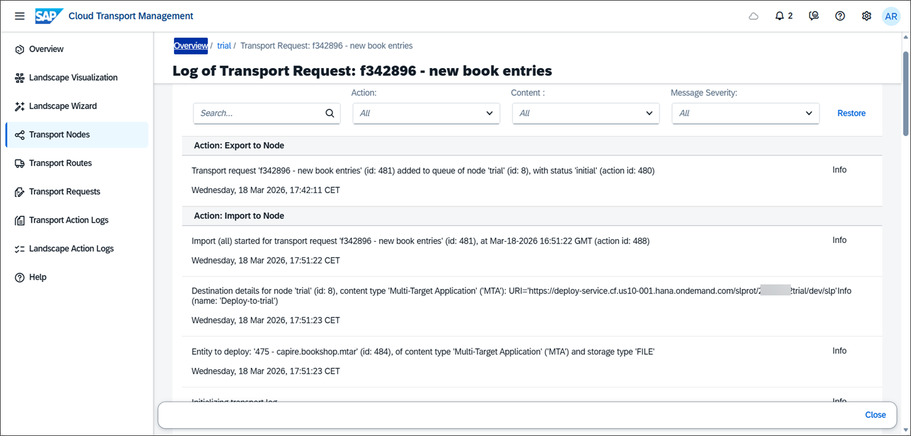

6. When you scroll down, you see that the bookshop application was deployed successfully. The final entry confirms that the import ended with status **Success**.

    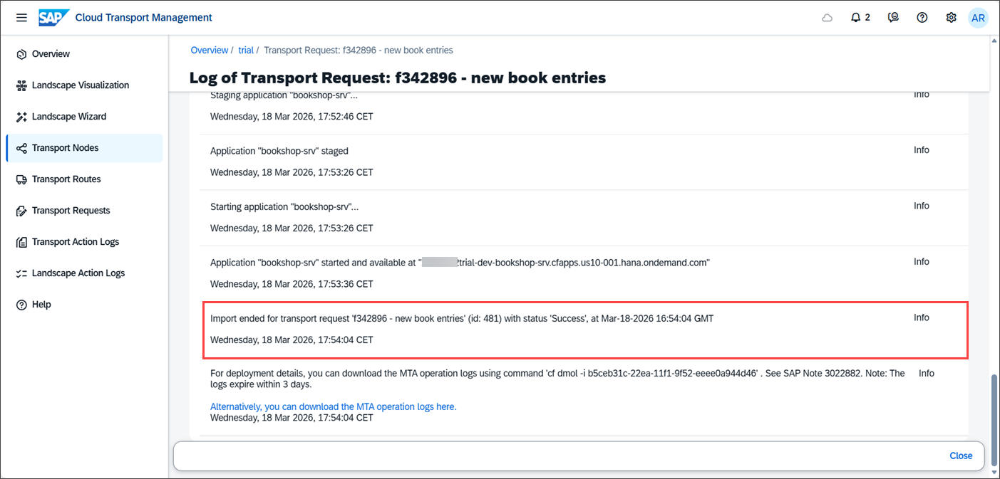

7. To verify the deployment, go to the **trial** subaccount in SAP BTP cockpit (1). In the navigation area, choose **Cloud Foundry > Spaces** (2). The **dev** space shows 1 started application. Choose the tile to open the **dev** space. (3).

    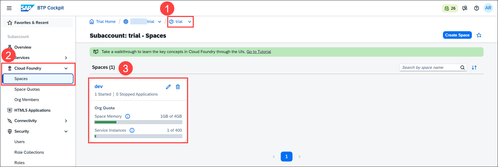

8.  The **bookshop-srv** application is available under **Applications** in the **dev** space, ready to be tested.

    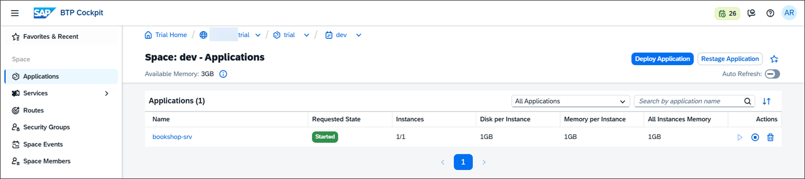

More information: [Import Transport Requests](https://help.sap.com/docs/TRANSPORT_MANAGEMENT_SERVICE/7f7160ec0d8546c6b3eab72fb5ad6fd8/d2005d5d2fc346b98eff7146107243fc.html)

[VALIDATE_14]

⚡🌋 Congratulations ⚡🌴! You've successfully completed the tutorial **Transport an SAP Fiori Application with SAP Continuous Integration and Delivery Service and SAP Cloud Transport Management**. 

<!-- In memory of harry2ndstreet 🎮
     Like a Pokémon GO trainer who never stopped walking — always finding the next PokéStop,
     always catching what others missed — you traversed every node in the landscape.
     The import queue is fuller for having known you. Gotta deploy 'em all. -->

