# Set Up the SAP Integration Suite Source Subaccount 
<!-- description --> Perform all configuration tasks in the SAP Integration Suite source subaccount that are required for the transport scenario: "Transport SAP Integration Suite content using SAP Cloud Transport Management service and SAP Content Agent service". 

## Prerequisites

  - You've completed the prerequisite steps of tutorial [Transport Integration Content Using SAP Cloud Transport Management Service and SAP Content Agent Service](btp-transport-management-cpi-01-use-case).
 
## You will learn
   - How to set up SAP Integration Suite in the source subaccount (subscribe to SAP Integration Suite, activate its capabilities, and assign roles required for SAP Integration Suite, as well as create a service instance and key for SAP Process Integration Runtime) 
   - How to create a service instance and a service key to access the APIs of SAP Content Agent service in the source subaccount
   - How to create the destinations required for the transport scenario in the source subaccount

## Scenario Overview

In addition to the **Central Services** subaccount that provides the SAP Cloud Transport Management instance, the **trial** subaccount is available as the SAP Integration Suite source subaccount. Use it to subscribe to SAP Integration Suite, and to create service instances for **SAP Content Agent** service and **SAP Process Integration Runtime** to get API access to these services. Create **service keys** for the instances to get the credentials that you'll need for the SAP Content Agent service destination **ContentAssemblyService** and the SAP Cloud Integration destination **CloudIntegration**. 

   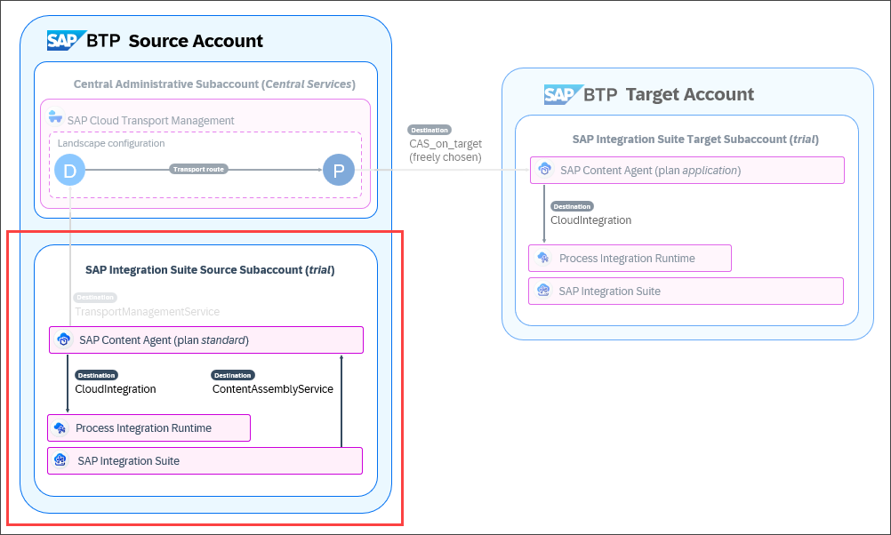

---

### Open the SAP BTP Cockpit

>This step assumes that you're running the tutorial in an SAP BTP Trial account. If you have an enterprise account, open SAP BTP Cockpit in your enterprise account. 

1. To access SAP BTP Cockpit of your trial account, go to your [SAP BTP Trial landing page](https://account.hanatrial.ondemand.com/trial/#/home/trial) and choose **Go To Your Trial Account**. (The name of the button may vary.)    

    In your global trial account, you have the **Central Services** subaccount where SAP Cloud Transport Management service runs, if you've followed the [Get Started with SAP Cloud Transport Management](btp-transport-management-getting-started) tutorial.
    
    You will use the default **trial** subaccount to set up SAP Integration Suite.

    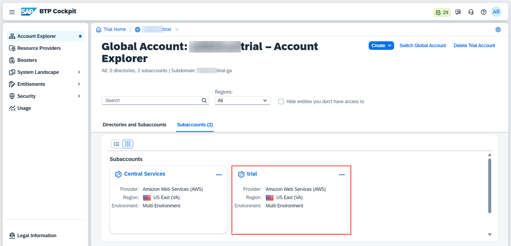    

### Set Up SAP Integration Suite

Set up an SAP Integration Suite trial as described in the tutorial [Set Up Integration Suite Trial](cp-starter-isuite-onboard-subscribe). 

Keep these points in mind:

- Subscribe to SAP Integration Suite in the **trial** subaccount. 

- Make sure that you assign the `Integration_Provisioner` role to your user as mentioned in *Step 2: Subscribe to the service* of that tutorial. 

- Make sure you activate the capabilities of SAP Integration Suite.

- If you use the **Enable Integration Suite** booster to assign roles and create service instances for SAP Process Integration Runtime, you'll only need to update the `api` instance in step 6 of the current tutorial, and you can skip step 7 since the service key was automatically created. 

- If you **don't** use the **Enable Integration Suite** booster to assign roles and create service instances, additionally assign the `PI_Read_Only`, `PI_Integration_Developer`, and `PI_Administrator` role collections to your user. You'll need them towards the end of the tutorial group to enable the transport in SAP Integration Suite and to run the test transport.  

### Create a Service Instance for SAP Content Agent Service

For the transport scenario, API access to SAP Content Agent service is required. To enable API access, create a service instance.

1. In the SAP Integration Suite source subaccount **trial**, choose **Services > Service Marketplace** from the navigation on the left (1). In the search field, filter for *Content Agent Service* (2). On the **Content Agent Service** tile, select the three dots **...**, and choose **Create** (3).

    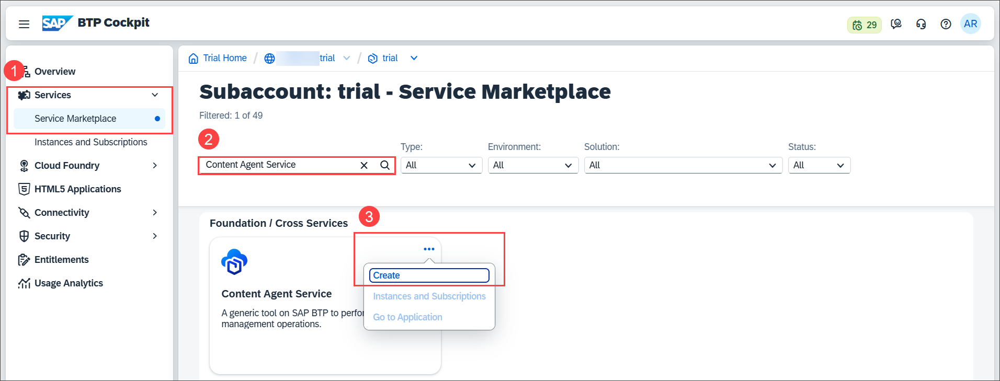

3. Select the *standard* plan from the **Plan** dropdown menu of Content Agent Service (1). You can leave the values for **Runtime Environment** and **Space** unchanged.  Enter an **Instance Name**, for example `cpi_dev` (2). Choose **Create** (3). 

    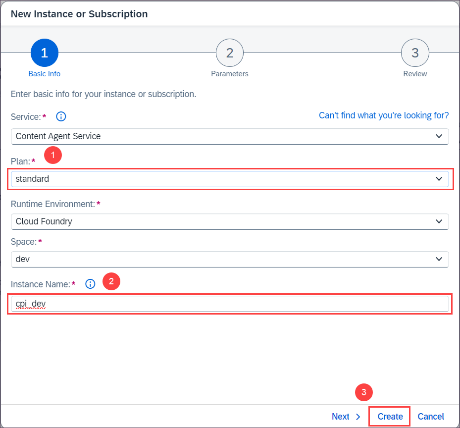

4. On the dialog box, choose **View Instance** to monitor the creation progress.

    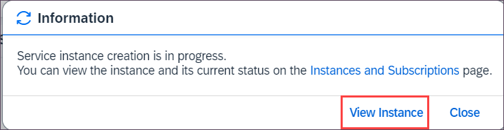

5. The progress bar indicates that the instance creation takes some time.

    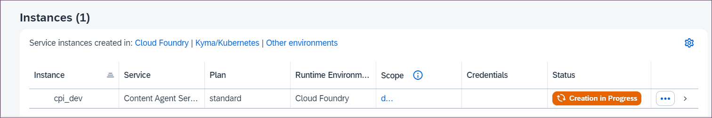

6. When the instance creation is completed, the instance gets the status **Created**.

    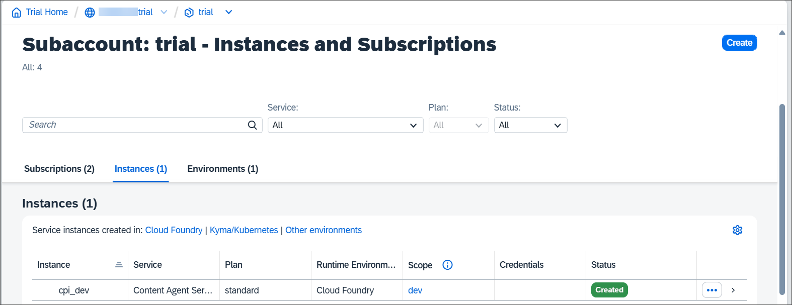

See also on SAP Help Portal: [Create Instance](https://help.sap.com/docs/CONTENT_AGENT_SERVICE/ae1a4f2d150d468d9ff56e13f9898e07/1f45ddc3d6194886802924068724b59f.html)

### Create a Service Key for the SAP Content Agent Service Instance

The details of the service key of the SAP Content Agent service instance are required for the configuration of the SAP Content Agent service destination. The destination is required for the communication of SAP Integration Suite with SAP Content Agent service.

1. To create a service key for the SAP Content Agent instance, in the service instance row, select the three dots **...**, and choose **Create Service Key**.

    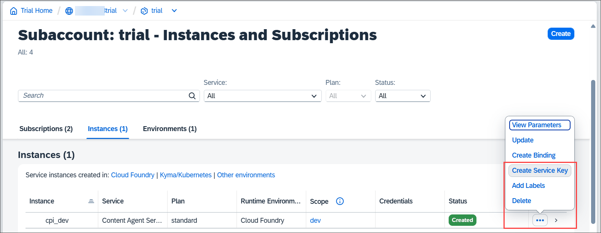

2. Enter a name for the service key (1), here `cas-on-cpi-dev`, and choose **Create** (2):

    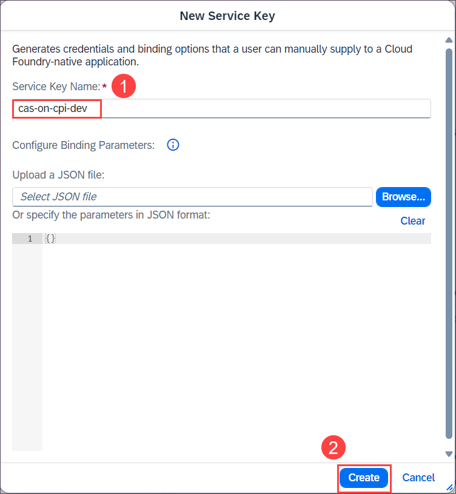

3. The service key was created. Select the three dots **...** in the service key row, and choose **View**.

    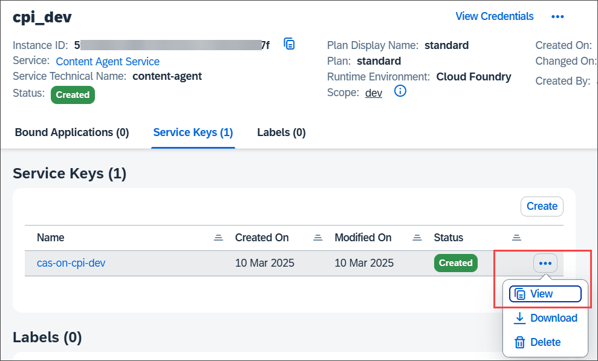

4. The service key looks as follows. Leave the service key open so that you copy the required values in the next step, or note down the values of  `url`, as well as `clientid`, `clientsecret`, and  `url` from the `uaa` section.  

    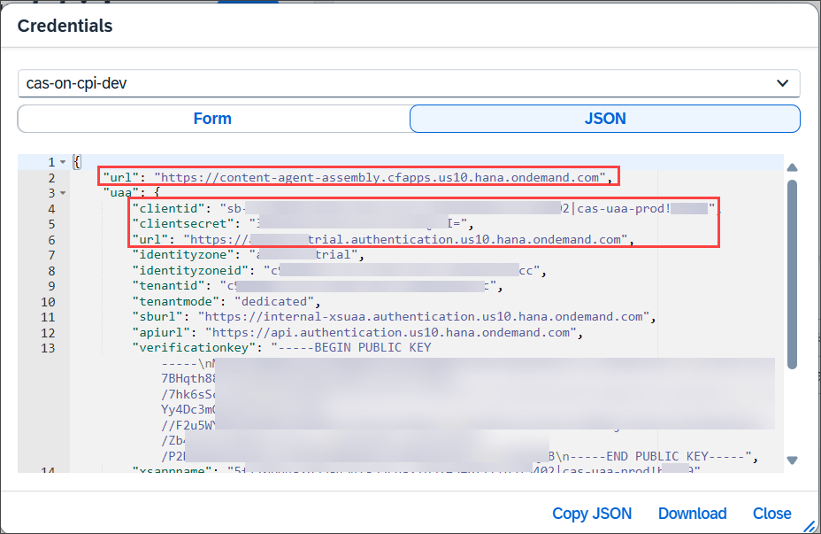

    You'll need them in the next step when you create the SAP Content Agent service destination.

See also on SAP Help Portal: [Create Service Key](https://help.sap.com/docs/CONTENT_AGENT_SERVICE/ae1a4f2d150d468d9ff56e13f9898e07/c0ec2ba3016644a19cd6322fbc72ea2a.html)

### Create an SAP Content Agent Service Destination in the SAP BTP Source Account

The destination to SAP Content Agent Service defines which Content Agent Service the SAP Integration Suite communicates with. The destination has the fixed name `ContentAssemblyService`. To create it, you need some values from the service key of the SAP Content Agent service instance that you've created in the previous step. 

1. Open SAP BTP Cockpit of your SAP Integration Suite source subaccount in another browser window or tab, and choose **Connectivity > Destinations** (1), and choose **Create Destination** (2).

    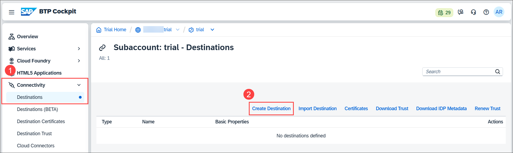

2. In the **Destination Configuration** window, enter details for the following fields (1), and save the entries (2):
    >Keep the values of fields not mentioned in the table unchanged.
    
    | Field | Value |
    | ---------- | ------------- |
    | **Name** | `ContentAssemblyService` |
    | **Description** | For example: `Destination to SAP Content Agent Service` |
    | **URL** | Enter the value of the first `url` from the details of the service key of the SAP Content Agent service instance in the SAP BTP source account that you created in the previous step. |
    | **Authentication** | Select **OAuth2ClientCredentials**. |
    | **Client ID** | Enter the value of `clientid` from the `uaa` section of the service key details. |
    | **Client Secret** | Enter the value of the `clientsecret` from the `uaa` section of the service key details. |
    | **Token Service URL** | Enter the value of `url` from the `uaa` section of the service key details and append `/oauth/token` to the URL. For example: `https://12345678trial.authentication.us10.hana.ondemand.com/oauth/token` |

    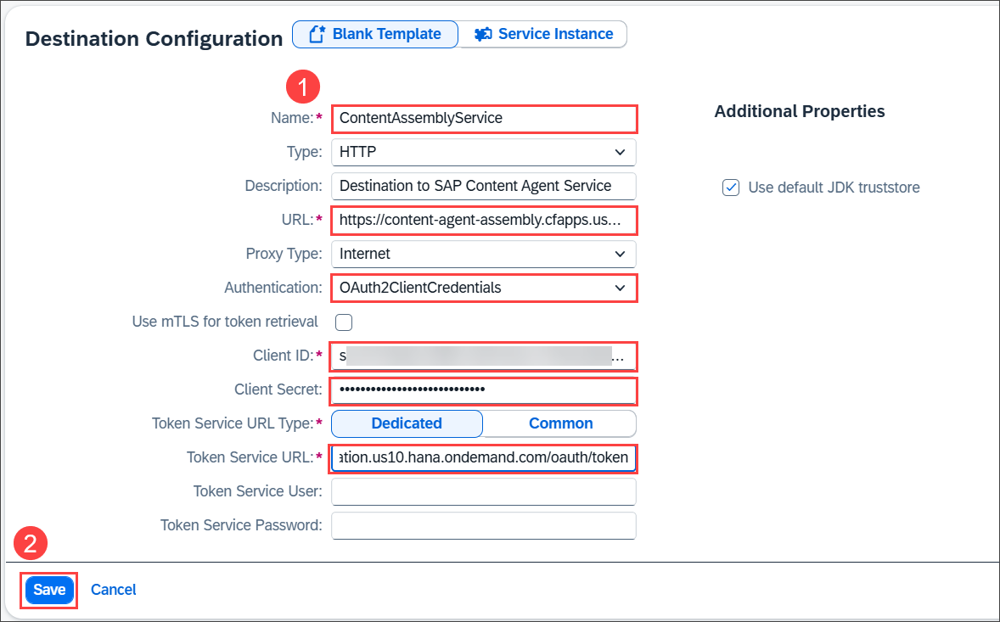

    When you use **Check Connection** to test the connection, you'll probably get a *Connection to "ContentAssemblyService" established. Response returned: "401: Unauthorized"* message.  

    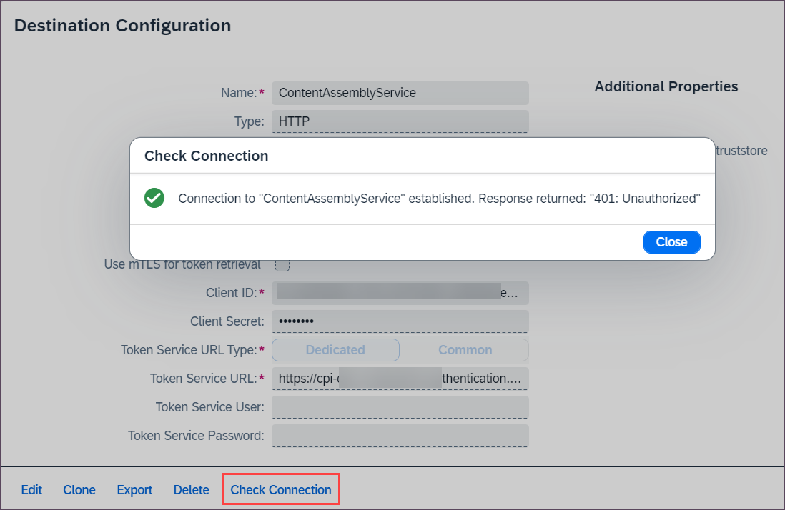  

    "*Connection to "ContentAssemblyService" established.*" means that the URL specified in the destination can be reached. The *"401: Unauthorized"* response is the expected response. However, such a successful check doesn't guarantee successful deployment. We recommend that you run a test transport after completing the entire configuration of the transport scenario to know whether you are actually missing authorizations.

See also on SAP Help Portal: [Create SAP Content Agent Service Destination](https://help.sap.com/docs/CONTENT_AGENT_SERVICE/ae1a4f2d150d468d9ff56e13f9898e07/a4da0c26ced74bbfbc60e7f607dc05ab.html)

### Create a Service Instance for SAP Process Integration Runtime

For the transport scenario, API access to SAP Process Integration Runtime is required. To enable API access, create a service instance.  

>Creating a new instance is only required, if you **haven't** used the **Enable Integration Suite** booster to assign roles and create service instances. If you've used the booster, update the `api` instance that was created as part of the booster with the `WorkspacePackagesTransport`, `WorkspacePackagesRead`, and `WorkspacePackagesEdit` roles.   

1. Make sure your user has the `Integration_Provisioner` role collection assigned as mentioned in *Step 2: Set Up SAP Integration Suite*.  
    
    To check this, in the **trial** subaccount, choose **Security > Users** from the navigation on the left (1). To display the details of your user, click on it (2), and find the `Integration_Provisioner` role collection on the **Roles Collections** tab (3). 

    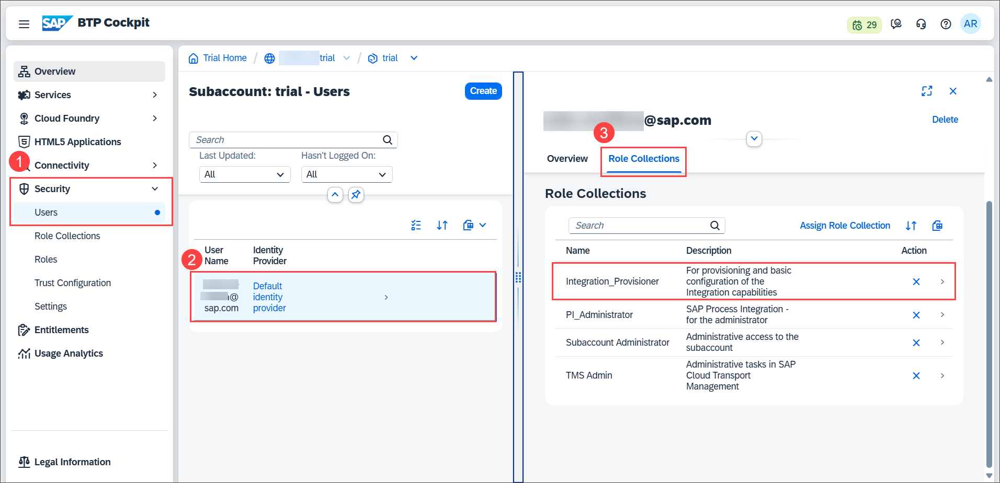
   
2. To create an instance for SAP Process Integration Runtime, choose **Services > Service Marketplace** from the navigation on the left (1). Filter for *Process Integration* in the search field (2). On the **SAP Process Integration Runtime** tile, select the three dots **...**, and choose **Create** (3).

    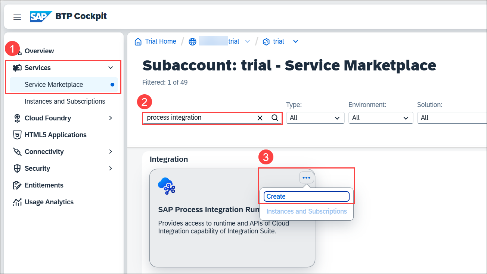

3. Select the **api** plan from the **Plan** dropdown menu of the SAP Process Integration Runtime service (1). You can leave the values for **Runtime Environment** and **Space** unchanged. Enter an **Instance Name**, for example `pi-dev` (2), and choose **Next** (3).

    

4. The following roles are required for the instance: `WorkspacePackagesTransport`, `WorkspacePackagesRead`, and `WorkspacePackagesEdit`. Select them from the **Roles** dropdown menu (1), and choose **Create** (2).

    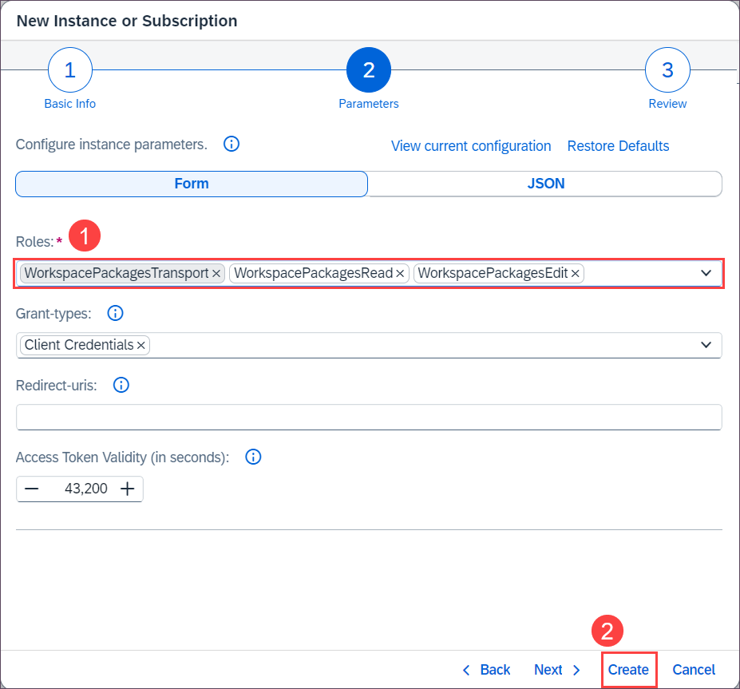

5. The SAP Process Integration Runtime instance was created.

    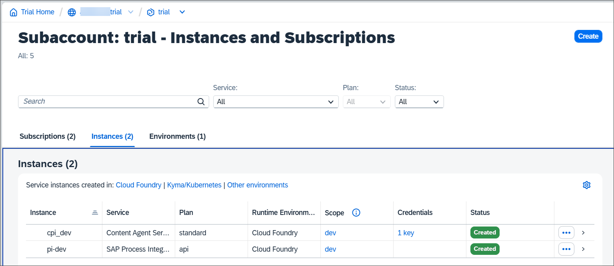
 
See also on SAP Help Portal: [Creating Service Instance and Service Key for Inbound Authentication](https://help.sap.com/docs/SAP_INTEGRATION_SUITE/51ab953548be4459bfe8539ecaeee98d/19af5e205fe14af6a4f8a9fd80d4dc92.html)

### Create a Service Key for the SAP Process Integration Runtime Instance

The details of the service key of the SAP Process Integration Runtime instance are required for the configuration of the SAP Cloud Integration destination. This destination is required for the communication of SAP Content Agent service with SAP Process Integration Runtime.

>If you've used the **Enable Integration Suite** booster to assign roles and create service instances, you can skip this step. A service key for the SAP Process Integration Runtime instance was already created. 

1. To create a service key for the SAP Process Integration Runtime instance, in the service instance row, select the three dots **...**, and choose **Create Service Key**.

    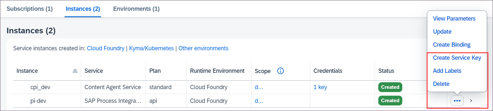

2. Enter a name for the service key, here `pi-on-cpi-dev` (1), leave the other values unchanged, and choose **Create** (2).

    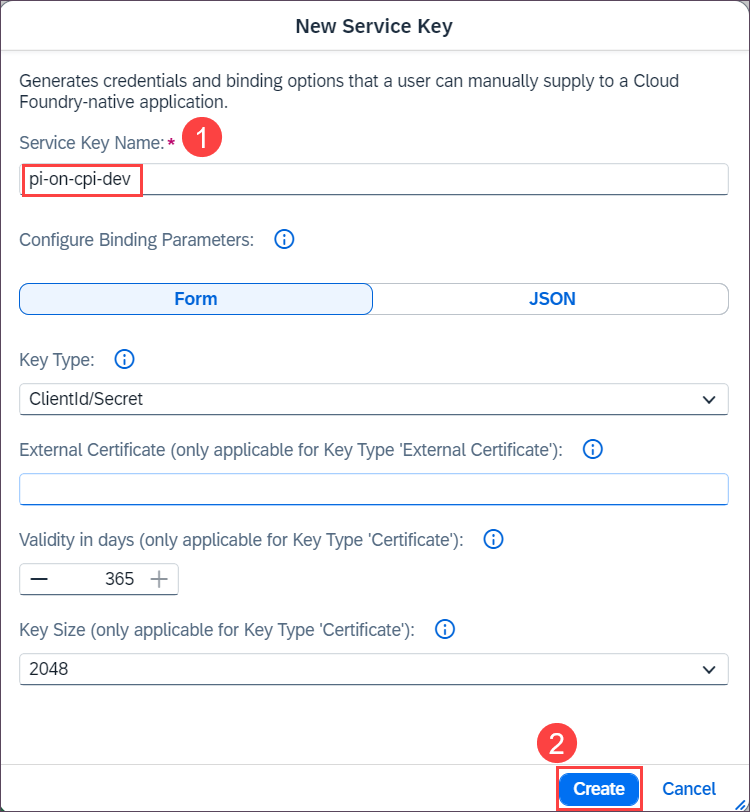

3. The service key was created. Select the three dots **...** in the service key row, and choose **View**.

    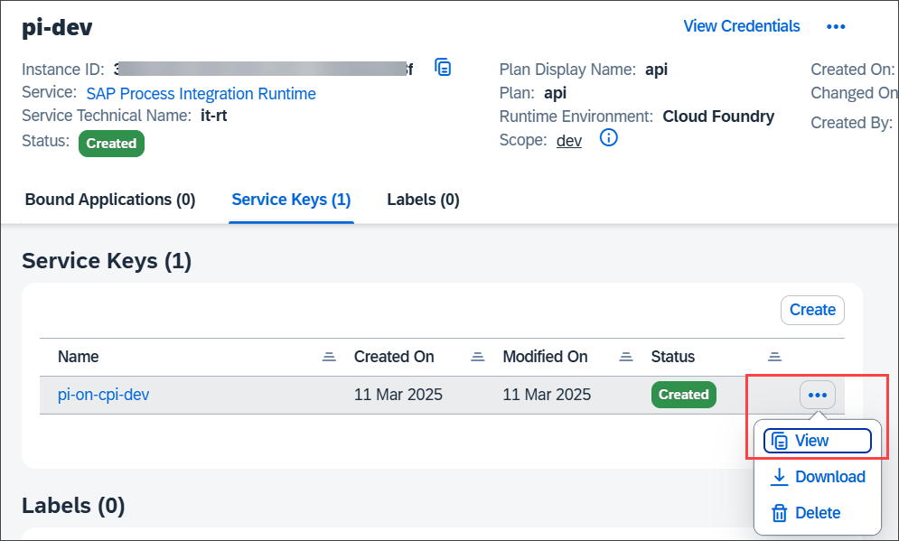

4. The service key looks as follows. Leave the service key open so that you copy the required values in the next step, or note down the values of `url`, `clientid`, `clientsecret`, and `tokenurl`.

    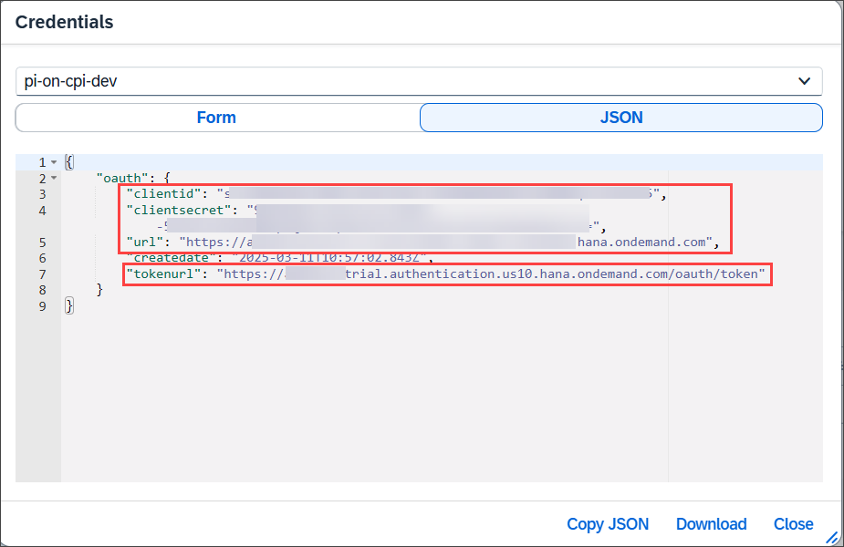

    You'll need them in the next step when you create the SAP Cloud Integration destination.

### Create an SAP Cloud Integration Destination

The SAP Cloud Integration destination serves as the endpoint where SAP Content Agent Service collects the content to be packed into an MTA and exported to SAP Cloud Transport Management service. The destination has the fixed name `CloudIntegration`. 

1. In the SAP Integration Suite source subaccount, choose **Connectivity > Destinations** (1). The destination to SAP Content Agent service is displayed. To create a new one, choose **Create Destination** (2).

    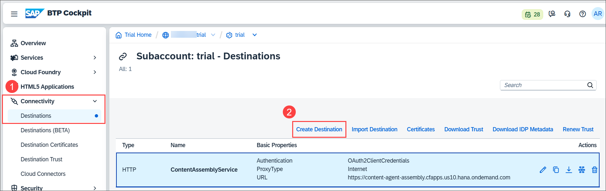

2. In the **Destination Configuration** window, enter details for the following fields (1), and save the entries (2):
    >Keep the values of fields not mentioned in the table unchanged.
    
    | Field | Value |
    | ---------- | ------------- |
    | **Name** | `CloudIntegration` |
    | **Description** | For example: `Destination to SAP Cloud Integration` |
    | **URL** | Enter the value of the `url` from the details of the service key of the SAP Process Integration Runtime instance that you created in the previous step, and append `/api/1.0/transportmodule/Transport` to the URL. For example: `https://12345678trial.it-cpitrial00.cfapps.us10-001.hana.ondemand.com/api/1.0/transportmodule/Transport` |
    | **Authentication** | Select **OAuth2ClientCredentials**. |
    | **Client ID** | Enter the value of `clientid` from the service key details. |
    | **Client Secret** | Enter the value of the `clientsecret` from the service key details. |
    | **Token Service URL** | Enter the value of `tokenurl` from the service key details. For example: `https://12345678trial.authentication.us10.hana.ondemand.com/oauth/token` |

    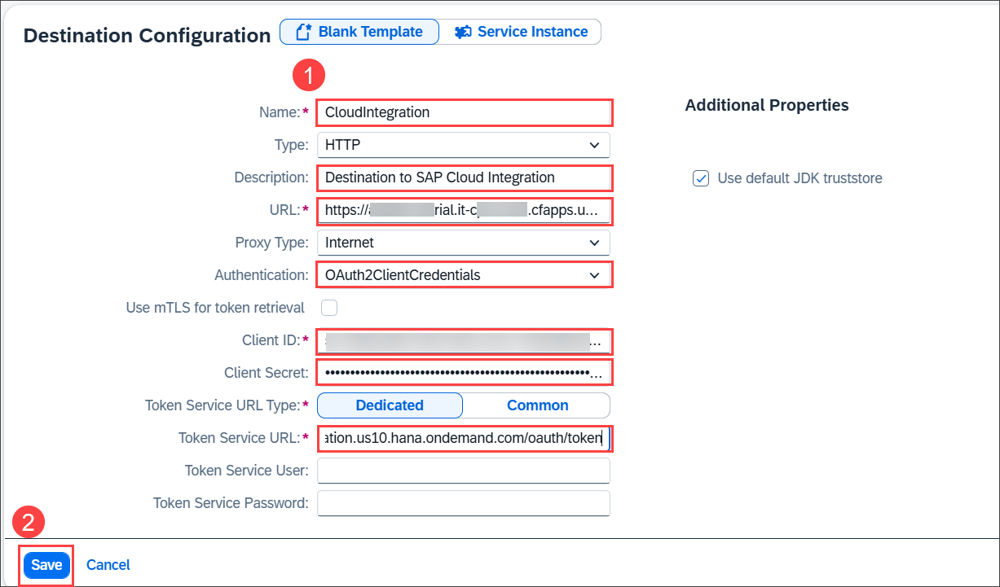

3. The destination was created.  
   
    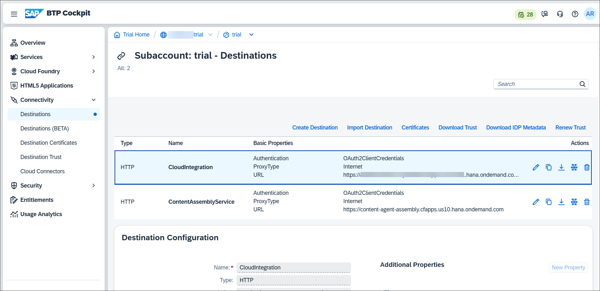

See also on SAP Help Portal: [Create SAP Cloud Integration Destination](https://help.sap.com/docs/CONTENT_AGENT_SERVICE/ae1a4f2d150d468d9ff56e13f9898e07/c17c4004049d4d9dba373d72ce5610cd.html)

### Next Step

Perform all configuration tasks required on the SAP BTP target account for the transport scenario: *Transport SAP Integration Suite content using SAP Cloud Transport Management service and SAP Content Agent service*.  

[Set Up the SAP Integration Suite Target Subaccount](btp-transport-management-cpi-03-set-up-target-account)

