# Create a Transport Destination and Configure the SAP Integration Suite Transport Landscape
<!-- description --> Create a transport destination in the administrative subaccount in the SAP BTP source account using the credentials of the service key of the SAP Content Agent service instance on the target subaccount. Then configure the SAP Integration Suite transport landscape in SAP Cloud Transport Management service using the transport destination.  

## Prerequisites

   - You've completed tutorial [Set Up the SAP Integration Suite Target Subaccount](btp-transport-management-cpi-03-set-up-target-account).
   - You have the details of the **service key of the SAP Content Agent instance** in the **target** subaccount at hand that you created in [Set Up the SAP Integration Suite Target Subaccount](btp-transport-management-cpi-03-set-up-target-account). 
   - You've set up SAP Cloud Transport Management service in the central administrative subaccount. If you haven't done that, follow the tutorial [Get Started with SAP Cloud Transport Management](btp-transport-management-getting-started).
   

## You will learn

   - How to create a transport destination to address the target endpoint of a deployment process 
   - How to configure a transport landscape in SAP Cloud Transport Management service
   

## Scenario Overview

In this tutorial, you are back in the SAP BTP source account, in the central administrative subaccount used for SAP Cloud Transport Management service.  

You configure a transport destination so that SAP Cloud Transport Management knows about the target endpoint of the deployment process. This is usually the deploy endpoint of the service whose content is to be transported. When SAP Content Agent is used for deployment, this is the endpoint of SAP Content Agent service in the target account. The transport destination is used to pass the transported integration content to SAP Content Agent service on the target subaccount, and SAP Content Agent will use the *CloudIntegration* destination to import this content. 

You configure the transport landscape in SAP Cloud Transport Management service. This includes transport nodes as representations of the source and target endpoints of the deployment processes in the landscape, as well as transport routes to connect the transport nodes. In this tutorial, you create a source node representing your SAP Integration Suite source subaccount, and a target node representing your SAP Integration Suite target subaccount. In the target node configuration, you assign the previously created transport destination pointing to SAP Content Agent service in the target subaccount. 

   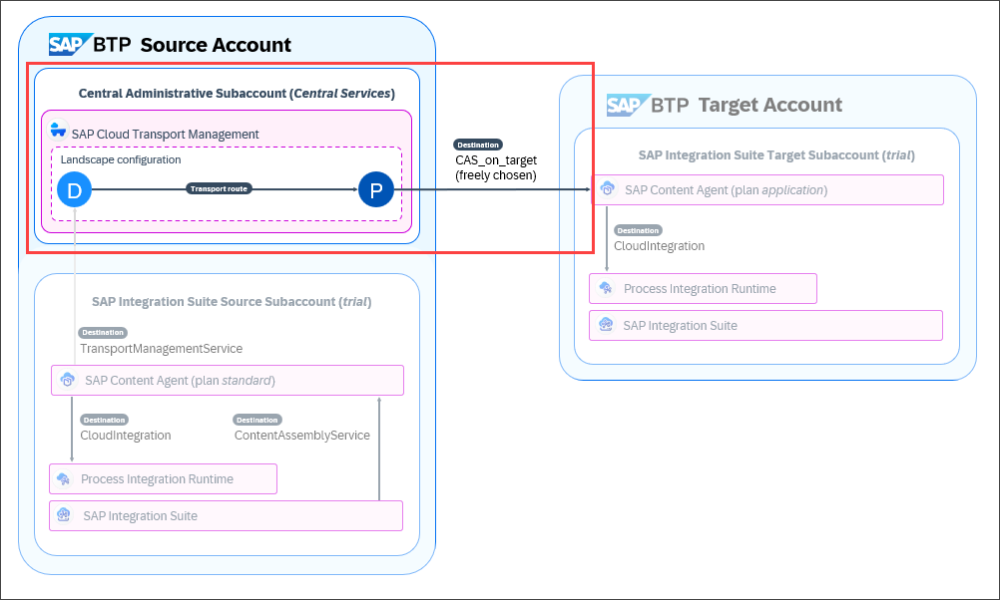

---

### Open the SAP BTP Cockpit

>This step assumes that you're running the tutorial in the SAP BTP Trial account. If you have an enterprise account, open SAP BTP Cockpit in your enterprise account in the subaccount that's subscribed to SAP Cloud Transport Management service. 

1. To access SAP BTP Cockpit of your trial account, go to your [SAP BTP Trial landing page](https://account.hanatrial.ondemand.com/trial/#/home/trial) and choose **Go To Your Trial Account**. (The name of the button may vary.)
   

2. In this tutorial, you will use the **Central Services** subaccount that's subscribed to SAP Cloud Transport Management service.

    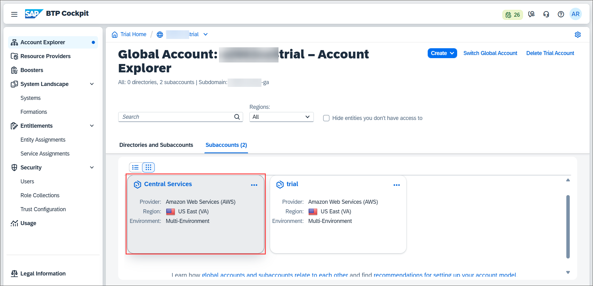

### Create a Transport Destination

The transport destination defines the endpoint of SAP Content Agent service in the target account. The name of the destination is not fixed.

>Make sure that you have the details of the **service key of the SAP Content Agent instance** in the **target** subaccount at hand that you created in [Set Up the SAP Integration Suite Target Subaccount](btp-transport-management-cpi-03-set-up-target-account). 

1. In the **Central Services** subaccount, choose **Connectivity > Destinations** (1). To create a new destination, choose **Create Destination** (2).

    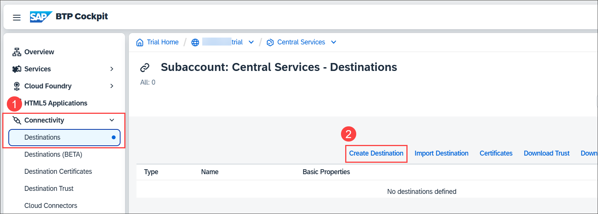

3. In the **Destination Configuration** window, enter details for the following fields (1), and save the entries (2):
    >Keep the values of fields not mentioned in the table unchanged.

    | Field | Value |
    | ---------- | ------------- |
    | **Name** | Enter a name, for example: `CAS_on_target` |
    | **Description** | For example: `Content Agent on Target` |
    | **URL** | Enter the value of the `url` from the details of the service key of the SAP Content Agent instance in the target subaccount that you created in [Set Up the SAP Integration Suite Target Subaccount](btp-transport-management-cpi-03-set-up-target-account). For example: `https://content-agent-engine.cfapps.us10.hana.ondemand.com` |
    | **Authentication** | Select **OAuth2ClientCredentials**. |
    | **Client ID** | Enter the value of `clientid` from the `uaa` section of the service key details. |
    | **Client Secret** | Enter the value of the `clientsecret` from the `uaa` section of the service key details. |
    | **Token Service URL** | Enter the value of `url` from the `uaa` section of the service key details and append `/oauth/token` to the URL. For example: `https://87654321trial.authentication.us10.hana.ondemand.com/oauth/token` |

    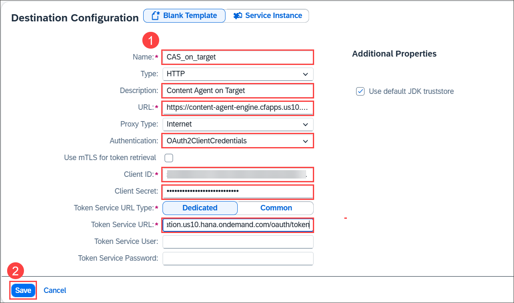

4. The destination was created.

    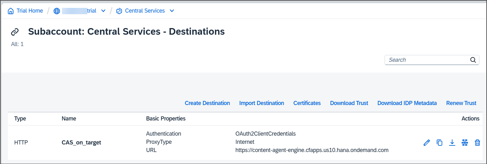

See also on SAP Help Portal: [Create Target Node Destination](https://help.sap.com/docs/CONTENT_AGENT_SERVICE/ae1a4f2d150d468d9ff56e13f9898e07/06bd9e2d55084eaf9235844118ddb84c.html)

### Configure the Integration Suite Transport Landscape  

Perform this step in the SAP Cloud Transport Management UI.

1. In the **Central Services** subaccount, choose **Services > Instances and Subscriptions** (1). To open the UI of SAP Cloud Transport Management service, click on the link or the icon (2).

    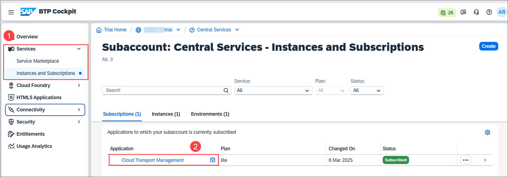

2. The UI opens in a new browser tab or window. The first time you open the service, the home screen is empty. To configure the landscape, select **Landscape Visualization** from the navigation on the left.
    
    

3. Start by creating the transport node that acts as the logical representation of your SAP Integration Suite source subaccount, here **DEV_NODE**. To do this, choose the **+** icon (1). On the **Create Node** dialog, enter details for the following fields (2-3), and click **OK** (4):
    >You can keep the values of fields not mentioned in the table unchanged.  

    | Field | Value |
    | ---------- | ------------- |
    | **Name** (2)| Enter a name, here: `DEV_NODE` |
    | **Description**| This field is optional. For example: `SAP Integration Suite source (development) node` |
    | **Allow Upload to Node** (3)| Select the checkbox. |

    

4. The `DEV_NODE` is created and is now visible on the canvas. To create the transport node that acts as the logical representation of your SAP Integration Suite target subaccount, choose the **+** icon.
    
    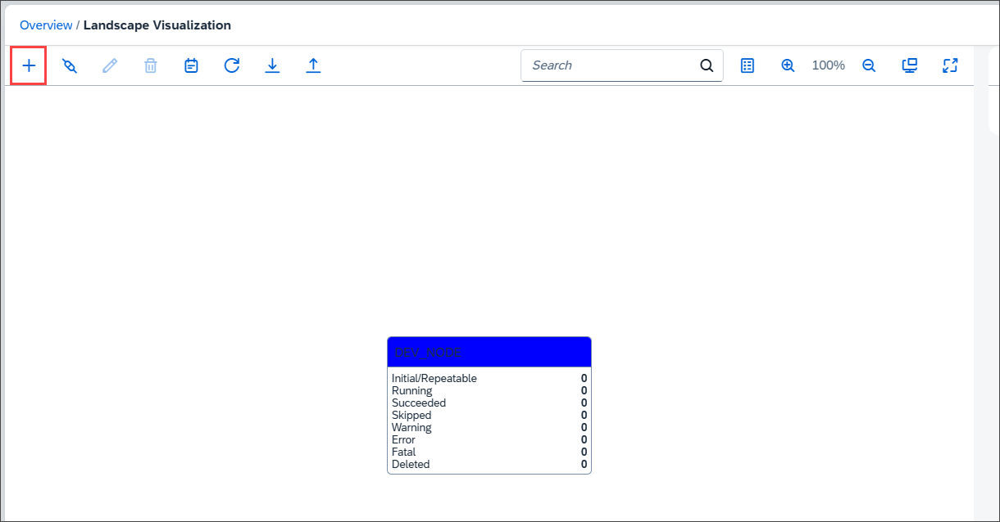

5.  For target nodes, select the following details that are relevant for the transport and the deployment of the content in the target subaccount (1-3). Afterwards, choose **OK** (4). 
    >You can keep the values of fields not mentioned in the table unchanged.

    | Field | Value |
    | ---------- | ------------- |
    | **Name** (1)| here `TARGET_NODE`|
    | **Description** | This field is optional. For example, `SAP Integration Suite target node`. |
    | **Content Type** (2) | Select the type of content that is transported. For SAP Integration Suite, this is **Multi-Target Application**. |
    | **Destination** (3) | Select the destination that points to SAP Content Agent service in the target subaccount. Here, this is **CAS_on_target**. |

    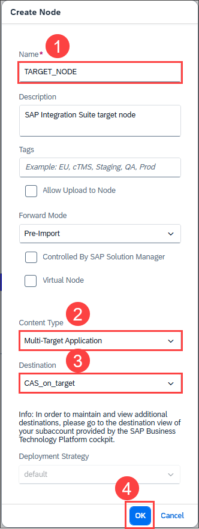

6.  The target node is created and is also visible on the canvas. To create a transport route to connect the two nodes, choose the connector icon.
   
    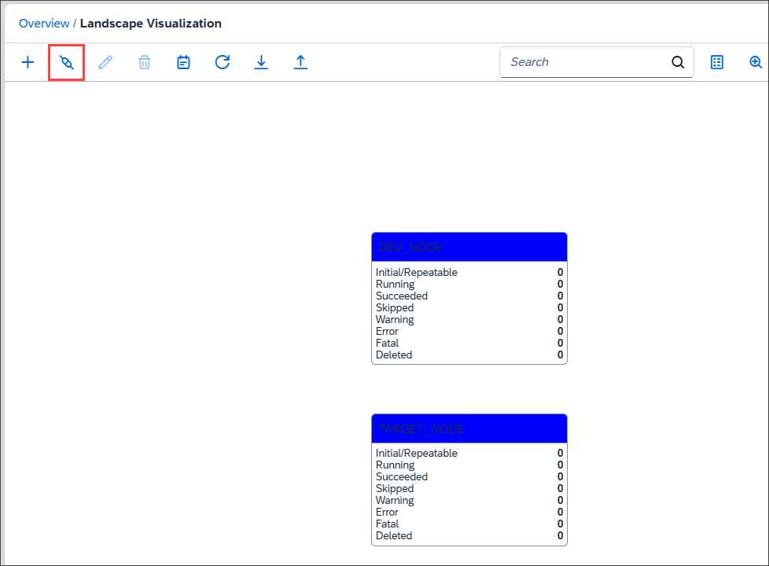

7.  On the **Create Route** dialog, enter a name for the transport route, here `CPI_DEV_TARGET` (1), select the source node `DEV_NODE` (2) and the target node `TARGET_NODE` (3), and click **OK** (4).
    
    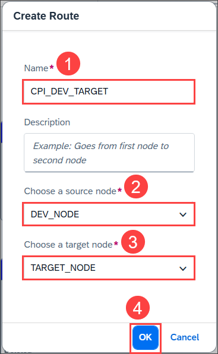

    The transport route is created.
    
    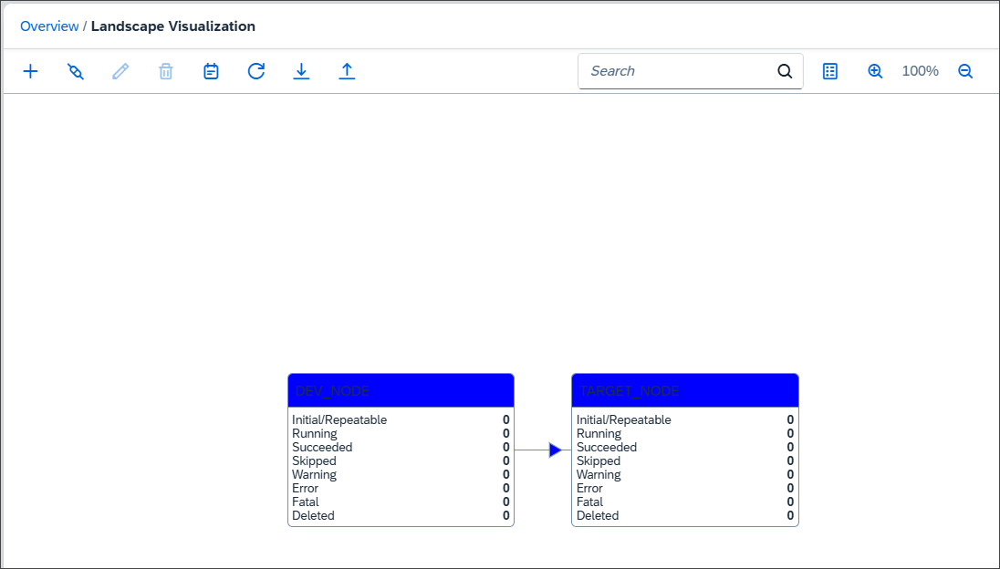

You've configured the transport landscape. When you export content from your SAP Integration Suite source subaccount, the content is automatically forwarded from the DEV_NODE to the TARGET_NODE. Once it's in the TARGET_NODE, you can decide when to import the content into your SAP Integration Suite target subaccount.

See also on SAP Help Portal: [Configuring the Landscape](https://help.sap.com/docs/TRANSPORT_MANAGEMENT_SERVICE/7f7160ec0d8546c6b3eab72fb5ad6fd8/3e7b04236d804a4eb80e42c6360209f1.html)

### Next Step 

To enable SAP Content Agent service to export the integration content to the import queue of SAP Cloud Transport Management service, establish an export connection to SAP Cloud Transport Management by creating a destination in the SAP Integration Suite source subaccount.  

[Establish an Export Connection from SAP Content Agent Service in the Source Subaccount to SAP Cloud Transport Management Service](btp-transport-management-cpi-05-create-ctms-destination)

