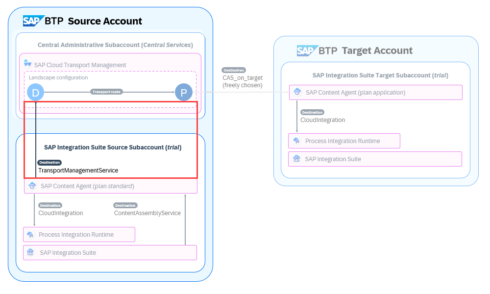
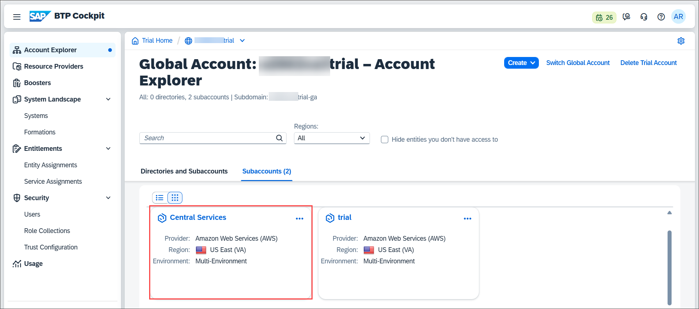
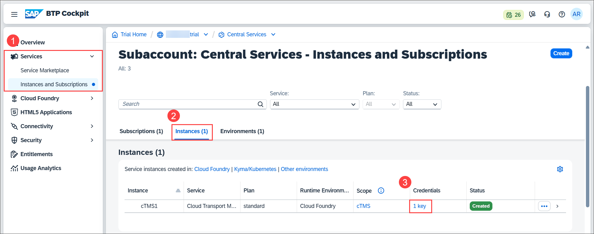
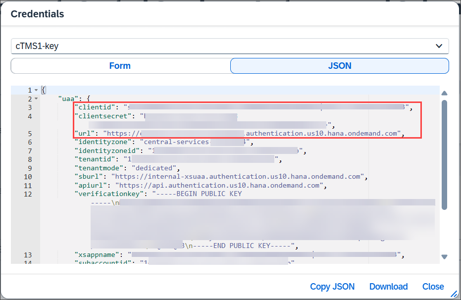
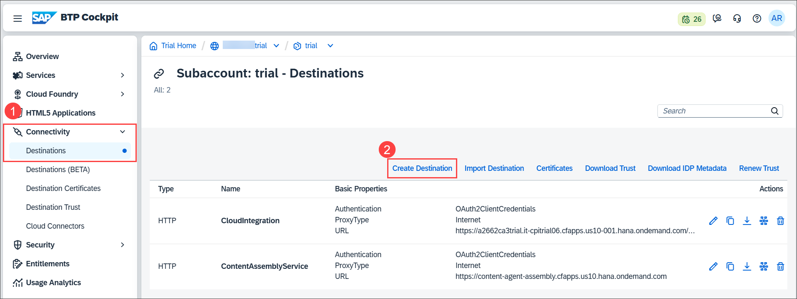
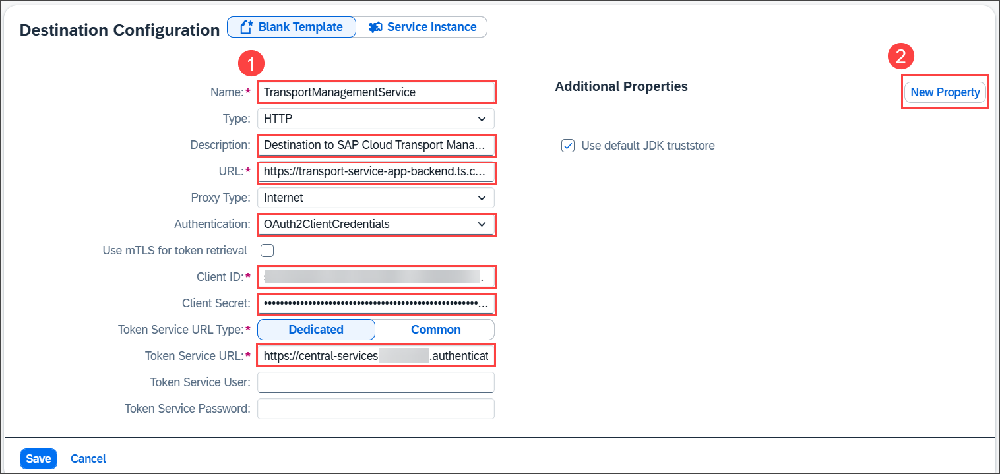
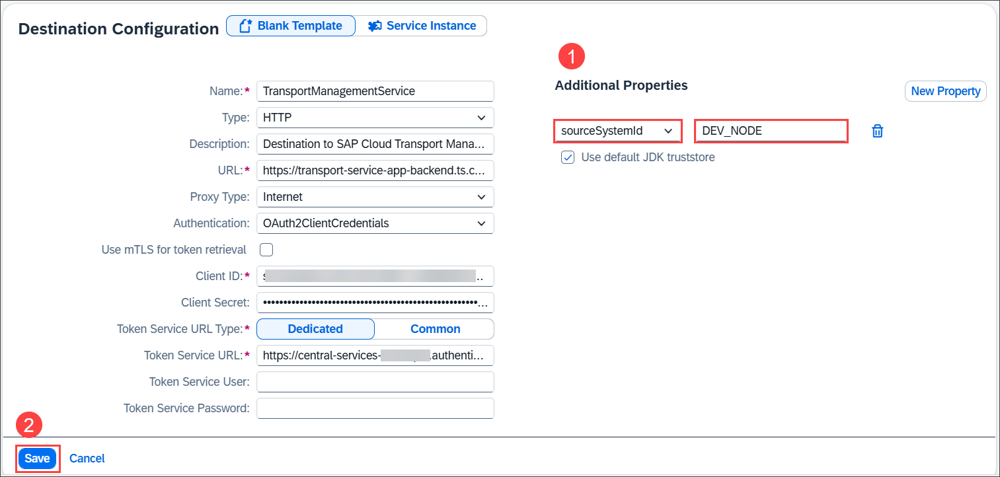

# Establish an Export Connection from SAP Content Agent Service in the Source Subaccount to SAP Cloud Transport Management Service 

<!-- description --> To enable SAP Content Agent service to export the integration content to the import queue of SAP Cloud Transport Management service, establish an export connection to SAP Cloud Transport Management by creating a destination in the SAP Integration Suite source subaccount.

## Prerequisites

   - You've completed tutorial [Create a Transport Destination and Configure the SAP Integration Suite Transport Landscape](btp-transport-management-cpi-04-connect-source-and-target).
   - You have the details of the service key of the SAP Cloud Transport Management instance at hand that you created as part of tutorial [Get Started with SAP Cloud Transport Management](btp-transport-management-getting-started).

## You will learn
   - How to create the destination to SAP Cloud Transport Management in the SAP Integration Suite source subaccount 
   

## Scenario Overview

The destination to SAP Cloud Transport Management service defines the endpoint of SAP Cloud Transport Management service. It contains the entry node of the transport landscape. Like this, SAP Content Agent service knows where to transfer the packaged integration content. The destination has the fixed name `TransportManagementService`.

   

---

### Open the SAP BTP Cockpit

>This step assumes that you're running the tutorial in the SAP BTP Trial account. If you have an enterprise account, open SAP BTP Cockpit in your enterprise account that you use as the source. 

1. To access SAP BTP Cockpit of your trial account, go to your [SAP BTP Trial landing page](https://account.hanatrial.ondemand.com/trial/#/home/trial) and choose **Go To Your Trial Account**. (The name of the button may vary.)

### Get the Details of the SAP Cloud Transport Management Service Instance 

Before you start creating the destination to SAP Cloud Transport Management service, make sure that you have the details of the service key of the SAP Cloud Transport Management instance at hand that you created as part of tutorial [Get Started with SAP Cloud Transport Management](btp-transport-management-getting-started). To do this, proceed as follows:

1. In your SAP BTP source account, go to the central administrative subaccount. To do this, click on the **Central Services** tile.

    

2. Choose **Instances and Subscriptions** (1). On the **Instances** tab (2), click on the key link (3).

    

3. The key looks as follows. Leave the service key open so that you copy the required values in the next step, or note down the values of `uri` (you have to scroll down), as well as `clientid`, `clientsecret`, and `url` from the `uaa` section.   
   
    

### Create a Destination to SAP Cloud Transport Management in the SAP Integration Suite Source Subaccount 

1. Open the SAP Integration Suite source subaccount **trial** in a new tab.

    

2. Choose **Connectivity > Destinations** (1). The two existing destinations are displayed. To create a new destination, choose **Create Destination** (2).

    

3. In the **Destination Configuration** window, enter details for the following fields (1), and then choose **New Property** to add an additional property (2). 
    >Keep the values of fields not mentioned in the table unchanged.

    | Field | Value |
    | ---------- | ------------- |
    | **Name** | `TransportManagementService` |
    | **Description** | For example: `Destination to SAP Cloud Transport Management` |
    | **URL** | Enter the value of the `uri` from the service key details (scroll down to the bottom of the service key). For example: `https://transport-service-app-backend.ts.cfapps.us10.hana.ondemand.com` |
    | **Authentication** | Select **OAuth2ClientCredentials**. |
    | **Client ID** | Enter the value of `clientid` from the `uaa` section of the service key details. |
    | **Client Secret** | Enter the value of the `clientsecret` from the `uaa` section of the service key details. |
    | **Token Service URL** | Enter the value of `url` from the `uaa` section of the service key details and append `/oauth/token` to the URL. For example: `https://cpi-dev-12345678.authentication.us10.hana.ondemand.com/oauth/token` |

    

4. As the additional property, enter `sourceSystemId`, and as the value, enter `DEV_NODE` (1). Save the destination (2).

    

See also on SAP Help Portal: [Create TransportManagementService Destination](https://help.sap.com/docs/CONTENT_AGENT_SERVICE/ae1a4f2d150d468d9ff56e13f9898e07/eed66f35f9d148c8ae5b2d46ff097d8c.html)

### Next Step

To enable the transport, assign a transport-related role collection to your user and to all users that work with integration content, and enable the transport in the SAP Integration Suite user interface.  

[Enable the Transport in SAP Integration Suite](btp-transport-management-cpi-06-enable-the-transport)