# Enable the Transport in SAP Integration Suite

<!-- description --> To enable the transport, assign a transport-related role collection to your user and all users that work with integration content, and enable the transport in the SAP Integration Suite user interface.

## Prerequisites

   - You've completed tutorial [Establish an Export Connection from SAP Content Agent Service in the Source Subaccount to SAP Cloud Transport Management Service](btp-transport-management-cpi-05-create-ctms-destination).

## You will learn
   - How to create a role collection and assign a transport-related role template to it
   - How to assign users to the role collection
   - How to enable the transport using SAP Cloud Transport Management service in the SAP Integration Suite user interface
   

## Scenario Overview

All users developing integration content and transporting it, need the permissions of the **WorkspacePackagesTransport** role. You create a role collection and assign the transport-related role template to it. You assign your user to the role collection.  
Before you can start transporting content, you enable the transport in SAP Integration Suite. To do this, you specify the transport mode as **Transport Management Service** in the SAP Integration Suite UI. This setting determines that integration content will be transported using SAP Cloud Transport Management service.   

   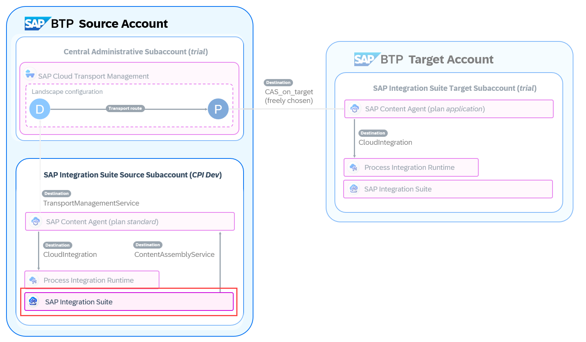

---

### Open the SAP BTP Cockpit

>This step assumes that you're running the tutorial in the SAP BTP Trial account. If you have an enterprise account, open SAP BTP Cockpit in your enterprise account that you use as the source account. 

1. To access SAP BTP Cockpit of your trial account, go to your [SAP BTP Trial landing page](https://account.hanatrial.ondemand.com/trial/#/home/trial) and choose **Go To Your Trial Account**. (The name of the button may vary.)
   
2. In this tutorial, you will use the **trial** subaccount.

    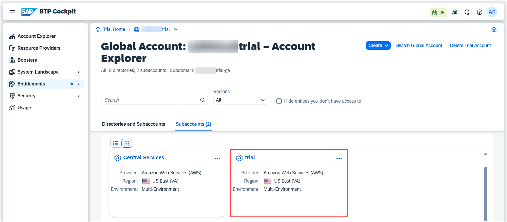

### Assign Transport-Related Role Collection to SAP Integration Suite Users

SAP Integration Suite users who will use the transport function, need the permissions of the **WorkspacePackagesTransport** role template. In this step, you create a role collection based on the corresponding role template and assign it to your user (and other users, if needed).  

1. In the **trial** subaccount, choose **Security > Role Collections** (1). To create a new role collection, choose **Create** (2).

    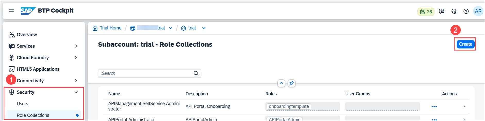

2. Enter a name for the new role collection, here `CPI-Transport` (1). Choose **Create** (2).

    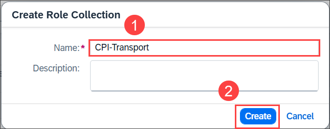

3. The role collection was created. You see it in the list of role collections that's filtered by *transport* here. To add the corresponding role template and assign users, click anywhere in the row. 

    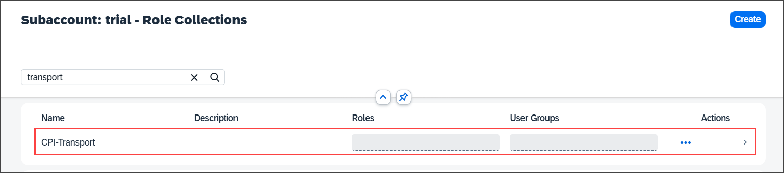

4.  In the role collection details, choose **Edit**.

    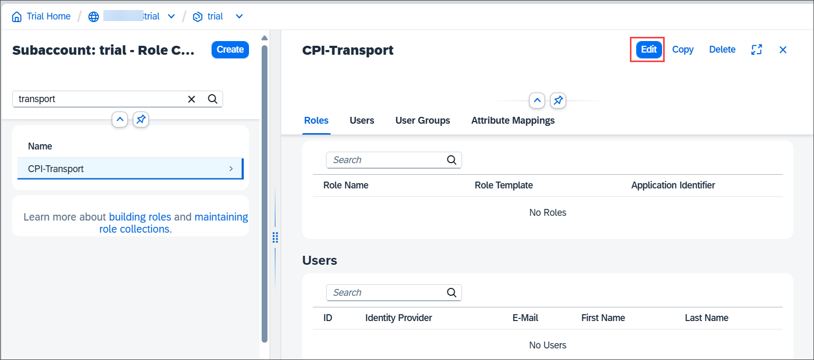
 
5.  You're now in edit mode. To add the role template, click in the entry field in the **Role Name** column.

    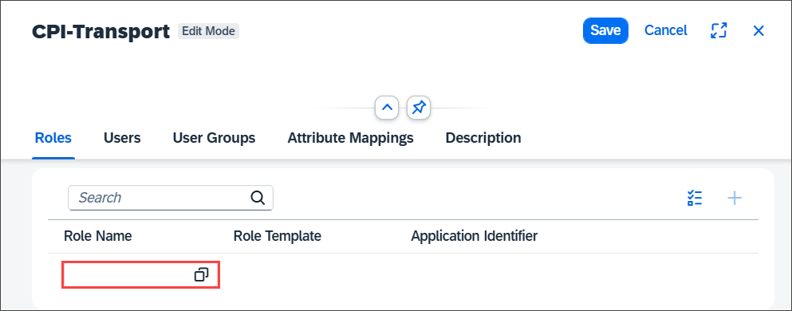

6.  Filter for **WorkspacePackagesTransport** and select the role template from the dropdown menu (1). Select this role template (2) and choose **Add** (3).

    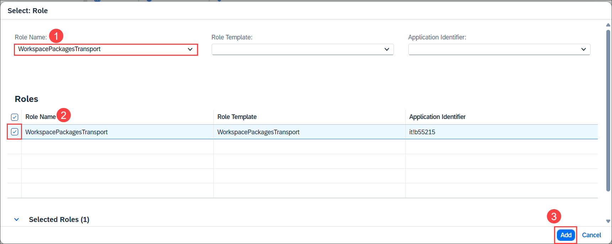

8.  The role was added to the role collection. To add the role collection to individual users who will transport integration content, start with your user. Enter your email address in the **ID** field in the **Users** section, and choose `Enter` (1). To add other users that also need this role use the **+** icon and repeat the previous step. To finish, choose **Save** (2). 

    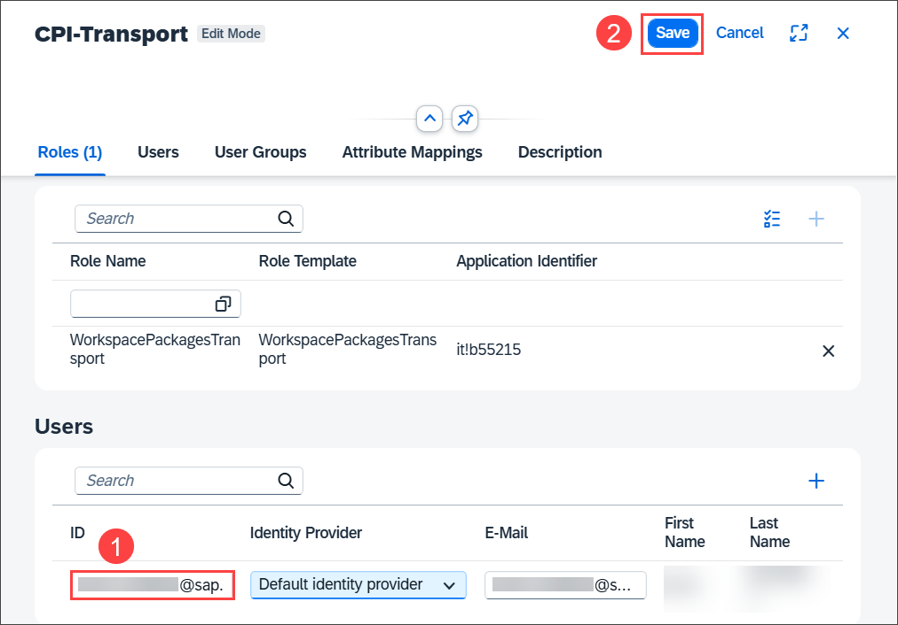

9.  Your user (and others, if you've added more) now has the permissions to transport integration content.

    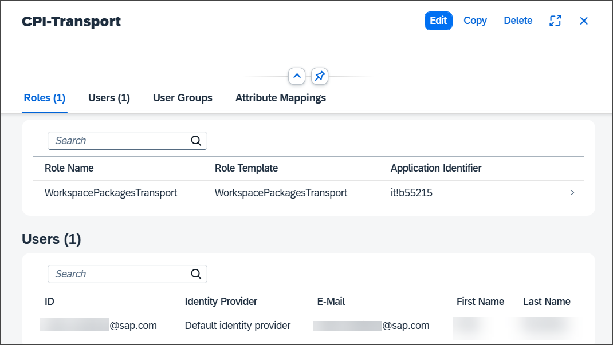

See also on SAP Help Portal: [Configuring User Access to SAP Integration Suite](https://help.sap.com/docs/SAP_INTEGRATION_SUITE/51ab953548be4459bfe8539ecaeee98d/2c6214a3228e4b4cba207f49fda92ed4.html)

### Enable the Transport in the SAP Integration Suite UI

1. In the **trial** subaccount, choose **Services > Instances and Subscriptions** (1). Open the UI of SAP Integration Suite by clicking on the link or the icon (2).

    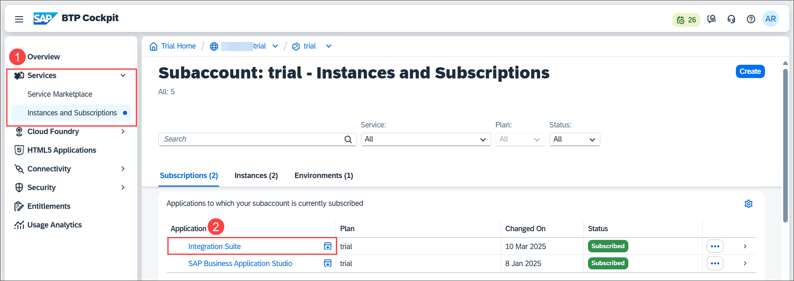

2. The SAP Integration Suite UI opens in a new tab or window. Choose **Settings > Integrations** (1). Go to the **Transport** tab (2), and choose **Edit** (3).
    
    >**Note**: The **Edit** button is at the very bottom right of the UI.  

    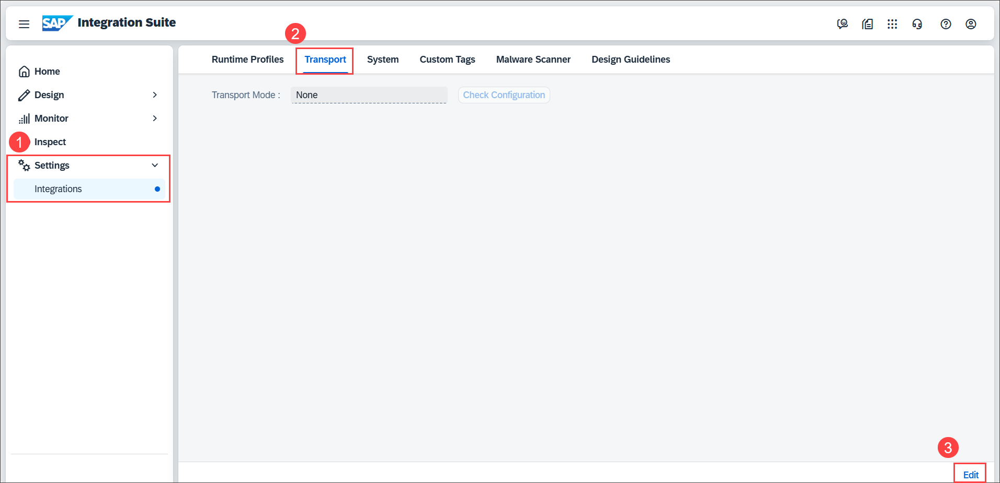

3. By default, no transport mode is selected. Choose **Transport Management Service** from the dropdown (1). Choose **Save** (2).  
    
    >**Note**: The **Save** button is at the very bottom right of the UI.  

    

    You get a success message.

    

4. To verify that SAP Integration Suite can reach the DEV_NODE configured in the SAP Cloud Transport Management destination, choose **Check Configuration**.

    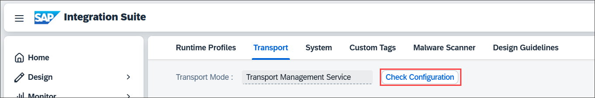

5. The result is presented in the following format. Here, the result is `SUCCESS`. 
   
    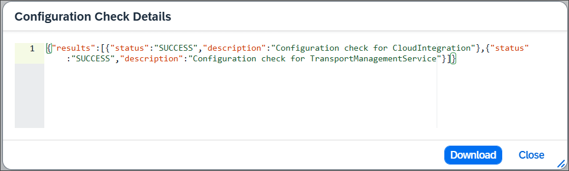

    >If the check is not successful, you get an error message that helps you identify the configuration error.

You've now completed all configuration steps required to transport integration content from your source subaccount to your target subaccount. 

See also on SAP Help Portal: [Content Transport Using Cloud Transport Management](https://help.sap.com/docs/SAP_INTEGRATION_SUITE/51ab953548be4459bfe8539ecaeee98d/d458b172b98d4112a08499541fddfc54.html)
