# Run a Test Transport 
<!-- description --> Test that you've correctly completed all configuration steps required to transport SAP Integration Suite content using SAP Cloud Transport Management service and SAP Content Agent service. 

## Prerequisites
 - You've completed tutorial [Enable the Transport in SAP Integration Suite](btp-transport-management-cpi-06-enable-the-transport).

## You will learn

   - How to run a transport in the configured transport landscape
   

## Scenario Overview

Now that you've completed all configuration steps, you can run a test transport. To do this, you can use any standard content from the **Discover** section in SAP Integration Suite, copy it to the **Design** section, and transport it.  

>First, you need to "discover" the package and copy it to the **Design** section. Otherwise, you won't find any entries in the **Design** section.

   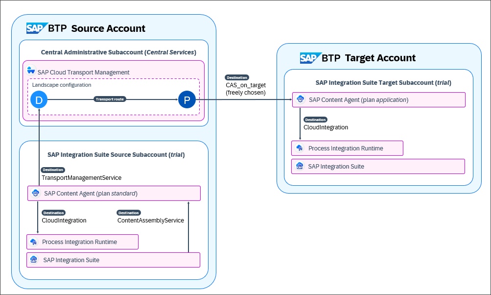

---
### Open the SAP BTP Cockpit

>This step assumes that you're running the tutorial in the SAP BTP Trial account. If you have an enterprise account, open SAP BTP Cockpit in your enterprise account. In this tutorial, you need access to both the SAP BTP source and target accounts.  

1. To access SAP BTP Cockpit of the source SAP BTP trial account, go to your [SAP BTP Trial landing page](https://account.hanatrial.ondemand.com/trial/#/home/trial) and choose **Go To Your Trial Account**. (The name of the button may vary.)
   
    - You will use the **trial** subaccount to go to the SAP Integration Suite UI and start the transport.

    - You will use the **Central Services** subaccount to go to the SAP Transport Management service UI and start the import of the integration content.  

2. To access SAP BTP Cockpit of the target SAP BTP trial account, ask your colleague to log on to their SAP BTP account.  
   
    You or your colleague will use the **trial** subaccount to go to the SAP Integration Suite UI. You'll verify **before** the transport that the integration content doesn't exist in the **Design** section. **After** the transport, you'll verify that it was imported there.

### Start the Transport

You are in the SAP Integration Suite **source** subaccount **trial** in the SAP BTP source account.

1. In the **trial** subaccount, choose **Services > Instances and Subscriptions** (1). Open the UI of SAP Integration Suite by clicking on the link or the icon (2).

    
   
2. In the SAP Integration Suite UI, choose **Discover > Integrations** (1). In the **Discover** section, select any content, here *SAP Cloud for Customer Integration with SAP ERP* (2).  

    >If you don't see the **Discover** section, assign the `PI_Integration_Developer` role to your user (see also step 2 of tutorial [Set Up the SAP Integration Suite Source Subaccount](btp-transport-management-cpi-02-set-up-source-account)).

    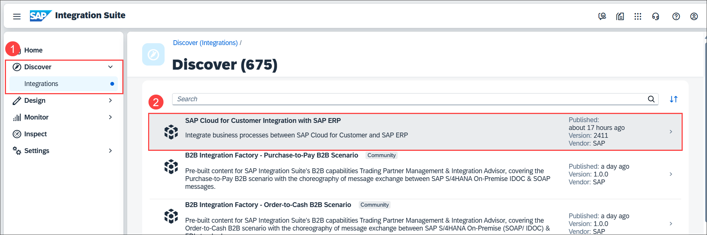   

3. In the detail view of the integration package, choose **Copy**.
    
    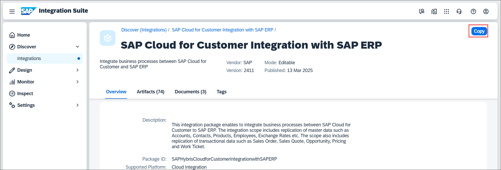   

    As a result, the content will appear in the **Design** section.

4. Choose **Design > Integrations and APIs** (1). Click anywhere in the *SAP Cloud for Customer Integration with SAP ERP* row to go to the detail view (2).

    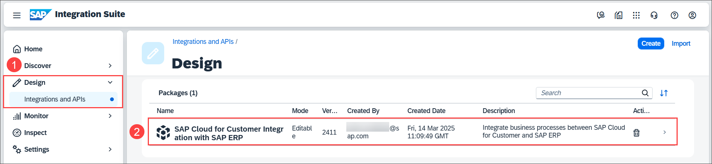

5. The details of the integration flow are displayed. To start the transport, choose **Transport**.

    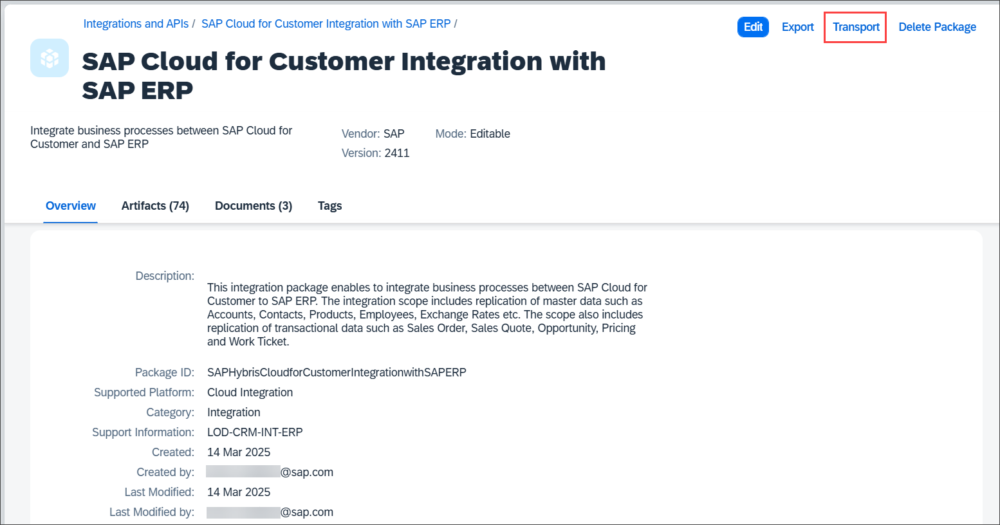

6. On the **Transport** dialog, enter a comment, here `First transport` (1). Select the **Propagate logged-in user as transport owner** checkbox (2), so that your email address will be displayed as **Owner** of the transport request in SAP Cloud Transport Management. Choose **Transport** (3).

    

7. The integration flow was packed into an MTA. It was attached to a transport request and put in the import queue of the target node in SAP Cloud Transport Management service. 

    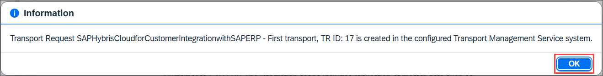

### Verify That Integration Content is Not Available in Target

Verify that the integration flow is not yet available in the **Design** section of SAP Integration Suite in the target subaccount.

You are in the SAP Integration Suite UI in the SAP Integration Suite **target** subaccount **trial**.  

1. You or your colleague: Log on to the **target** SAP BTP account. Select the **trial** tile.

    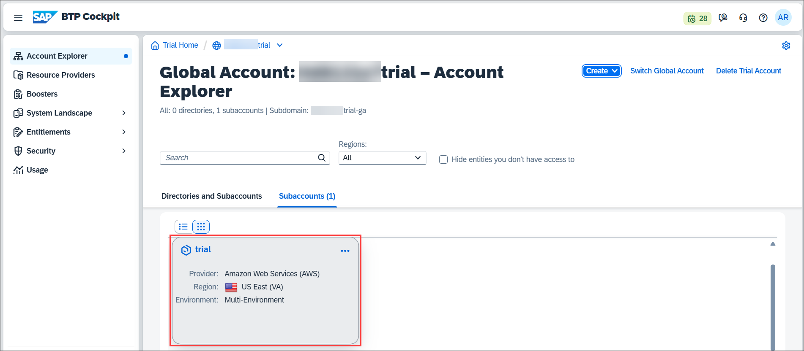

2. Choose **Services > Instances and Subscriptions** (1). Click on the **Integration Suite** link (2).

    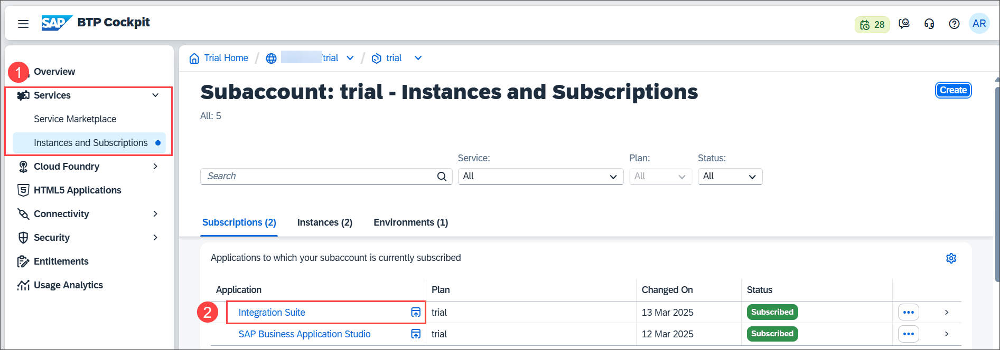

3. The SAP Integration Suite UI opens in a new browser tab or window. Choose **Design > Integrations and API**. The **Design** section in the SAP Integration Suite target is empty.  

    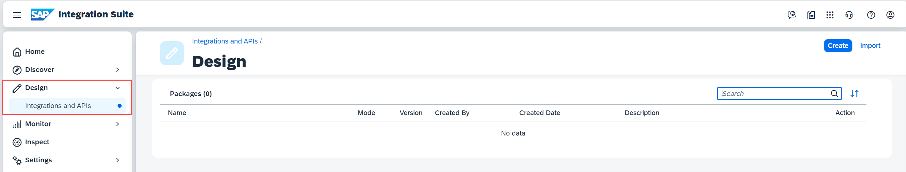

### Import the Integration Content

You are in the SAP Cloud Transport Management UI in the SAP BTP source account in the central administrative subaccount **Central Services**.  

1.  To open the UI of SAP Cloud Transport Management service, in the **Central Services** subaccount, choose **Services > Instances and Subscriptions** (1). Click on the **Cloud Transport Management** link or the corresponding icon to open the UI (2).

    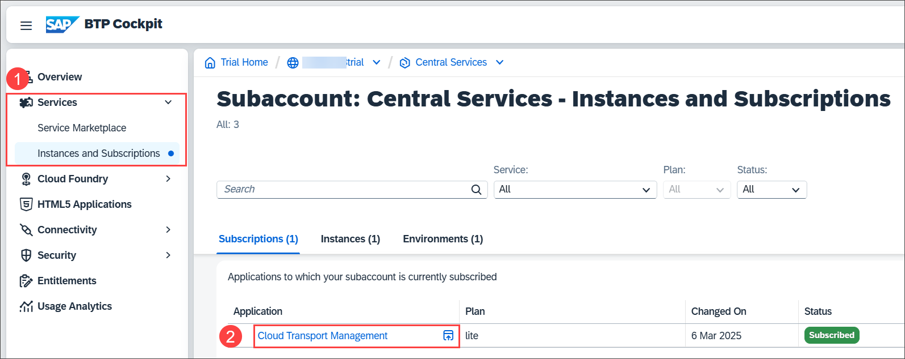

    The SAP Cloud Transport Management service UI opens in a new tab.

2. On the home screen of SAP Cloud Transport Management service, you can see that a transport is pending in the **TARGET_NODE**. Click on this entry. 

    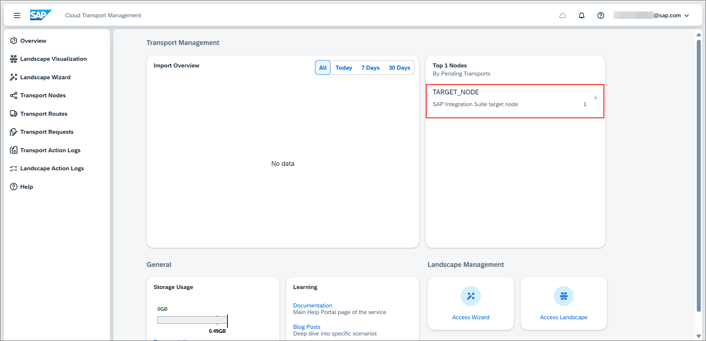

3.  The transport request created for the integration content was added to the import queue of **TARGET_NODE**. The name of the integration package and the comment you entered when you started the transport in SAP Integration Suite is displayed as the **Transport Description**. Your user email address is displayed as the **Owner** of the transport request. To start the import, choose **Import All**. 

    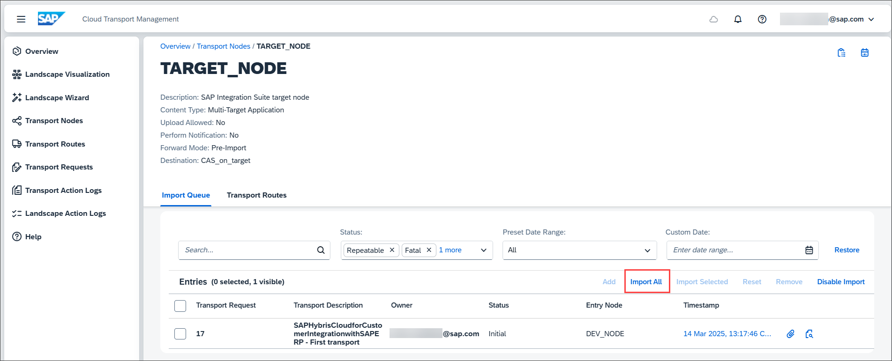

4. Approve the import of the integration content into the target node by choosing **OK**.
    
    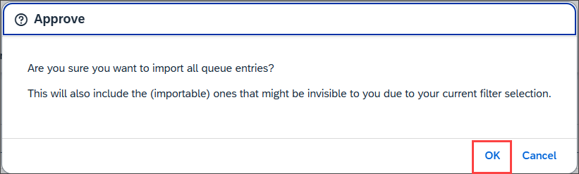

5. When the import is successful, the status of the transport request changes to **Succeeded**. You can display more details about the import in the log of the transport request. To display the log, click on the log icon.

    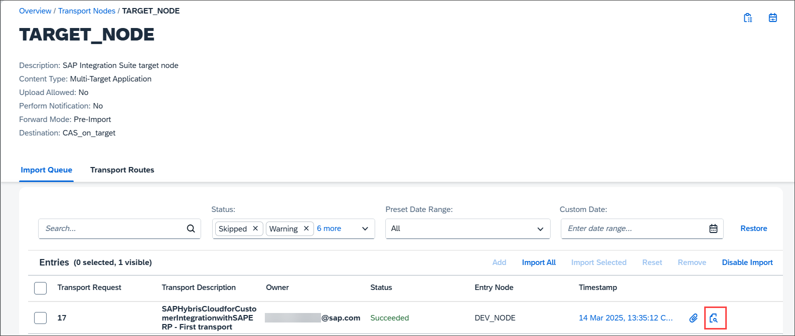

6. The log contains detailed information about the individual import steps. When you scroll down to the end, the log shows that the import has ended with the status **Success**.

    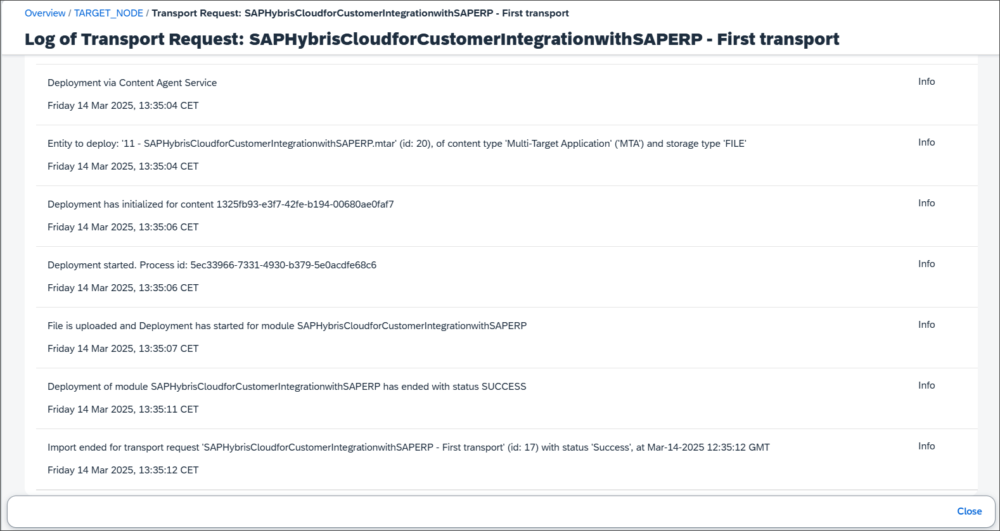

### Verify The Successful Import

You are in the SAP Integration Suite UI in the SAP Integration Suite **target** subaccount **trial**.

1. Return to the SAP Integration Suite UI on the **target** account to verify that the integration content has arrived there. Since you had previously opened the UI, refresh the browser to reload the UI.
2. In the **Design** section in the target subaccount, you can now see the *SAP Cloud for Customer Integration with SAP ERP* integration package. The credentials of the client ID from the SAP Content Agent service key on the target subaccount are displayed as the user who created the integration flow. This way, you can confirm that the integration flow was imported in the target subaccount.

    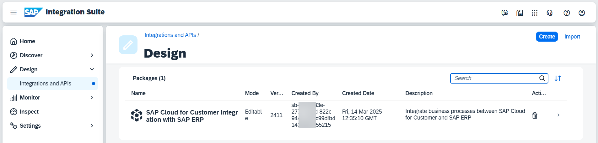

Congratulations! You have successfully set up the scenario to transport SAP Integration Suite content using SAP Cloud Transport Management service and SAP Content Agent. 

The configuration may require some initial effort. However, from now on, all integration content developers can transport their developments in the configured landscape in an automated and traceable way.

If you want to explore the option of using the UI of SAP Content Agent to start the transport of SAP Integration Suite content and the required configuration for this scenario, see [Use the SAP Content Agent Service UI to Start the Transport](btp-transport-management-cpi-08-cas-ui). 

