## Prerequisites  
 - **Proficiency:** Beginner

## Details
### You will learn  
The SAP API Business Hub integration in SAP Build enables you to prototype your applications using real world data structures. Limit the amount of re-design and re-work by using the right data structure from the start.

### Time to Complete
**20 Min**

---

[ACCORDION-BEGIN [Step 1: ](Sign into SAP Build)]

Go to the [SAP Build](https://www.build.me/splashapp/) homepage. Select **Log In** in the top right corner.

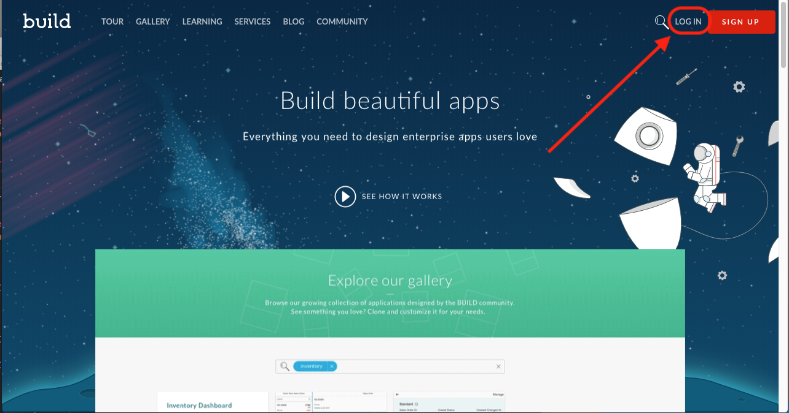

[DONE]
[ACCORDION-END]

[ACCORDION-BEGIN [Step 2: ](Create a new project)]

Under **Projects**, click the **New Project** button to go to the create wizard.

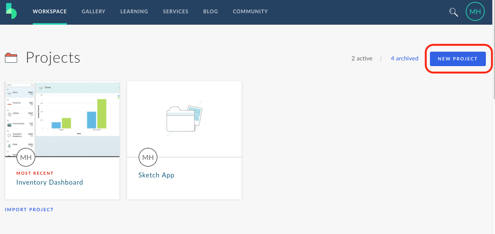

Under the _Start from Scratch_ box, click the **Create New Project** button.

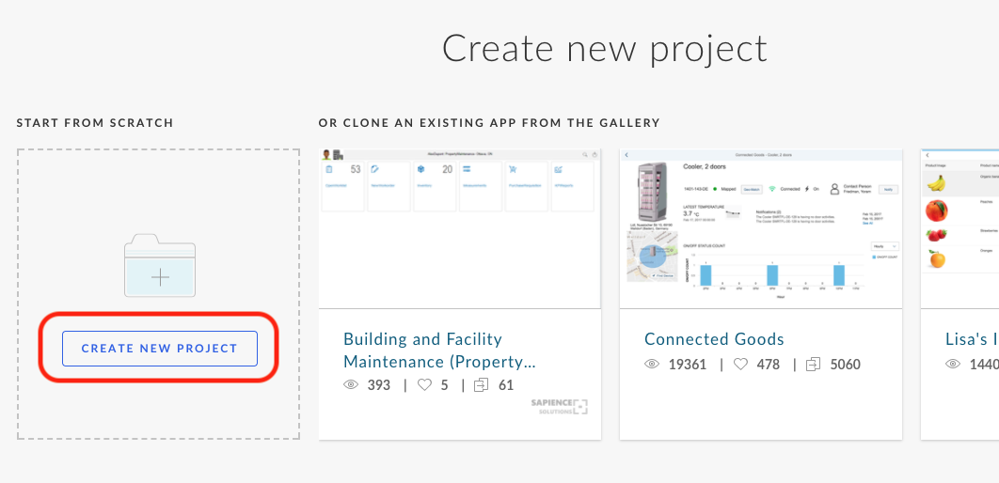

Give the project a **name**.

At the bottom of the screen, find the **Create Project** button. **Click it** to finish creating the project.

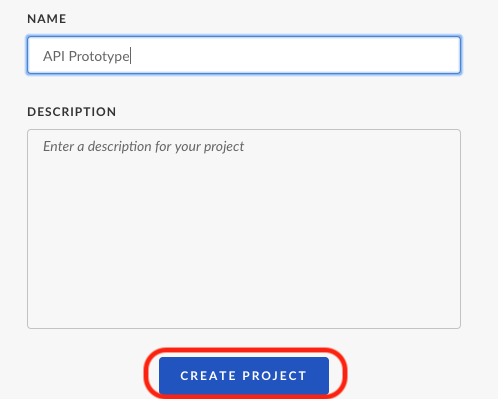

[DONE]
[ACCORDION-END]

[ACCORDION-BEGIN [Step 3: ](Start prototyping)]

In your project overview, select the **Create Prototype** option under the _What do you want to do first?_ section.

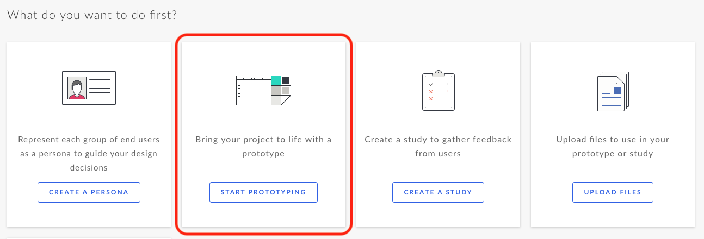

You will see some options to start prototyping. Select the **Freestyle** option so you can design your own prototype in the interactive UI editor.

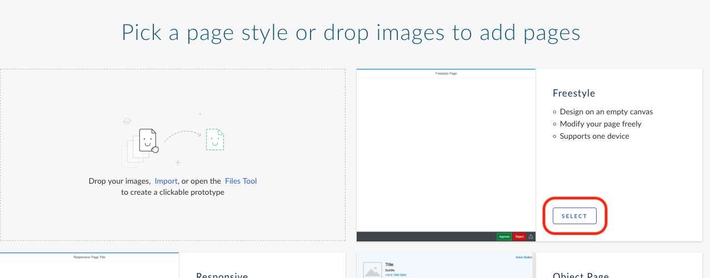

To start editing the page, hover over the page to reveal the **Edit Page** button and **click it**.

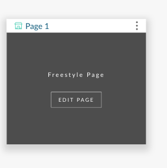

In the UI Editor, you will have a blank screen. Add some controls to the page by searching in the Controls pane on the left side of the screen. Once you find the control you want to add, drag and drop it on to the canvas. Add a **List** control to the page. Search for _list_ in the controls pane.

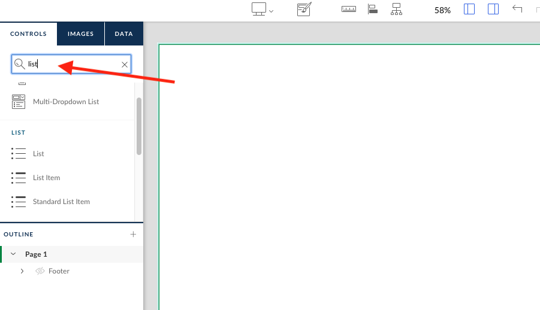

Find the **List** control in the search results. Drag it onto the canvas by clicking the List control and, without releasing the mouse, dropping it on the canvas.

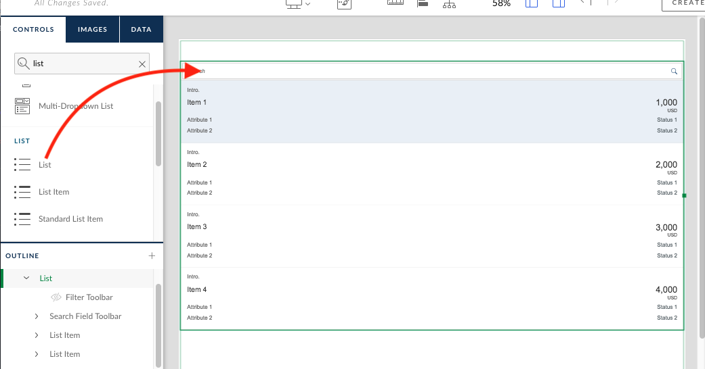

[VALIDATE_3]
[ACCORDION-END]

[ACCORDION-BEGIN [Step 4: ](Explore data sources)]

To add a data model to a prototype, click on the **Data** tab on the left hand side of the screen. There are a couple options for adding a data model. You can use Excel files if you have your own data structure to follow, or you can use an existing SAP service such as an API from the SAP API Business Hub. To import data from the API Hub, **click the Import an API Hub data source** link.

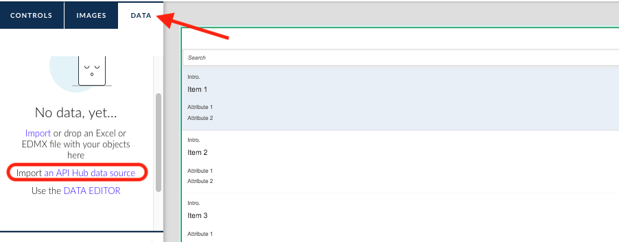

This will bring up the SAP API Business Hub browser. You can search for APIs or filter the APIs to a certain package to find the right data for you.

[DONE]
[ACCORDION-END]

[ACCORDION-BEGIN [Step 5: ](Select a data source)]

In the API Hub browser, select the **SAP Hybris Cloud for Customer - OData API** from the Package dropdown.

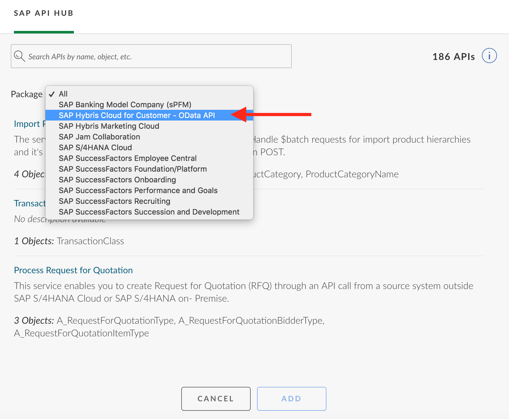

This will filter the list down to 3 API packages. Select the **Product Entity** package. Once it is selected, click **Add**.

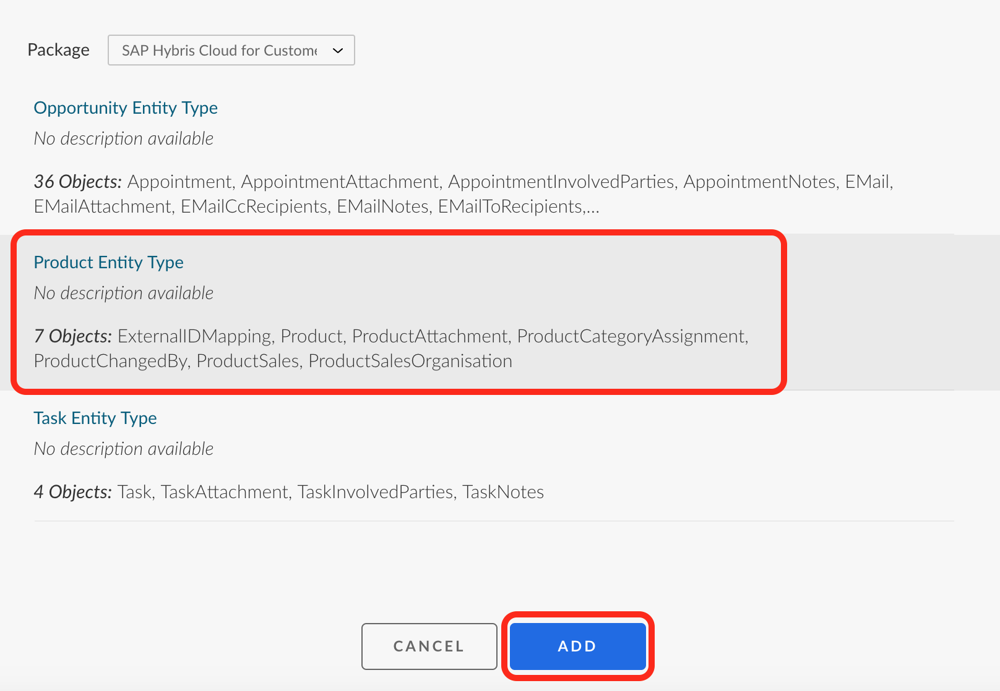

The data structures for the Product API are now available in your Data panel. To bind the data into the list, you can just drag and drop it. Drag the whole **Product** entity and drop it onto the **List control**.

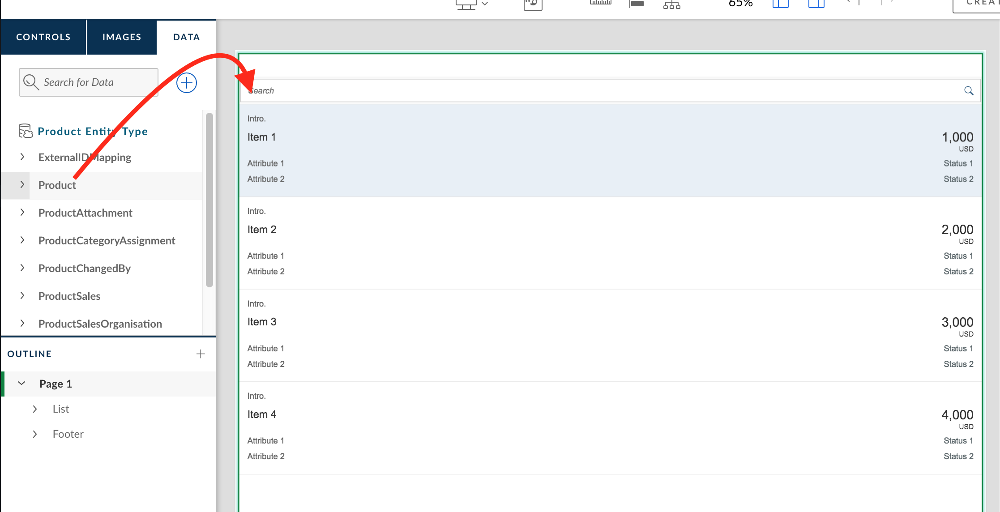

Once you dropped the entity on the list, you list should look like the screenshot below.

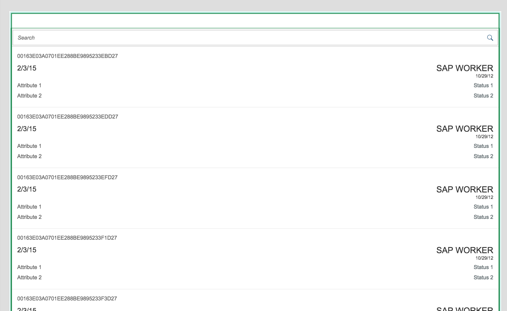

[DONE]
[ACCORDION-END]

[ACCORDION-BEGIN [Step 6: ](Bind data to controls)]

The data that is automatically bound the control is based off the name of the control and the name of the field. Some of the fields bound don't make sense, so you can fix them by dragging the individual field onto the control.

Expand the **Product** object in the Data panel by clicking the arrow next to it.

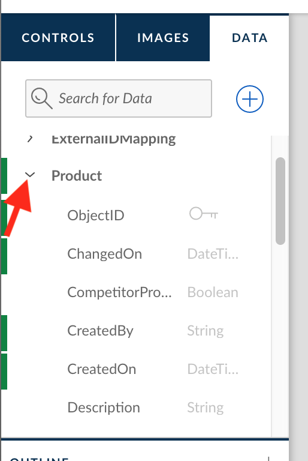

Find the **Description** field. Make that the new title. **Drag the Description field onto the List Item Title control**.

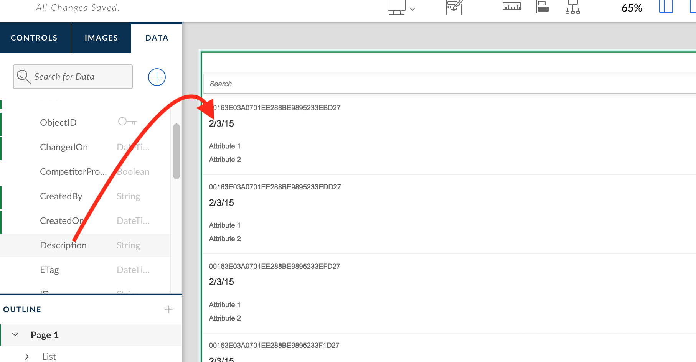

Find the **ID** field. Make that the new introduction. **Drag the ID field onto the List Item Intro control**.

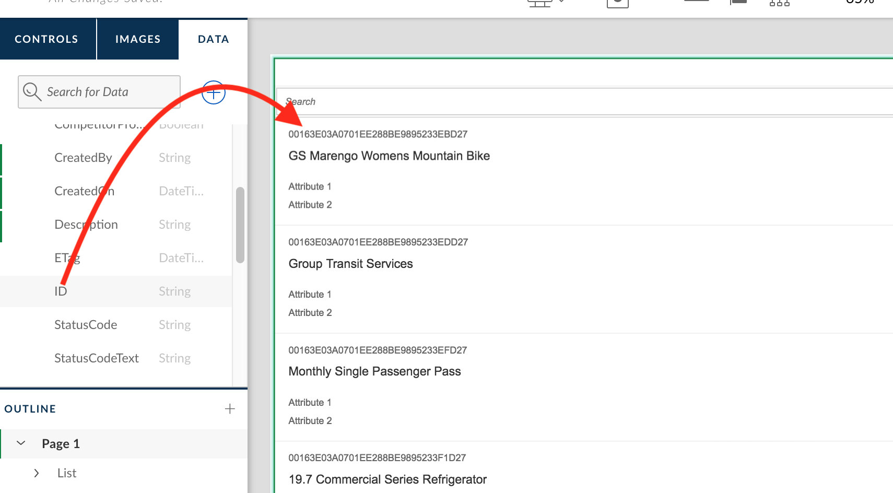

Drag **`UnitOfMeasureText`** and **`StatusCodeText`** onto the Status 1 and Status 2 fields.

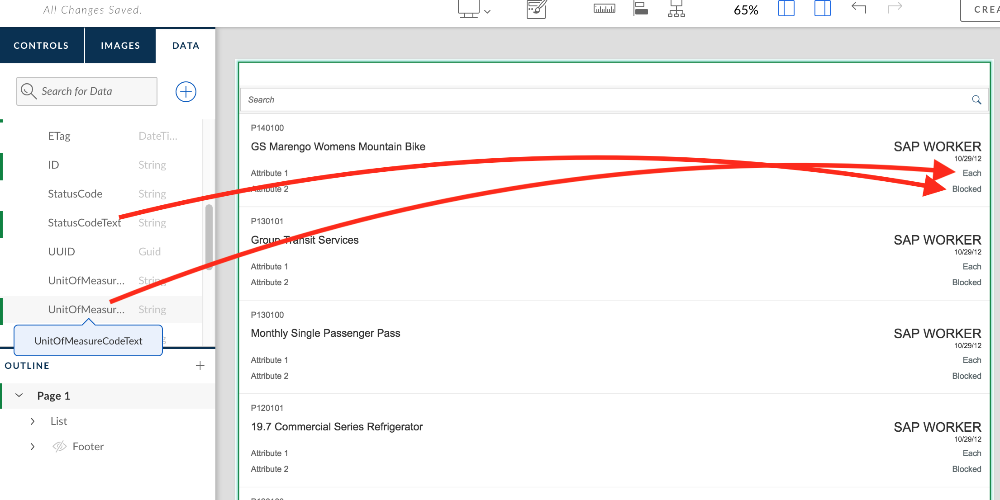

[VALIDATE_6]
[ACCORDION-END]

[ACCORDION-BEGIN [Step 7: ](Live preview your prototype)]

To preview your prototype, click the **Eye icon** in the top right corner.

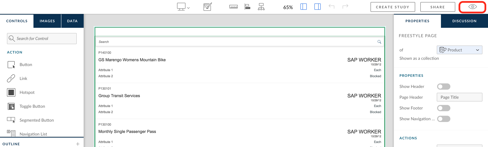

This will load the live preview to show you what your running application could look like.

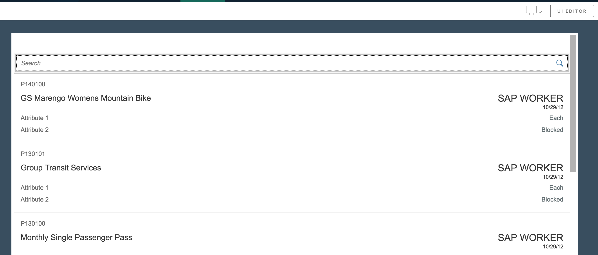

[DONE]
[ACCORDION-END]

---
