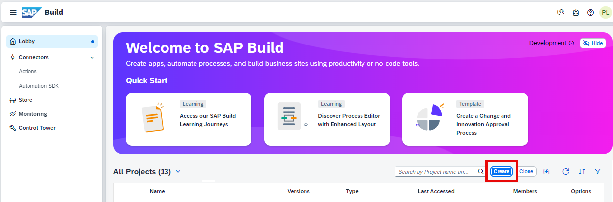
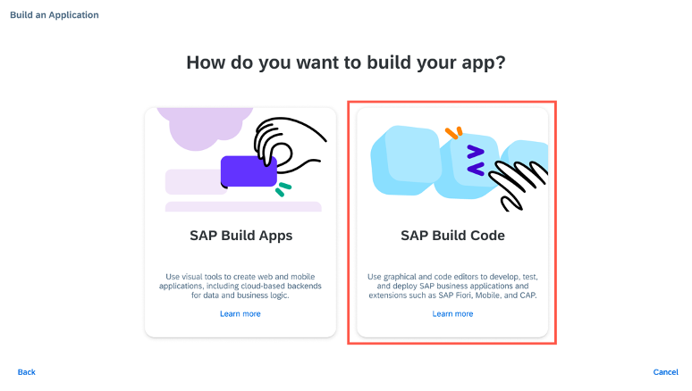
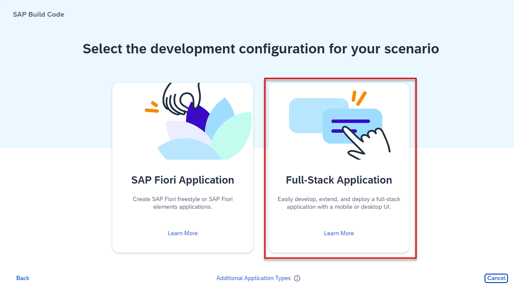
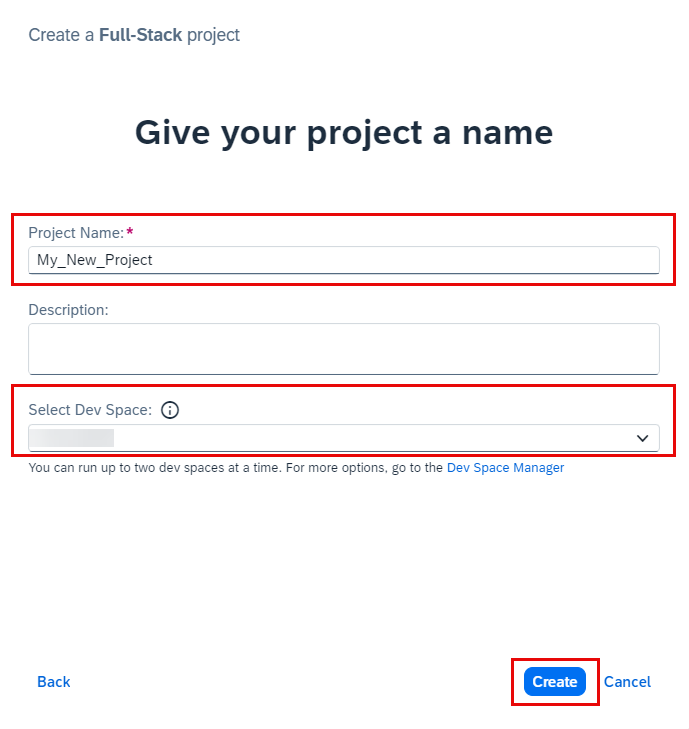
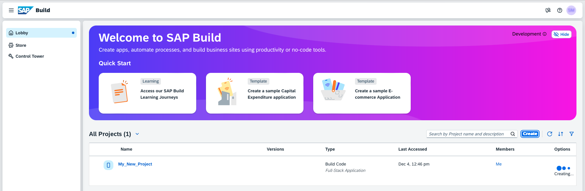
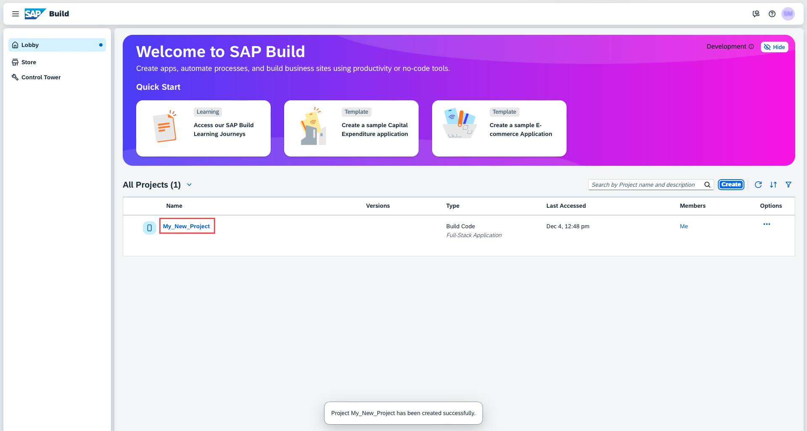

# Create a Full-Stack Project in SAP Build Code
<!-- description --> SAP Build Code is a turnkey development environment that combines runtime and design-time capabilities with built-in solutions for DevOps and Application Lifecycle Management.

## You will learn
- How to create a CAP service with SAP Build Code. 

## Prerequisites
- You have an SAP BTP Trial account ([Get a Free Account on SAP BTP Trial](hcp-create-trial-account))
- You have completed the [Setup SAP Build Code](https://developers.sap.com/tutorials/build-code-setup.html) tutorial. 

### Create a New Project Using SAP Build Code

>**Note** This tutorial assumes that you are using an SAP BTP Trial account. If you are using a different account, some steps might be different.

1. Navigate to the SAP Build lobby.
2. Click **Create** to start the creation process.
 

    <!-- border -->

3. Click the **Build an Application** tile.

    <!-- border -->

4. Click the **SAP Build Code** tile to develop your project in SAP Business Application Studio, the SAP Build Code development environment, leveraging the capabilities of the services included in SAP Build Code.
   
    <!-- border -->

5. Click the **Full-Stack Application** tile.
   
    <!-- border -->

6. Enter a name for your project.

7. Select the dev space where you want the project to reside.
    >SAP Build Code recommends the dev space it deems most suitable, and it will automatically create a new one for you if you don't already have one. If you have other dev spaces of the same type (for example, Full-Stack), you can select between them. If you want to create a different dev space, or a dev space or another type, go to the Dev Space Manager. See [Working in the Dev Space Manager](https://help.sap.com/docs/build_code/d0d8f5bfc3d640478854e6f4e7c7584a/ad40d52d0bea4d79baaf9626509caf33.html?locale=en-US&state=DRAFT&version=SHIP).

8. Click **Create**.
    
    <!-- border -->

    You can see the project being created in the Project table of the lobby.  
    >The creation of the project may take a few moments.

    <!-- border -->

9.  After you see a message stating that the project has been created successfully, click the project to open it.

    <!-- border -->

    The project opens in SAP Business Application Studio, the SAP Build Code development environment.

    <!-- border -->