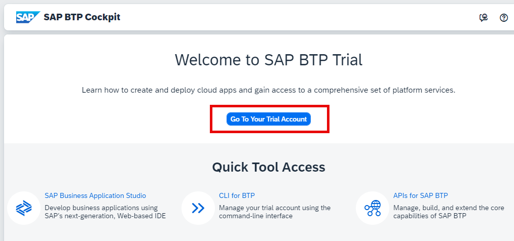
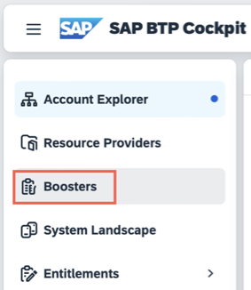
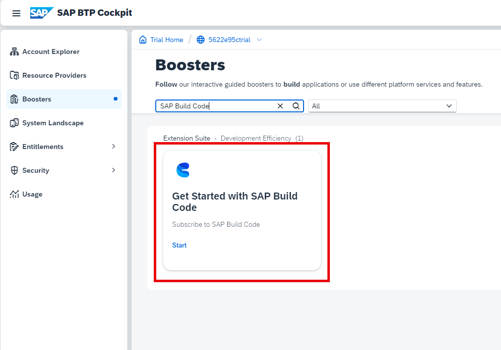
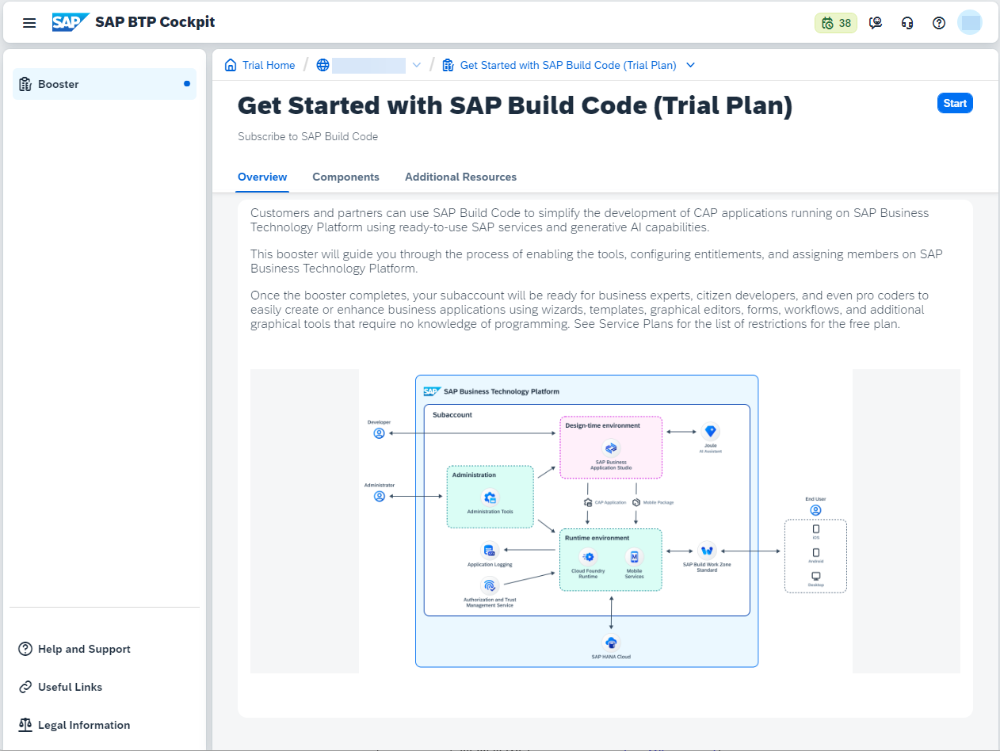
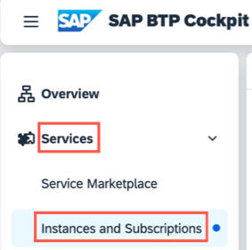
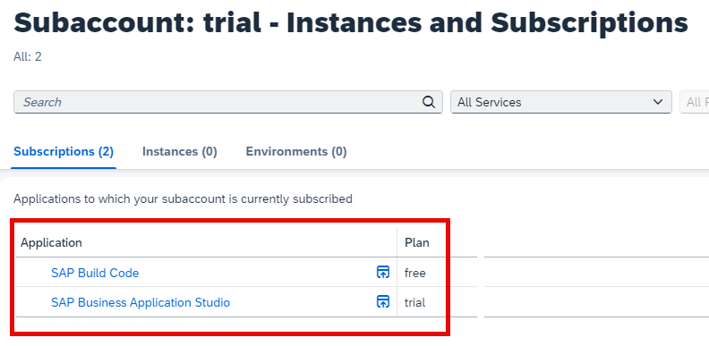

# Setup SAP Build Code in SAP BTP
<!-- description --> SAP Build Code provides generative AI-based code development with Joule copilot, optimized for Java and JavaScript application development. It offers a turn-key environment for coding, testing, integrations, and application lifecycle management.
>**Note** The trial version of SAP Build Code is currently only available in the US10 region. 

Perform these preparatory steps to set up your system for creating your business applications in SAP Build Code.

## You will learn
- How to set up your system to start creating business applications in SAP Build Code.   

## Prerequisites
 - You have an SAP BTP Trial account in the US10 region ([Get a Free Account on SAP BTP Trial](hcp-create-trial-account)) 

### Run the SAP Build Code Booster

>**Notes** This tutorial assumes that you are using an SAP BTP Trial account. If you are using a different account, some steps might be different.  
    

1. Access your [global account](https://account.hanatrial.ondemand.com/) and click **Go To Your Trial Account**.

    <!-- border -->

2. In the navigation pane, click **Boosters**. 

    <!-- border -->
    
3. Search for **SAP Build Code**.
   
    <!-- border -->

    >There is a booster for each of the SAP Build Code service plans. Make sure to select the one relevant to the plan you want to work in.
    
4. Open the booster to see the overview, components, and additional resources, and click **Start**.

   
    <!-- border -->

    The booster checks for required authorizations, compatible providers, and regions, as prerequisites for successful execution.

5. After running the booster, in the popup window, click **Navigate to Subaccount**.
    
    <!-- border -->

### Verify Subscription
1. From the navigation pane, select **Services** > **Instances and Subscriptions**.
   
    <!-- border -->

2. Make sure you are subscribed to SAP Business Application Studio and to SAP Build Code. 

    <!-- border -->

3. Click **SAP Build Code**.

    The SAP Build lobby opens.

    <!-- border -->