# Create a Full-Stack Application with SAP Fiori UI using Joule in SAP Build Code
<!-- description --> In this tutorial, you will use the Generative AI capabilities of Joule to create a CAP service with SAP Build Code. 


## You will learn
- To leverage the power of Joule in SAP Build Code


## Prerequisites
- You have an SAP BTP Trial account ([Get a Free Account on SAP BTP Trial](hcp-create-trial-account)).
- You have completed the [Setup SAP Build Code](https://developers.sap.com/tutorials/build-code-setup.html) tutorial. 


### Create a New Project Using SAP Build Code

>**Note** This tutorial assumes that you are using an SAP BTP Trial account. If you are using a different account, some steps might be different.

1. Navigate to the SAP Build lobby.

2. Click **Create** to start the creation process.  

    <!-- border -->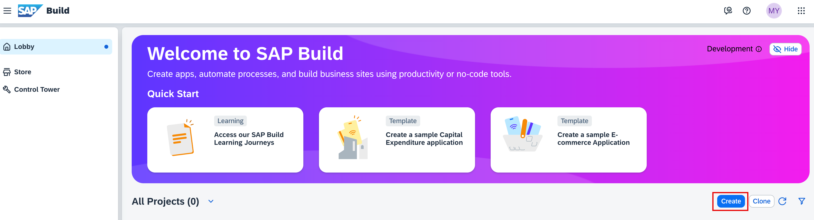

3. Click the **Build an Application** tile.

    <!-- border -->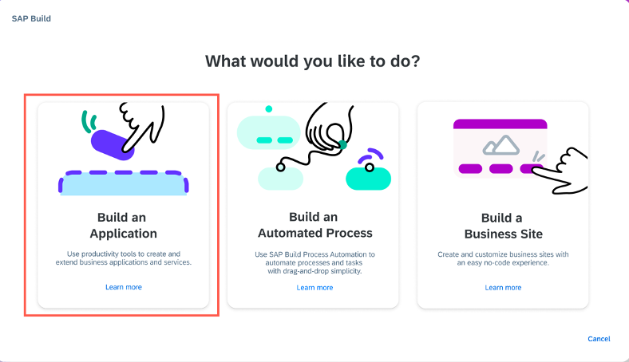

4. Click the **SAP Build Code** tile to develop your project in SAP Business Application Studio, the SAP Build Code development environment, leveraging the capabilities of the services included in SAP Build Code.
   
    <!-- border -->

5. Click the **Full-Stack Application** tile.
   
    <!-- border -->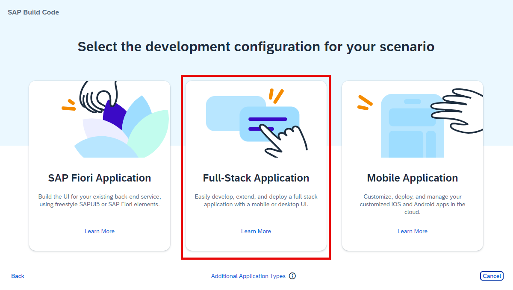

6. Enter a name for your project.

7. Select the dev space where you want the project to reside.
    >SAP Build Code recommends the dev space it deems most suitable, and it will automatically create a new one for you if you don't already have one. If you have other dev spaces of the same type (for example, Full-Stack), you can select between them. If you want to create a different dev space, or a dev space or another type, go to the Dev Space Manager. See [Working in the Dev Space Manager](https://help.sap.com/docs/build_code/d0d8f5bfc3d640478854e6f4e7c7584a/ad40d52d0bea4d79baaf9626509caf33.html?locale=en-US).

8. Click **Create**.
    
    <!-- border -->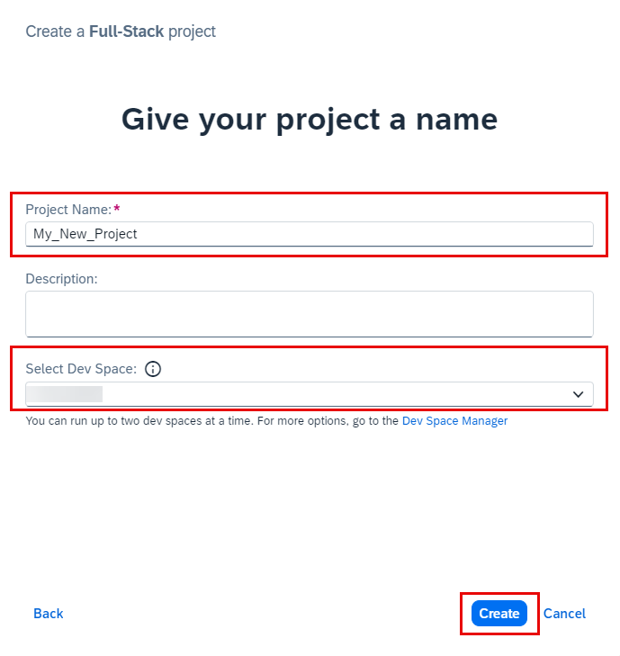

    You can see the project being created in the Project table of the lobby.  
    >The creation of the project may take a few moments.

    <!-- border -->


9.  After you see a message stating that the project has been created successfully, click the project to open it.

    <!-- border -->

    The project opens in SAP Business Application Studio, the SAP Build Code development environment.

    <!-- border -->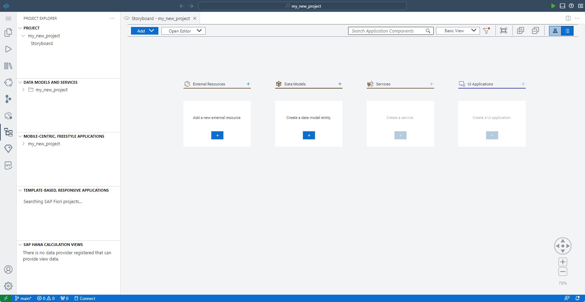


### Create Data Entities with Joule

Let's create an application for a customer loyalty program. The customer can get bonus points by purchasing products and can redeem these points. 

>**Note:** Joule is a Generative AI assistant that will create code for you. The code might be different every time you trigger the prompt, so the examples shown in the tutorial might not be exactly the same as what you see in your system.


1. In SAP Business Application Studio, the SAP Build Code development environment, open the digital assistant, Joule, from the activity bar.

    <!-- border -->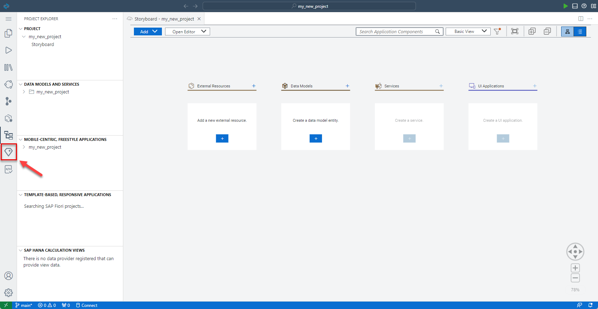

    >If you do not see the icon, click Additional Views and select **Joule** from the list.
    >
    >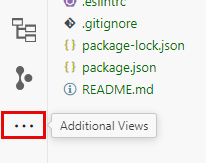


4.  Copy the prompt below.

    ```code
    Design a customer loyalty program application. 
    Define 4 data entities: Customers, Products, Purchases and Redemptions. 
    Each customer must have the following fields: name, email, 7-digit customer number, total purchase value, total reward points, total redeemed reward points. 
    All fields for each customer should be integer except name and email that will be stored as string. 
    Each product should have a name, description and price. 
    Purchases should include the following fields: purchase value, reward points. 
    All fields in Purchases must be integer. 
    Redemptions must have 1 field in integer: redeemed amount. 
    Each purchase and redemption will be associated to a customer. 
    Each purchase will be associated to a product and is called selectedProduct.
    ```

5. At the bottom of the Joule view, select one of the slash commands suggested and then paste the code in the text field.

    <!-- border -->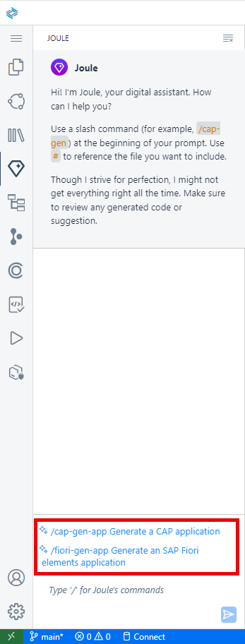 

6. Click the arrow  to send the prompt to Joule.

    <!-- border -->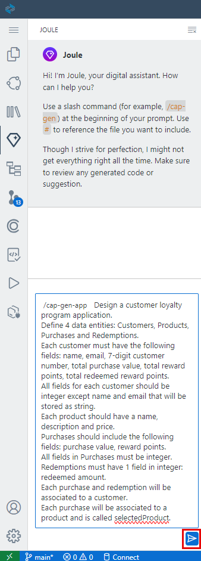 

    The code is generated and is displayed below your prompt. 
    
6. Accept the code. <br/>

    <!-- border -->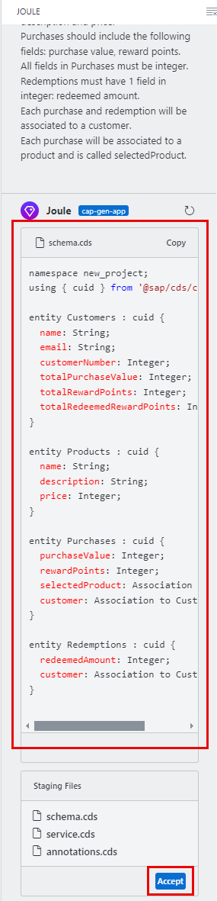
    
    Depending on the server, it may take a few moments for Joule to create the data models and services for you.<br>

    Once you accept the code, you will see the update on the right side in the Storyboard tab.<br>

    >**Tip**: To open the Storyboard, navigate to the **Project Explorer**, expand your project, and select **Storyboard**. 


### Enhance the Application Data Using Joule 

<!-- description --> Joule created the CAP data model and the OData service. In addition, Joule created some data by default. We will now ask Joule to provide additional data.  

1. Click **Open Data Editor**.

    <!-- border -->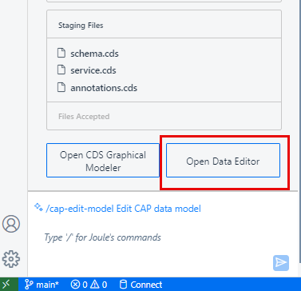

2. In the Data Editor, select the **Customers** data entity, go to the **SAMPLE DATA** tab, and add 5 more rows. Click **Add**.

    <!-- border -->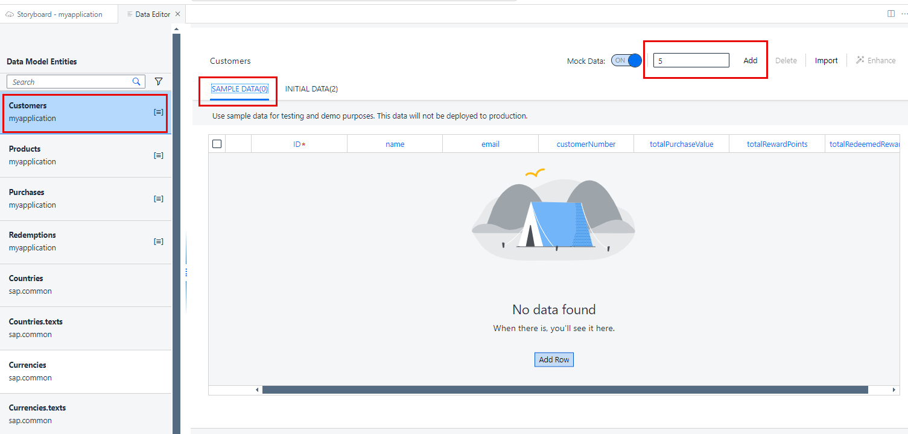


3. Click **Enhance**. This will reopen Joule to modify the application data. 

    <!-- border -->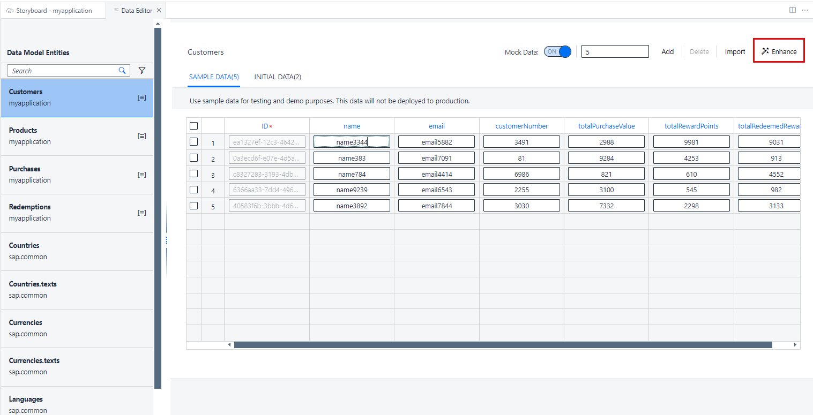

4. Copy the prompt below:

    ```code
    Enhance my sample data with meaningful data. Any phone numbers must be 10 digits long. 
    All customer numbers must be 7 digits long and one customer must use the customer number 1200547. 
    No fields may be empty. 
    Total purchase value must be smaller than 10000 not rounded. 
    Both total reward points and total redeemed reward points must not be rounded, must not be identical. and must always sum to one-tenth of the total purchase value for each customer.
    ```

5. Paste the prompt in the text field, and click the arrow () to send the prompt to Joule.

    <!-- border -->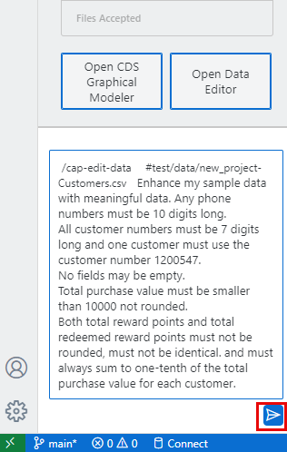 

    The code is generated and is displayed below your prompt.

4. Accept the code.<br>
   This will add the customer names, email addresses, and purchases. 

    <!-- border -->
    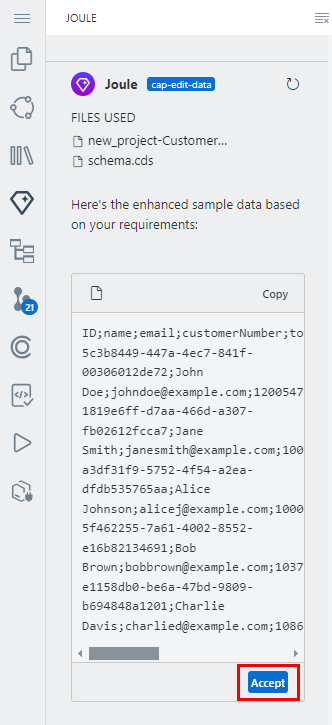


### Create Application Logic with Joule 

We already have created the data model, service, and sample data with Joule. Now we want to create some logic for our service. We would like to calculate the bonus points automatically when a customer makes a purchase. Additionally, we want to provide logic for customers to redeem these bonus points.

1. In the Storyboard, click on the **Purchases** entity under **Services**, and select **Add Logic**.

    <!-- border -->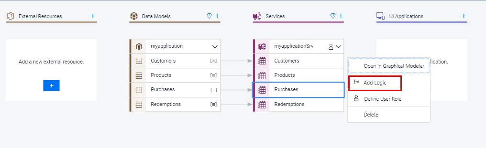
    
    >If you do not see the entity, click the **Show All** icon.
    >
    >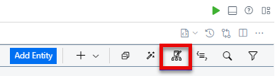

3. In the **Add Application Logic** dialog, leave the default values, and click **Add**.

    <!-- border -->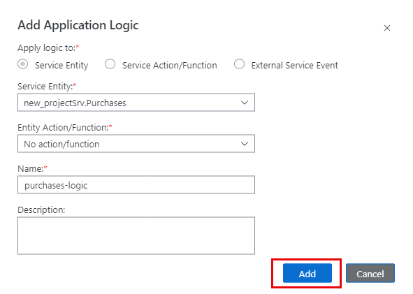

    The Application Logic Editor opens.

4. In the **Standard Event** section, select **Create**. That means that this logic will be automatically executed if an OData create operation is requested. <br/> 

    <!-- border -->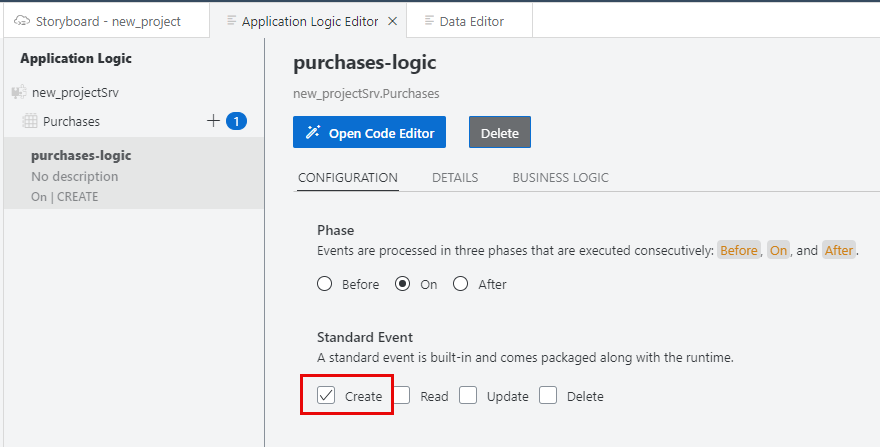

5. Click **Open Code Editor**, and select **Application Logic**. This will open Joule again to allow us to send a prompt to Joule to create the logic for us.

    <!-- border -->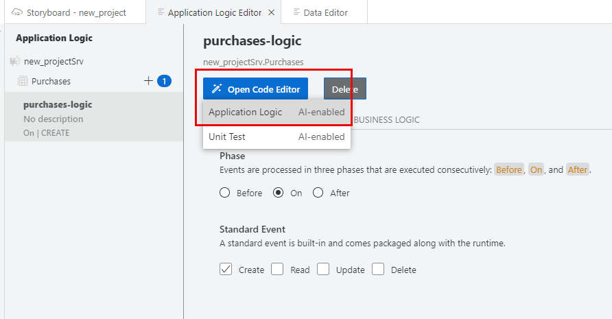

6. Copy the prompt below:

    ```code
    Reward points of each purchase will be the one tenth of the purchase value. 
    Each purchase value will be added to the total purchase value of the related customer. 
    Each reward point will be added to the total reward points of the related customer.
    ```
    
7. Paste the prompt in the text field, and click the arrow () to send the prompt to Joule.
    
    <!-- border -->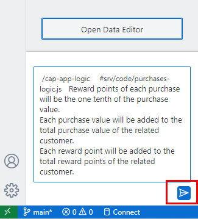

    So Joule created code that implements the following logic:

     - Check if the customer exists

     - Calculate the rewardPoints from the purchase value

     - Update the total purchase value and the total reward points in the customers entity


7. Accept the code. 

    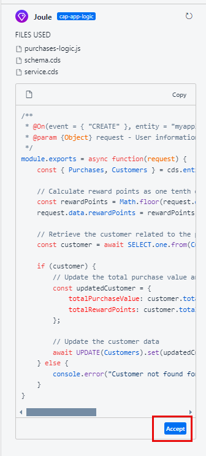

    > Joule typically generates different code each time for the same prompt. If yours is different to what you can see here, that's fine as long as it does the same job.
    > 
    >If there are no obvious errors, just keep working on the exercise. If you  aren't sure, you can ask Joule to try again by clicking **Regenerate**.  

8. Go back to the storyboard. 

9. Select the **Redemptions** entity under **Services** and select  **Add Logic**. 

    <!-- border -->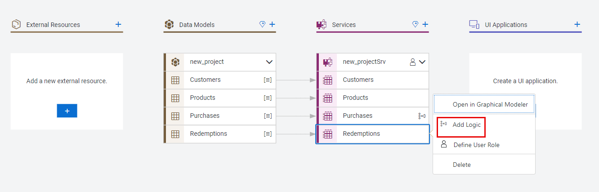

    >If you do not see the entity, click the **Show All** icon.
    >
    >

9. In the **Add Application Logic** dialog, leave the default values, and click **Add**.

    <!-- border -->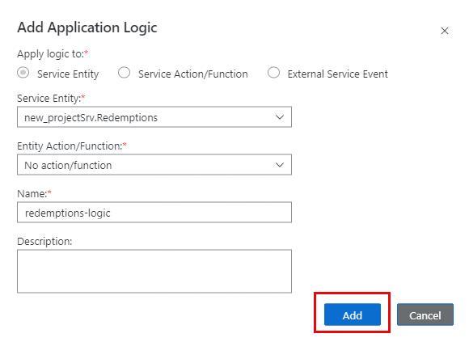

10. In the **Standard Event** section, select **Create**.

    <!-- border -->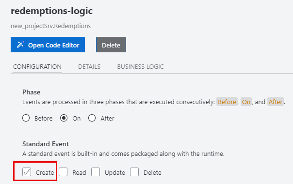

11. Click **Open Code Editor**, and select **Application Logic**. This will open Joule again to allow us to send a prompt to Joule to create the logic for us.

    <!-- border -->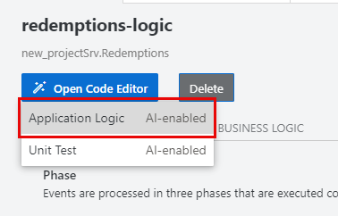

11. Copy the prompt below::

    ```code
    Deduct the redemption amount from the customer's total reward points and add that to their total redeemed points.
    ```

12. Paste the prompt in the text field, and click the arrow () to send the prompt to Joule.

    <!-- border -->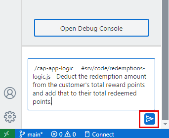

13. Accept the code. 

    <!-- border -->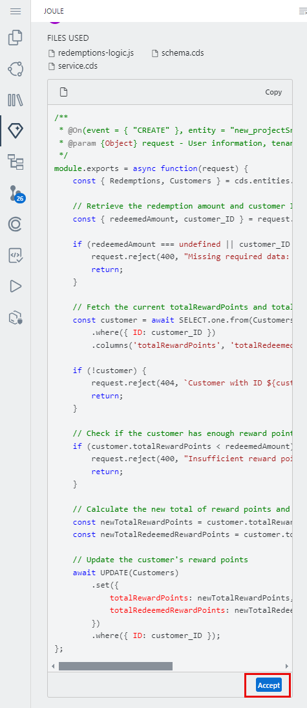

    Have a closer look at the generated code. It even includes some checks to see if the customer has enough points to redeem.

    <!-- border -->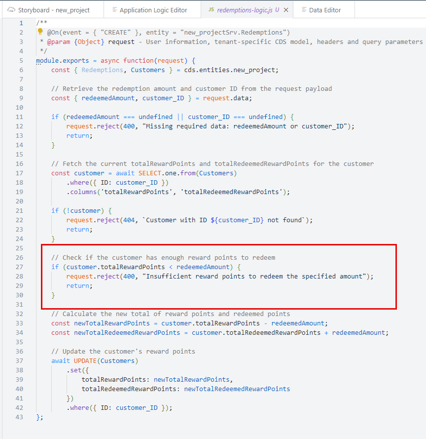
 
 


###  Add UI to the Application  

To display and test the content we created for the customer loyalty program, we need to create an SAP Fiori elements UI.

1. Go to back to the Storyboard and add a UI application.

    <!-- border -->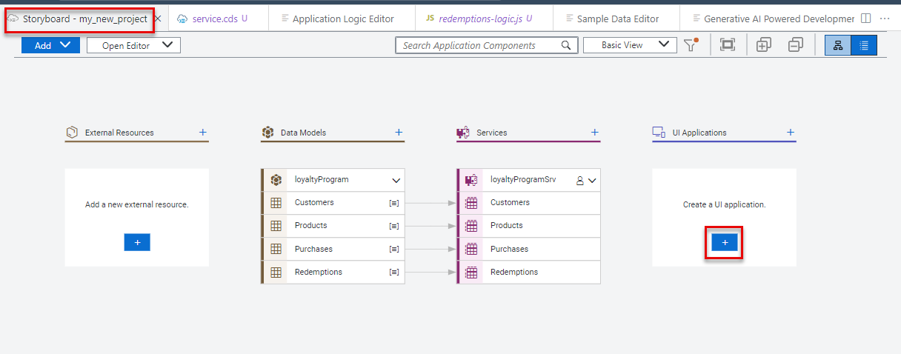

2. We will start with the user interface for the **Purchases** data entity. 

    Set the **Display name** to **Purchases** and the **Description** to **Manage Purchases**, and then click **Next**.

    <!-- border -->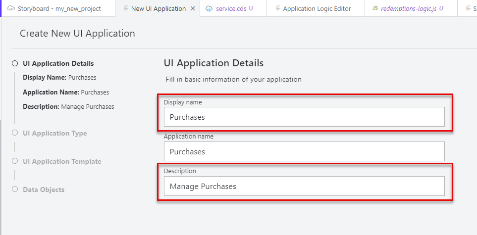

3. We are using the browser, so we will select **Template-Based Responsive Application** as the UI Application type, and click **Next**.

    <!-- border -->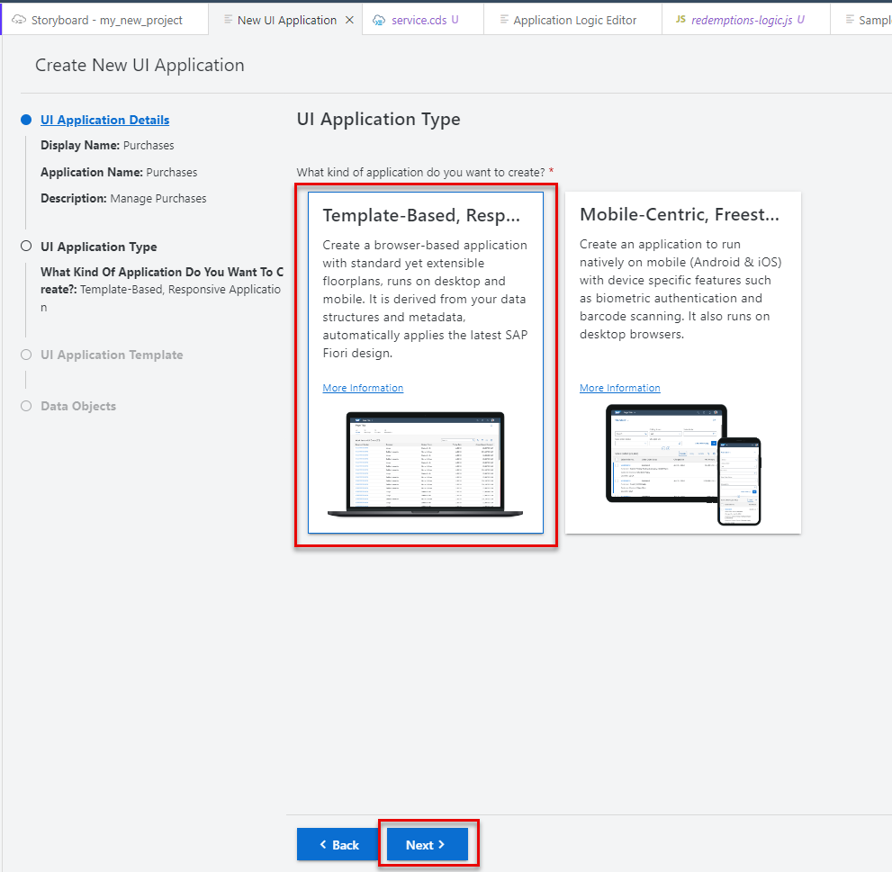

4. Select **List Report Page** as the UI application template, and click **Next**. 

    <!-- border -->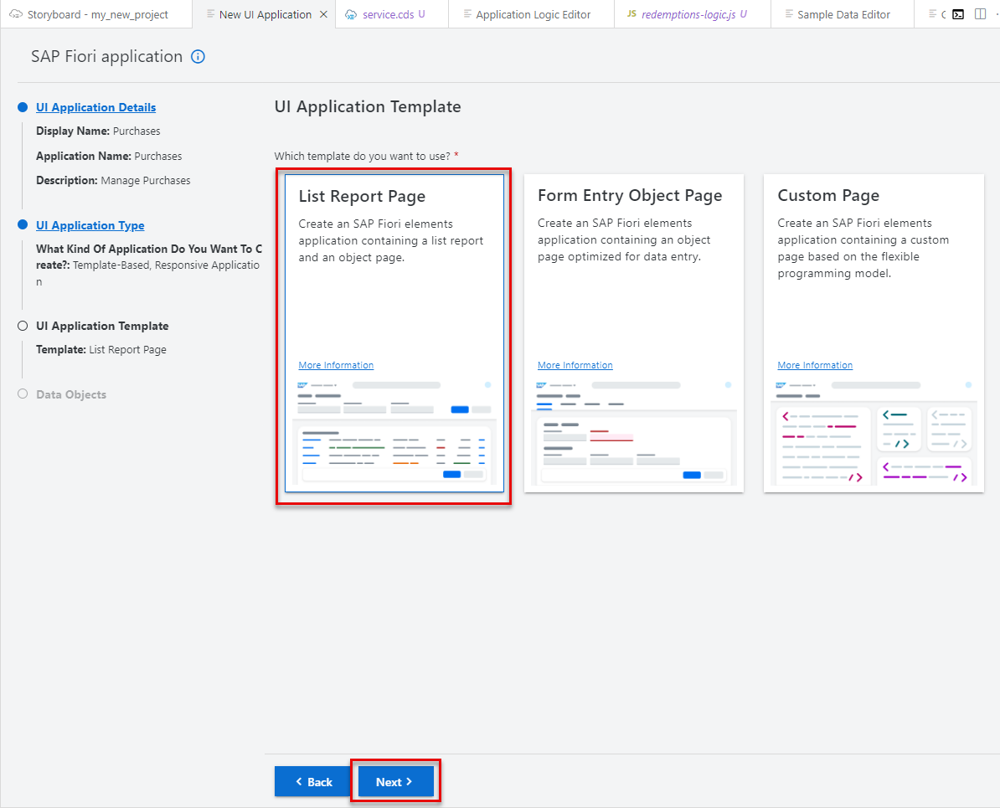

5. Select **Purchases** as the **Main entity**, and click **Finish**. The page will be created now.

    <!-- border -->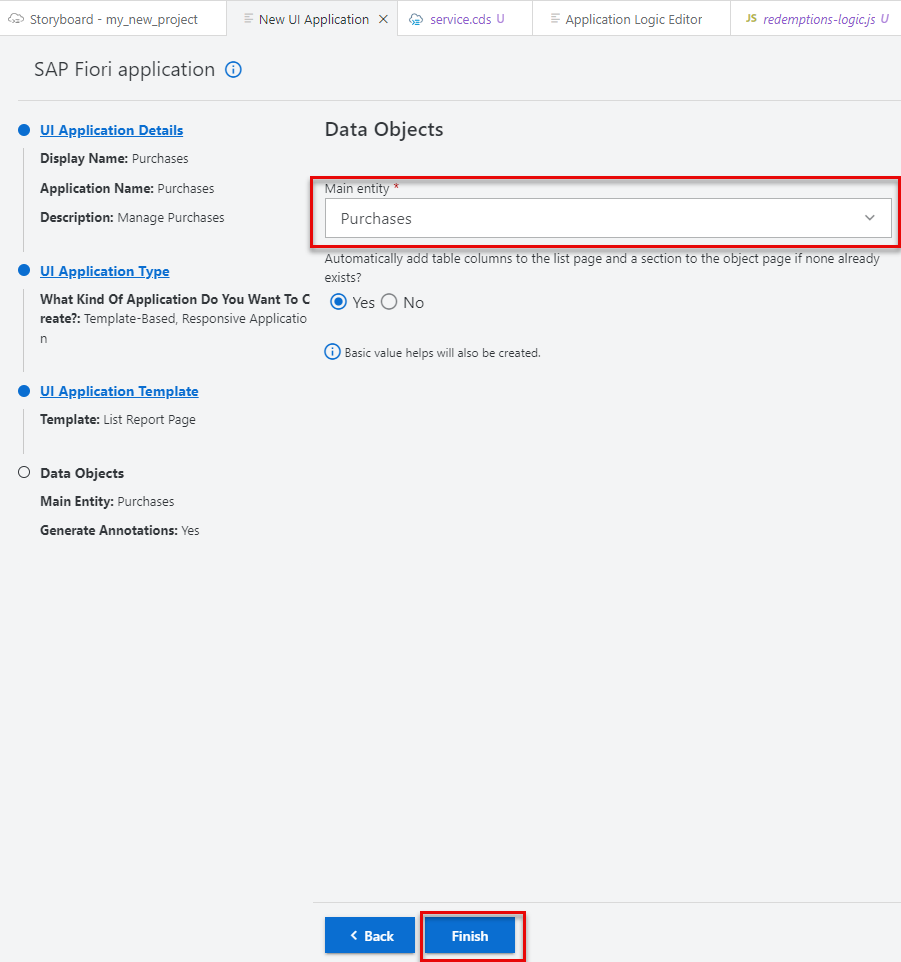

    It might take a few moments for the UI to be created because the dependencies need to be installed. 

6. Repeat steps 2 through 5 to create additional UI apps for the **Customers** and the **Redemptions** entities.

    **Customer**:

    * Display name: **Customers** <br/>
    * Description: **Manage Customers**
    * UI Application type: **Template-Based Responsive Application** <br/>
    * UI Application Template: **List Report Page** <br/>
    * Main Entity: **Customers** <br/>

    **Redemptions**:

    * Display name: **Redemptions** <br/>
    * Description: **Manage Redemptions** <br/>
    * UI Application type: **Template-Based Responsive Application** <br/>
    * UI Application Template: **List Report Page** <br/>
    * Main Entity: **Redemptions** <br/>

    And that's it! You've created an application.

7. To preview your application, once the files have been generated, go to the upper-right corner, and click  (Run and Debug).

    <!-- border -->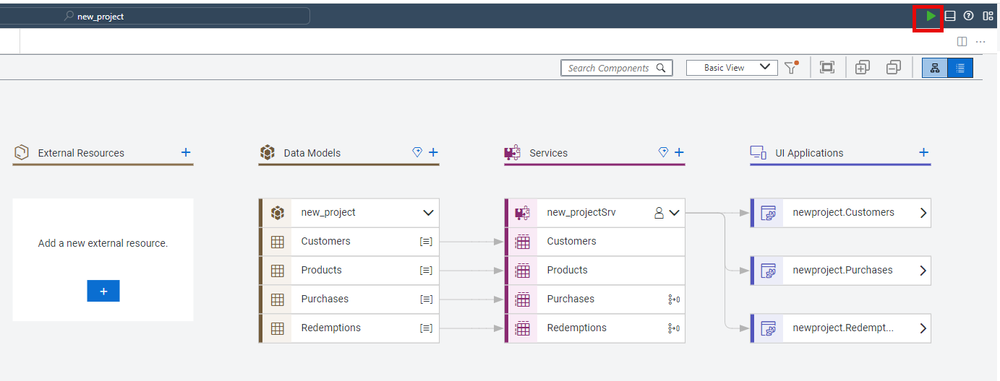

    The application's preview is displayed.

    <!-- border -->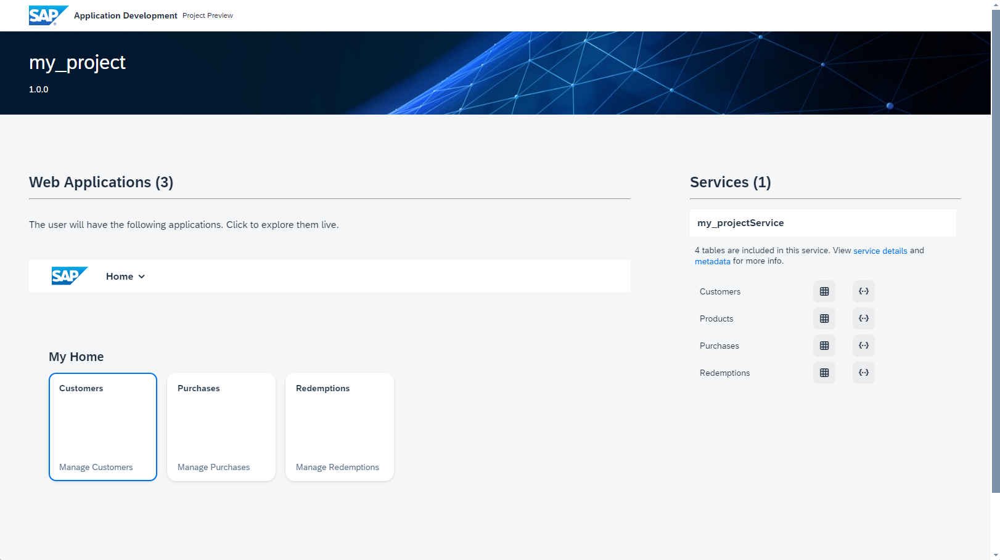

8. Click **Go**.

    <!-- border -->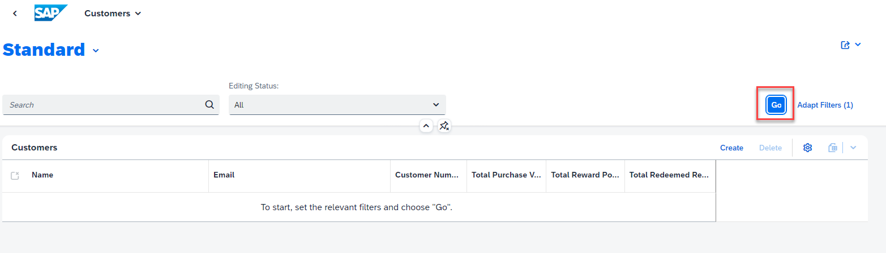

    The customer information is displayed.

    <!-- border -->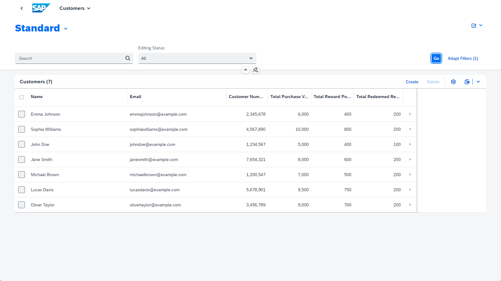

9.  From the dropdown list at the top of the page, select **Home** to go back and preview the other applications.

    <!-- border -->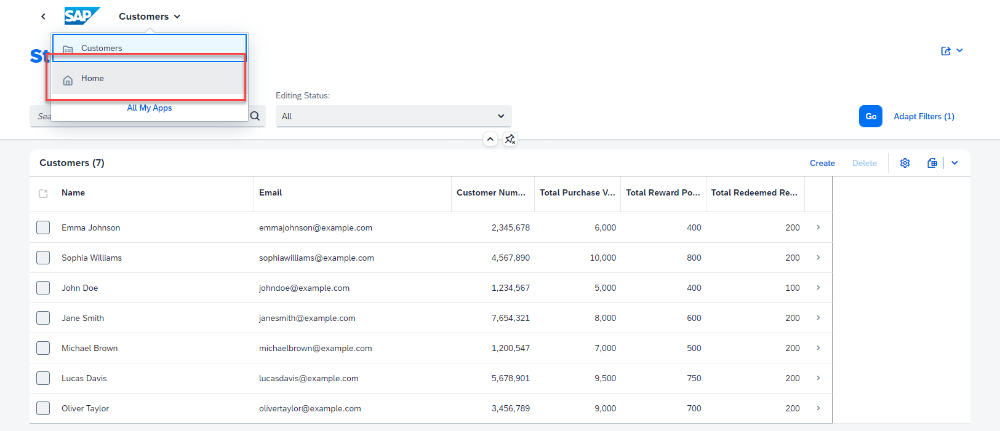

