## Prerequisites  
 - **Proficiency:** Beginner
 - **Tutorials:** [Create a BUILD Prototype](http://www.sap.com/developer/tutorials/build-create-prototype.html)


## Next Steps
 - [Import your BUILD Project into Web IDE](http://www.sap.com/developer/tutorials/build-import-webide.html)
 - Select a tutorial group from the [Tutorial Navigator](http://www.sap.com/developer/tutorial-navigator.html) or the [Tutorial Catalog](https://www.sap.com/developer/tutorial-navigator.tutorials.html)

## Details
### You will learn  
Gain user feedback on your prototype. Create questions to see if the application flow is intuitive, collect feedback and feelings from screens, and analyze your results from your users to see what features you should keep and what features might need to be rethought.


### Time to Complete
**20 Min**

---

[ACCORDION-BEGIN [Step 1: ](Create a new study)]
To create a new survey to send out to your end users, you will have to create a new study. To create a new study, click the **Create Study** button in the top tool bar in the UI Editor or on the prototype overview page.

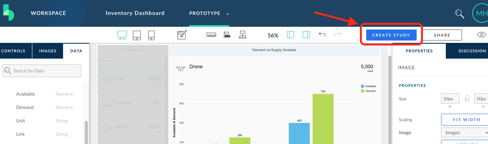

Give the study a **name**, such as _User Feedback_. Click **Save and Go to Feedback**.

 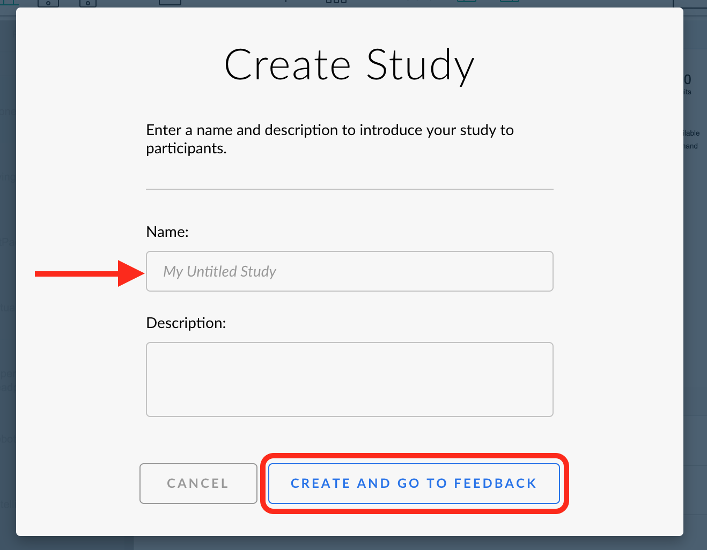

[DONE]
[ACCORDION-END]

[ACCORDION-BEGIN [Step 2: ](Add a new question)]
Studies have an out of the box question to provide general sentiment and comments about the application. You can add additional questions if you want users to look more in depth into certain features.

Create a new question that will test the navigation and placement of data on the screen. Click **New Question**.

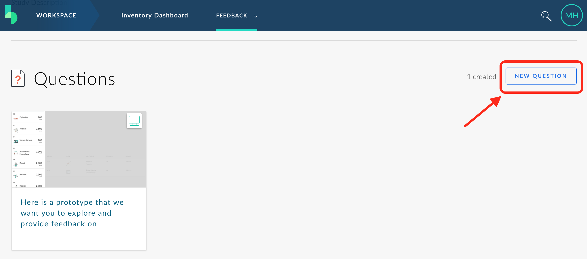

You can add questions about Images or Prototypes in your project. Select **Prototypes**.

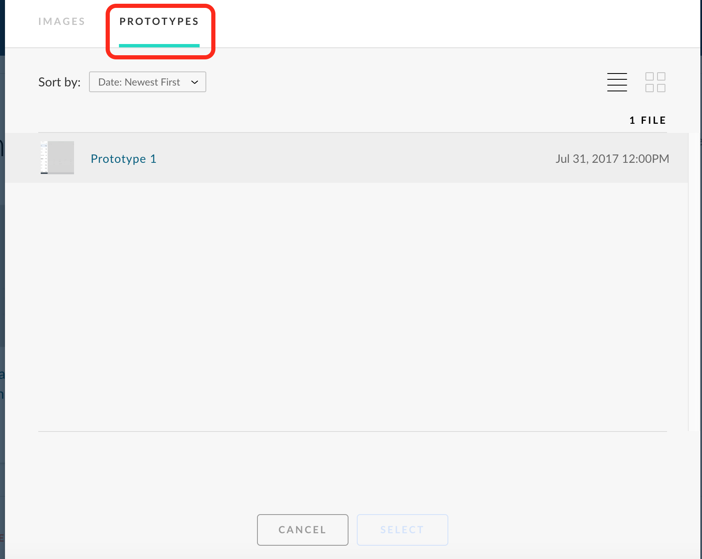

Select **Prototype 1** from the list and then click **Select**.

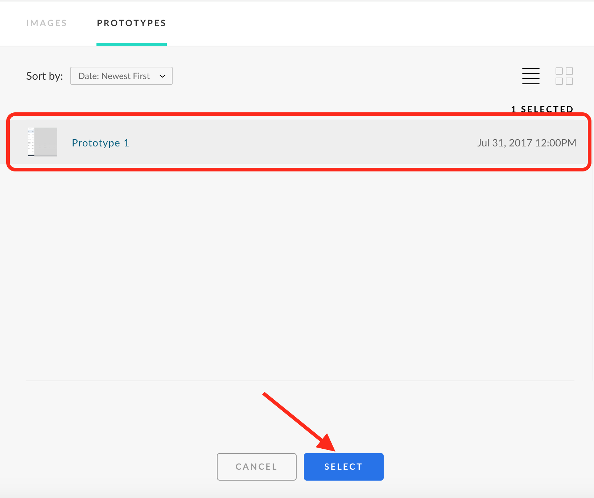

There are 4 types of questions you can ask: annotation, comment, multiple choice, and navigation. Select **Select Answer(s) from multiple choice**. You must provide at least 2 options for multiple choice, but you can supply more than 2 answers.

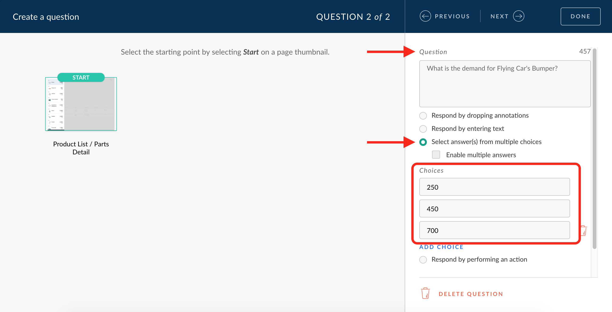

Set the question to see if users can find the specified demand of a part for the Flying Car. **Here is a sample question**:

```
What is the demand for Flying Car's Bumper?
```

The correct answer for this is 450. **Set the options** to 250 (the availability of the part), 450 (the correct demand), and 700 (the demand for a part on the initial screen).

```
Choices:
 - 250
 - 450
 - 700
```

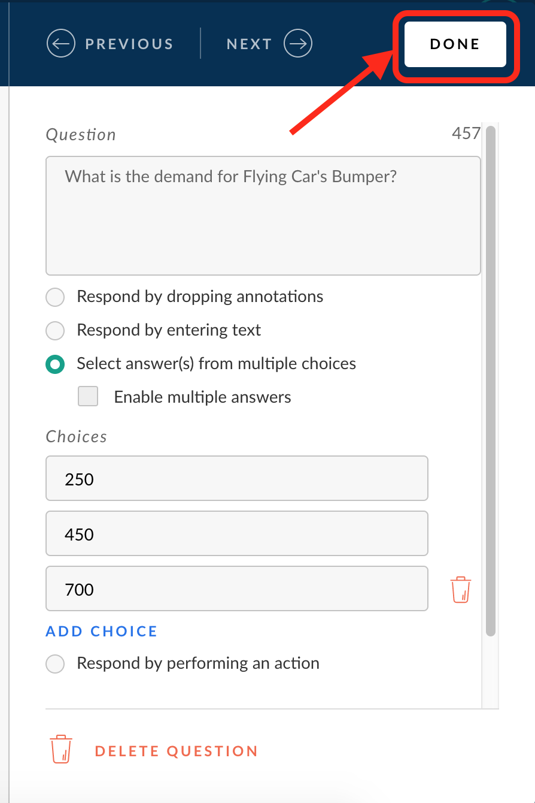

Click **Done**.


[DONE]
[ACCORDION-END]


[ACCORDION-BEGIN [Step 3: ](Preview the study)]
You can review the "live" study before sending it out to participants to make sure you have all your questions and the order makes sense. You can even take your own survey, but your responses will not be recorded.

To preview the survey, click on the **Preview** link at the top of the survey page.


This will start the survey in preview mode. No responses will recorded from this page.

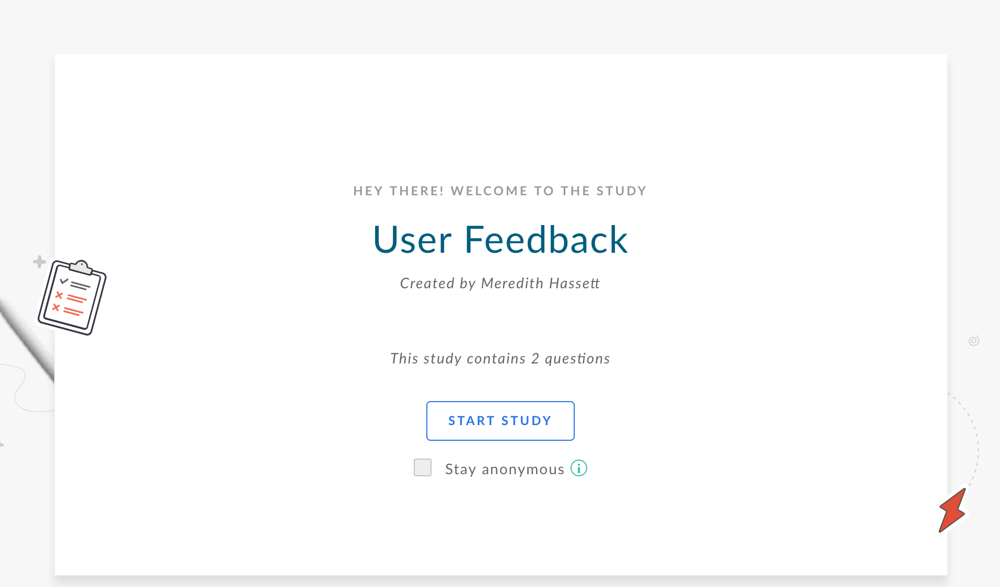

[DONE]
[ACCORDION-END]

[ACCORDION-BEGIN [Step 4: ](Publish your study)]
In order to have your users provide feedback, you need to publish your study and share the URL.

On the survey's dashboard, click **Publish**.

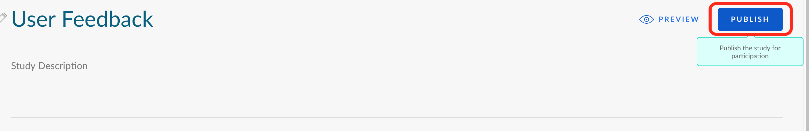

Once you publish your survey, you cannot edit it. Make sure you have all the questions you want to ask. If you are creating a real study and are not ready to share, click Cancel. For now, you can click **Publish**.

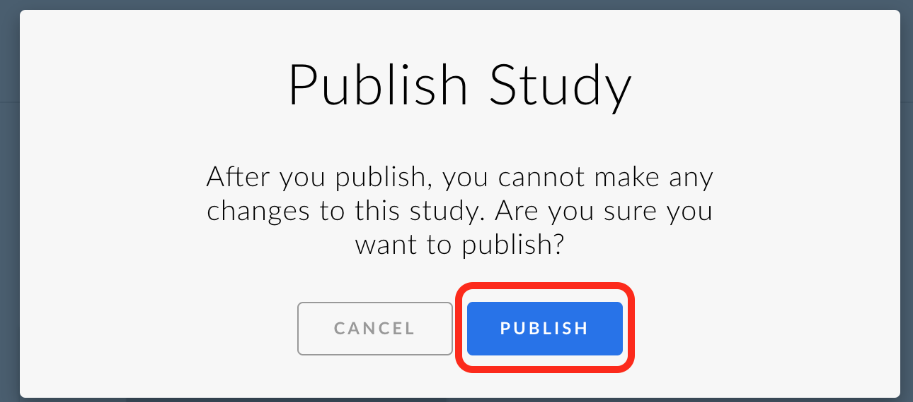

Once you publish, you will have a shareable link. **Copy the link** and click **OK**.

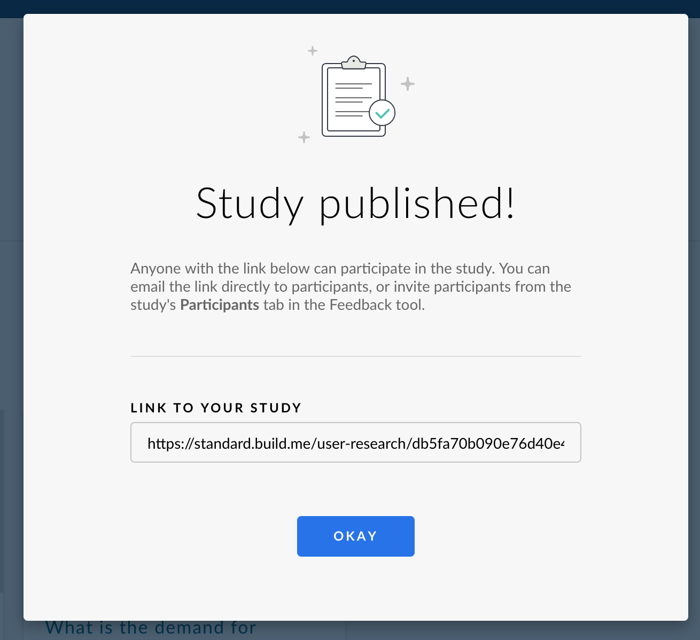

Send out the link to your intended audience to collect feedback. You can fill out your own survey to have some sample feedback in your application.

[DONE]
[ACCORDION-END]

[ACCORDION-BEGIN [Step 5: ](Provide feedback)]
When completing a survey, your users will see a live preview of the application prototype along with the questions.

Try out your survey! **Paste the copied URL** from the previous step into your browser. Click the **Start Survey** button on the survey screen.


The first question will appear once you click start. This is to give feedback and comments on the screen. Click **Place Feedback** in the right side bar to activate the feedback click on the application prototype.

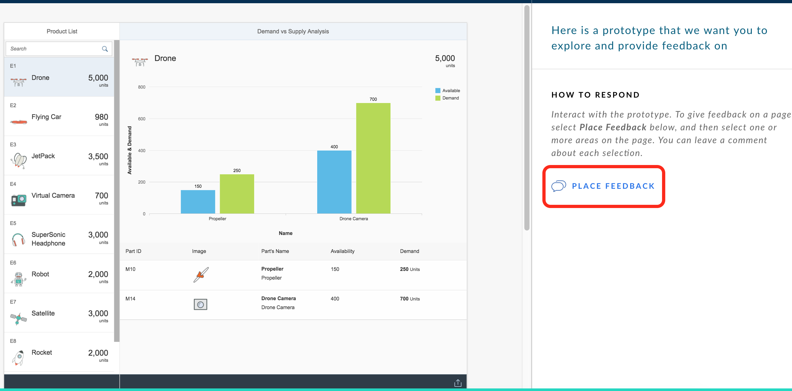

**Click on the application prototype**. A comment box appears. Provide your comments and/or how you feel about that part of the screen. Click **Save** when you are done providing feedback on the selected area.

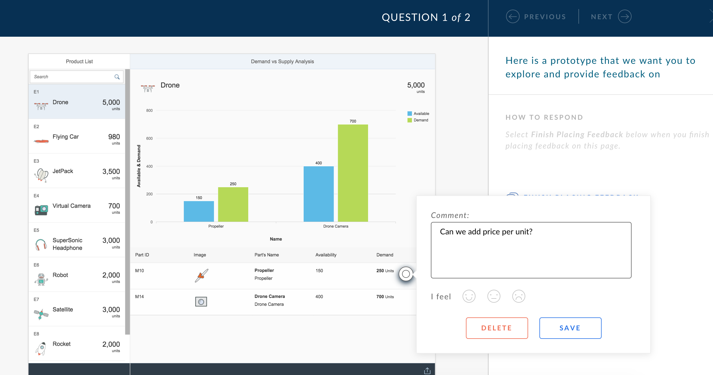

When you are finished providing feedback on the screen, click **Finish Placing Feedback**.


When you are ready to move on to the next question, click **Next** in the top of the screen.

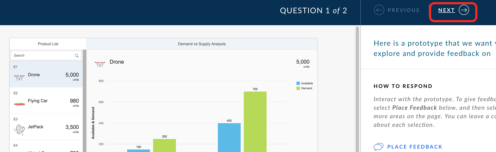

Answer the next questions by finding the right product and looking at the parts and their demand. Select an answer from the choices. If you want to place feedback, you have that option as well.


When you are finished providing an answer (and, optionally, feedback), click **Done**.

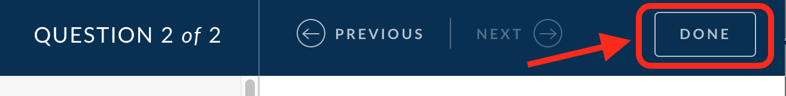

You have finished your survey! You can always go back and edit the feedback your provided or provide more feedback. If you wish, you can make your responses anonymous.

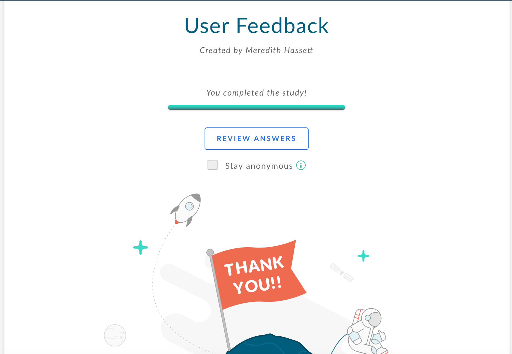

[DONE]
[ACCORDION-END]

[ACCORDION-BEGIN [Step 6: ](Review feedback responses)]
Once your users provide feedback, you can explore their responses. To review feedback, select **Feedback** from the BUILD main menu top bar. Click on your survey named **User Feedback**.

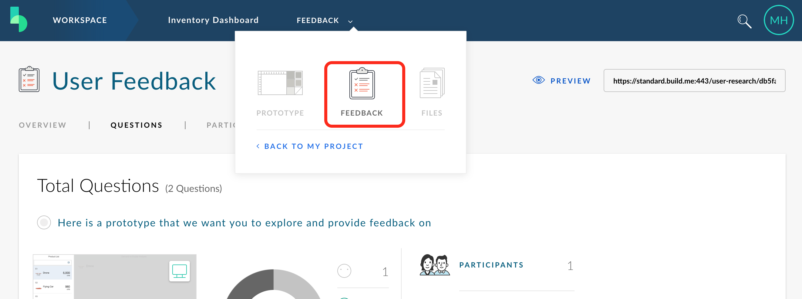

This will load the feedback analytics. You can see how many people participated, how long it took for them to complete the survey, and how many questions they answered. You can drill into individual question stats as well.

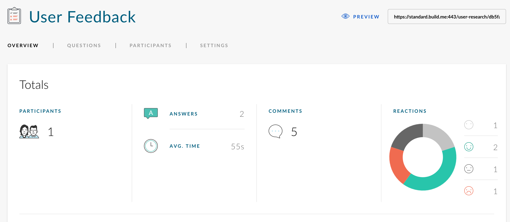

To see individual question responses, click **Questions** from the survey menu bar. By **clicking a particular question**, you can see the aggregated responses for that question.

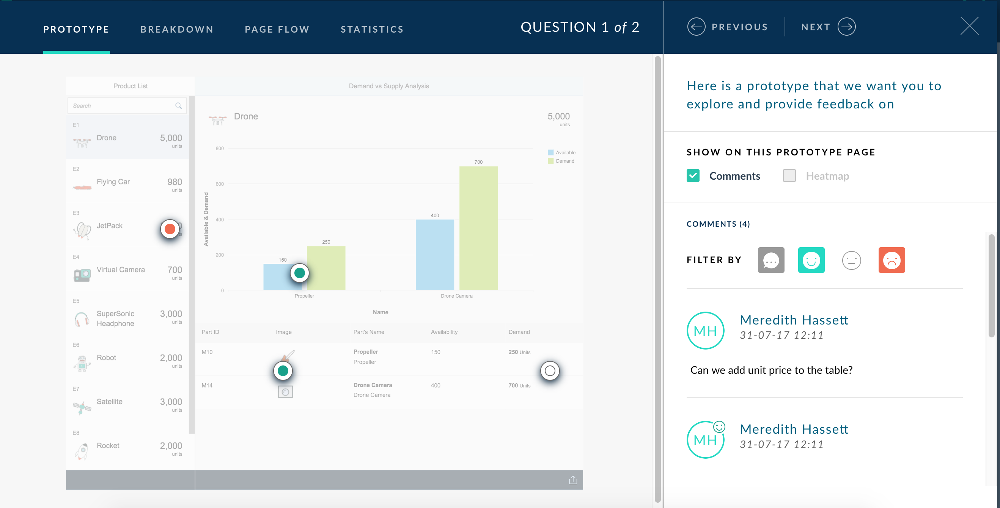

Review your user's feedback and make adjustments as necessary before creating your real application.

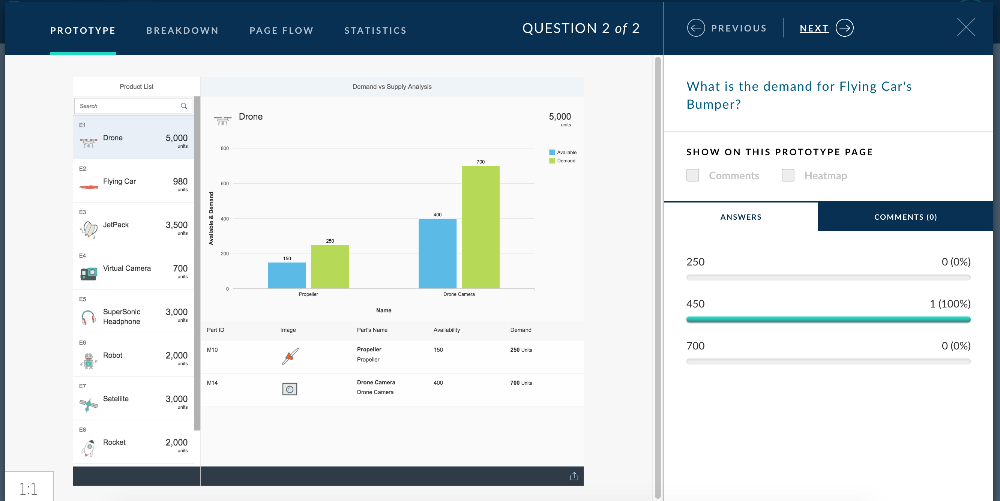


[DONE]
[ACCORDION-END]


## Next Steps
- [Import your BUILD Project into Web IDE](http://www.sap.com/developer/tutorials/build-import-webide.html)
- Select a tutorial from the [Tutorial Navigator](http://www.sap.com/developer/tutorial-navigator.html) or the [Tutorial Catalog](http://www.sap.com/developer/tutorials.html)
