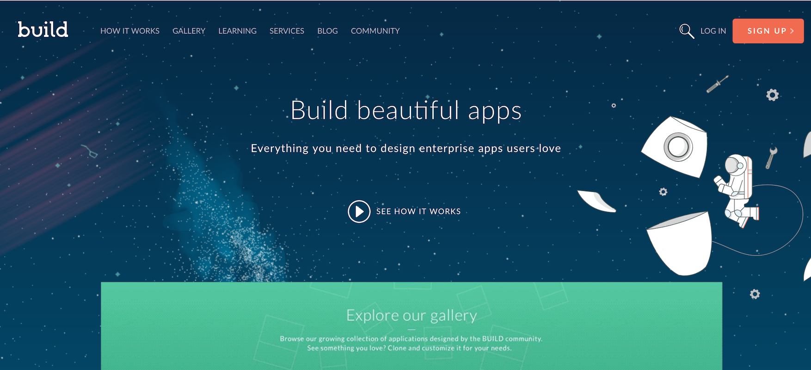
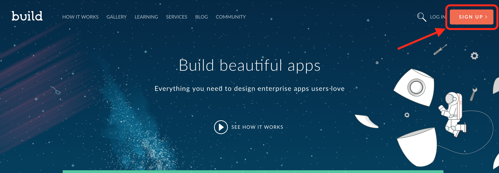
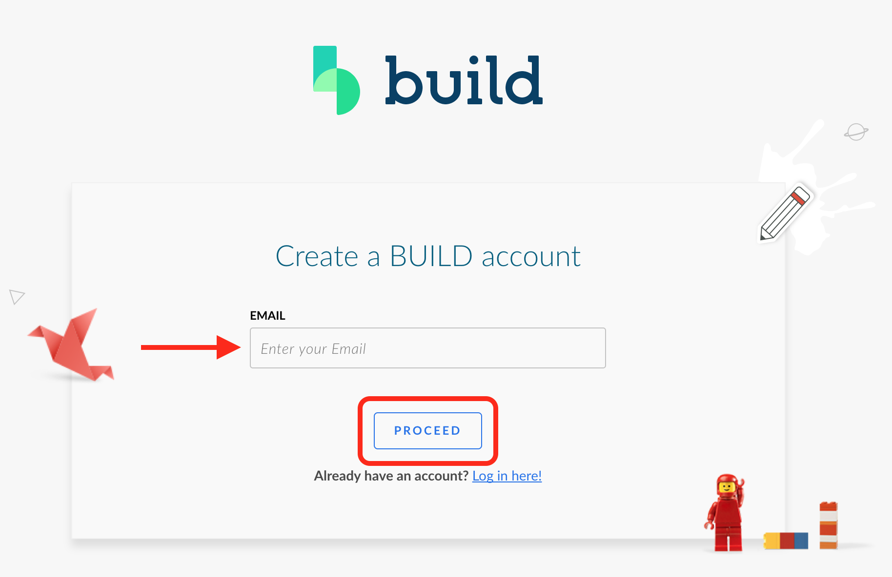
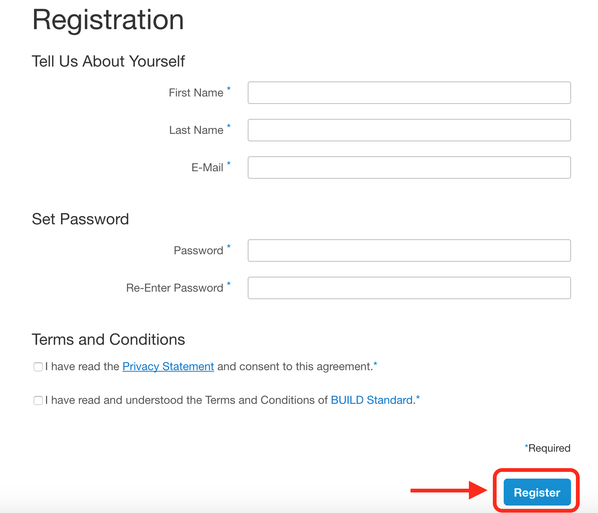
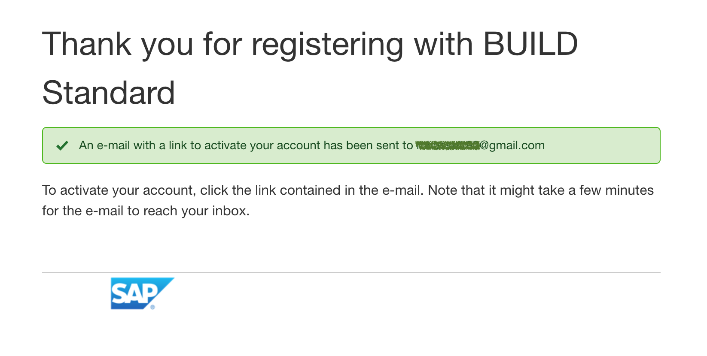
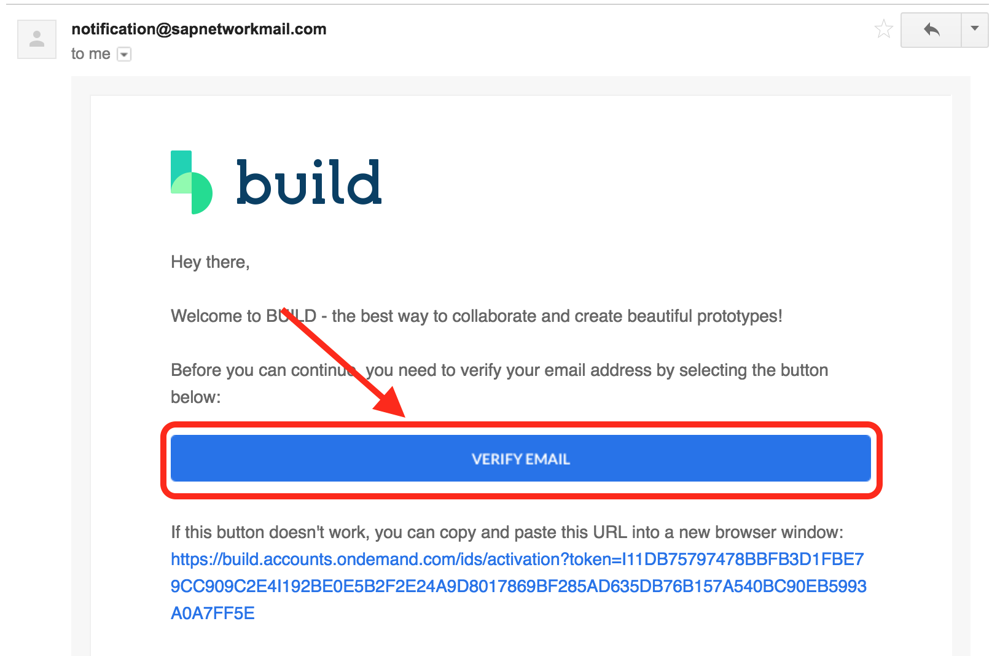
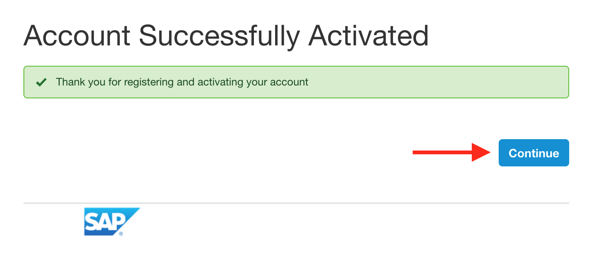
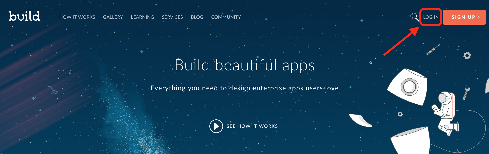
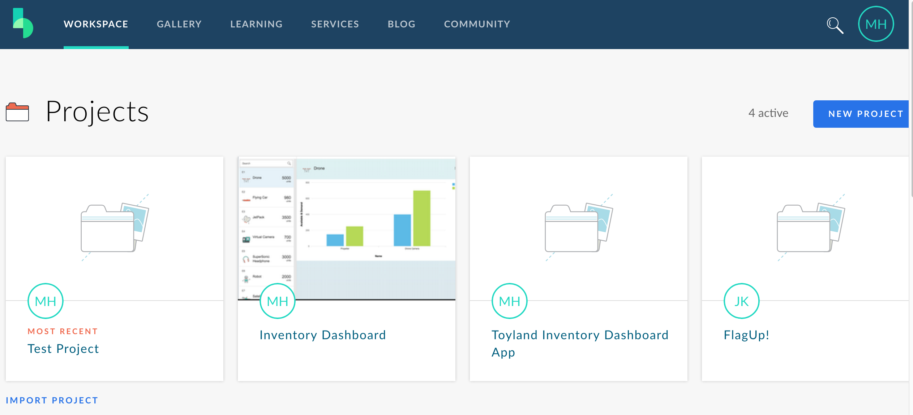
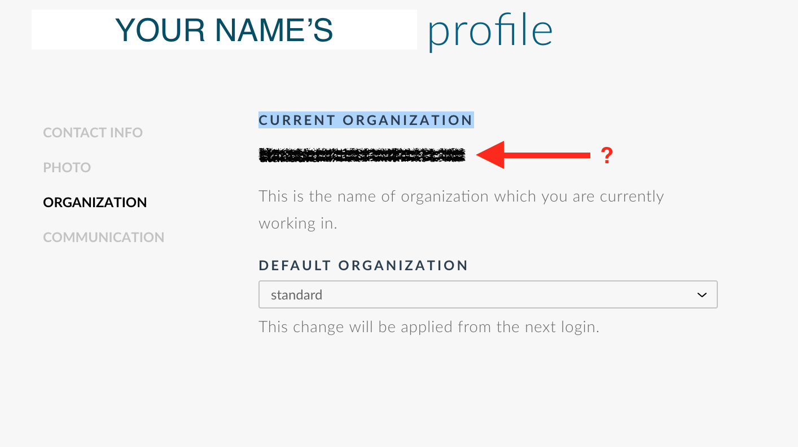

## Prerequisites  
 - **Proficiency:** Beginner

## Details
### You will learn  
SAP Build is a cloud based collaborative design tool that provides knowledge, tools, and inspiration to create beautiful apps that your users love. See for yourself how easy it can be to use SAP Build to learn design thinking, create interactive prototypes, collect feedback from users, and jump-start development without writing a single line of code. With SAP Build, it's easy to create, design, and develop applications according to the SAP Fiori design guide.

Take some time to get familiar with the SAP Build landscape and sign up for a free account today.

### Time to Complete
**10 Min**

---

[ACCORDION-BEGIN [Step 1: ](Find out more about SAP Build)]
To find out more about SAP Build, visit [SAP Build's website](https://www.build.me/splashapp/). Here you will be able to find learning on design thinking, sample prototypes, and a community centered around all things SAP Build.

[DONE]
[ACCORDION-END]

[ACCORDION-BEGIN [Step 2: ](Sign up for an account)]
In the upper right hand corner, select the **Sign Up** button.

[DONE]
[ACCORDION-END]

[ACCORDION-BEGIN [Step 3: ](Enter your email)]
Provide **your email address** on the next screen.

Click **Proceed**.

[DONE]
[ACCORDION-END]

[ACCORDION-BEGIN [Step 4: ](Fill out the registration details)]
On the last screen, provide the requested information in the **Registration form**.

Once all the required information has been provided, click **Register**.

[DONE]
[ACCORDION-END]

[ACCORDION-BEGIN [Step 5: ](Activate your account)]
Once you submit your registration, an email with be sent to the provided email address.

Open your email and click on the **Verify Email** link.

This will activate your account. Once you have verified and activated your account, click **Continue**. You will be brought back to the SAP Build homepage.

[DONE]
[ACCORDION-END]

[ACCORDION-BEGIN [Step 6: ](Open the SAP Build tools)]
Back on the SAP Build homepage, click **Log In**. Provide your credentials you created in the previous steps.

Once you have successfully logged in, you will now be able to see more SAP Build tools, including your workspace and projects.

[DONE]
[ACCORDION-END]

[ACCORDION-BEGIN [Step 7: ](Validate your SAP Build account)]
Once you are logged in, **click on your initials icon** in the top right corner and select **User Profile** from the menu.

On the **Organization** tab, copy your **Current Organization** and **paste it in the below box**.

[VALIDATE_7]
[ACCORDION-END]
