## Prerequisites  
 - **Proficiency:** Beginner

## Details
### You will learn  
Learn how to import a completed and published prototype from BUILD into Web IDE. This will help you convert your prototype into a live application. This will be your guide or template for creating the real UI5/Fiori version.

> Please note that an imported BUILD prototype should not be used for a production application. The version of BUILD used in these tutorials is for prototyping and designing purposes only. The code generated is not optimized for performance and security. Stay tuned to BUILD for updates about BUILD Apps, a drag and drop tool to create production ready applications!  

### Time to Complete
**15 Min**

---

[ACCORDION-BEGIN [Step 1: ](Enable BUILD Services)]
Open your [SAP Cloud Platform account](https://account.hanatrial.ondemand.com/cockpit).

In your SAP Cloud Platform cockpit, go to the **Services**.

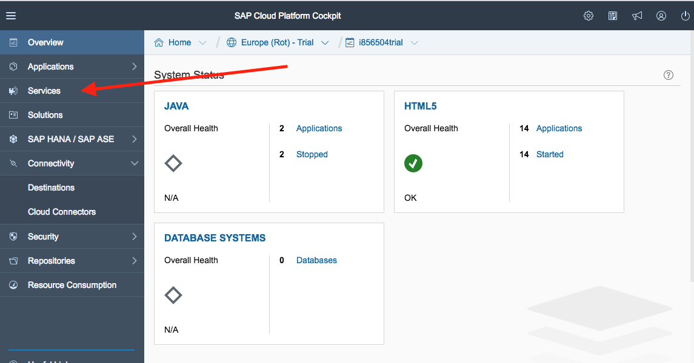

In the **Search Bar**, search for _BUILD_.

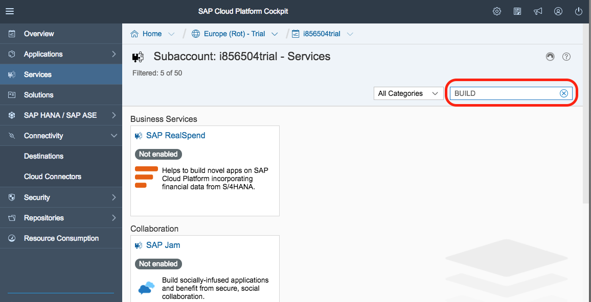

Click on the **BUILD** service tile under the User Experience section.

**Enable the service**.

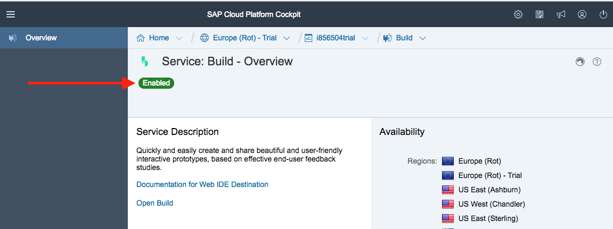

[VALIDATE_1]
[ACCORDION-END]

[ACCORDION-BEGIN [Step 2: ](Import the destinations)]
**Download** the four destinations files by **right clicking and selecting Save As** for each of the files.

- [BUILD Production Destination](https://raw.githubusercontent.com/SAPDocuments/Tutorials/master/tutorials/build-import-webide/BUILD_Production)
- [SAPUI5 Destination](https://raw.githubusercontent.com/SAPDocuments/Tutorials/master/tutorials/build-import-webide/sapui5-private)
- [SAPUI5 Private Destination](https://raw.githubusercontent.com/SAPDocuments/Tutorials/master/tutorials/build-import-webide/sapui5-private-build)
- [SAP Web IDE Plugin](https://raw.githubusercontent.com/SAPDocuments/Tutorials/master/tutorials/build-import-webide/Web_IDE_PLUGIN)

In your SAP Cloud Platform cockpit, under Connectivity, select **Destinations**.

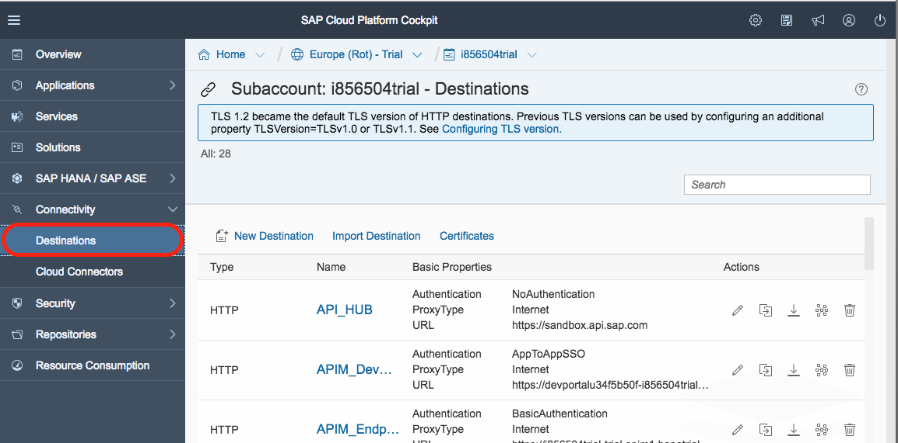

You can import each of the downloaded destination files. To import, select **Import Destination**.

Choose the `BUILD_Production*` file. Click **Save**.

Select **Import Destination** again. Choose the `sapui5-private` destination. Click **Save**.

Select **Import Destination** again. Choose the `sapui5-private-build` destination. Click **Save**.

Select **Import Destination** again. Choose the `Web_IDE_PLUGIN` destination. Click **Save**.

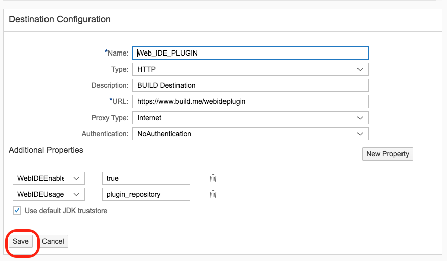

[DONE]
[ACCORDION-END]

[ACCORDION-BEGIN [Step 3: ](Open SAP Web IDE)]
In your SAP Cloud Platform cockpit, navigate back to **Services**.

Locate the **SAP Web IDE** service and **Go to Service**.

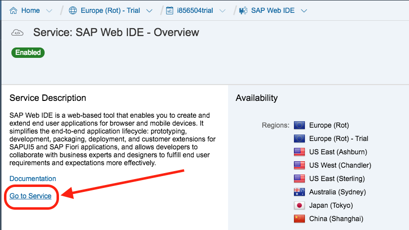

This will launch your SAP Web IDE.

[DONE]
[ACCORDION-END]

[ACCORDION-BEGIN [Step 4: ](Enable the BUILD plugin)]
In your SAP Web IDE, click on the **Gear Icon** to open the preferences view.

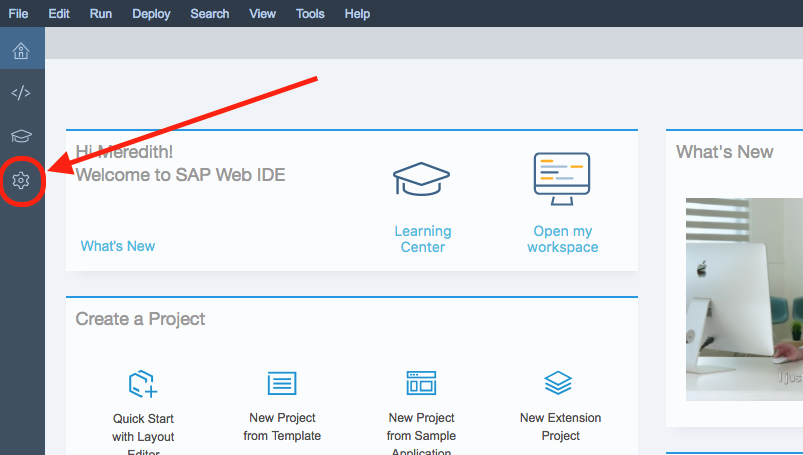

Select **Plugins**.

In the drop down menu, select **BUILD Destinations**. **Enable the Import from BUILD** plugin by clicking the switch on the right hand side.

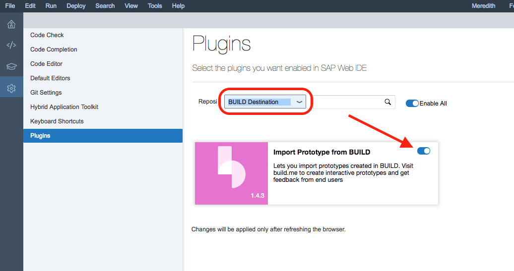

Click **Save**.

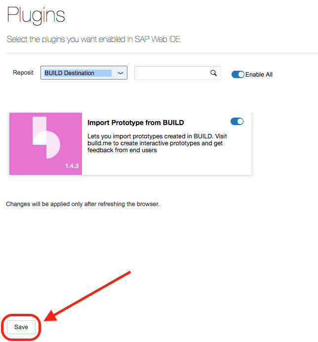

Your SAP Web IDE will refresh. Click **Refresh**.

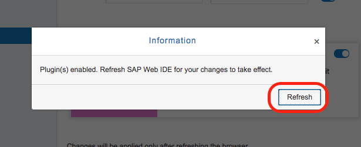

[DONE]
[ACCORDION-END]

[ACCORDION-BEGIN [Step 5: ](Create a new project)]
Go back to the code view by **clicking the angle brackets icon** (`</>`).

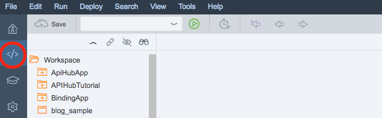

In the code view, create a new project by selecting **File > New > Project from Template**.

Under the _Category_ drop down, select **BUILD Project**. Select the **BUILD Project** tile. Click **Next**.

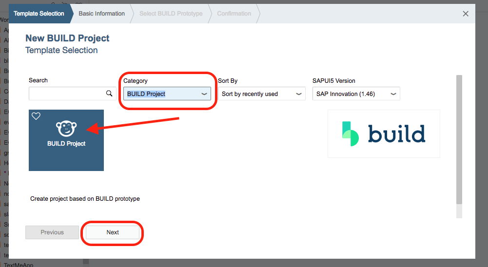

[DONE]
[ACCORDION-END]

[ACCORDION-BEGIN [Step 6: ](Name the project)]
Give your project a **Name**. Click **Next**.

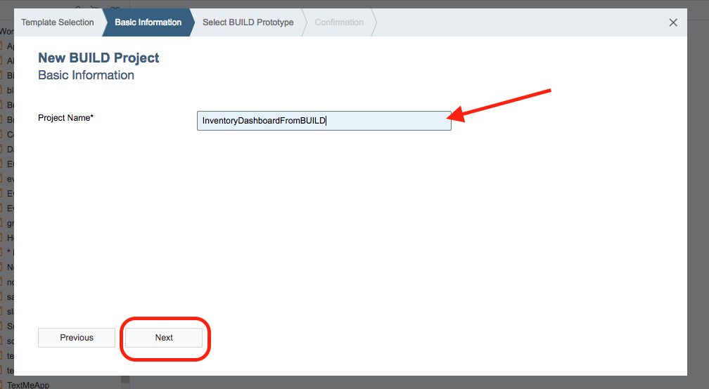

When prompted, enter your **BUILD Username and Password**. This will be your email address and password you used when signing up for BUILD in the previous tutorial.

> **SAP EMPLOYEES**: If you are an SAP Employee, your SSO password will not work. To continue, you must follow the directions to [reset your BUILD password](https://jam4.sapjam.com/groups/EwzMfO4LtSxrAjXwDipkgC/documents/ru6GmtH0bYRGEKqctpp8ye/slide_viewer). You are NOT resetting your SSO password, just the password to access BUILD. If you have followed the above steps and you are still unable to login, you can alternatively download the project from Build and import into SAP Web IDE.

[DONE]
[ACCORDION-END]

[ACCORDION-BEGIN [Step 7: ](Select a project to import)]

If you successfully logged in, you will see a list of your prototypes that you can import. Under the _BUILD System Information_, select **standard**.

Select **Inventory Dashboard** from the list of prototypes available. You always want to only import _High Fidelity_ prototypes.

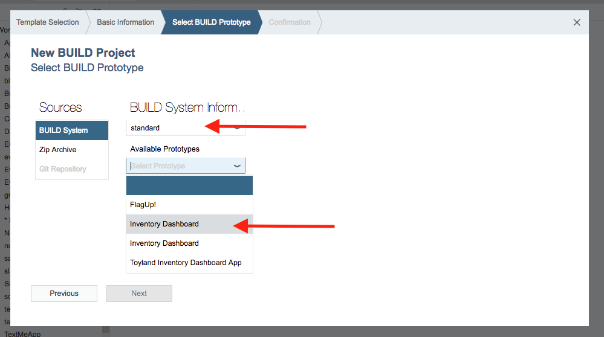

Click **Finish**.

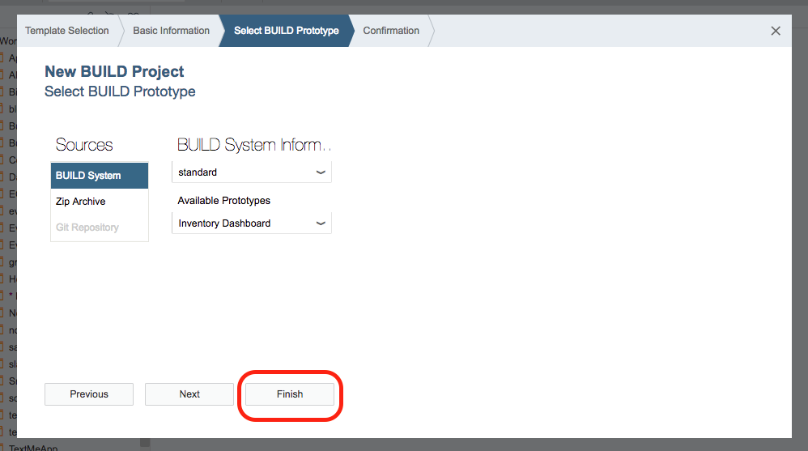

A new project will be created in your workspace.

[DONE]
[ACCORDION-END]

[ACCORDION-BEGIN [Step 8: ](Run your application)]
**Right click** on your project name.

From the menu options, select **Run > Run as > Web Application**.

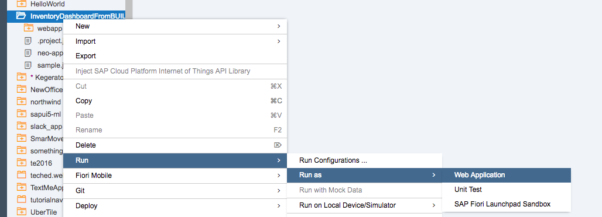

If prompted, select `testFLPService.html` as the file to run. Click **OK**.

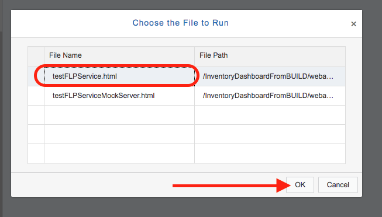

Your application is now running on SAPUI5!

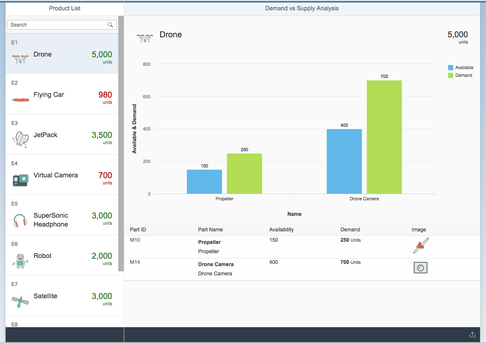

[VALIDATE_9]
[ACCORDION-END]
