## Prerequisites  
 - **Proficiency:** Beginner

## Details
### You will learn  
BUILD enables you to take your sketches from a piece of paper to a functioning prototype. Learn how to upload your sketches, add navigation and hot zones, and share your low fidelity prototype.

### Time to Complete
**15 Min**

---

[ACCORDION-BEGIN [Step 1: ](Create a project)]
Log in to [BUILD](https://standard.build.me/projects/).

Under Projects, click the **New Project** button to start creating a new project.

You can start projects from different templates or samples in BUILD, but for this tutorial, you will want to choose **Start from Scratch**. Select **Create New Project** button.

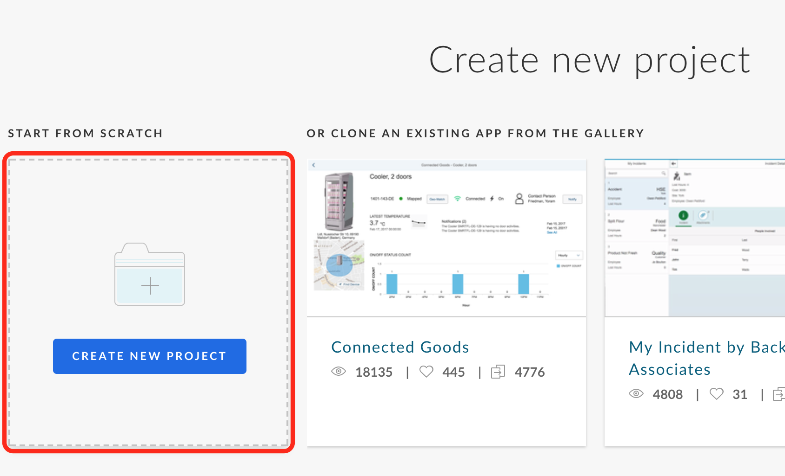

Enter a **Name** and **Description** on the New Project page.

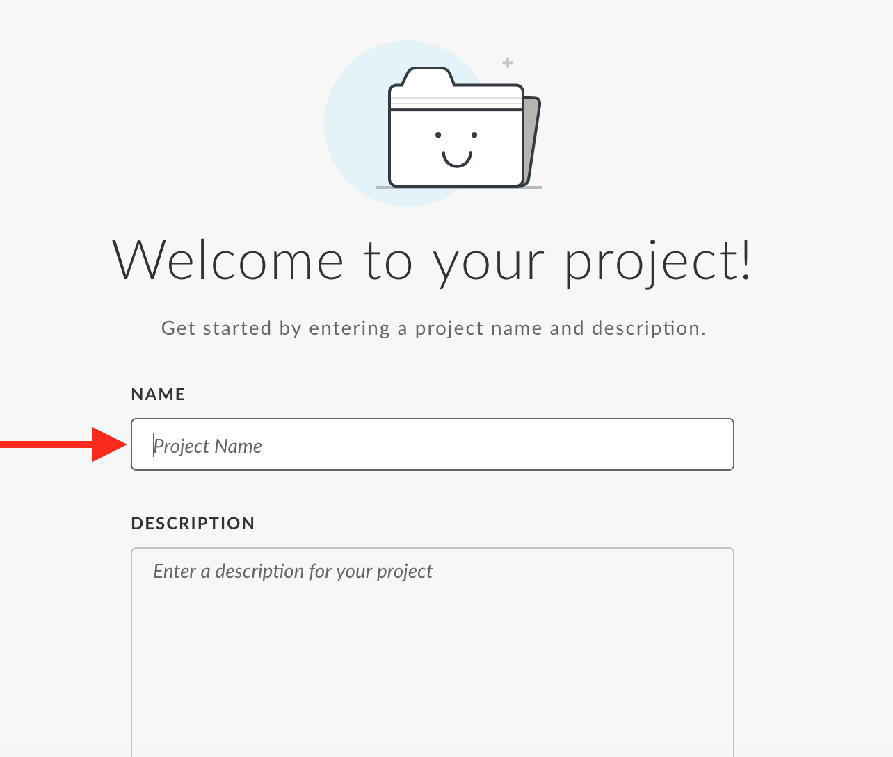

Click **Create Project** when all the fields have been filled out.

[DONE]
[ACCORDION-END]

[ACCORDION-BEGIN [Step 2: ](Download or Create the files)]
**Sketch up your application.** Use pen and paper or a computer tool. You want to create 3 screens.
1. Product List
2. Product Details
3. Order details

They can look like screenshots below.

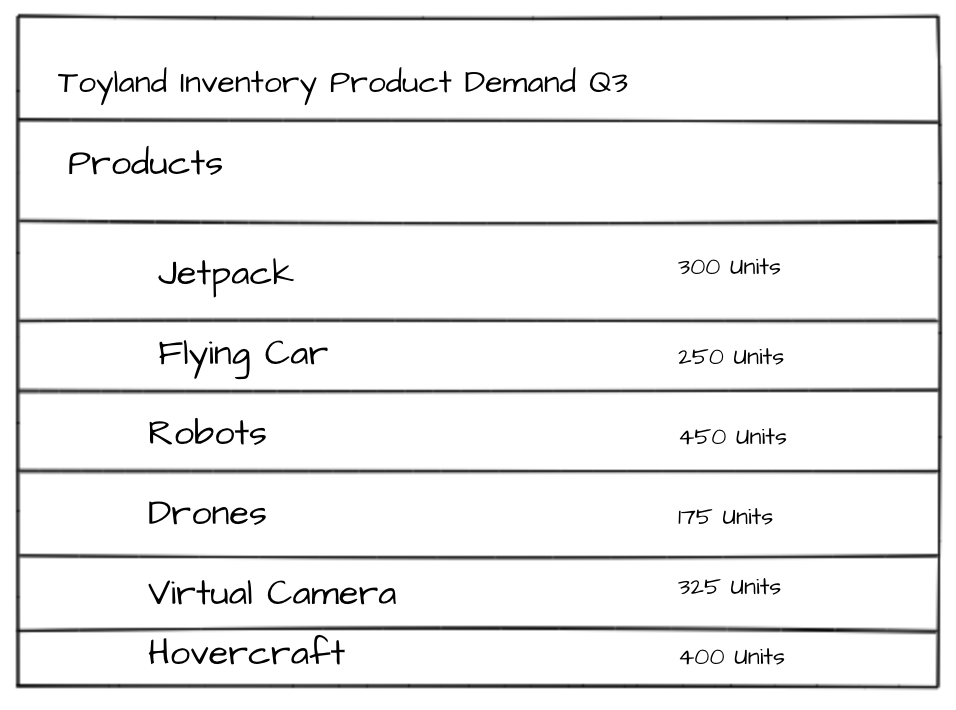

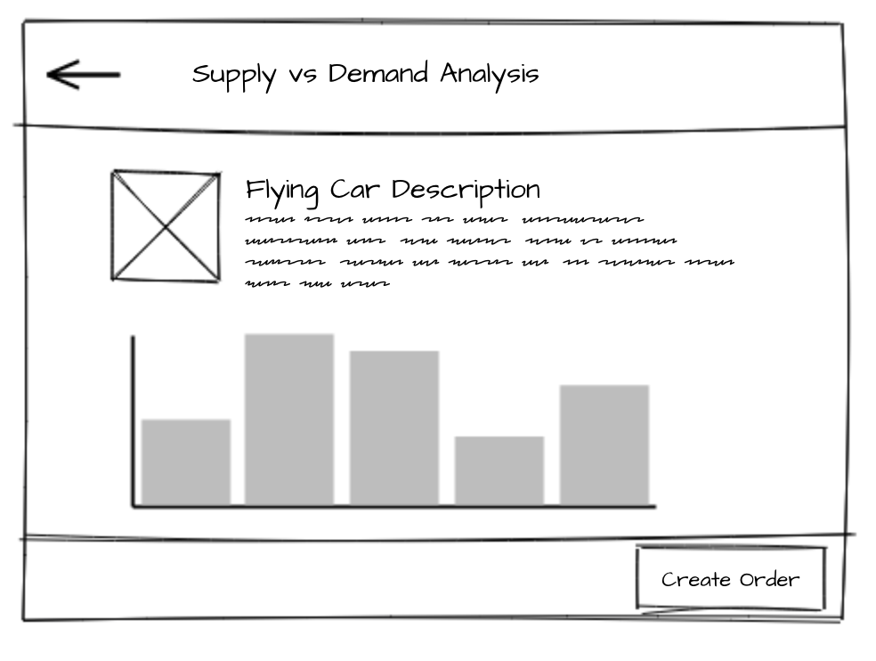

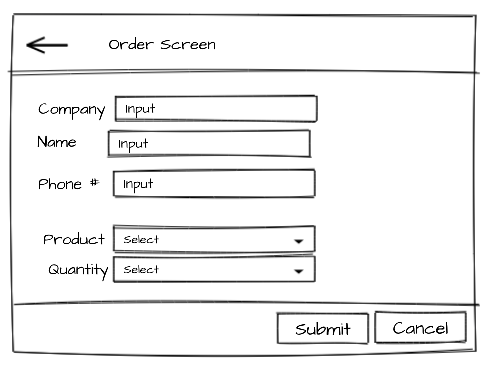

Don't have time to make your own sketches? You can use the above samples. **Right click and Save As** to download these files.

 - [Product list sketch](5.png)
 - [Product details sketch](6.png)
 - [Order details sketch](7.png)

[DONE]
[ACCORDION-END]

[ACCORDION-BEGIN [Step 3: ](Upload the files to BUILD)]
In your BUID project, select the **Upload Files** tile under the What do you want to do section.

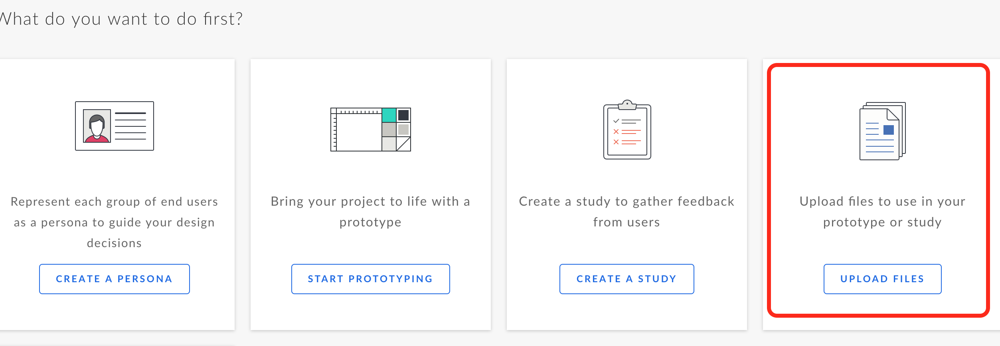

Either click the **upload** link or drag your files into the space to start the upload.

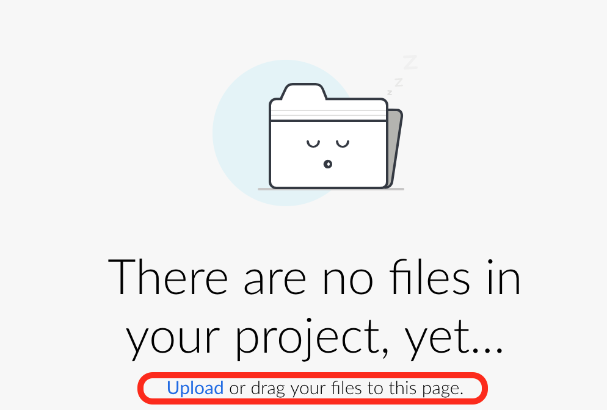

Once the upload is complete, you will see a listing of your files.

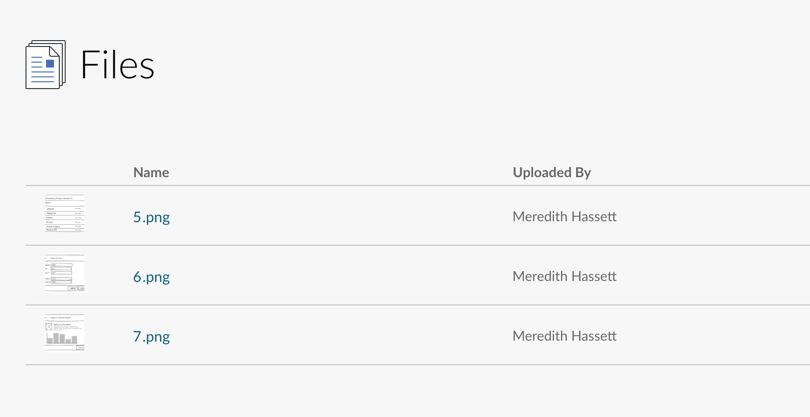

[DONE]
[ACCORDION-END]

[ACCORDION-BEGIN [Step 4: ](Use uploaded files)]
Switch over to **Prototype** mode by clicking on the File drop down in the menu bar. Select **Prototype** from the list of options.

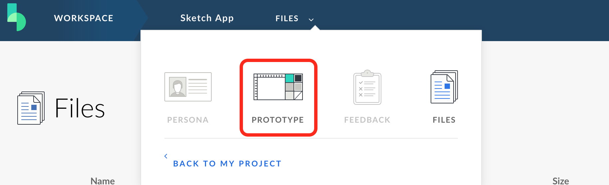

You can use the **File Tool** to use the files you just uploaded to create your prototype. Click the link.

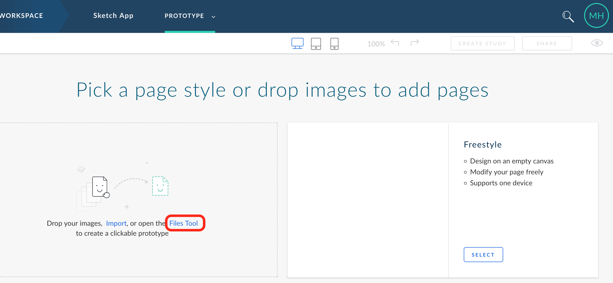

**Hold Shift and click the files** to multi-select all the files. Once you have all 3 files selected, click **Select**.

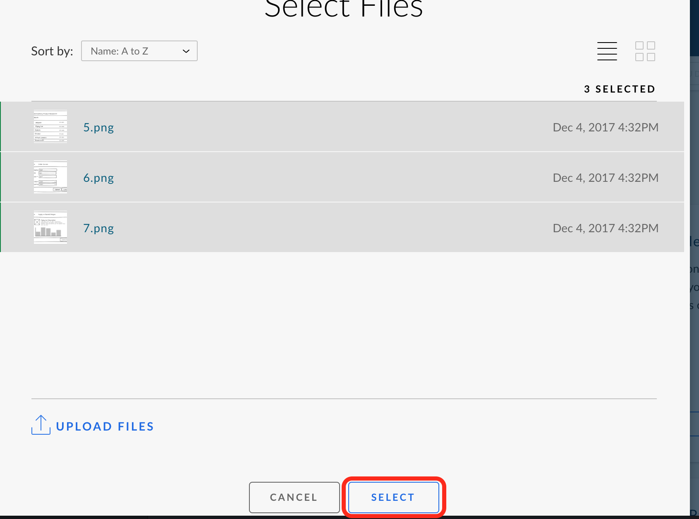

[DONE]
[ACCORDION-END]

[ACCORDION-BEGIN [Step 5: ](Create hotspots)]
To create a hotspot, hover over the **Product List** image. You will see a tooltip that states how you add a hotspot.

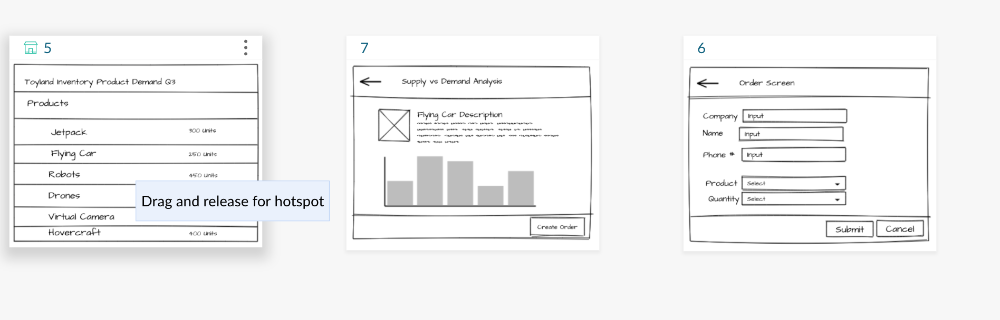

**Drag and create a hotspot over Flying Car**. After creating the hotspot, you need to set where it navigates to. **Point the arrow to the Product Details screen** to complete the hotspot navigation. You prototype should look like the screenshot below.

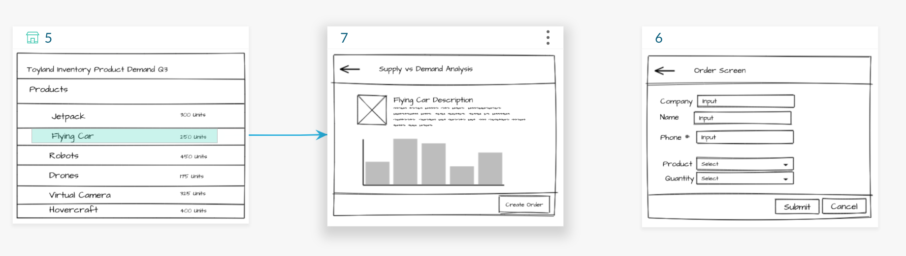

Add additional hotspots on the **nav-back arrows** and **Create Order button**. Have the nav-back arrows return to the previous page and the create order button navigate to the Order Details screen. The final configuration should look like the screenshot below.

[VALIDATE_5]
[ACCORDION-END]

[ACCORDION-BEGIN [Step 6: ](Preview the prototype)]
To preview the prototypes and test the hotspots, **click the Eye icon** in the top-right corner of the screen. This will toggle Preview mode.

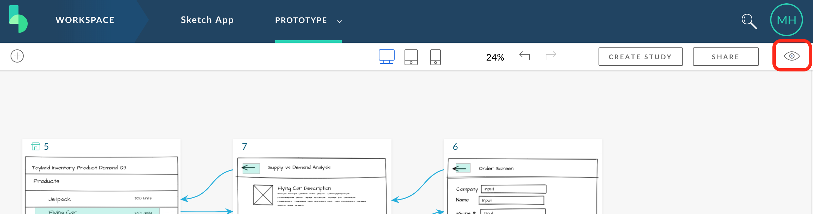

Click around on your application to try out the navigation on your low fidelity prototype.

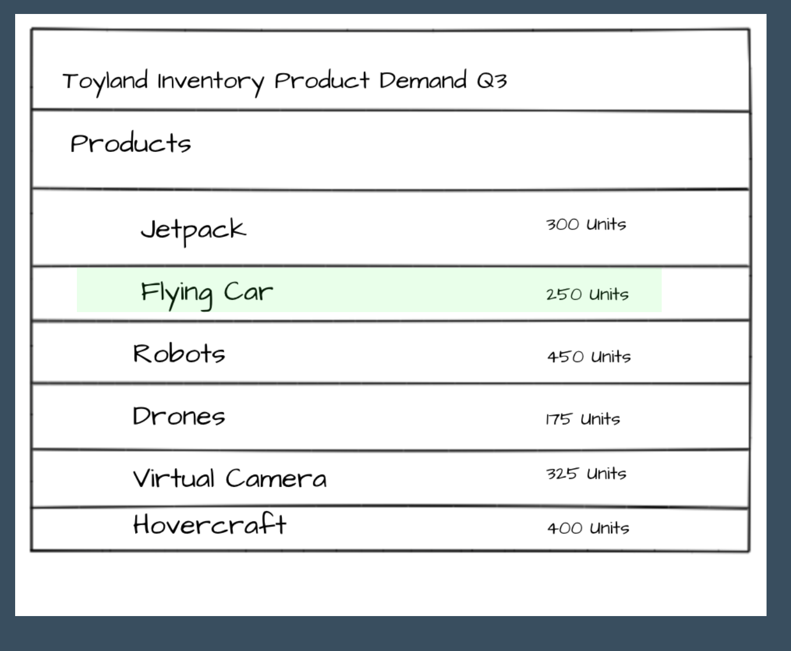

If you need help locating your hotspots, you can check the **Show Hotspots** box in the top tool bar. If you need to make changes to the app or are done testing, you can click **Return to Page Map** to exit the preview mode.

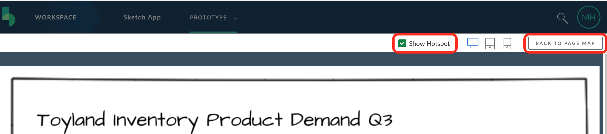

[DONE]
[ACCORDION-END]
