# Modify the process of your Use Case Buddy and connect it to your Work Zone site and app
<!-- description --> This tutorial will show you how to implement the Use Case Buddy's approval process to your app and configure the necessary elements to set the process up for you. This is possible because you already imported the templates and initially got your project started in the first tutorial - now is the time to connect everything and get your Use Case Buddy up to speed.

## You will learn  
  - How to connect SAP Build Apps and SAP Build Process Automation destinations
  - How to customize templates and get your Use Case Buddy to a first version

## Prerequisites  
 -  You went through the first Use Case Buddy Tutorial ["Get your Use Case Buddy started"](https://developers.sap.com/tutorials/build-use-case-buddy.html)  and got your project started. 

## Intro
Within this tutorial you will implement the Use Case Buddy's approval process and configure necessary elements to set it up. 

>Objective of this tutorial: Connect all content packages from SAP Build Apps, Build Process Automation and SAP Build Work Zone as well as change up necessary personalized settings for a first working version of the Use Case Buddy.

### Configure the needed process changes on the template
You'll need to set up the correct email configurations so that the right people in your organisation are the reviewers. The first email step in this process is to send a notification to the IT team/SAP Build Admins. They can then review the submitted use case information. Now you will configure the email notification that will be sent to them when a new Use Case idea is submitted.

1. Open your imported automation for the Use Case Buddy within SAP Build Process Automation. 

1. Change up the correct address of your reviewer. This person will get all the notifications about new submitted use cases, so this might be your IT Admin or CoE team. The email address can be entered in the email header. 
    
    <!-- size:500px -->
    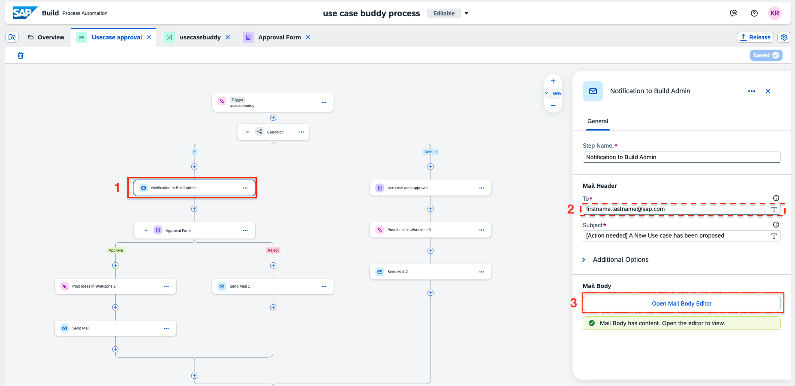

1. Feel free to also change up the content of the mail. Edit the mail body to reflect your thoughts on how such a email should look like.  Make sure to change the link of the inbox.
    
    <!-- size:300px -->
    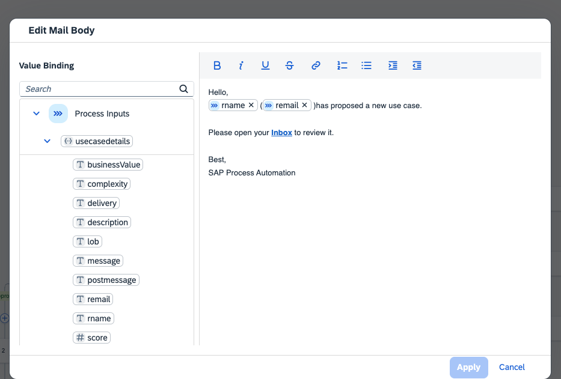

1. Similarily, edit the email body of the other email steps - for instance if an Use Case gets denied. 

1. Go to the approval step and enter the email address of your SAP Build Admin/IT admin.
   Following the same approach, also change the recipient for the use case auto approval form to this person.

    <!-- size:500px -->
    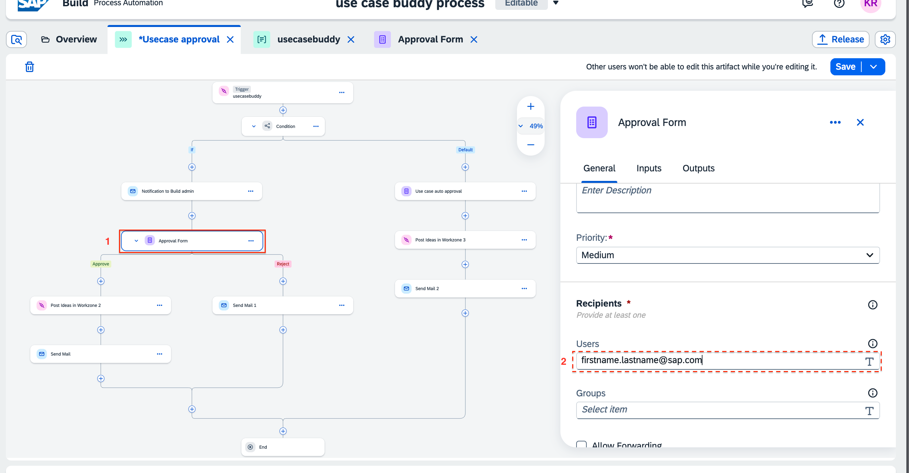

### Forward and show submitted ideas in the SAP Build Work Zone site

In the previous [tutorial](https://developers.sap.com/tutorials/build-use-case-buddy.html), you created an action project that will post the ideas in a chosen workspace of SAP Build Work Zone. Now you will insert that action project in this approval process so that approved ideas get displayed on the Work Zone site.

1. Click on the **+** icon under the left branch of the approval form (success branch) to add a step.  Select **Actions** now.
   
   <!-- size:500px -->
   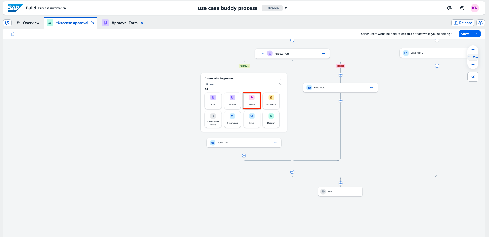

2. Now search for the action project you created and add it. 
    
    <!-- size:500px -->
    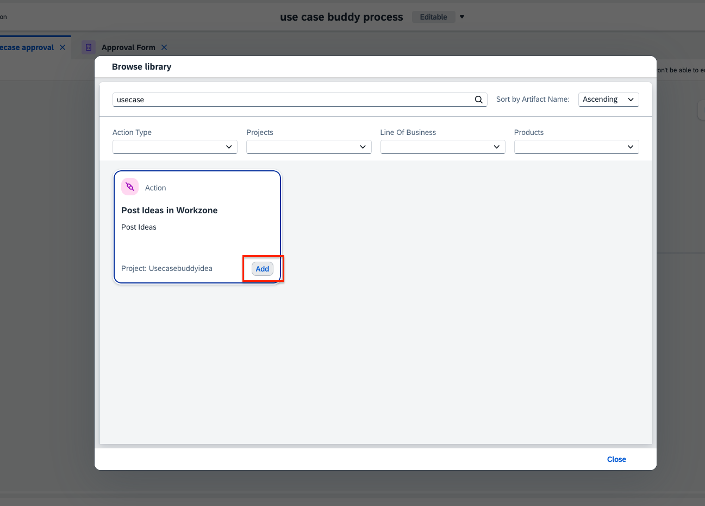
   
3. Rename the step to *Submit idea to Build COE*. Make sure a destination variable is selected, if not, please create one.
    Under **Run step on behalf of**, select **Approval form**. Leave the input parameters as it is.

    <!-- size:500px -->
    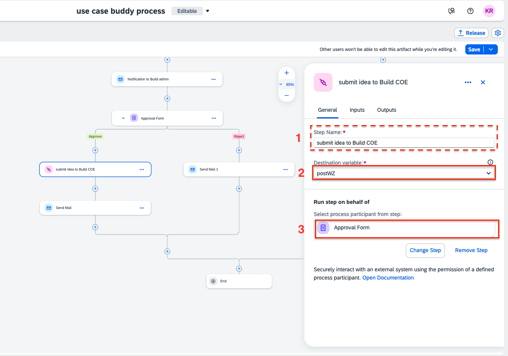
    
    Go to the Inputs tab, map, choose **postmessage** to *Content* and **title** to *Name*

       <!-- size:500px -->
    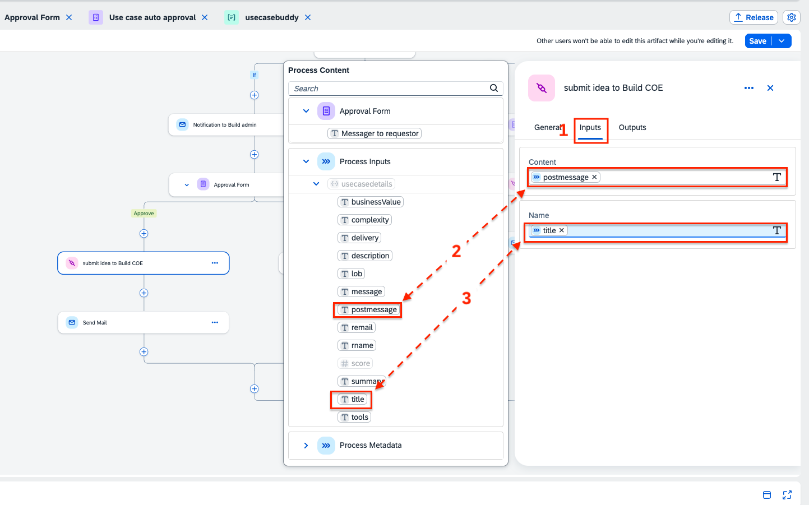

4. Similarily add another action project under the **Auto approval form** in the default branch of the Condition.
   
     <!-- size:500px -->
    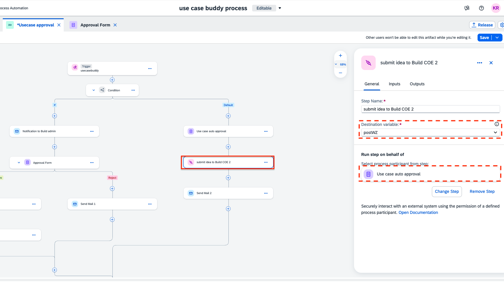

5. After all the configuration, make sure to **save** it and **release** it.

    <!-- size:500px -->
    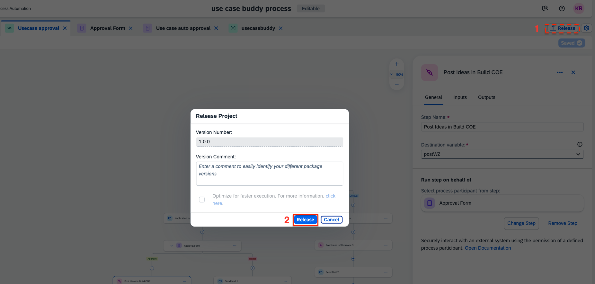

6. After releasing, deploy your project. Select the target you created to connect to  SAP Build Work Zone to define the target variable.

    <!-- size:500px -->
    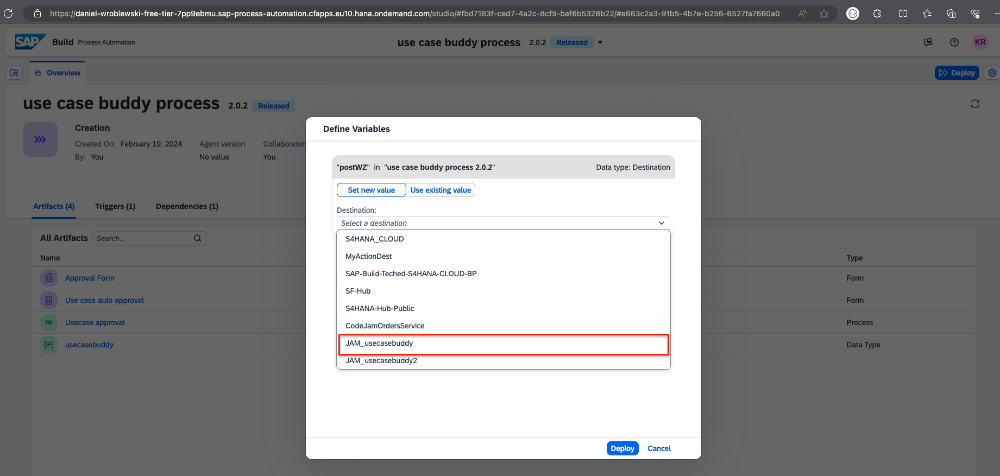

### Integrate your use case approval process with the Use Case Buddy App
In order for the Use Case Buddy to be able provide submitted ideas to your process you have to connect SAP Build Apps and SAP Build Process Automation. You will do this using a **destination** in the following step.

1. Make sure your [process automation destination setup](https://developers.sap.com/tutorials/spa-create-service-instance-destination.html) is completed. 

1. Open your process in SAP Build Process Automation. Check out which values are triggering your process. Navigate to the data type *Use Case Buddy*, where you can see the parameters.

    <!-- size:500px -->
    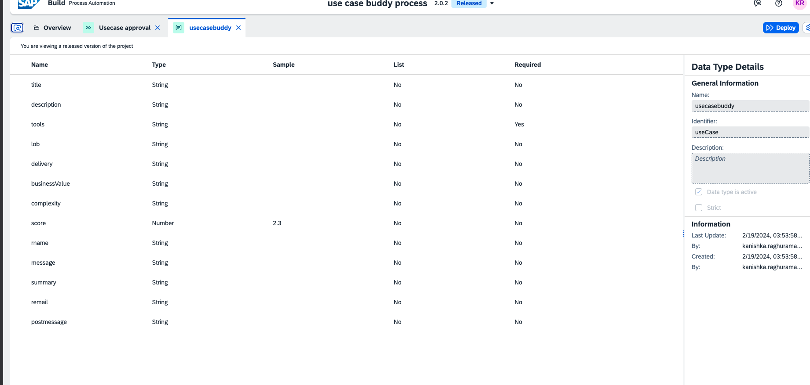

2. Make sure your SAP Build Process Automation project is **deployed**. Once deployed, go to the monitoring tab of your Build lobby and select **Process and Workflows**. 

    <!-- size:500px -->
    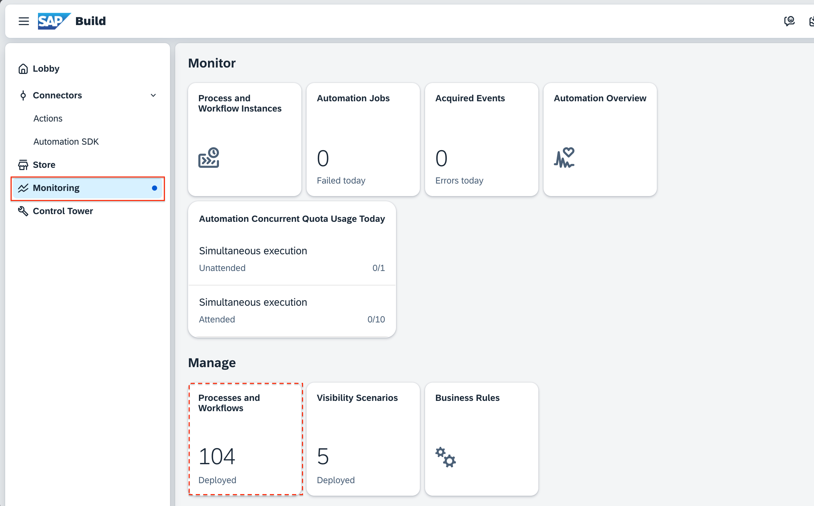

    Search for your process, and select it.

3. Copy the definition ID, you will use it later in your SAP Build Apps project.
    
    <!-- size:500px -->
    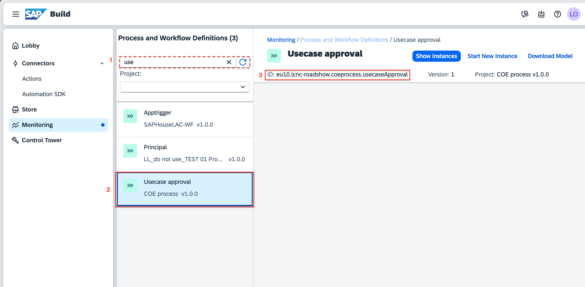

4. Open your SAP Build Apps project and check the data connection **Workflow**. 
   
   - Make sure the correct destination is selected to access your SAP Build Process automation. *Please note: the name should match with name given when creating your process automation destination in the first step.*
   - The resource schema from SAP Build Apps should match the data types in SAP Build Process Automation. 

    <!-- size:400px -->
    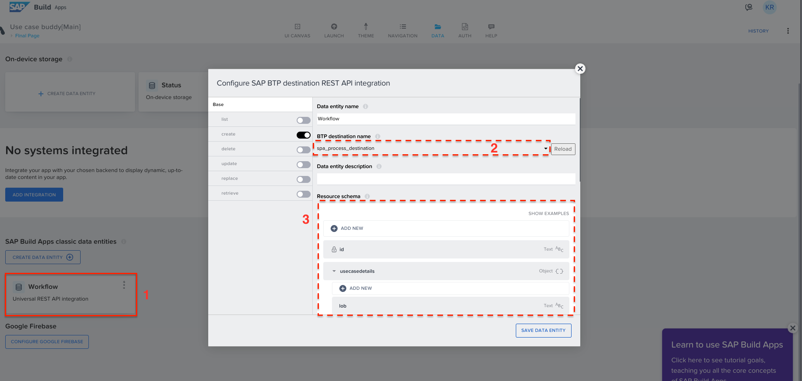

5. Select the **Create** tab and open the formula for *Request body mapper*.

    <!-- size:400px -->
    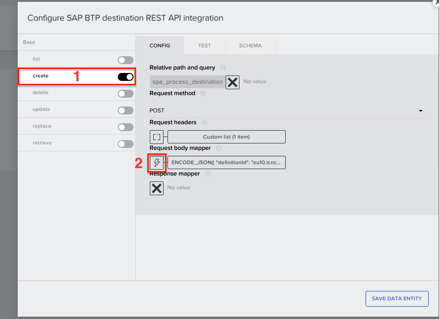

6. Use the formula editor to replace the destination id of your deployed process. This is the id you copied in step 4. 

    *Context information:*
    *Through the destination, SAP Build applications can access the SAP Build Process Automation service, and by using the definition id of the process, the application will be able to identify the correct process to respond to. This data connection identifies the process and returns the values according to the data type schema created in the process automation project.*

    <!-- size:400px -->
    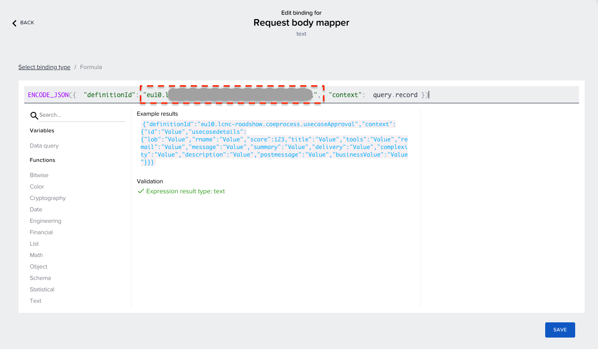

### Reality Check

✅ You just modified your process so that the right people are notified. 

✅ You connected your process to your Work Zone site so that submitted ideas will be displayed.

✅ You connected your process to your app so that submitted ideas will get forwarded and processed.

You successfully integrated SAP Build Apps, SAP Build Process Automation and SAP Build Apps Work Zone Advanced Edition! **Your Use Case Buddy is now setup.**

Now you finally only need to customize the app to your needs (f.ex. the branding, the questions) and deploy it in the last tutorial: ["Customize the Use Case Buddy App to your needs"](https://developers.sap.com/tutorials/build-use-case-buddy-customize.html) of the Use Case Buddy. See you there!

