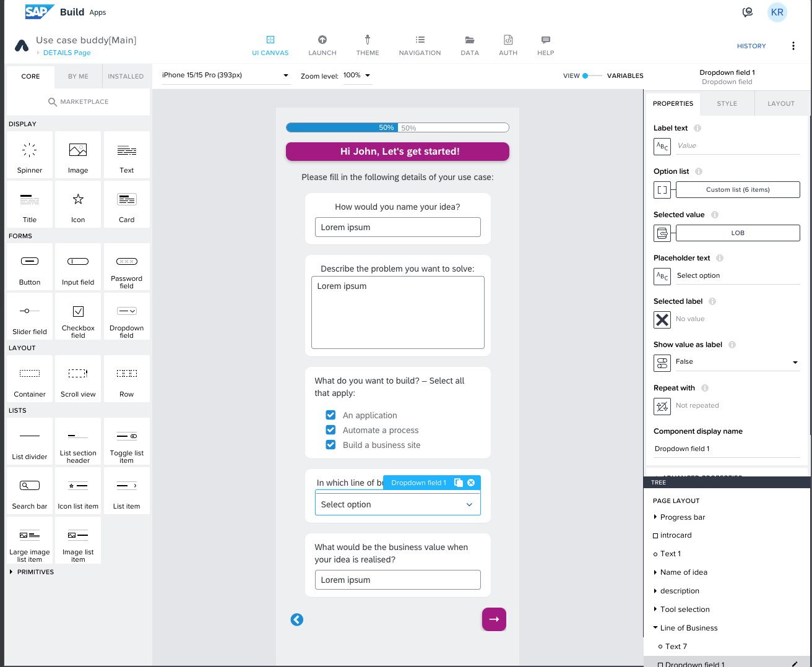
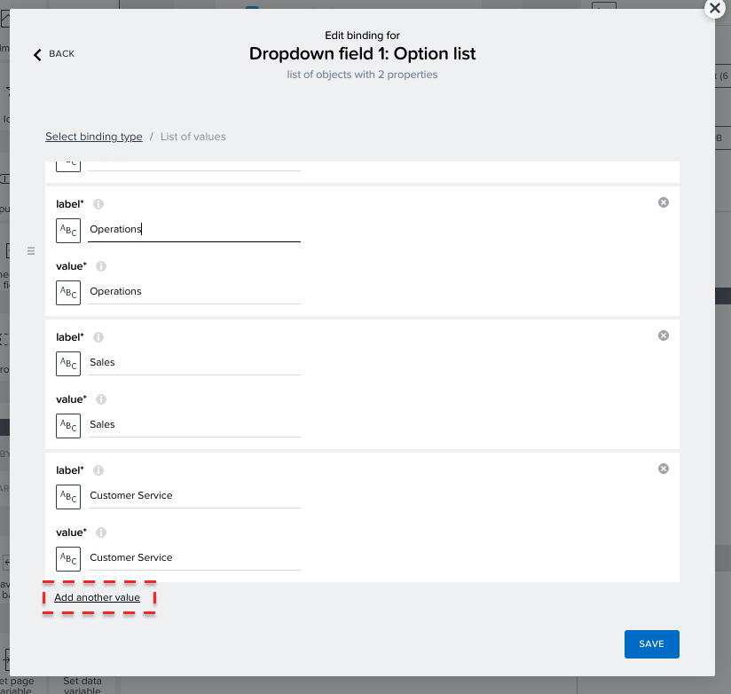
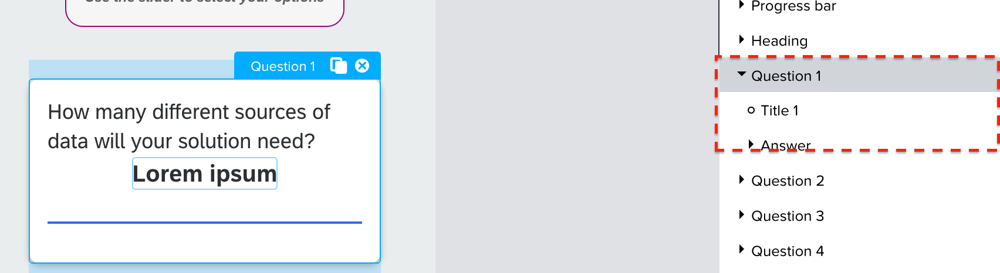
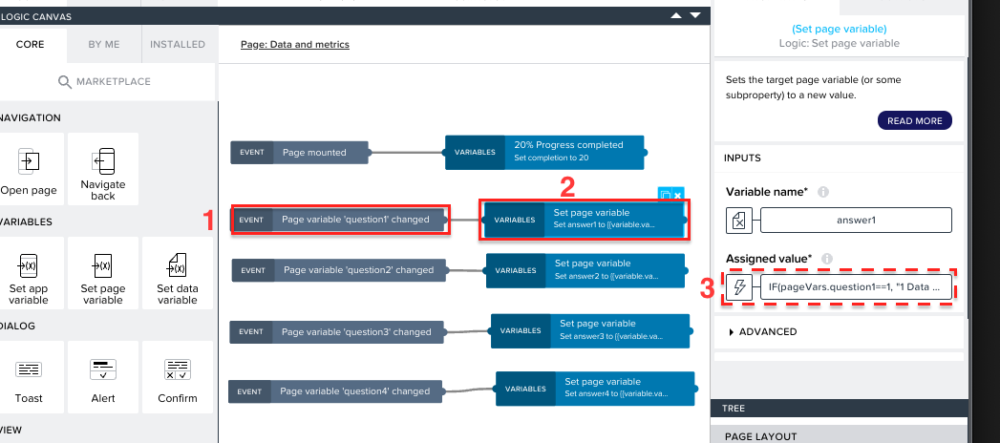
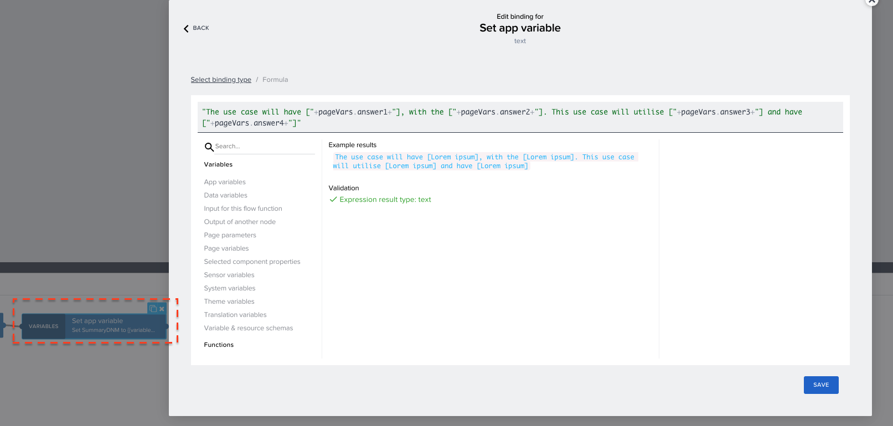
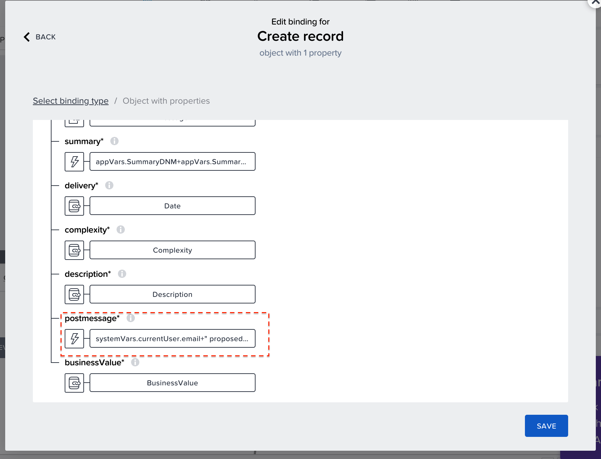
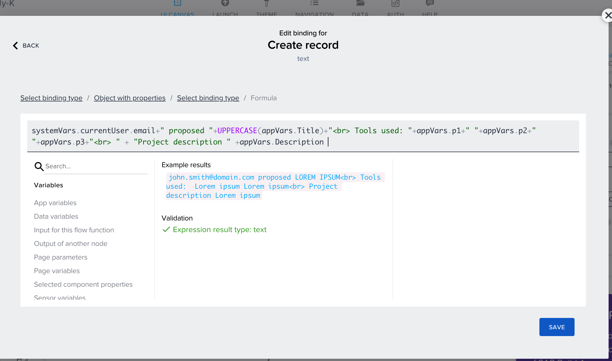
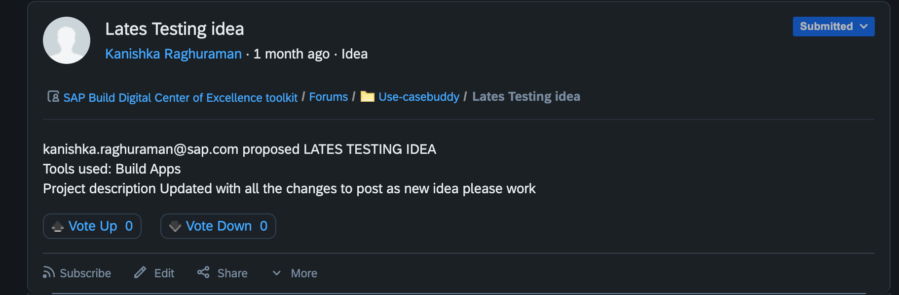

# Customize the Use Case Buddy App to your needs
<!-- description --> The templates of the Use Case Buddy already contain lots of great questions and proposals for how you can use and build your own Buddy app. This tutorial is all about you changing up the content from the app and deploy it in the end.

## You will learn  
  - How to customize a pre-built app in SAP Build Apps
  - How to deploy an SAP Build Apps app

## Prerequisites  
-  You went through the first Use Case Buddy Tutorial ["Build up your Use Case Buddy"](https://developers.sap.com/tutorials/build-use-case-buddy.html)  and got your project started. 
 -  You have implemented the Use Case Buddy's approval process configuration and setup the necessary steps from Tutorial ["Implement the Use Case Buddy's approval process configuration and setup"](https://developers.sap.com/tutorials/build-use-case-connect.html)

## Intro
This tutorial gives you inspiration and explains how the templates logic and flow is being built. You can go through the steps, check out what is possible and start playing around with your Use Case Buddy App.

Simply make it your own for example by using your company colours everywhere, change the questions and contents. 

### Customize the Introduction (Details) page
In the Details Page of your app, the basic information of the use case idea is collected. For example the Name, description, Line of business and more. App variables are used to collect this information.
  
  <!-- size:400px -->
  

If you want to add more questions to learn more or different things from the about the idea then add new questions and include new app variables to save the information. 

#### Do you want to have more options in the Line of Business Dropdown?
Sometimes the proposed Lines of Business don't reflect your organizations example. By changing up the list and add your own departments / business areas your users will understand the question. This way they are able to provide the right information for IT to process.

1. To add the more options in the list for *Line of Business*, open the binding menu for the *Option list* and add the options. 
  <!-- size:400px -->
  

2. In the binding menu - select the list of values to edit or add more options in the dropdownn list.
<!-- size:500px -->

### Customize the Progress bar
Your users are being made aware of their progess in answering all of the questions by seeing the progress bar at the top. If you don't want this to happen or change it up follow these steps.

1. The progress bar has been built by using an app variable: the *completion* value.
  <!-- size:500px -->

  
2. Use the *Set app variable* function to assign the value to progress bar, in every page to hardcode the progress based on the number of pages used.
   
  <!-- size:500px -->
  

### Customize the slider question containers
As your users progress through the app, they will be asked a series of questions. Each answer will have a different level of complexity associated with it. Using the sliders below the questions, they will be able to not only answer to it but at the same time understand for themselves and show IT the impact of the answer on the overall complexity.

If you want to have different slider questions or change up the look of it follow the next steps.

1. Each question container will have a Title component and an Answer component.
  The questions are static, and can be changed in the properties of the component. Here would be the place to insert your new / changed question if you want to have a different or new question.

    <!-- size:500px -->
    

1. The Answer component will have a text component and a slider component. Additionally there are page variables binded to the answer and question components respectively to save and process the information.

    <!-- size:500px -->
    

3. The slider has 5 values and the text components will display dynamic values based on the slider value with logic created on the page level. Feel free to change the options and values accordingly - for example if you want to weigh certain factors more or get rid of the "Unsure" option.
  
  Below is the logic for the values:
   - An event logic is used to check the slider values. In the properties of event logic select the question variable which is binded with the slider.

  <!-- size:500px -->
  

   - The answer page variable is binded with a formula to check the slider value and show the respective option accordingly. 
      
    For example:
      IF(pageVars.question1==1, "1 Data source", IF(pageVars.question1==2, "2 Data sources", IF(pageVars.question1==3, "3 Data sources", IF(pageVars.question1==4, "4 Data sources", IF(pageVars.question1==5, "not sure about the number of data resources",""))))) <!-- this will format it as code on the sap.developers markdown flavor-->

### Understand how the complexity score is calculated
The complexity score is a straightforward aggregation of the previous slider values. Each slider, ranging from 1 to 5, represents a level of complexity (1 being easy, 5 being difficult). In the template, there are five values in each slider.

Consider a page with four questions where each question has a slider with five values. The maximum complexity score for this page would be **5 values * 4 questions = 20**. To make this more digestible, we calculate the average score on a 10-point scale for each page using the formula:

      Averagescore= (sum of selected values/maximum value) * 10

  <!-- size:500px -->
  

Finally we aggregate the score of all pages to calculate the overall complexity of the idea.

  <!-- size:500px -->
  

Feel free to change this calculation path according to your needs. You might want different aspects, meaning different pages, to have more impact than others on the score or add more complexity to the calculation.

### Customize the summary view in the end
At the end of the questions in the app your users get a summary screen which invites them to submit their idea with some additional information to IT. Similar to the score calculation, the summaries are concatinated using the page variables and some of the static text in each page.

  <!-- size:500px -->
  

Finally the summaries from all the pages are also concatinated when sending data to SAP Build Process Automation.

  <!-- size:500px -->
  

Feel free to change up this summary page for instance if you want to give your users more information, like further contacts, information on the next steps or if you want them to just be able to submit without needing to give our further descriptions like the expected go-live date or don't see their own complexity score.

### Customize the end results 
When your users answered all questions and described the necessary information the complexity level will get identified based on the complexity score. Additionally the information about the use case will be forwarded and displayed on the Work Zone site.

#### Identifying the different complexity level

- When the final page is mounted, the app variable *complexity* is binded using the following formula:
        IF(appVars.Score<=3, "Low", IF(appVars.Score<=5,"Moderate",IF(appVars.Score<=7.5, "High", IF(appVars.Score>=7.5,"Very High",""))))

- For a complexity score less than 3 the complexity is **low**, for complexity less than 5 it will be **moderate**,for the complexity score less 7.5 the complexity will **High**, and will remain **Very High** if the complexity score is greater than 7.5.Similar formula is used in the image component.

- Using *create record* logic in the *Submit use case* button, the data is sent from the app to trigger the approval process via destinations. Here, an additional field called *post message* is sent. 
This field is used to add formatting to the content of the post when adding it to your Work Zone site. 

  <!-- size:500px -->
  

  The used HTML tags can be used to format this text.

  <!-- size:500px -->
  

  This is the formatted text on the workspace:
  
  <!-- size:500px -->
  

### Test the app
Once you have finished customising, open the application in Preview mode to test the framework.

- In testing, you can enter the use case idea in the application and submit it.
- The idea will be submitted to the process where you will see the email notification to review the use case. In the SAP Build inbox from your reviewer you can then review the use case and approve it. 
- Now the approved idea will be forwarded and visible in the Forums of your workspace in your Work Zone site.  

### Deploy your app
Here you can find how to [deploy your application](https://help.sap.com/docs/build-apps/service-guide/build-and-deploy-web-applications).

### Reality Check

✅ You just customized your app based on your needs 

✅ You understood how app and page variables can be used in the logic flow of your app.

✅ You deployed your app so that your users will be able to consume it.

#### You successfully setup and build your very own Use Case Buddy!
Use it in your organization and adapt if over time to fit your internal processes and needs. 

What do you think of the Use Case Buddy? Share your experiences here within the [SAP Builders Group discussion](https://community.sap.com/t5/sap-builders-discussions/use-case-buddy/m-p/13628558#M867)!