## Prerequisites
 - You understand the basics of creating a chatbot, as described in the tutorial [Build Your First Chatbot with SAP Conversational AI](cai-bot-getting-started).

## Details
### You will learn
  - How to create intents
  - How to create entities
  - How to fork intents and entities
  - How to trigger skills and define required data for those skills
  - How to access data in the memory


### What you will build

You will build a bot so customers can:

  - Track a package
  - Price a package

To track a package:

  - The customer will indicate that they want to track a parcel
  - The customer will provide the package number
  - The customer will confirm they want to track the package
  - The bot will call an API to retrieve package info and display it

To price package:

  - The customer will indicate they want to price a package
  - The customer will provide the address (France only) and the size of the package
  - The bot will check that the address is in France, and then call an API to retrieve a map of the location
  - The bot will display the map, and provide a price for the package, based on its size

### In this tutorial

In this tutorial, you will start by creating a bot that understands the customer's intent to track a package, and understands when the user has provided a valid tracking number.

---

[ACCORDION-BEGIN [Step 1: ](Create skeleton bot)]

1. Go to [SAP Conversational AI](https://cai.tools.sap/) and log in.

2. Click **New Bot** and select the following:

    |  Field Name     | Value
    |  :------------- | :-------------
    |  1. What do you want your chatbot to do?           | **Perform Actions**
    |  2. Predefined Skills           | **Greetings**
    |  3. Create your bot     | <ul><li>Name: **`ShippingBot`**</li><li>Description: **A bot to help shipping customers track and price packages**</li><li>Language: **English**</li></ul>
    |  4. Data Policy  | <ul><li> **Non-personal**</li><li> **Store**</li><li> **Non-vulnerable**<li></ul>
    |  5. Bot Visibility | **Public**

    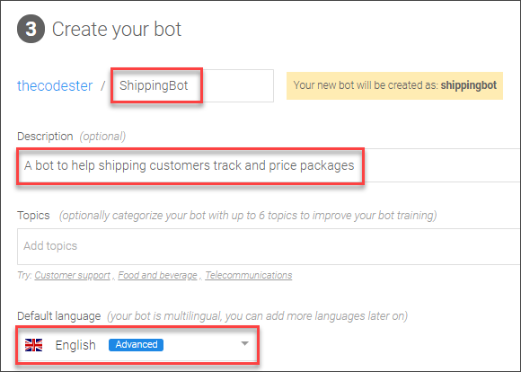

3. Click **Create a Bot**.


[DONE]
[ACCORDION-END]

[ACCORDION-BEGIN [Step 2: ](Create entity for parcel number)]

Our bot must be able to extract the parcel number from within the conversation. Such data extracted from a conversation is defined as entities.

The tracking number is based on one of UPS's standards: 18 characters with constraints, as described in [Tracking Number](https://en.wikipedia.org/wiki/Tracking_number).

1. Under the **Train** tab, go the subtab **Entities**.

    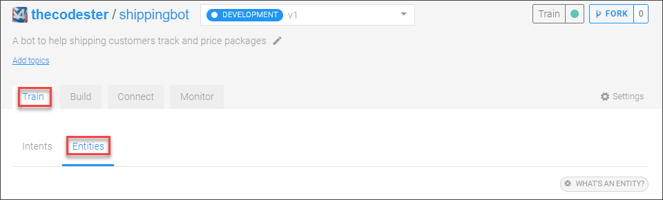

2. Click **Create an Entity**.

3. Call the entity **`PARCEL-NUMBER`**, specify it as a **Regex entity**, and click **Create**.

    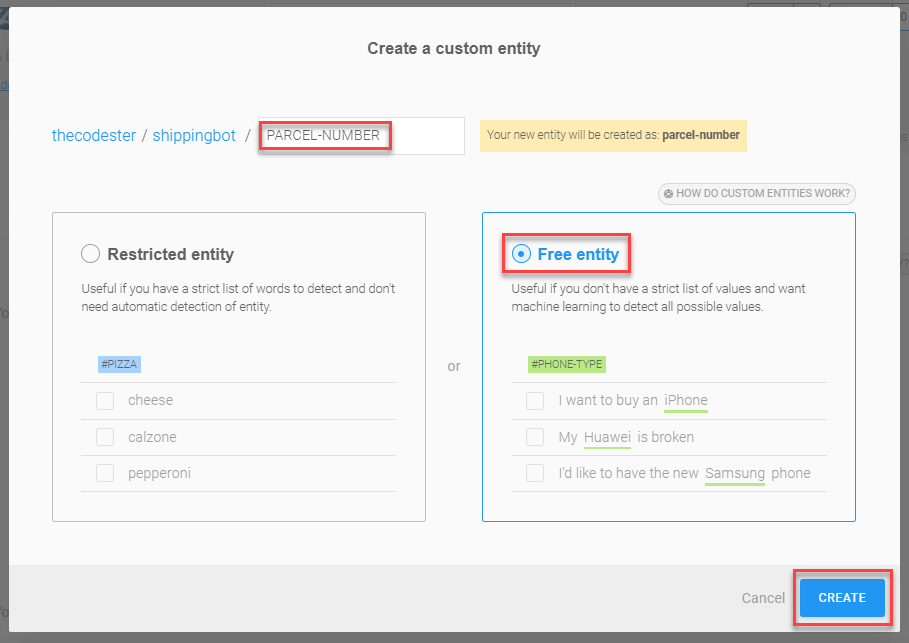

    >**Free entities**: You specify the type of data it is, and you teach the bot how to identity a value for that entity. You specify the form of the data but not the actual acceptable values.
    >
    >**Restricted entity:** You specify a limited list of acceptable values.

4. Click **`PARCEL-NUMBER`**.

    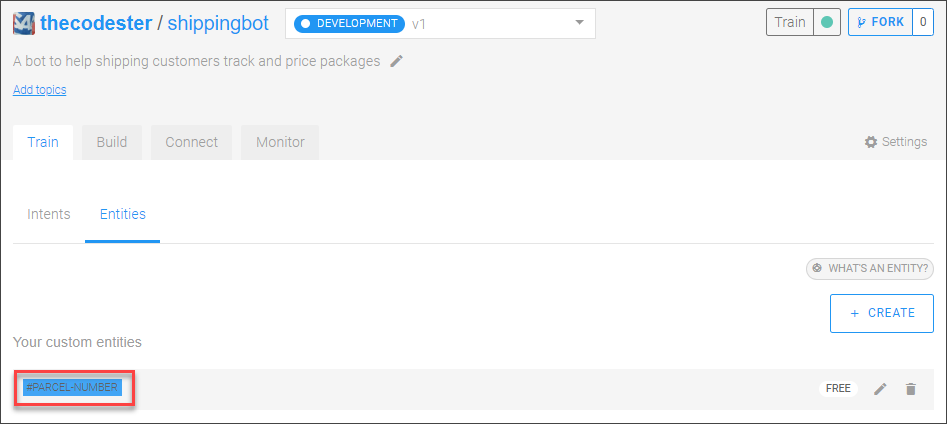

5. Enter the following regular expression:

    ```Regex
    \b(1Z[0-9A-Z]{6}[\d]{10})\b
    ```

    >This defines only one kind of UPS tracking number, and is a simple regex that does not distinguish between the parts of the tracking number.

    You can test some of your parcel numbers to make sure they match, for example, enter `1ZISDE016694068891` and click **Test**:

    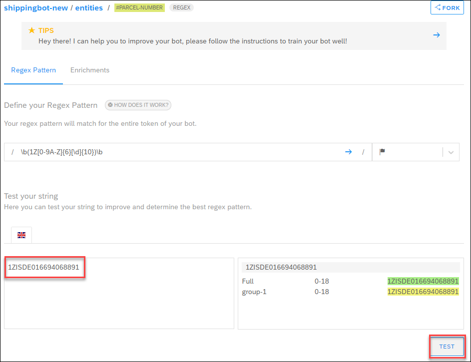

> ### Built-in Entities
>
> SAP Conversational AI comes with built-in entities (called gold entities) for common data, like location, dates, and money values. For more information, see [List of Gold Entities](https://help.sap.com/viewer/a4522a393d2b4643812b7caadfe90c18/latest/en-US/161cfefadfea4fbd9912cc38317ded57.html).


[DONE]
[ACCORDION-END]


[ACCORDION-BEGIN [Step 3: ](Add intents for yes and no)]

Customers will have to indicate whether they accept or reject certain requests from the bot, so the bot needs to be able to recognize when a customer means **"Yes"** and when they mean **"No"**.

You do not have to create these yourself. Instead, you can fork them from others who have already created them.

>Forking is simply copying, and does not create a relationship between your bot and the source of what you forked. You can fork intents, entities, skills or an entire bot. For more information, see [Forking Bots, Skills, Intents, and Entities](https://help.sap.com/viewer/a4522a393d2b4643812b7caadfe90c18/latest/en-US/eaa5dceaa83946f487c403b0bd6b6217.html).

1. In a different browser tab, go to [cai-adoption / ups-bot / intents / @yes](https://cai.tools.sap/cai-adoption/ups-bot/train/intents/yes).

    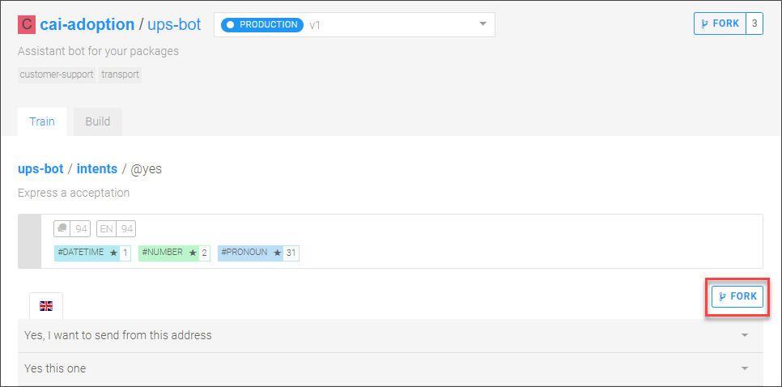

2. Just above the list of values -- **NOT** at the top of the page (that button is to fork the entire project) -- click **Fork**.

    Select your project, and click **Fork**.

    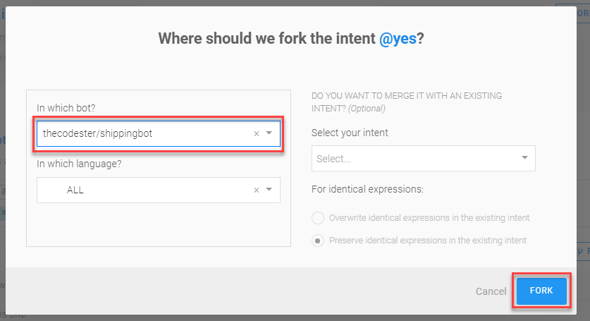

3. Go back to your project and click the **Train** tab (refresh the page if necessary), and you now see the **@yes** intent.

    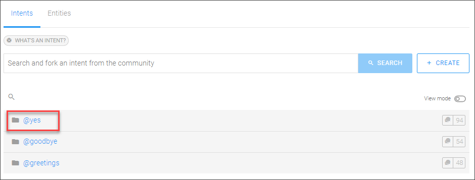

    Click into it, and see all its expressions, that is, all the ways someone could say **"Yes"**.

4. Test the intent by clicking the **Test** flap on the right of the screen, and entering expressions at the bottom.

    Enter **Sure** and **I think so** and **OK** to see that the bot understands the intent. Feel free to add additional expressions.

    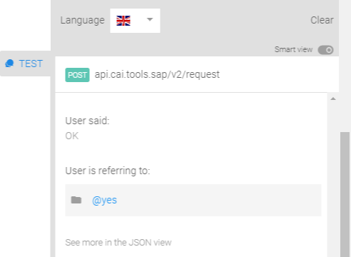

    You can see that the bot detected the intent.

5. Repeat the above steps for the **@No** intent, located at [cai-adoption / ups-bot / intents / @no ](https://cai.tools.sap/cai-adoption/ups-bot/train/intents/no).

[DONE]
[ACCORDION-END]

[ACCORDION-BEGIN [Step 4: ](Add intent for tracking parcel)]

Customers will be indicating that they want information on a parcel, so you need to create an intent for that.

Again, you do not have to create this intent yourself, but you can fork an existing intent.

1. In a different browser tab, go to [cai-adoption / ups-bot / intents / @track-parcel](https://cai.tools.sap/cai-adoption/ups-bot/train/intents/track-parcel).

2. Just above the list of values -- **NOT** at the top of the page (that button is to fork the entire project) -- click **Fork**.

    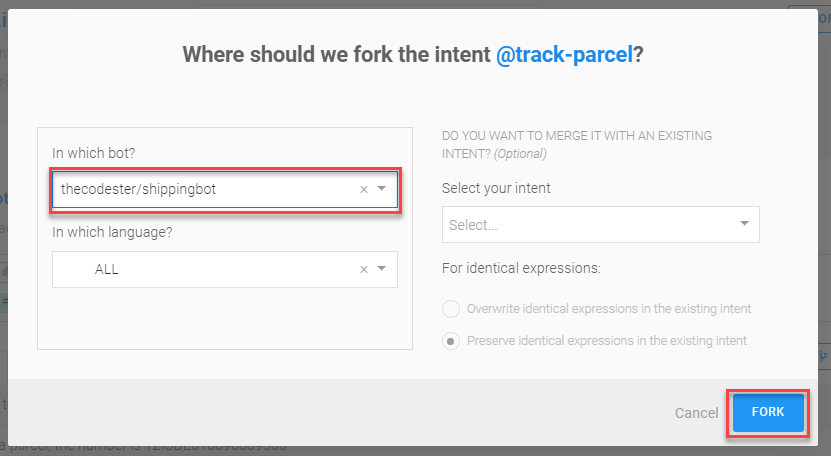

    Select your project, and click **Fork**.

3. Go back to your project and click the **Train** tab (refresh the page if necessary), and you now see the **@track-parcel** intent.

    Click into it, and see all its expressions, that is, all the ways someone could indicate they want to track a package.

    >Notice that some of the expressions contain a tracking number and some don't.

4. Test the intent by clicking the **Test** flap on the right of the screen, and entering expressions at the bottom.

    Try the following:

    - Where is my package
    - Track 1ZISDE016694068891

    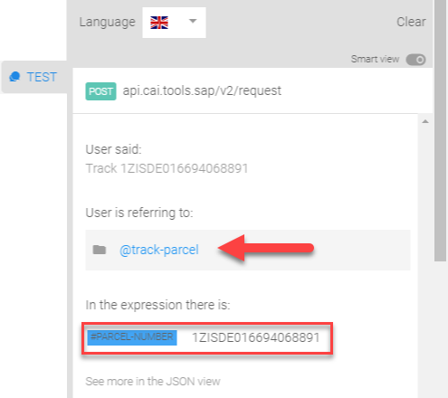

    In the second phrase, you can see that the bot not only detected the intent, but also detected the parcel number.

    Feel free to add additional expressions.

[DONE]
[ACCORDION-END]

[ACCORDION-BEGIN [Step 5: ](Create skill for tracking parcel)]

After you've determined that the user wants to track a package, you have to build a skill so the bot knows what to do in response to this intent.

1. On the **Build** tab, click **Add skill**.

    Call the skill **`track-parcel`**, and specify that it is a **Business** skill, then click **Add**.

    !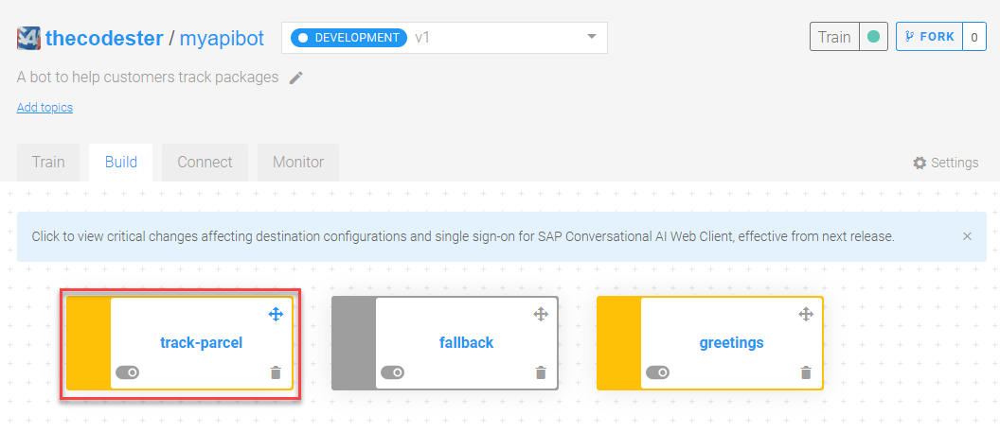

2. Open the skill for editing by clicking on its name.

3. Add a trigger so that this skill is triggered when the **@track-parcel** intent is detected.

    - In the **Triggers** tab, click in the field next to **If**.
    - Select **`@track-parcel`**.
    - Click **Save**.

    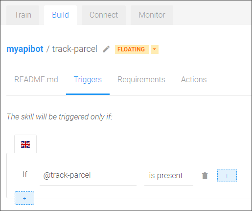


[DONE]
[ACCORDION-END]

[ACCORDION-BEGIN [Step 6: ](Add requirement to skill (parcel-number))]

The requirements for the **track-parcel** skill indicate the data the bot needs to extract from the conversation before executing the skill's action.

You will have several requirements. In this step, you will add the requirement for the parcel number.

1. In the **track-parcel** skill, go to the **Requirements** tab.

2. In the first field under **Required Information**, click and then select **`#parcel-number`**.

    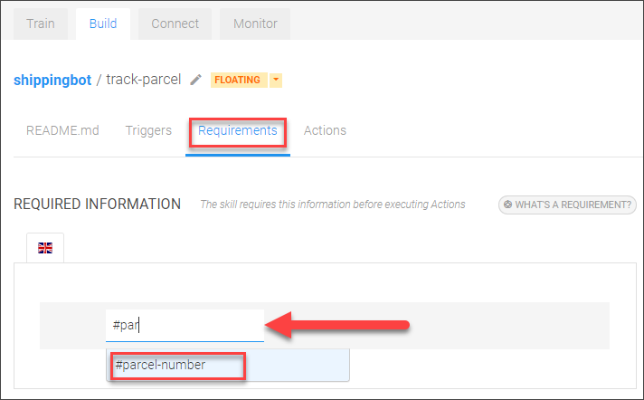

    In the second field (after **as**), enter **`parcel-number`**, and press **Enter**. This is the name in the memory for storing the data for this entity.

3. Click the **Expand** arrow.

    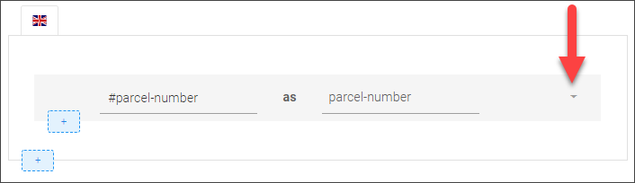


4. Next to **If #parcel-number is missing**, click **New Replies**, and then do the following:

    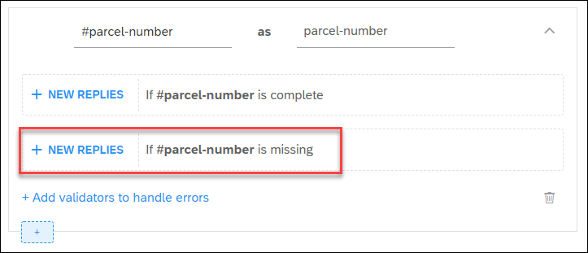

    - Click **Send Message**.
    - Click **Text**.
    - For the message, enter **Could you give me your tracking number?**
    - Click **Save**

    Reset the memory:

    - Click **Update Conversation > Edit Memory**.
    - Under **Unset Memory Field**, add `yes`, then add another field to unset, `no`.

    Click **Back**.

5. Next to **If #parcel-number is complete**, click **New Replies**, and then do the following:

    - Click **Update Conversation | Edit Memory**.
    - In the **Set Memory Field**, enter **`parcel-number`**.
    - For the field value, click in the field and replace the contents with the following:

        ```JSON
        {
        "raw": "{{uppercase memory.parcel-number.raw}}",
        "value": "{{uppercase memory.parcel-number.raw}}"
        }
        ```

    - Click **Save**, then click **Back**.

    >The API to get tracking information requires the parcel number in upper case, so this step automatically converts any input to upper case.

    >Here, we use Handlebars scripting to access the memory and execute the `uppercase` function. For more information on how to use scripting to access the memory and other conversation data, see [Scripting with Variables](https://help.sap.com/viewer/a4522a393d2b4643812b7caadfe90c18/latest/en-US/5b86debf32444658b29db44733d8d81a.html).

    >Scripting is also used to manipulate data returned by API calls, as described in the tutorial [Use Scripting to Design a Chatbot Message from an API Response](conversational-ai-scripting-intro).

[DONE]
[ACCORDION-END]


[ACCORDION-BEGIN [Step 7: ](Add requirement to skill (yes/no) )]
Now you'll add a second set of requirements -- the user's confirmation that they want to track the package.

1. Add a second requirement by clicking the plus sign ( **+** ) -- the second one that when you hover it says **Add a new list of requirements**.

    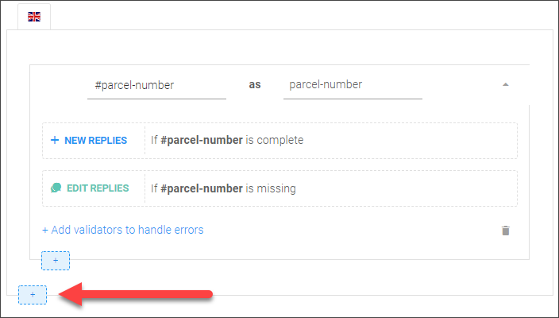

2. In the first field, click and select **@yes**.

    In the second field (after **as**), enter **`yes`** (the name in the memory for this value), and press **Enter**.

    Immediately under **@yes**, click the plus sign ( **+** ) and add the **@no** intent and store its value in the **`no`** variable. Press **Enter**.

    Click the **And** between `@yes` and `@no` and change it to **Or**.

3. Click **New Replies** next to **If @yes or @no are missing**.

    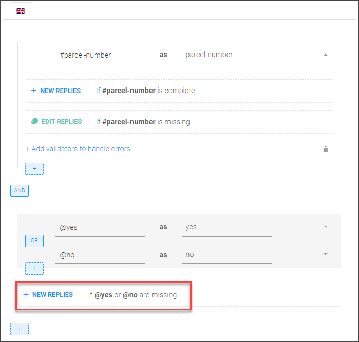

    Then do the following:

    - Click **Send Message**.
    - Click **Quick Replies**.
    - For the message, enter:

        ```Message
        Do you want to track the parcel {{memory.parcel-number.raw}} ?
        ```
        >Above you added code to retrieve the parcel number from the memory -- which stores all requirements, and any information you manually store there. For more information on the memory and syntax, see [Memory Management](https://help.sap.com/viewer/a4522a393d2b4643812b7caadfe90c18/latest/en-US/e99f8ad649a94f4a9c3c628567bede7f.html).

        - Click **Add Quick Reply** twice, and:
            - For the first, add **Yes** for both the title and value.
            - For the second, add **No** for both the title and value.

        - Click **Save**, then click **Back**.

        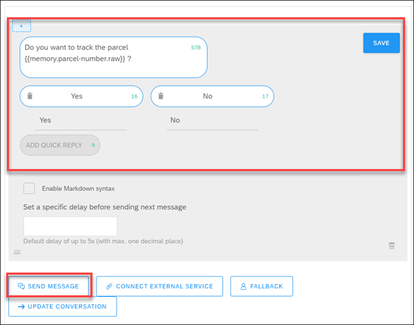

[DONE]
[ACCORDION-END]


[ACCORDION-BEGIN [Step 8: ](Add action to skill)]

Add the action if the user says **No**.

1. Go to the **Actions** tab.

2. Click **Add New Message Group**.

    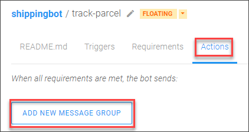

3. Click **Add Condition**, and then in the field next to **If**, select **@no**, and click **Save**.

4. Click **Send Message**, and then:

    - Select **Text**.
    - Enter **No problem. Let me know anytime if you want to track a package.** as the message.
    - Click **Save**.

5. Click **Update Conversation** | **Edit Memory**.

    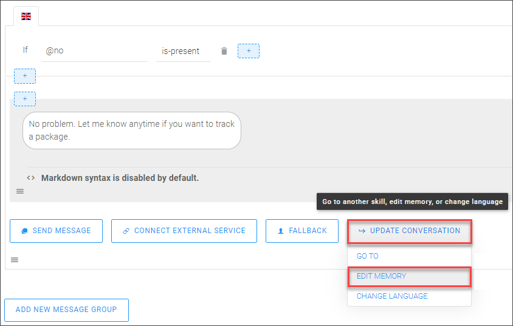

    In the **Unset memory field**, enter **`no`** (the value is case-sensitive), and then click **Save**.

    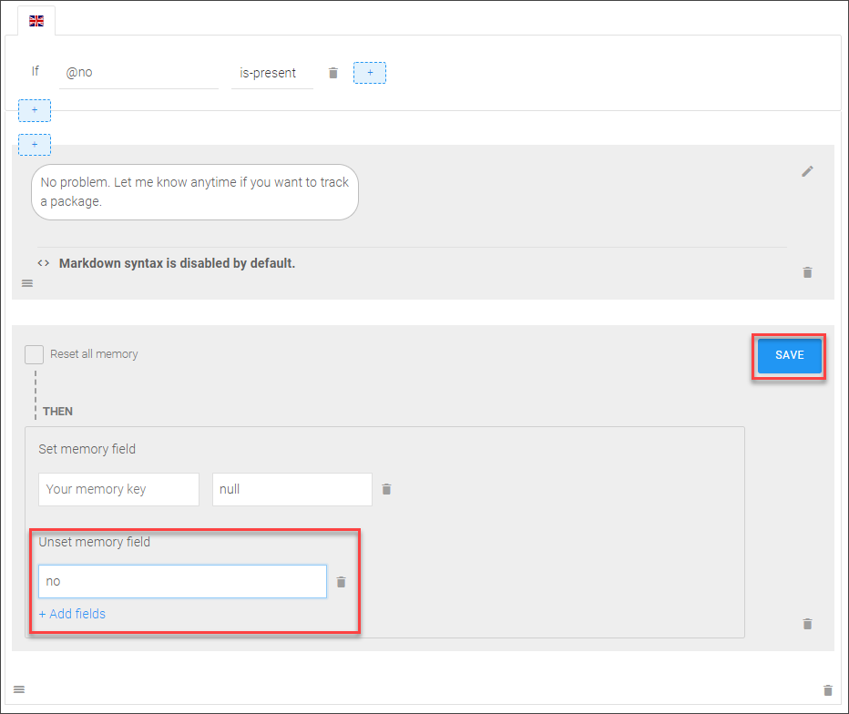

    > ### Why unset No ?
    >This will make it so the skill no longer fulfilled the requirement of having a **Yes** or **No** answer. So now if the user changes their mind, they can enter **`track package`** and the conversation will already have the tracking number stored and will only ask for confirmation.

If the customer says **Yes**, then you will make an API call and retrieve the information to display. You will code this in the next tutorial.

[DONE]
[ACCORDION-END]

[ACCORDION-BEGIN [Step 9: ](Test the bot)]

>If the **Test** panel is open, close it.

Click **Chat Preview** (bottom right) and start a conversation with your bottom. Use this tracking number: **`1Z12345E6205277936`**.

In the example below, notice the bot detects the intent to track a package, but notices the tracking number is missing, and asks for it. Finally, it asks for confirmation, using the tracking number by retrieving it from memory.

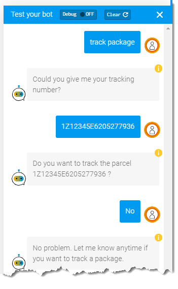

After the customer says **No**, this reply is unset in memory, so if the user again says **track package**, the bot simply asks for confirmation because the latest tracking number is still in memory.

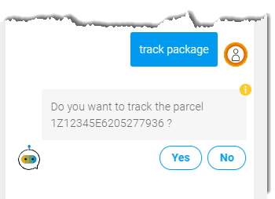

If the customer says **Yes** instead, for now the bot shows **No Reply** because you have not defined an action in this case.

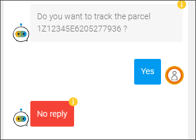

> ### No Reply vs. Fallback Actions
> When a bot has detected an intent and that intent triggers a skill, but that skill does not have an action that returns a message, then **No Reply** is shown.

> If a bot cannot figure out the intent of the user, or no skill has been triggered by the detected intent, then the fallback skill is triggered. When you created your bot, a fallback skill was created automatically for you with a default message.

> 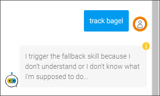

[VALIDATE_1]
[ACCORDION-END]


---
