## Prerequisites
 - You created a chatbot with SAP Conversational AI that enables customers to track packages, as described in the tutorial [Add Webhook to Chatbot to Retrieve Tracking Info](cai-bot-shipping-2-api).

## Details
### You will learn
  - How to create a restricted entity
  - How to enrich data in an entity
  - How to call an webhook to retrieve a Google map
  - How to retrieve data from memory, and to reset the memory

You will add features to your chatbot to answer customer questions about pricing a package, require customers to include a size and location, to validate the location, show a Google map when a location is validated, and to display a message with data from the memory.


---

[ACCORDION-BEGIN [Step 1: ](Create entity for parcel size)]

When a customer indicates they want to price a package, you have to know the size of the package. So our bot must be able to extract the parcel size from the conversation.

So create an entity for the parcel size. But in this case, create a restricted entity -- which only recognizes a fixed set of valid values.

1. Go to **Train | Entities**.

    - Click **Create**.
    - Enter **parcel-size** for the name.
    - Specify **Restricted entity**.
    - Click **Create**.

      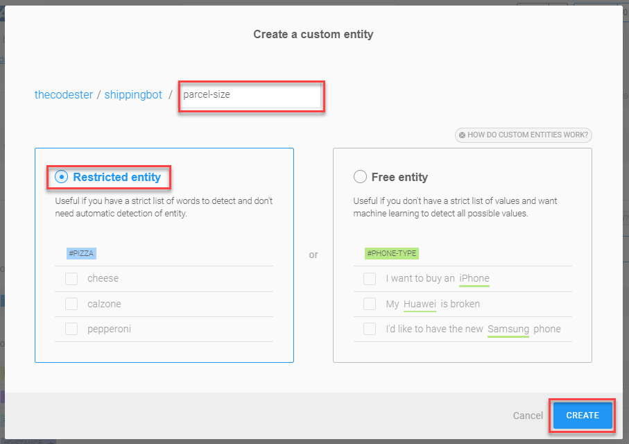

      You now have a second entity.

      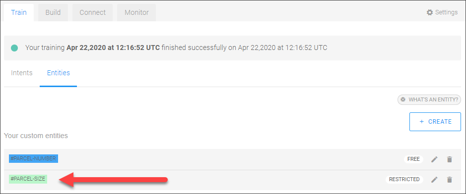

2. Enter the valid values for this entity.

    And instead of you entering each size separately, we have supplied the sizes in a CSV file. Do the following:

    - Download the [CSV file](https://raw.githubusercontent.com/SAPDocuments/Tutorials/master/tutorials/cai-bot-shipping-3-price-parcel/parcel-sizes.csv), which contains a fixed set of sizes expressed in various ways.
    - Click the new entity.
    - Click **Import a CSV File**.
    - Click **Browse** and select your file.
    - Click **Upload**.

    Refresh the page, if necessary.

    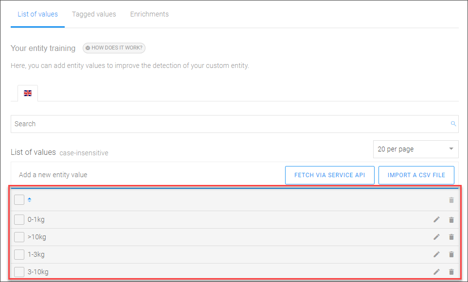

3. You will want to return a shipping price based on the size. So "enrich" the entity's data, setting a price value that the bot will add into memory when the entity is detected.

    - Go to **Enrichments**, and then select **Map Enrichments** (you may need to confirm by clicking **Validate**).

        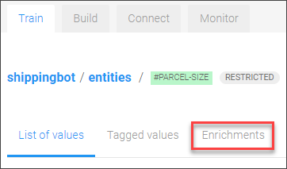

    - Click **Add New Pair**, enter **`name`** and **`null`** (the default value), and then press **Enter**.

        !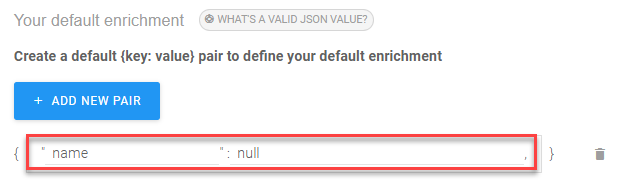

    - Click again  **Add New Pair**, enter **`price`** and **`null`**, and then press **Enter**.

    - Add 4 enrichment groups. For each, click **Add New Group**, specify a name ( **`>10kg`**, **`3-10kg`**, **`1-3kg`** or **`0-1kg`** ), and then click **Save**.

        For each group, click the pencil icon, select the corresponding entity values for the group, and set the values for the fields **`name`** and **`price`**.

        >Values must be in JSON format, so **`name`** must be enclosed in quotes.

        The groups should look like the following:

        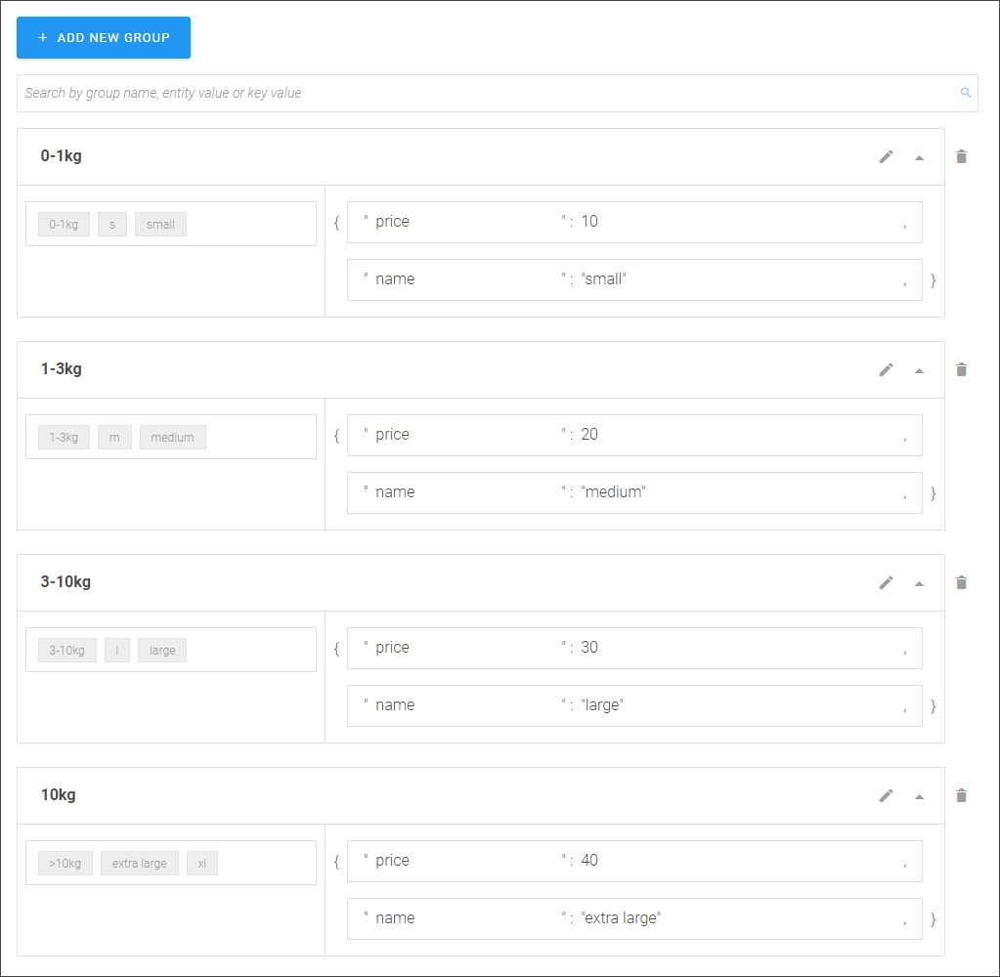

> ### What's going on?
>When a customer enters a size, the bot detects this as the #parcel-size entity. It then sees what group the entity value is part of, and then adds the additional fields in the memory, which can then be used in subsequent conversation.

>Try it out.

>Go to the **Test** panel on the right, and enter **`small`**. You can see it was detected as an entity **#parcel-size**.

>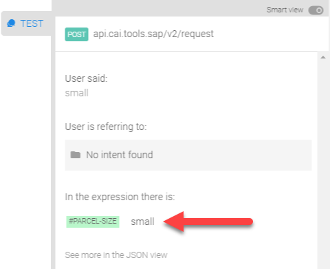

>Change to the JSON view, and you can see that the enrichments were added, based on the value of the entity.

>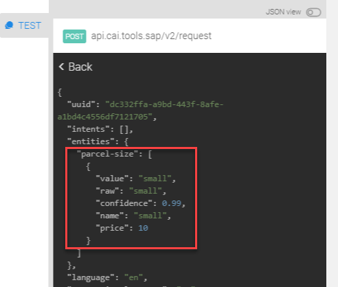


[DONE]
[ACCORDION-END]

[ACCORDION-BEGIN [Step 2: ](Add intent for requesting shipping price)]

You now want to define an intent so the bot can know when the customer is asking for pricing information.

You can also fork this intent.

1. Go to [`cai-adoption / ups-bot / intents / @rate-parcel`](https://cai.tools.sap/cai-adoption/ups-bot/train/intents/rate-parcel).

2. Just above the list of values -- **NOT** at the top of the page (that is to fork the entire project) -- click **Fork**.

    Select your project, and click **Fork**.

3. Go back to your project and click the **Train** tab (refresh the page if necessary), and you now see the **@rate-parcel** intent.

    Click into it, and see all its expressions, that is, all the ways someone could indicate they want a price for a package.

    >Notice that some of the expressions only indicate a need to price a package, others include the size, and still others include a location.

    >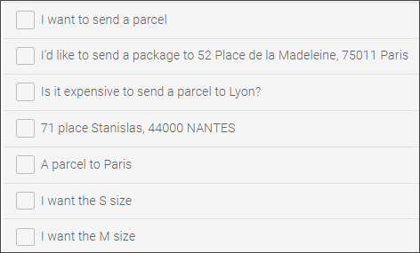
    >

3. Test the intent by clicking the **Test** flap on the right of the screen.

    Enter the following:

    ```Conversation
    I want to send a parcel to 102 place Stanislas, 44100 Nantes with L size box
    ```

    You see that the bot detected the intent of the customer -- to ship a package -- and was able to extract `#location` (a built-in entity) and `#parcel-size` (the entity you just created).

    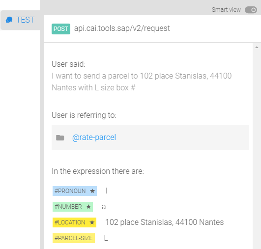

[DONE]
[ACCORDION-END]

[ACCORDION-BEGIN [Step 3: ](Build skill for requesting shipping quote)]

Build a skill that:

  - Requires the bot to have a location and parcel size.
  - Makes an API call to get a map of the location.
  - Displays the map plus the price from memory based on the enrichments you created earlier.

In this step, you'll simply create the skill and add the trigger.


1. In the **Build** tab, click **Add Skill** and create a new business skill called **`price-parcel`**, and click **Add**

    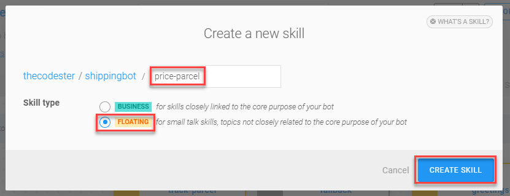

2. Click the new skill (it may be hiding under the **`track-parcel`** skill), and in the **Triggers** subtab, add the **`@rate-parcel`** intent, and click **Save**.

    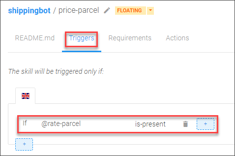


[DONE]
[ACCORDION-END]

[ACCORDION-BEGIN [Step 4: ](Add requirements to skill)]
You must require that the bot knows the size and location, and in addition get a confirmation of either yes or no.


1. In the **Requirements** subtab, add the requirements as follows:

    - Add 2 requirements: **`#parcel-size`** and **`#location`**

    - Add another requirement list, and add 2 requirements: **@yes** and **@no**

    - Between @yes and @no, click **And** to change it to **Or**.

    Your requirements should look like this:

    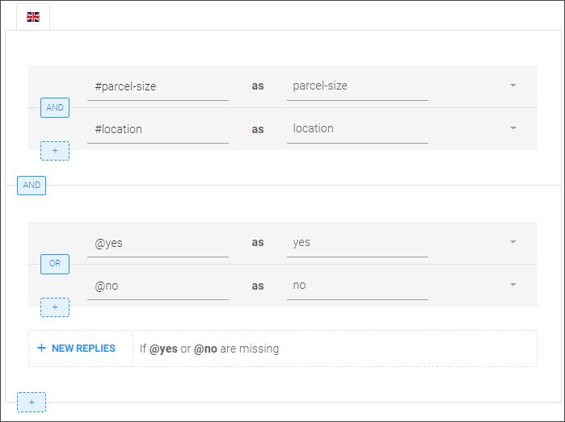

2. Now add a message in case the parcel size is missing.

    - Expand the **`#parcel-size`** requirement, and click **New Replies** in the case the requirement is missing.

    - Click **Send Message | Carousel**.

    - Add a card for the user to specify the small size, adding a **Postback** button type, and adding the texts as show below. When done, click **Add Card**.

        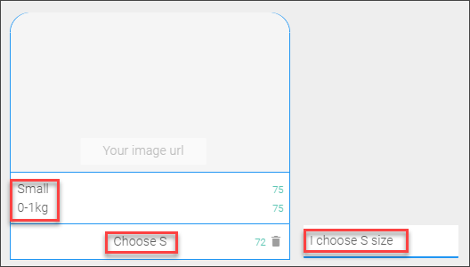

    - Add additional cards for each size.

        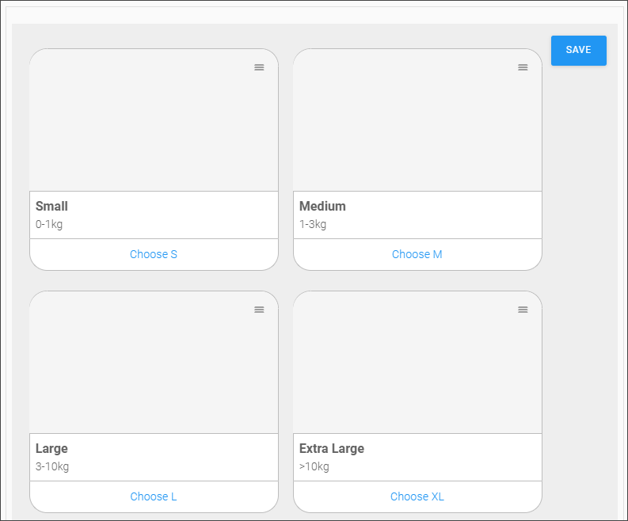

    - Click **Save** and then **Back**.

3. Now add a message in case the location is missing.


    - Expand the **`#location`** requirement, and click **New Replies** in the case the requirement is missing.

    - Click **Send Message | Text**, and enter the following for the message:

        ```Message
        What is the delivery address? (France ONLY)
        ```

    - Click **Save** and then **Back**.


4. Now let's require that the location be in France.

    - Expand the **`#location`** requirement, and click **Add validators to handle errors**.

        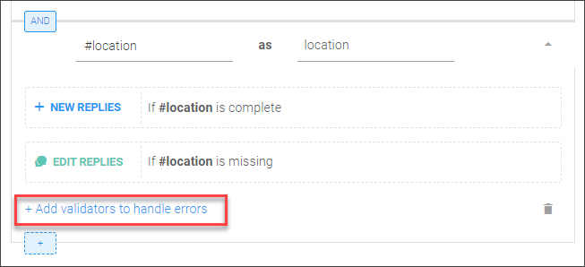

    - Click in the field next to **New Replies**, and select **`#location`**.

        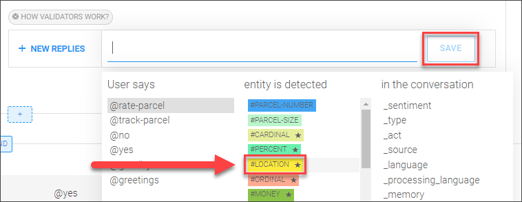

        Select **`.country`**, click **Save**, select **is-not**, enter **`fr`**, and then press **Enter**.

        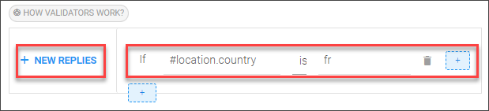

    - Click **New Replies** for the new validation, and create an error message with the following text:

        ```Message
        The delivery address is not in France. Can you give me another address?
        ```

[DONE]
[ACCORDION-END]

[ACCORDION-BEGIN [Step 5: ](Call API to show Google map)]

A nice feature would be to get a Google map for the delivery location. Our application deployed to SAP Business Technology Platform also has a call for retrieving a Google map based on the location in memory.

Your default endpoint is already set up because you used it earlier to retrieve tracking information.

1. In the **`price-parcel`**  skill, go to the **Requirements** subtab.

2. Expand the **`#location`** requirement, and click **New Replies** if #location is complete.

    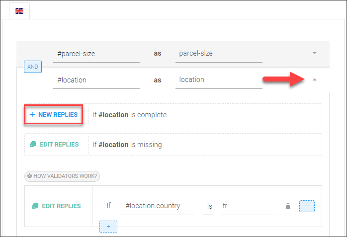

3. Click **Connect External Service | Call Webhook**

    - For the URL, enter: **`/get_location_thumbnail`**
    - Click **Save**.
    - Click **Back**.

You can open a chat and test this, by entering: **How much to send package to Paris**

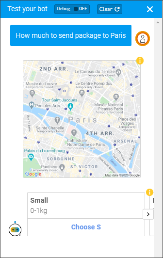

[DONE]
[ACCORDION-END]

[ACCORDION-BEGIN [Step 6: ](Display confirmation)]

1. In the requirements, click **New Replies** (if **`@Yes`** or **`@No`** are missing).

2. Click **Send Message | Quick Replies**.

3. For the the message, add:

    ```Message
    Are you sure?
    ```

4. Click **Add Quick Reply** twice, and create a reply for **Yes** and a reply for **No**.

    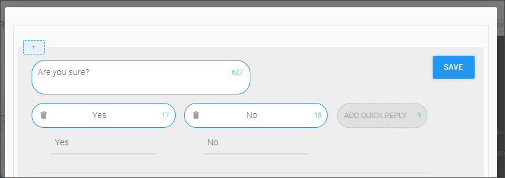

5. Click **Save** and **Back**.

[DONE]
[ACCORDION-END]

[ACCORDION-BEGIN [Step 7: ](Display results)]

Finally, you want to display to the customer the results of the query.

1. Go to the **Actions** subtab, and click **Add New Message Group**.

2. Click **Add Condition**.

    - Select **`_memory`**
    - Enter **`.yes`**.
    - Click **Save**.
    - Select **`is-present`**.

    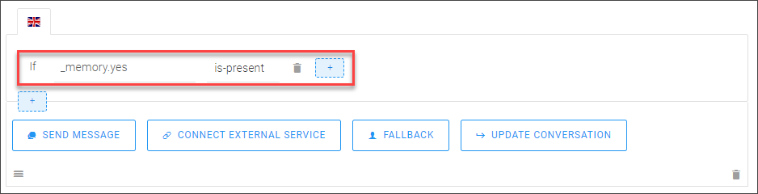

3. Click **Send Message | Text**, and enter the following for the message:

    ```Message
    A {{memory.parcel-size.name}} parcel sent to {{memory.location.formatted}} will cost ${{memory.parcel-size.price}}
    ```

    Click **Save**.

4. Since the conversation is complete, reset the memory so the customer can start a new conversation.

    - Click **Update Conversation | Edit Memory**.
    - Select **Reset all memory**.
    - Click **Save**.

    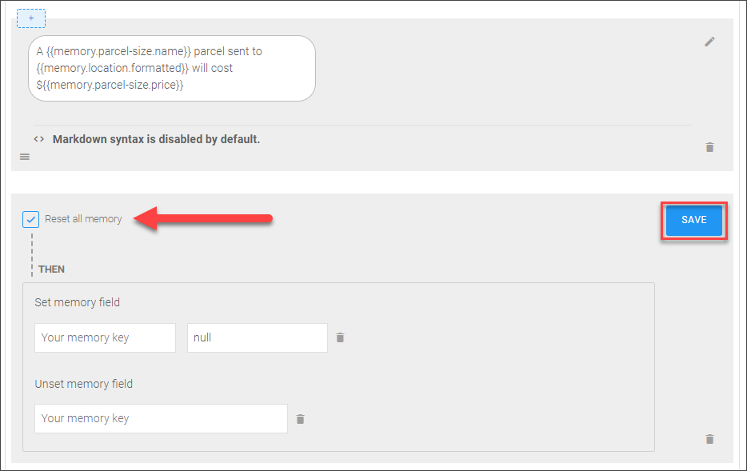

If you want, add a reply if the customer says no. Currently, it will just say **No reply**.

[DONE]
[ACCORDION-END]


[ACCORDION-BEGIN [Step 8: ](Test the bot)]

Here's an example of a conversation with the bot. Start off by saying this:

```Conversation
I'd like to send a package to 52 Place de la Madeleine, 75011 Paris
```


Test it by just indicating the intent (i.e., **How much to send package?**), giving it a non-French address, giving it the size in the right away, and other variations.


[VALIDATE_7]
[ACCORDION-END]
