## Prerequisites
 - An SAP Conversational AI account (as described in Step 1 of [Build Your First Chatbot with SAP Conversational AI](cai-bot-getting-started))
 - A Facebook account

## Details
### You will learn
  - How to create a Facebook Messenger app
  - How to set up your app for use as a chatbot
  - How to connect your SAP Conversational AI chatbot to your app
  - How to test and publish your Messenger chatbot

---

[ACCORDION-BEGIN [Step 1: ](Create your chatbot)]
First, create a chatbot by following the steps in the tutorial [Build Your First Chatbot with SAP Conversational AI](cai-bot-getting-started).

You'll need a bot so you can connect it to Facebook Messenger, and share with others.

[DONE]
[ACCORDION-END]

[ACCORDION-BEGIN [Step 2: ](Get your Facebook page ready)]
Your chatbot will only be available for integration on a Facebook page -- not on your personal profile. This means you must either create a Facebook page or have an existing page that you can use with your bot.

We assume your organization already has a page. If it does, continue to the next step.

If it doesn't, create one at <https://www.facebook.com/bookmarks/pages> by doing the following:

1. Click **Create a Page**.

    !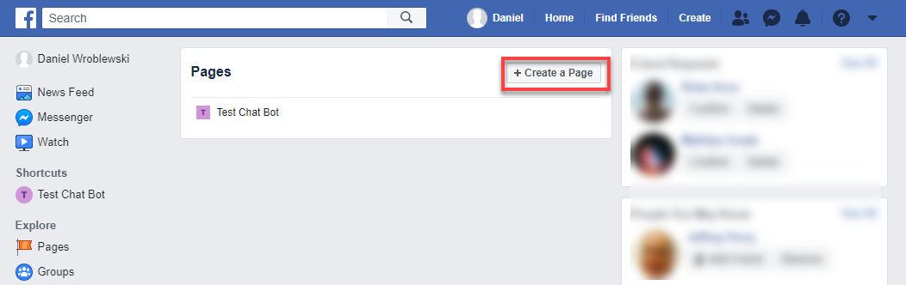

2. In the **Business or Brand** tile, click **Get Started**.

3. Enter:

    |  Field Name     | Value
    |  :------------- | :-------------
    |  **Page name**           | **`My Chat Bot Page`**
    |  **Category**           | **`Education`**

    Click **Continue** and follow the remaining instructions.

    >We suggest you add a unique profile image so when you message the page later, you can more easily find your page.

    >We also suggest you create a unique username for your page, also to make it easier to find. You can do this on the **About** tab of your page.

    > 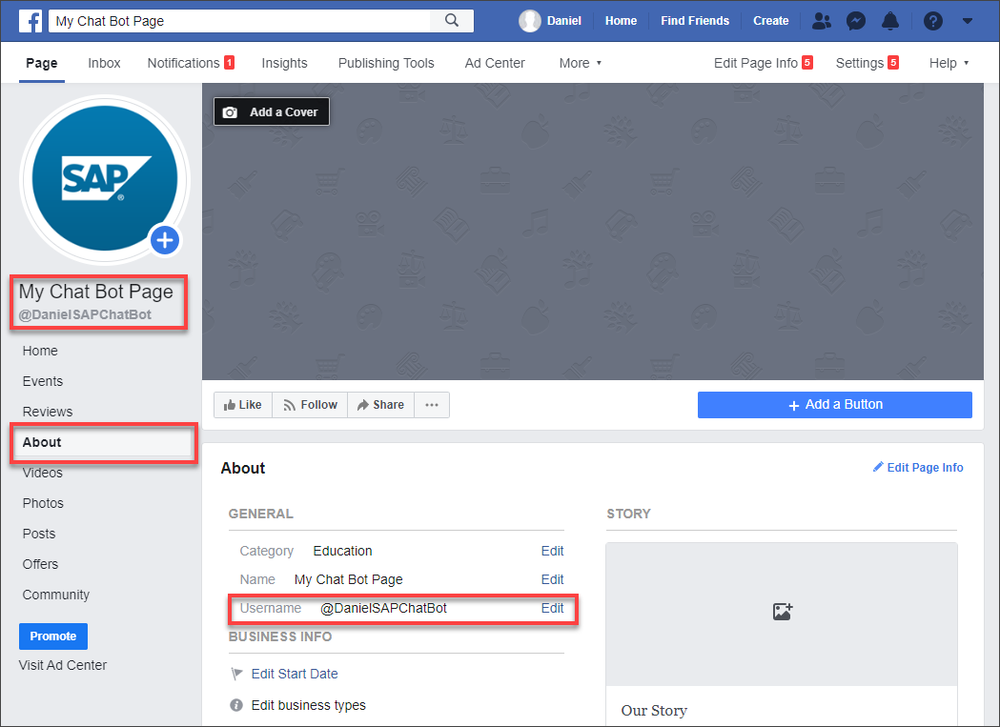

[DONE]
[ACCORDION-END]

[ACCORDION-BEGIN [Step 3: ](Create a Facebook Messenger app)]
To publish your chatbot on your Facebook page, you need to create an app that connects SAP Conversational AI and your Facebook page.

You do this at <https://developers.facebook.com/> (make sure you are logged into Facebook).

!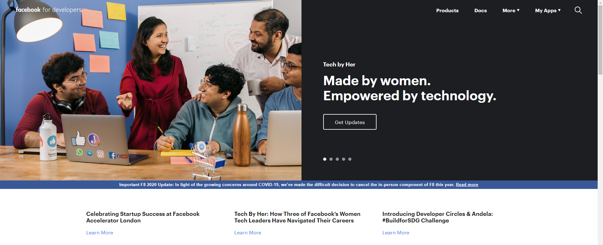

First, choose **My Apps** at the top right of the screen and then choose **+ Create App**.

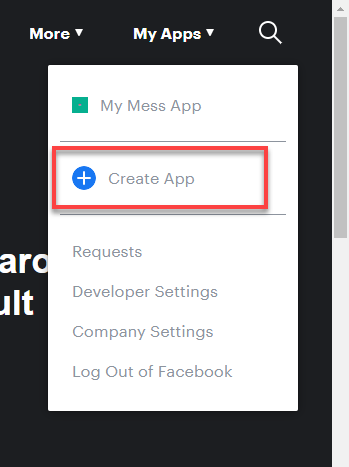

Second, give the app a name (e.g., **My Bot App**) and enter your email, then click **Create App ID**.

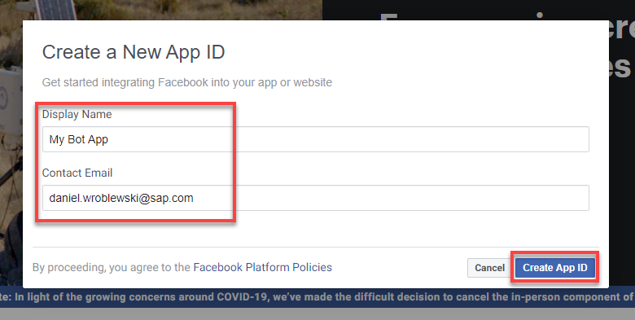

>Complete security check, if needed.

[DONE]
[ACCORDION-END]

[ACCORDION-BEGIN [Step 4: ](Set up your Facebook Messenger app)]
1. On the left of your Facebook dashboard, choose the plus symbol after **PRODUCTS**.

2. Find the **Messenger** tile, and choose **Set Up**.

    !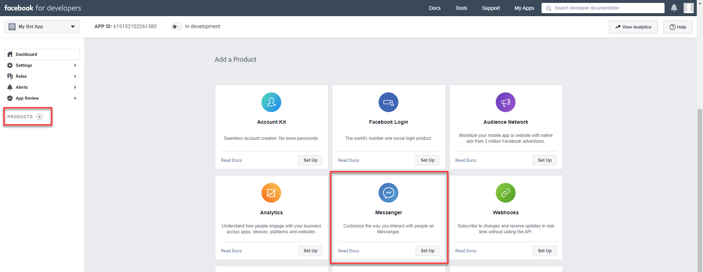

You now see **Messenger** under **PRODUCTS** on the left of the screen.

!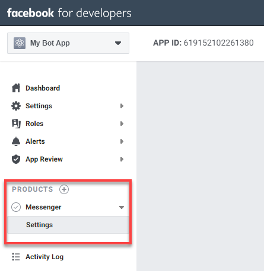

[DONE]
[ACCORDION-END]

[ACCORDION-BEGIN [Step 5: ](Get your Facebook page token)]
1. On the left of your dashboard, choose **Settings** just below the **Messenger** product.

    !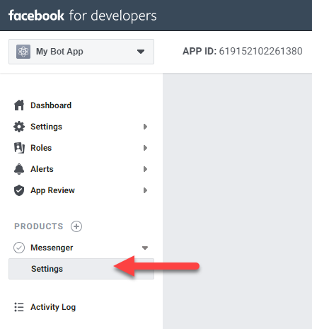

2. In **Access Tokens** section, click **Add or Remove Pages**.

    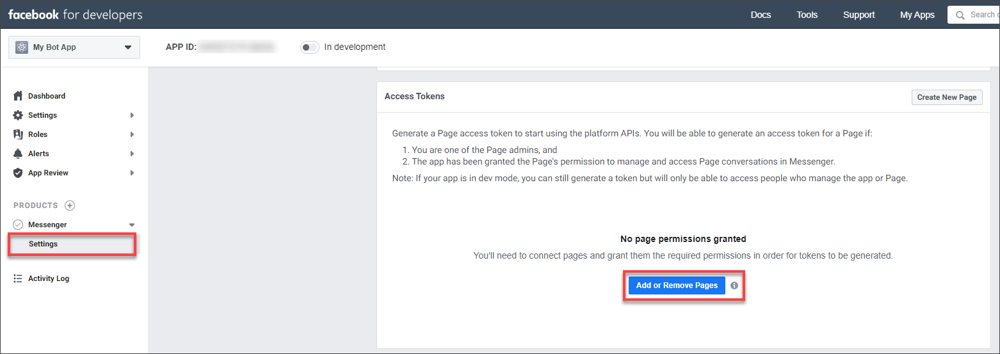

    - A login dialog asks you to confirm your account. Click **Continue as ...**.

    - Select your Facebook page, and click **Next**.

    - Click **Done**.

3. Back in the **Settings** screen, click **Generate Token**.

    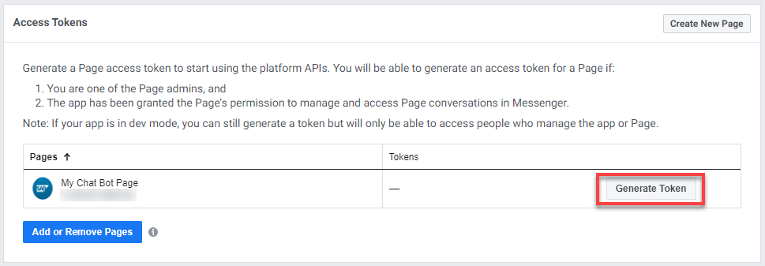

    Click **I Understand**, and copy the token, and click **Done**.

    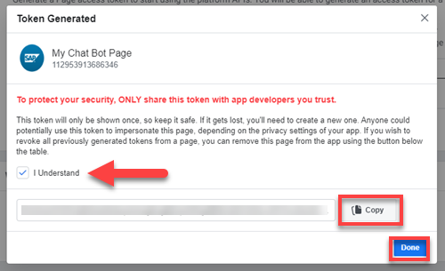

4. Go back to your SAP Conversational AI bot, and open the **Connect** tab in your SAP Conversational AI chatbot.

    - Choose **Messenger**.

    - Under **Get your app secret**, paste the token into the **Page token** field.

    Leave the page open. You will soon add the secret.

[DONE]
[ACCORDION-END]

[ACCORDION-BEGIN [Step 6: ](Get your app secret)]
On your Facebook dashboard, choose **Settings** > **Basic**.

!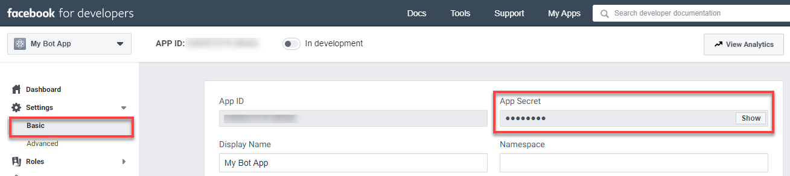

For privacy reasons, the app secret is hidden.

1. Choose **Show**.

2. Copy the contents of the field, and then paste them into the **App secret** field on back in SAP Conversation AI on your chatbot's **Connect** tab -- in the same way as you did with the page token.

    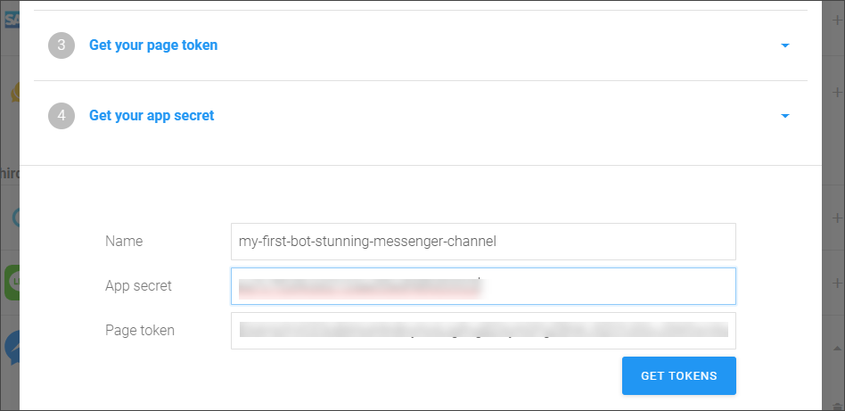

3. Now that you pasted in the token and secret, click **Get Tokens**.

[DONE]
[ACCORDION-END]

[ACCORDION-BEGIN [Step 7: ](Connect SAP Conversational AI to your Messenger app)]

1. Go back to the Facebook dashboard and choose **Products** > **Messenger** > **Settings**.

2. Go to the **Webhooks** section, and click **Add Callback URL**.

    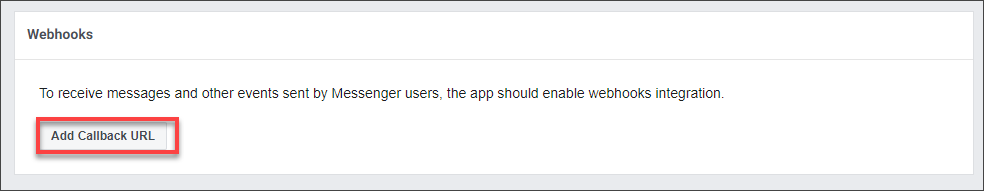

3. In the popup that now appears, enter the values for **Callback URL** and **Verify Token**, which you can copy from the your chatbot's **Connect** tab in SAP COnversational AI.

    The values were generated when you clicked **Get Tokens**.

    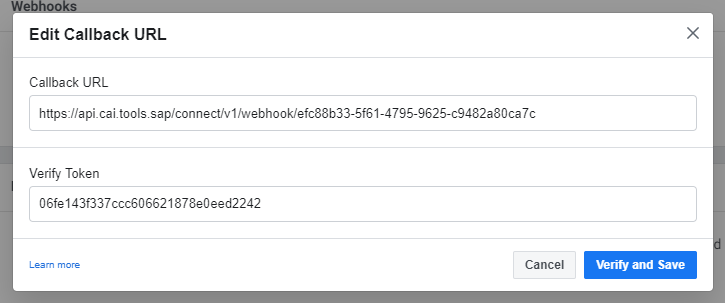

    Click **Verify and Save**.

4. Once your page has reloaded, click **Add Subscriptions** for your page.

    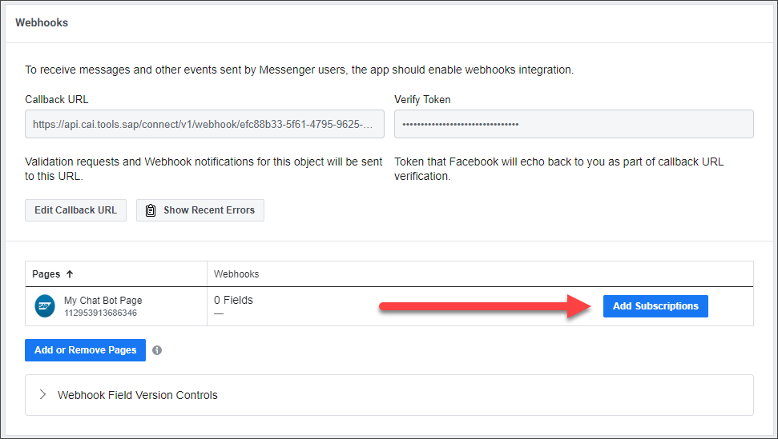

    Select the first 4 fields:

    - `messages`

    - `messaging_postbacks`

    - `messaging_optins`

    - `message_deliveries`

    

    Click **Save**.

[DONE]
[ACCORDION-END]

[ACCORDION-BEGIN [Step 8: ](Test your Messenger chatbot)]
Your bot won't be publicly accessible until you get approval and publish it. But you can access it as the administrator/developer.

Take your time to test the bot and make sure everything is working properly before releasing it to the world.

1. Go to your Facebook home page (not the bot page) and start a conversation with your bot.

2. Click the **New Message** button at the bottom of the page, and enter the name of your Facebook page.

    I used the unique username **`DanielSAPChatBot`** to find my page.

    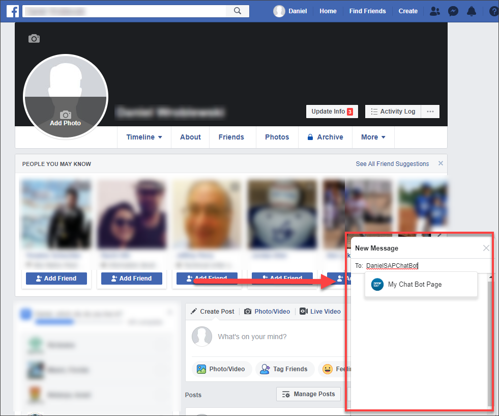

3. Type in text that will trigger intents of your bot.

    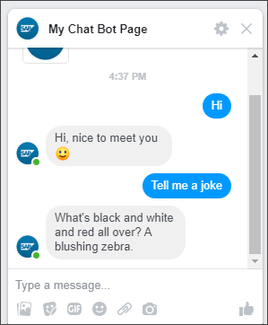

>You can also grant test roles using **Roles** in the left-hand menu in your app page on Facebook for Developers.

[DONE]
[ACCORDION-END]

[ACCORDION-BEGIN [Step 9: ](Submit your bot to Facebook and publish it)]

You've been testing your bot in development. Now you can make it public and everyone can talk with it.

1. Go back to your app in Facebook for Developers.

2. In the menu on the left, choose **Products** > **Messenger** > **Settings**.

3. In the **App Review for Messenger** area, and next to **`pages_messaging`**, click **Add to Submission**.

    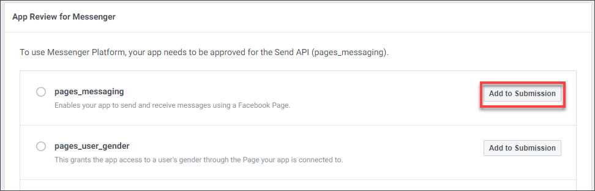

    This enables Facebook to perform mandatory verification and testing for your Messenger chatbot.
    You likely will have to provide additional information and add settings to the bot.

    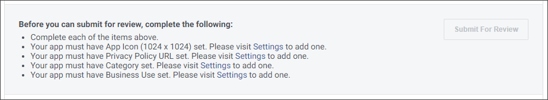

    Once you have added all the information, click **Submit for Review**. It won't take long for the Facebook review team to look at your bot and give you the green light to publish it.

    Once it is approved, a message should appear next to your submission.

    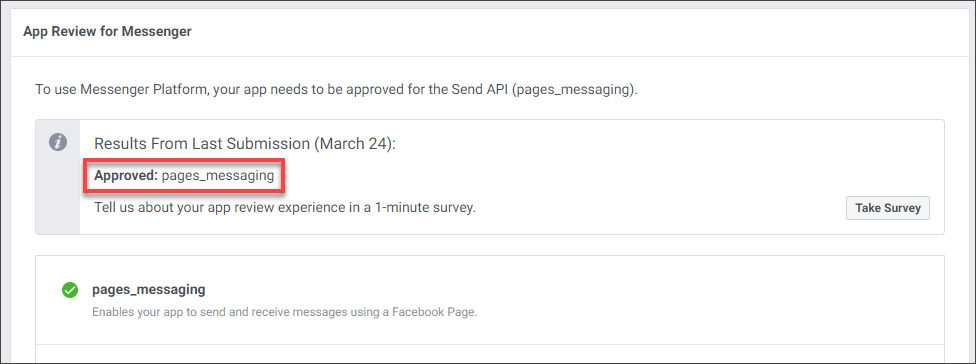

4. Once approved, make your application live by changing the **In development / Live** toggle.

    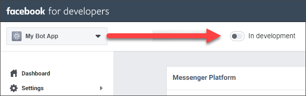

[DONE]
[ACCORDION-END]

[ACCORDION-BEGIN [Step 10: ](Test yourself)]
Congratulations! Your Messenger chatbot is now online on Facebook. If necessary, you can modify it, and any changes you make will appear in your Messenger chat.

Ask others to test

[VALIDATE_7]
[ACCORDION-END]

---
