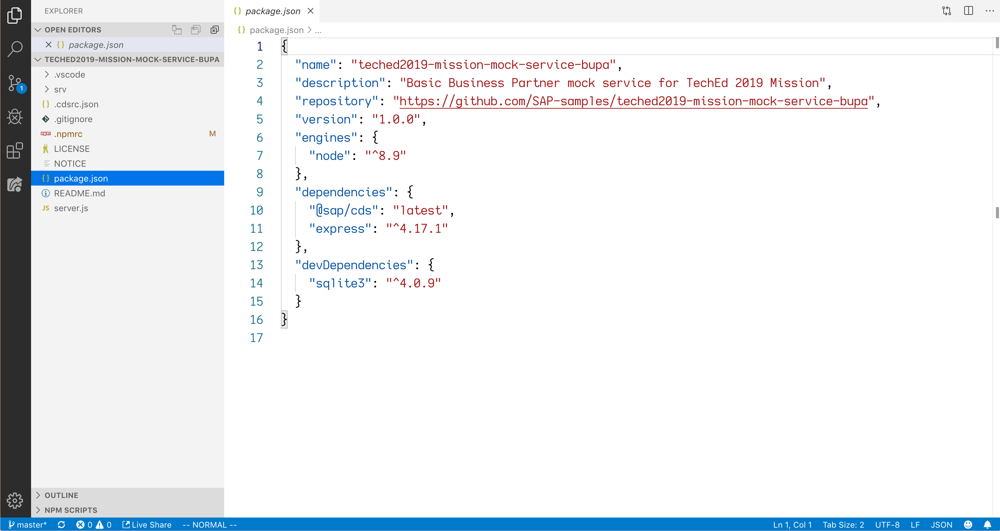
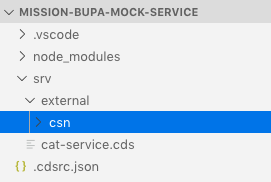
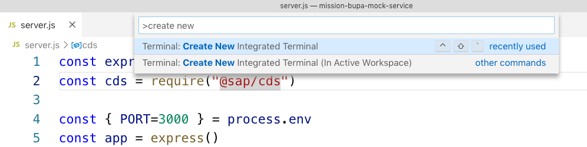
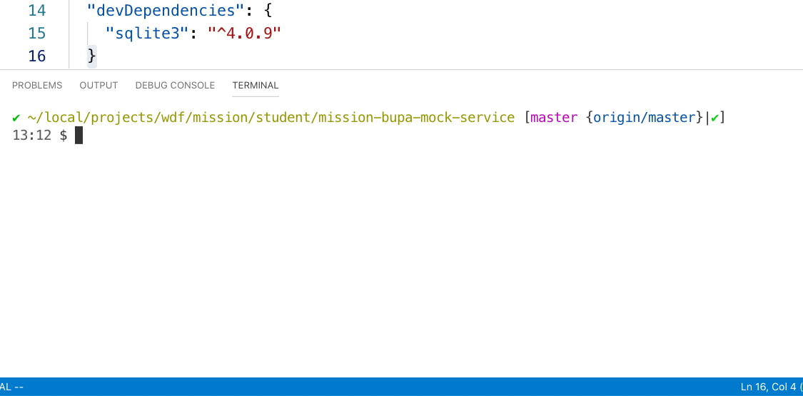

## Prerequisites
- You have the latest Google Chrome browser installed and will use that for these tutorials.
- You have a Git client available, with which to clone repositories (this tutorial will assume you will use the command line client `git`).
- You have [Node.js](https://nodejs.org/en/) version 8.9 or higher.
- You have the latest version of [Visual Studio Code](https://code.visualstudio.com/) with the latest [CDS Language Support for Visual Studio Code](https://tools.hana.ondemand.com/#cloud) installed.
- You have the [`SQLite`](https://sqlite.org/download.html) tools for Windows (for Windows users only, as it is already installed for macOS and Linux systems).


## Details
### You will learn
- How to clone a Git repository containing a Node.js project and install the dependencies
- How one might successfully combine use of the `@sap/cds` and `express` packages
- What an OData V4 entity set looks like

>For a quick map and overview of what this tutorial is, and where it sits in the overall [Use CAP and SAP Cloud SDK to Extend S/4HANA  mission](mission.cap-s4hana-cloud-extension), see the diagram in the blog post [Mission "Use CAP and SAP Cloud SDK to Extend S/4HANA" – an overview](https://blogs.sap.com/2019/11/08/sap-teched-mission-api-hub-cloud-sdk-and-cap-an-overview/).

This is the first tutorial in the [Use CAP and SAP Cloud SDK to Extend S/4HANA mission](mission.cap-s4hana-cloud-extension), which will show you how the SAP Cloud Application Programming Model can be used with the SAP Cloud SDK to consume a service from an SAP S/4HANA system in the context of extending core functionality with a new app and service.

Instead of consuming a service from a real SAP S/4HANA system, you'll create and use a mock service, which mimics the equivalent service in a real SAP S/4HANA system. This keeps things simple and allows you to practice this tutorial at home too.

In this tutorial, you will set up this mock SAP S/4HANA service and start it running locally. This will then become the base, and in subsequent tutorials you will add more to it and eventually consume it from another CAP-based application.

---

[ACCORDION-BEGIN [Step 1: ](Clone the mock service git repository)]

The basic service has been prepared for you and is available in a repository on GitHub: <https://github.com/SAP-samples/teched2019-mission-mock-service-bupa>. Feel free to browse the content of this repository.

Open a command prompt and ensure you are in your home directory, or at least a directory where you have write access.

Clone the git repository to a directory locally, thus:

```Bash
git clone https://github.com/SAP-samples/teched2019-mission-mock-service-bupa.git
```

[DONE]
[ACCORDION-END]

[ACCORDION-BEGIN [Step 2: ](Explore the mock service project in VS Code)]

Open up the new project directory in VS Code. You can do this by either:

- From the command line, invoking the `code` command and specifying the name of the directory just created from the `git clone` action in the previous step, like this: `code teched2019-mission-mock-service-bupa`

- Opening VS Code via your operating system menu and then using VS Code menu path **File | Open ...** to search for and select the new `teched2019-mission-mock-service-bupa` directory.

> VS Code may open up with a file `cli.js` already open in the editor. You can safely close this file.

Now open the the `package.json` file to have a look inside. It should look similar to this:



Note the two main dependencies for this project are `@sap/cds` and `express`. The `express` package is the popular [web framework for Node.js](https://expressjs.com/). The `@sap/cds` package is the main runtime Node.js package for the SAP Cloud Application Programming Model.

Now open the `server.js` file and take a brief look. This is the script that will be executed when you run `npm start` in a later step to start the service. You'll see something like this at the start:

```JavaScript
const express = require("express")
const cds = require("@sap/cds")

const { PORT=3000 } = process.env
const app = express()

cds.serve("all").in(app)

app.listen (PORT, ()=> console.info(`server listening on http://localhost:${PORT}`))

```

Notice how it uses both the `express` and `@sap/cds` packages together, and defines a default port of 3000 that the service will bind to and listen for incoming HTTP connections.

Further down in the code, notice also how the sample data for this service is seeded directly.

> Feel free to add more data if you wish, but it's not necessary. If you do edit the data, ensure you do not change any of the values for the existing records, in particular values for the `BusinessPartner` and `AddressID` properties, as these values are referenced in a later tutorial in this mission.

Finally, have a look in the service definition file `srv/cat-service.cds`. You should see the definition of a service `API_BUSINESS_PARTNER` that looks something like this:

```CDS
using API_BUSINESS_PARTNER as BUPA_API from './external/csn/API_BUSINESS_PARTNER';

service API_BUSINESS_PARTNER @(path: '/sap/opu/odata/sap/API_BUSINESS_PARTNER') {
	@cds.persistence.skip:false
	@cds.persistence.table
	entity A_BusinessPartner as projection on BUPA_API.A_BusinessPartnerType;
	@cds.persistence.skip:false
	@cds.persistence.table
	entity A_BusinessPartnerAddress as projection on BUPA_API.A_BusinessPartnerAddressType;
}
```

The `path` annotation specifies `/sap/opu/odata/sap/API_BUSINESS_PARTNER` -- this is the path at which this service will be served. This will become clear later in this tutorial.

Notice that the `using` declaration refers to a resource named `API_BUSINESS_PARTNER` in a directory (within the `srv/` directory) called `./external/csn/`. This is a single file that describes the Business Partner API in Core Schema Notation (CSN), and this file is needed for the service to execute successfully.

You will create this directory structure and import this file into your project in the next step.

> Content in this file will most likely be highlighted as containing errors at this point, due to the (as yet) unresolved reference to the `API_BUSINESS_PARTNER` sources. They will disappear when you import the source in the next step.

[DONE]
[ACCORDION-END]

[ACCORDION-BEGIN [Step 3: ](Import the API_BUSINESS_PARTNER API definition)]

At the end of the previous step you saw this line in the `cat-service.cds` file:

```CDS
using API_BUSINESS_PARTNER as BUPA_API from './external/csn/API_BUSINESS_PARTNER';
```

This refers to a file, which you must now import into the project.

First, create the directory structure `external/csn/` within the `srv/` directory of the project, so it looks like this:



> The name of this structure is not fixed, but is a common convention in CAP projects.

Follow the link here to download the [`API_BUSINESS_PARTNER.json`](https://github.com/SAPDocuments/Tutorials/blob/master/tutorials/cap-cloudsdk-1-mock-service/API_BUSINESS_PARTNER.json) file from GitHub and save it in this new `srv/external/csn/` directory. Be sure to use the **Raw** link on the GitHub page to get to the raw file contents before downloading, and keep the `.json` extension. If you opt for copy/pasting the content into a new file, make sure you only copy the JSON content, and not any comments that might otherwise be rendered by a Chrome extension.

[DONE]
[ACCORDION-END]

[ACCORDION-BEGIN [Step 4: ](Install the required packages)]

In this step you'll use `npm` to install the packages detailed as dependencies in the `package.json` file you looked at earlier.

While still in VS Code, open a new integrated terminal. Do this by using the Command Palette (menu path **View | Command Palette...**) and searching for and selecting the **Create New Integrated Terminal** command.



This should bring about a command line prompt within VS Code that looks similar to this (the exact layout of the prompt may look different):



At the command prompt, start the package installation process with this invocation:

```Bash
npm install
```

This should result in a new `node_modules/` directory in your project, containing the packages that this project has as dependencies (and their dependencies, too).

[VALIDATE_4]
[ACCORDION-END]

[ACCORDION-BEGIN [Step 5: ](Start up the service)]

Now that everything is installed, it's possible to start up the mock service.

From the command prompt in the integrated terminal you opened earlier in this tutorial, enter the following:

```Bash
npm start
```

You should see output appear similar to this:

```
> teched-2019-mission-mock-service-bupa@1.0.0 start /Users/i347491/local/projects/wdf/mission/student/teched2019-mission-mock-service-bupa
> node server.js

server listening on http://localhost:3000
Adding sample data...
```

Your mock service is now running. If you try to access the base URL, <http://localhost:3000>, you will see that nothing is served at that location (that is, the `/` root path): the message "Cannot GET /" appears as a response in your browser. Note that this is different to the browser showing you a "this site cannot be reached" error.

Remember the path defined in the `srv/cat-service.cds` file? It's at this location that the mock service is served.

Try it (the URL is also in this repository's README file):

<http://localhost:3000/sap/opu/odata/sap/API_BUSINESS_PARTNER/A_BusinessPartnerAddress>.

You should see an OData V4 entity set returned, containing 4 entities (these are the 4 records that were inserted at startup in `server.js` of course).

> You can tell that the service is not OData V2, because the entity set's JSON representation doesn't start with the following structure `{ d : { results : [ ... ] }`.

At this stage you now have a running mock SAP S/4 service -- specifically relating to the address data in the [Business Partner API](https://api.sap.com/api/API_BUSINESS_PARTNER/overview).

Congratulations!

[DONE]
[ACCORDION-END]
