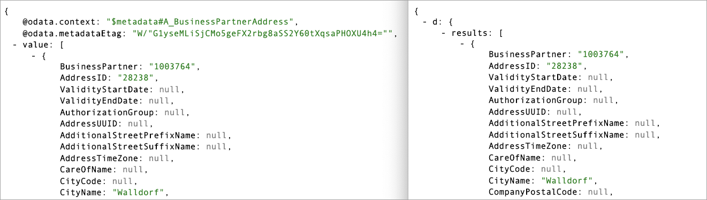
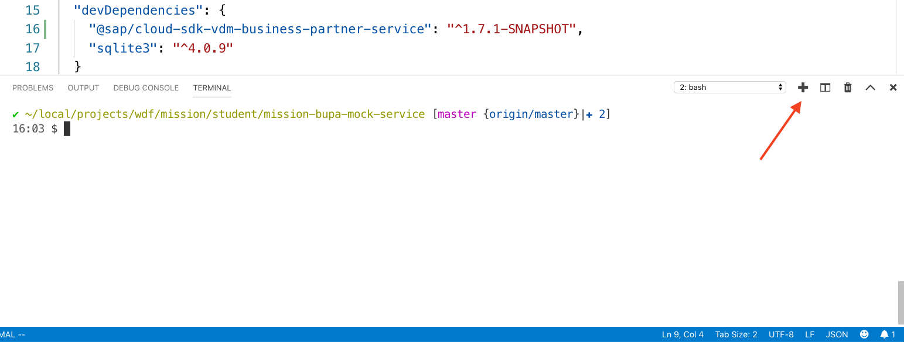

## Prerequisites
- You should start off in the same place as you were at the end of the previous tutorial -- in VS Code, with the project open and an integrated terminal ready with a command prompt for you to enter commands.

## Details
### You will learn
- That there are different versions of OData
- How middleware is used in Express based applications
- What the OData V2 Adapter is and how it can be used
- How to make basic use of the SAP Cloud SDK

>For a quick map and overview of what this tutorial is, and where it sits in the overall [Use CAP and SAP Cloud SDK to Extend S/4HANA  mission](mission.cap-s4hana-cloud-extension), see the diagram in the blog post [Mission "Use CAP and SAP Cloud SDK to Extend S/4HANA" – an overview](https://blogs.sap.com/2019/11/08/sap-teched-mission-api-hub-cloud-sdk-and-cap-an-overview/).

Right now your mock SAP S/4HANA service returns OData V4 responses. There are certain circumstances where this may not be directly consumable. The [SAP Cloud SDK](https://developers.sap.com/topics/cloud-sdk.html) is one consumer that currently expects OData V2. You may also have UI libraries, for example, that expect OData V2 data sources.

The OData V2 Adapter is a piece of [Express middleware](https://expressjs.com/en/guide/using-middleware.html) that will act as a proxy and adapt OData V4 responses to the OData V2 representations.

In this tutorial, you will install and configure the OData V2 Adapter so that your mock service can return OData V2 responses, to be consumed eventually by the SAP Cloud SDK in a subsequent tutorial.

---

[ACCORDION-BEGIN [Step 1: ](Install the V2 adapter package)]

The OData V2 adapter is available in the form of a Node.js package, which can be installed into the project.

> You're about to enter a command in the integrated terminal. If your service is still running (which it should be) from the previous tutorial in this mission, you can terminate it with `Ctrl-C` in order to get back to the prompt.

At the command prompt in the integrated terminal in VS Code, install this package into the project with:

```Bash
npm install @sap/cds-odata-v2-adapter-proxy
```

After the process finishes, you will see a new entry in the `dependencies` section inside the `package.json` file.

[DONE]
[ACCORDION-END]

[ACCORDION-BEGIN [Step 2: ](Introduce the V2 adapter to the server executable)]

Now you have the package installed, it can be used in the service's main file (`server.js`).

Open `server.js` in VS Code and add a couple of new lines.

First, add the line that will load the package, and make this the very first line.

```JavaScript
const odatav2proxy = require("@sap/cds-odata-v2-adapter-proxy")
```

Second, add the line that will insert an instance of the V2 adapter as a piece of middleware into the Express-based app. Add the line just before the call to `app.listen`.

```JavaScript
app.use(odatav2proxy({ port: PORT }))
```

The idea of middleware is that discrete pieces of logic can be inserted cleanly into the HTTP request processing flow, to adjust or augment how the responses are formed. The OData V2 adapter has been designed with this in mind, to play nicely with the standard Express app framework.

After you've made these changes, the start of `server.js` should look like this:


```JavaScript
const odatav2proxy = require("@sap/cds-odata-v2-adapter-proxy")
const express = require("express")
const cds = require("@sap/cds")

const { PORT=3000 } = process.env
const app = express()

cds.serve("all").in(app)

app.use(odatav2proxy({ port: PORT }))

app.listen (PORT, ()=> console.info(`server listening on http:\/\/localhost:${PORT}`))
```

[DONE]
[ACCORDION-END]


[ACCORDION-BEGIN [Step 3: ](Start the service and check the OData responses)]

In the integrated terminal, start the service again (with `npm start`). You should see some extra logging output, like this:

```
> teched2019-mission-mock-service-bupa@1.0.0 start /Users/i347491/local/projects/wdf/mission/student/teched2019-mission-mock-service-bupa
> node server.js

[HPM] Proxy created: /  ->  http://localhost:3000
[HPM] Proxy rewrite rule created: "^/v2" ~> ""
server listening on http://localhost:3000
Adding sample data...
```

The key line in that log output is this one:

```
[HPM] Proxy rewrite rule created: "^/v2" ~> ""
```

What it means is that OData resources that were already available from this service (with V4 responses) are now also available at paths with a `/v2` prefix.

In other words, the V4 resource that we retrieved in the previous tutorial:

<http://localhost:3000/sap/opu/odata/sap/API_BUSINESS_PARTNER/A_BusinessPartnerAddress>

is now also available in an OData V2 flavor at this URL:

<http://localhost:3000/v2/sap/opu/odata/sap/API_BUSINESS_PARTNER/A_BusinessPartnerAddress>

Try both URLs out, and compare the representations, which should look something like this (V4 on the left, V2 on the right):




[VALIDATE_3]
[ACCORDION-END]

[ACCORDION-BEGIN [Step 4: ](Install SAP Cloud SDK)]

In a later tutorial, you'll be using [SAP Cloud SDK](https://developers.sap.com/topics/cloud-sdk.html) within the context of an SAP Cloud Application Programming (CAP) Model-based application to consume the V2 version of this mock service. But it's also possible to try that out manually now, to get a feel for how it will work.

First, the SDK must be available to the project. It's in the form of a Node.js package, so can be installed using a similar process to that which you followed previously. However, this time, it's worth understanding the difference between design-time and runtime dependencies; some packages are only for use while developing and testing, and not for production. The Node.js package management allows for this, with a separate dependencies section in the `package.json` file, a section that denotes that "these packages are for design-time only".

When performing the install, the `--save-dev` flag can be used for this -- see [Specifying dependencies and `devDependencies` in a package.json file](https://docs.npmjs.com/specifying-dependencies-and-devdependencies-in-a-package-json-file) for more information on this.

> Remember that you'll only be using SAP Cloud SDK to test out the mock service, i.e. at design-time; it's not a requirement for the "productive" execution of the service.

At the command prompt in the integrated terminal, install SAP Cloud SDK (more specifically the SAP Cloud SDK package relating to the Business Partner API) like this:

```Bash
npm install --save-dev @sap/cloud-sdk-vdm-business-partner-service
```

Notice the name of this package -- it includes `vdm` which stands for _virtual data model_. This tells us a bit about how SAP Cloud SDK works, in that it provides virtual data models for the SAP S/4HANA APIs; the virtual data models make it very convenient and comfortable to consume those APIs at a high level of abstraction.

Note that when installing a specific virtual data model, the core SAP Cloud SDK is installed, too. This is because of the dependency relationship that's defined, which you can check with the command `npm info @sap/cloud-sdk-vdm-business-partner-service`.

You can try this out yourself, but in any case, here's output similar to what you'll see:

```
@sap/cloud-sdk-vdm-business-partner-service@1.7.0 | SEE LICENSE IN developer-license-3.1.txt | deps: 1 | versions: 9
SAP Cloud SDK for JavaScript: Virtual Data Model (VDM) for the SAP S/4HANA Cloud business partner service
https://www.sap.com/cloud-sdk

dist
.tarball: https://npm.sap.com/@sap/cloud-sdk-vdm-business-partner-service/-/cloud-sdk-vdm-business-partner-service-1.7.0.tgz
.shasum: 2716036d8b5bdbe6749c3234d988c706a0e4ba91
.integrity: sha512-FGc5Ijl4njCdd+1OEJwWtcvo3TQndsaaEqzmC1lDhNeH8rSgkfwFxeOodWlroStabQlvKsYnpjZhaIu7Q/giGQ==

dependencies:
@sap/cloud-sdk-core: ^1.7.0

maintainers:
- https-support.sap.com <do.not.reply@sap.com>

dist-tags:
latest: 1.7.0

published 8 hours ago by https-support.sap.com <do.not.reply@sap.com>
```

Finally, in this step, notice that a reference to the package you've just installed has now appeared in the `devDependencies` section of `package.json`, alongside `sqlite3` which was already there.

[DONE]
[ACCORDION-END]

[ACCORDION-BEGIN [Step 5: ](Use SAP Cloud SDK to retrieve data)]

Now that SAP Cloud SDK is available in the project directory for use with the Business Partner API, it's worth trying it out by hand, to get a feel for how it works, in particular the request builder and its [fluent interface](https://en.wikipedia.org/wiki/Fluent_interface) style.

First, make sure the service is actually running; if it's not, start it up again with `npm start` in the integrated terminal.

You now need to leave that service running, and establish a _second_ integrated terminal where you can try out a request.

In the top right menu area of the existing integrated terminal, use the plus button (indicated in the screenshot) or menu path **Terminal | New Terminal** to create another one.



> You can switch between your terminals with the menu that is seen in the screenshot as showing "2: bash".

In the new, second integrated terminal, start a Node.js REPL ([Read-Evaluate-Print Loop](https://en.wikipedia.org/wiki/Read%E2%80%93eval%E2%80%93print_loop)) where you can write JavaScript directly and have it executed immediately and interactively.

```Bash
node
```

You won't see much initially -- just a simple **`>`** prompt. At this prompt, enter the following, to load the specific Business Partner Address part of the SAP Cloud SDK virtual data model you installed earlier in this tutorial.


```JavaScript
const BusinessPartnerAddress = require('@sap/cloud-sdk-vdm-business-partner-service').BusinessPartnerAddress
```

What this returns is not particularly spectacular (`undefined`) ... but don't be fooled -- at this point you now have an object bristling with potential. If you're interested in seeing this potential, just enter `BusinessPartnerAddress.`, including the period at the end, and then hit **Tab** to see the possibilities. Now you can use this object, and invoke the request builder to make a call to the service that you have running in the other integrated terminal.

Switch to editor mode in the Node.js REPL with the command `.editor` (note the period at the start -- see [Commands and Special Keys](https://nodejs.org/api/repl.html#repl_commands_and_special_keys)) so you can paste in the following all at once:

```JavaScript
BusinessPartnerAddress
        .requestBuilder()
        .getAll()
        .select(
                BusinessPartnerAddress.BUSINESS_PARTNER,
                BusinessPartnerAddress.ADDRESS_ID,
                BusinessPartnerAddress.CITY_NAME,
        )
        .execute({url:'http://localhost:3000/v2'})
        .then(xs => xs.map(x => x.cityName))
        .then(console.log)
```

You must explicitly exit editor mode as directed (with **Ctrl-D**) before the JavaScript is executed. When you do, and it is, you will see something similar to the following:

```
Promise {
  <pending>,
  domain:
   Domain {
     domain: null,
     _events:
      [Object: null prototype] {
        removeListener: [Function: updateExceptionCapture],
        newListener: [Function: updateExceptionCapture],
        error: [Function: debugDomainError] },
     _eventsCount: 3,
     _maxListeners: undefined,
     members: [],
     [Symbol(kWeak)]: WeakReference {} } }
> [ 'Walldorf', 'Palo Alto', 'Hallbergmoos', 'Potsdam' ]
```

> You may or may not see the detail of the Promise in your output (as it's shown here), depending on circumstances ... but you should at least see the data returned.

The call returns a Promise from which, once resolved, we can extract data. As you can see, we've managed to retrieve the city names from the data served by this mock service (you can check the names against the initial data that is loaded in `server.js`).

Feel free at this stage to experiment further with the SDK's fluent API, before switching back over to the first integrated terminal, where you'll see some logging output that will look similar to this:

```
#2.0#2019 08 01 16:19:56:671#+01:00#INFO#/LoggingLibrary/NetworkLog#####jysts8gh##########jysts8gh#PLAIN##{"written_at":"2019-08-01T15:1
9:56.671Z","written_ts":1564672796671000000,"csn_component":"-","correlation_id":"jysts8gh","type":"request","logger":"nodejs-request-lo
gger","layer":"/LoggingLibrary/NetworkLog","level":"info","container_id":"-","component_type":"application","component_id":"-","componen
t_name":"-","component_instance":-1,"source_instance":-1,"organization_id":"-","organization_name":"-","space_id":"-","space_name":"-","
request_id":"jysts8gh","direction":"IN","protocol":"HTTP/1.1","method":"GET","request":"/v2/sap/opu/odata/sap/API_BUSINESS_PARTNER/A_Bus
inessPartnerAddress?$format=json&$select=BusinessPartner,AddressID,CityName","request_size_b":-1,"request_received_at":"2019-08-01T15:19
:56.369Z","remote_user":"redacted","referer":"redacted","remote_host":"redacted","remote_ip":"redacted","remote_port":"redacted","x_forw
arded_for":"redacted","response_sent_at":"2019-08-01T15:19:56.671Z","response_time_ms":302,"response_status":200,"response_size_b":-1,"r
esponse_content_type":"-"}#
```

Congratulations!

You have now adapted your mock service to also be able to produce OData V2 responses, and have also installed and used the SAP Cloud SDK to consume data from that service.

[DONE]
[ACCORDION-END]
